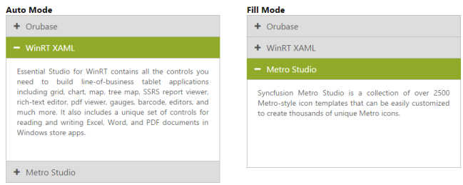
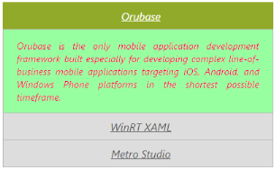

# Appearance and Styling

## Adjusting Accordion size

You can customize the Accordion panel height by using HeightAdjustMode property. It can be set to Enum values like Content, Fill or Auto. By default HeightAdjustMode is set to Content so the panel height is adjusted to the content size.

<table>
<tr>
<th>
Height adjust modes</th><th>
Description</th></tr>
<tr>
<td>
Content</td><td>
Panel height is set to fit the corresponding panels content</td></tr>
<tr>
<td>
Auto</td><td>
Panel height set to the largest content height among the panels</td></tr>
<tr>
<td>
Fill</td><td>
Panel height is set to fill the content of the panel</td></tr>
</table>

## Configure Height of Accordion panel

The following steps explains you on how to configure Accordion panel height.

In an ASPX page, define the Accordion control and add the contents correspondingly



    

    <h3>Auto Mode</h3>

    <ej:Accordion ID="AccordionAuto" runat="server" HeightAdjustMode="Auto">

        <Items>

            <ej:AccordionItem Text="Orubase">

                <ContentSection>

                     Orubase is the only mobile application development framework built especially for developing complex line-of-business mobile applications targeting iOS, Android, and Windows Phone platforms in the shortest possible time frame. 

                </ContentSection>

            </ej:AccordionItem>

            <ej:AccordionItem Text="WinRT XAML">

                <ContentSection>

                    Essential Studio for WinRT contains all the controls you need to build line-of-business tablet applications including grid, chart, map, tree map, SSRS report viewer, rich-text editor, PDF viewer, gauges, barcode, editors, and much more. It also includes a unique set of controls for reading and writing Excel, Word, and PDF documents in Windows store apps.

                </ContentSection>

            </ej:AccordionItem>

            <ej:AccordionItem Text="Metro Studio">

                <ContentSection>

                    Syncfusion Metro Studio is a collection of over 2500 Metro-style icon templates that can be easily customized to create thousands of unique Metro icons. 

                </ContentSection>

            </ej:AccordionItem>

        </Items>

    </ej:Accordion>

    

    

    <h3>Fill Mode</h3>

    <ej:Accordion ID="AccordionFill" runat="server" HeightAdjustMode="Fill">

        <Items>

            <ej:AccordionItem Text="Orubase">

                <ContentSection>

                     Orubase is the only mobile application development framework built especially for developing complex line-of-business mobile applications targeting iOS, Android, and Windows Phone platforms in the shortest possible time frame. 

                </ContentSection>

            </ej:AccordionItem>

            <ej:AccordionItem Text="WinRT XAML">

                <ContentSection>

                    Essential Studio for WinRT contains all the controls you need to build line-of-business tablet applications including grid, chart, map, tree map, SSRS report viewer, rich-text editor, PDF viewer, gauges, barcode, editors, and much more. It also includes a unique set of controls for reading and writing Excel, Word, and PDF documents in Windows store apps.

                </ContentSection>

            </ej:AccordionItem>

            <ej:AccordionItem Text="Metro Studio">

                <ContentSection>

                    Syncfusion Metro Studio is a collection of over 2500 Metro-style icon templates that can be easily customized to create thousands of unique Metro icons. 

                </ContentSection>

            </ej:AccordionItem>

        </Items>

    </ej:Accordion>

    



Output for Accordion control when panel height is set to Auto so that the maximum content height and Fill for minimum content height in all the panels is as follows.

  

### Rounded corner

You can customize the shape of the Accordion control from regular rectangular shape to rounded rectangle shape enabling ShowRoundedCorner property that is set to false by default.

### Enabling Rounded corner property

The following steps explains you in enabling the ShowRoundedCorner property for an Accordion control.

In an ASPX page, define the Accordion control and add the contents correspondingly.



    <ej:Accordion ID="BasicAccordion" runat="server" ShowRoundedCorner="true">

        <Items>

            <ej:AccordionItem Text="Orubase">

                <ContentSection>

                     Orubase is the only mobile application development framework built especially for developing complex line-of-business mobile applications targeting iOS, Android, and Windows Phone platforms in the shortest possible time frame. 

                </ContentSection>

            </ej:AccordionItem>

            <ej:AccordionItem Text="WinRT XAML">

                <ContentSection>

                    Essential Studio for WinRT contains all the controls you need to build line-of-business tablet applications including grid, chart, map, tree map, SSRS report viewer, rich-text editor, PDF viewer, gauges, barcode, editors, and much more. It also includes a unique set of controls for reading and writing Excel, Word, and PDF documents in Windows store apps.

                </ContentSection>

            </ej:AccordionItem>

            <ej:AccordionItem Text="Metro Studio">

                <ContentSection>

                    Syncfusion Metro Studio is a collection of over 2500 Metro-style icon templates that can be easily customized to create thousands of unique Metro icons. 

                </ContentSection>

            </ej:AccordionItem>

        </Items>

    </ej:Accordion>

    



Output for accordion control when “ShowRoundedCorner” is set to “true” is as follows.

 

### Customize Accordion icon

Accordion control allows you to customize the icons by using CustomIcon option that has two properties Header and SelectedHeader. By default, the classes of Header and SelectedHeader are e-collapse and e-expand respectively. By setting the desired CSS class names for these properties as required overrides the default icons with customized icons.

### Configuring custom icon for Accordion

The following steps explains you the configuration of icon for an Accordion control.

In an ASPX page, define the Accordion control and add the contents correspondingly. 



<%--In Design page configure Accordion with corresponding AccordionItems. To customize the header icons, set the “e-arrowheaddown” and “e-arrowheadup” classes to Header and SelectedHeader properties.  “e-arrowheaddown” and “e-arrowheadup” are available in ej.widgets.core.min.css file.--%>

    <ej:Accordion ID="BasicAccordion" runat="server" EnableMultipleOpen="true">

    <CustomIcon Header="e-arrowheaddown" SelectedHeader="e-arrowheadup" />

        <Items>

            <ej:AccordionItem Text="Orubase">

                <ContentSection>

                     Orubase is the only mobile application development framework built especially for developing complex line-of-business mobile applications targeting iOS, Android, and Windows Phone platforms in the shortest possible time frame. 

                </ContentSection>

            </ej:AccordionItem>

            <ej:AccordionItem Text="WinRT XAML">

                <ContentSection>

                    Essential Studio for WinRT contains all the controls you need to build line-of-business tablet applications including grid, chart, map, tree map, SSRS report viewer, rich-text editor, PDF viewer, gauges, barcode, editors, and much more. It also includes a unique set of controls for reading and writing Excel, Word, and PDF documents in Windows store apps.

                </ContentSection>

            </ej:AccordionItem>

            <ej:AccordionItem Text="Metro Studio">

                <ContentSection>

                    Syncfusion Metro Studio is a collection of over 2500 Metro-style icon templates that can be easily customized to create thousands of unique Metro icons. 

                </ContentSection>

            </ej:AccordionItem>

        </Items>

    </ej:Accordion>

    



Output for Accordion control with customized icons is as follows. 

  

## Animation Options

### Set animation

By default the Animation for expanding and collapsing is enabled. To remove the Animation you can set the EnableAnimation property to false. This restricts customizing animations as well. By default EnableAnimation is set to true.

Following code disables Animation for Accordion.



 

<ej:Accordion ID="BasicAccordion" runat="server" EnableAnimation="false">

        <Items>

            <ej:AccordionItem Text="Orubase">

                <ContentSection>

                    Orubase is the only mobile application development framework built especially for developing complex line-of-business mobile applications targeting iOS, Android, and Windows Phone platforms in the shortest possible time frame. 

                </ContentSection>

            </ej:AccordionItem>

            <ej:AccordionItem Text="WinRT XAML">

                <ContentSection>

                    Essential Studio for WinRT contains all the controls you need to build line-of-business tablet applications including grid, chart, map, tree map, SSRS report viewer, rich-text editor, PDF viewer, gauges, barcode, editors, and much more. It also includes a unique set of controls for reading and writing Excel, Word, and PDF documents in Windows store apps.

                </ContentSection>

            </ej:AccordionItem>

            <ej:AccordionItem Text="Metro Studio">

                <ContentSection>

                    Syncfusion Metro Studio is a collection of over 2500 Metro-style icon templates that can be easily customized to create thousands of unique Metro icons. 

                </ContentSection>

            </ej:AccordionItem>

        </Items>

</ej:Accordion>



### Expand and collapse speed

This feature allows you to set the speed for expanding and collapsing the Accordion panels. By default it is set to 300 in milliseconds. By configuring the animation speed you can optimize the delay in loading the panel content.

The following code example sets value for ExpandSpeed and CollapseSpeed properties,



<ej:Accordion ID="BasicAccordion" runat="server" CollapseSpeed="1000" ExpandSpeed="600">

        <Items>

            <ej:AccordionItem Text="Orubase">

                <ContentSection>

                     Orubase is the only mobile application development framework built especially for developing complex line-of-business mobile applications targeting iOS, Android, and Windows Phone platforms in the shortest possible time frame. 

                </ContentSection>

            </ej:AccordionItem>

            <ej:AccordionItem Text="WinRT XAML">

                <ContentSection>

                    Essential Studio for WinRT contains all the controls you need to build line-of-business tablet applications including grid, chart, map, tree map, SSRS report viewer, rich-text editor, PDF viewer, gauges, barcode, editors, and much more. It also includes a unique set of controls for reading and writing Excel, Word, and PDF documents in Windows store apps.

                </ContentSection>

            </ej:AccordionItem>

            <ej:AccordionItem Text="Metro Studio">

                <ContentSection>

                    Syncfusion Metro Studio is a collection of over 2500 Metro-style icon templates that can be easily customized to create thousands of unique Metro icons. 

                </ContentSection>

            </ej:AccordionItem>

        </Items>

    </ej:Accordion>

    



### Theme

You can control the style and appearance of Accordion control based on CSS classes. To apply styles to the Accordion control, refer to two files, ej.widgets.core.min.css and ej.theme.min.css. When you refer to ej.widgets.all.min.css file, then it is not necessary to include the files ej.widgets.core.min.css and ej.theme.min.css in your project, as ej.widgets.all.min.css is the combination of these two. 

By default, there are 13 themes support available for Accordion control namely

* default-theme
* flat-azure-dark
* fat-lime
* flat-lime-dark
* flat-saffron
* flat-saffron-dark
* gradient-azure
* gradient-azure-dark
* gradient-lime
* gradient-lime-dark
* gradient-saffron
* gradient-saffron-dark
* bootstrap-theme

### CSS class

CSS class can be used to customize the Accordion control appearance. Define a CSS class as per your requirement and assign the class name to CssClass property. The custom CSS class must override the predefined CSS styles applied in the Accordion control.

<table>
<tr>
<th>
Class or Element name</th><th>
Description</th></tr>
<tr>
<td>
.e-acrdn</td><td>
Base class that is added to the Accordion wrapper div element where the custom CSS class will also be added</td></tr>
<tr>
<td>
h3</td><td>
Header element for the Accordion panel</td></tr>
<tr>
<td>
span .e-icon</td><td>
Accordion icon in the header that change on expand and collapse panels</td></tr>
<tr>
<td>
.e-content</td><td>
Class for the div element that holds the Accordion panel’s content.</td></tr>
</table>

### Configure Accordion using CSS class

The following steps allows you to configure CSS class for an Accordion control.

In the ASPX page, define the Accordion control and add the contents correspondingly



    <ej:Accordion ID="BasicAccordion" runat="server" CssClass="customCss">

        <Items>

            <ej:AccordionItem Text="Orubase">

                <ContentSection>

                     Orubase is the only mobile application development framework built especially for developing complex line-of-business mobile applications targeting iOS, Android, and Windows Phone platforms in the shortest possible time frame. 

                </ContentSection>

            </ej:AccordionItem>

            <ej:AccordionItem Text="WinRT XAML">

                <ContentSection>

                    Essential Studio for WinRT contains all the controls you need to build line-of-business tablet applications including grid, chart, map, tree map, SSRS report viewer, rich-text editor, PDF viewer, gauges, barcode, editors, and much more. It also includes a unique set of controls for reading and writing Excel, Word, and PDF documents in Windows store apps.

                </ContentSection>

            </ej:AccordionItem>

            <ej:AccordionItem Text="Metro Studio">

                <ContentSection>

                    Syncfusion Metro Studio is a collection of over 2500 Metro-style icon templates that can be easily customized to create thousands of unique Metro icons. 

                </ContentSection>

            </ej:AccordionItem>

        </Items>

    </ej:Accordion>

    



Define CSS class for customizing the Accordion. Here the “customCss” class is defined to configure the Accordion panel header, hide the icon by overriding the “e-icon” class and changing the default font styles. Similarly you can customize the Accordion display structure by defining required CSS styles for the Accordion classes.



        .customCss

        {

        font-style: italic;

        text-align:justify;

        }

        .customCss span.e-icon {

        display: none !important;

        }

        .customCss h3

        {

            text-decoration:underline;

            text-align:center;

        }

        .customCss .e-content {

        background-color: #98FFA0 !important;

        color: #FF0069 !important;

        }



Output for Accordion with customized CSS property to hide the Accordion icon and format its content is as follows.

 

