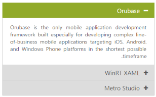

# RTL Support

This feature supports to change the left-to-right alignment of the Accordion control to right-to-left (RTL). 

## Enabling RTL Support

The following steps explains you in enabling the right-to-left property for an Accordion.

In an ASPX page, define the Accordion control and add the contents correspondingly.



    <ej:Accordion ID="BasicAccordion" runat="server" EnableRTL="true">

        <Items>

            <ej:AccordionItem Text="Orubase">

                <ContentSection>

                     Orubase is the only mobile application development framework built especially for developing complex line-of-business mobile applications targeting iOS, Android, and Windows Phone platforms in the shortest possible timeframe. 

                </ContentSection>

            </ej:AccordionItem>

            <ej:AccordionItem Text="WinRT XAML">

                <ContentSection>

                    Essential Studio for WinRT contains all the controls you need to build line-of-business tablet applications including grid, chart, map, tree map, SSRS report viewer, rich-text editor, pdf viewer, gauges, barcode, editors, and much more. It also includes a unique set of controls for reading and writing Excel, Word, and PDF documents in Windows store apps.

                </ContentSection>

            </ej:AccordionItem>

            <ej:AccordionItem Text="Metro Studio">

                <ContentSection>

                    Syncfusion Metro Studio is a collection of over 2500 Metro-style icon templates that can be easily customized to create thousands of unique Metro icons. 

                </ContentSection>

            </ej:AccordionItem>

        </Items>

    </ej:Accordion>

    



Output for accordion when “EnableRTL” is set to “true” is as follows,

  