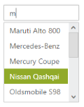
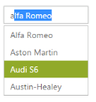
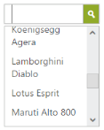

# Behavior Settings

## Filtering Type

AutoComplete textbox supports a wide range of filtering options to search for items in the PopUp list. The FilterType takes enum values, like StartsWith(Default Value), Contains, EndsWith, LessThan, GreaterThan, GreaterThanOrEqual, LessThanOrEqual, Equal and NotEqual.

### Defining the Filter type

The following steps explain the configuration of the filtering conditions for an AutoComplete textbox.

In the design page, define the AutoComplete control and configure the FilterType for it.



<%--Refer the ObjectDataSource binding for DataBinding to this code snippet--%>

<ej:Autocomplete ID="AutoComplete" runat="server" DataSourceID="ObjectDataSource1" DataTextField="Text" DataUniqueKeyField="ID" FilterType="GreaterThanOrEqual" />



The following screenshot is the output for AutoComplete control that filters the list items based on the GreaterThanOrEqual option.

## AutoFill

The AutoComplete textbox control offers an AutoFill option. This feature is used to automatically fill the item when text is entered, when EnableAutoFill is set to True. The first Item in the suggestions list that matches the entered text is automatically displayed in the AutoComplete textbox. The search text is selected in the AutoComplete textbox for identification. 

This feature reduces the requirement to type the entire text and makes the search box more efficient. This can be used only with filterType “StartsWith”, since text is filled automatically, based on the text entered.

### Configure AutoFill property in AutoComplete 	

The following steps explain how to enable the AutoFill property for an AutoComplete textbox.

In the design page define the AutoComplete control and enable the AutoFill for it.



        <%--Refer the ObjectDataSource binding for DataBinding to this code snippet--%>

<ej:Autocomplete ID="AutoComplete" runat="server" DataSourceID="ObjectDataSource1" DataTextField="Text" DataUniqueKeyField="ID" FilterType="StartsWith" EnableAutoFill="true" />



The following screenshot is the output for AutoComplete when EnableAutoFill is set to True.

## Sorting Items

AutoComplete control allows you to sort the suggestions list items and set the sorting order. To enable sorting, set AllowSorting to True. It is enabled by default. The SortOrder property takes enum values, Ascending or Descending.

### Steps to define sorting order

The following steps explain how to enable the sorting property for an AutoComplete textbox.

In the design page, define the AutoComplete control and configure the sorting format for the control.



<%--Refer the ObjectDataSource binding for DataBinding to this code snippet--%>

<ej:Autocomplete ID="AutoComplete" runat="server" DataSourceID="ObjectDataSource1" DataTextField="Text" DataUniqueKeyField="ID" SortOrder="Descending" />



The following screenshot is the output for AutoComplete when “SortOrder” is configured.

## Distinct List items

AutoComplete control provides an option to extract repeating items in the PopUp list. By setting EnableDistinct property to True, you can prevent the duplicate items in the suggestions list.

### Steps to enable distinct items

The following steps explain how to enable the distinct property for an AutoComplete textbox.

In the design page, define the AutoComplete control and configure EnableDistinct property for the control.



<%--Refer the ObjectDataSource binding for DataBinding to this code snippet--%>

    

        <h6>

                Distinct disabled</h6>  

 <ej:Autocomplete ID="AutoComplete" runat="server" DataSourceID="ObjectDataSource1" 

            DataTextField="Text" DataUniqueKeyField="ID" 

            EnableDistinct="false"/>

    

    

        <h6>

                Distinct enabled</h6>

<ej:Autocomplete ID="AutoCompletedist" runat="server" DataSourceID="ObjectDataSource1" 

            DataTextField="Text" DataUniqueKeyField="ID" 

EnableDistinct="true"/>

    



The following screenshot is the output for AutoComplete when EnableDistinct is set to True.

## Show Popup button

ShowPopupButton property provides you with an option to display an icon, to show the popup list in the AutoComplete control.

### Enabling Popup button

The following steps explains how to configure the popup button for an AutoComplete textbox.

In the design page, define the AutoComplete control and configure the ShowPopupButton property.



<%--Refer the ObjectDataSource binding for DataBinding to this code snippet--%>

<ej:Autocomplete ID="AutoComplete" runat="server" DataSourceID="ObjectDataSource1" DataTextField="Text" DataUniqueKeyField="ID" ShowPopupButton="true"/>



The following screenshot is the output for AutoComplete when ShowPopupButton is enabled.

## Restrict editing

AutoComplete textbox control provides ReadOnly property to disable editing in the control, so that the value set to AutoComplete can only be read and cannot modified. The Value property allows you to set the default value for AutoComplete control, when it is created.

### Configure AutoComplete textbox to restrict editing

The following steps help you disable editing in an AutoComplete textbox.

In the design page, define the AutoComplete control and configure ReadOnlyproperty



<%--Refer the ObjectDataSource binding for DataBinding to this code snippet--%>

<ej:Autocomplete ID="AutoComplete" runat="server" DataSourceID="ObjectDataSource1" DataTextField="Text" DataUniqueKeyField="ID" ReadOnly="true" Value="BMW 7"/>



The following screenshot is the output for the AutoComplete textbox configured to restrict editing.

## Empty Result settings

TheAutoComplete control allows you to configure the display message when the list doesn’t return any values. By default, ShowEmptyResultTextis set to True and EmptyResultText is set to the string value “No suggestions_”._ 

### Configure Empty result setting

The following steps allow you to set text for empty results of an AutoComplete textbox.

In the design page, define the AutoComplete control and set the text for EmptyResultText property.



   <ej:Autocomplete ID="AutoComplete" runat="server" DataSourceID="ObjectDataSource1" DataTextField="Text" DataUniqueKeyField="ID" ShowEmptyResultText="true" EmptyResultText="No Items Available" />



The following screenshot is the output of the AutoComplete textbox, when the list doesn’t return any value.

 

