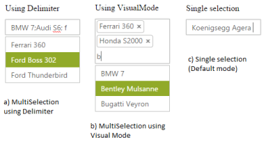
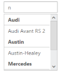

## MultiSelection modes

AutoComplete control allows you to select multiple values from the suggestions list by using the MultiSelectMode property. Multiple values can be selected when MultiSelectMode value is set to VisualMode or Delimiter. 

Delimiter mode separates multiple items by using a separator character defined. When the Delimiter mode is set, you can define the delimiter character by using Delimiter property as well. It takes a single character and it must be a symbol. 

Visual mode selects multiple items by enclosing the item in a rounded rectangle with a close icon to remove item from the selection.

### Configuring MultiSelection Mode

The following steps explain the configuration of the MultiSelectMode for an AutoComplete textbox.

In the design page, define the AutoComplete control and configure its MultiSelectModeproperty accordingly.



<%--Refer the ObjectDataSource binding for DataBinding to this code snippet--%>

    

    Using Delimiter       <ej:Autocomplete ID="AutoCompleteBelmt" runat="server" DataSourceID="ObjectDataSource1" 

            DataTextField="Text" DataUniqueKeyField="ID" 

MultiSelectMode="Delimiter" Delimiter=";"/>

    

    

    Using VisualMode 

 <ej:Autocomplete ID="AutoCompleteVisl" runat="server" DataSourceID="ObjectDataSource1" 

            DataTextField="Text" DataUniqueKeyField="ID" 

            MultiSelectMode="VisualMode"/>

    

    

        Single selection

<ej:Autocomplete ID="AutoComplete" runat="server" DataSourceID="ObjectDataSource1" 

            DataTextField="Text" DataUniqueKeyField="ID" 

MultiSelectMode="None"/>

    



The following screenshot is the output for AutoComplete control with configured multiple selection.

{  | markdownify }
{:.image }

### Grouping

AutoComplete control provides grouping support for the suggestions list based on the category specified in the dataSource. By default AllowGrouping is set to False. To enable grouping for your AutoComplete control, set the value to True.

Configuring Grouping for AutoComplete

The following steps explain how to configure grouping for an AutoComplete textbox by using ObjectDataSource.

Define an ObjectDataSource in the web page and configure the data source elements with Category field.



namespace ASPWeb

{

    public class ObjectData

    {

        public ObjectData(int _id, string _text, string _category)

        {

            this.ID = _id;

            this.Text = _text;

            this.Category = _category;

        }

        public ObjectData() { }

        public int ID

        {

            get;

            set;

        }

        public string Text

        {

            get;

            set;

        }

        public string Category

        {

            get;

            set;

        }

        public List<ObjectData> GetGroupingData()

        {

            List<ObjectData> cars = new List<ObjectData>();

cars.Add(new ObjectData { ID = 1, Text = "Audi S6", Category = "Audi" });

cars.Add(new ObjectData { ID = 2, Text = "Austin-Healey", Category = "Austin" });

cars.Add(new ObjectData { ID = 3, Text = "BMW 7", Category = "BMW" });

cars.Add(new ObjectData { ID = 4, Text = "Chevrolet Camaro", Category = "Chevrolet" });

cars.Add(new ObjectData { ID = 5, Text = "Mercedes-Benz", Category = "Mercedes" });

cars.Add(new ObjectData { ID = 6, Text = "Toyota 2000GT", Category = "Toyota" });

cars.Add(new ObjectData { ID = 7, Text = "Volvo P1800", Category = "Volvo" });

cars.Add(new ObjectData { ID = 8, Text = "Audi Avant RS 2", Category = "Audi" });

cars.Add(new ObjectData { ID = 9, Text = "Audi S4 quattro", Category = "Audi" });

cars.Add(new ObjectData { ID = 10, Text = "BMW M Roadster E85", Category = "BMW" });

cars.Add(new ObjectData { ID = 11, Text = "Mercedes-Benz Sprinter", Category = "Mercedes" });

cars.Add(new ObjectData { ID = 12, Text = "Corvette", Category = "Chevrolet" });

cars.Add(new ObjectData { ID = 13, Text = "Volvo P1800", Category = "Volvo" }); 

            return cars;

        }

    }

}



In the Design page, add an AutoComplete element from ToolBox and assign values for DataTextField, DataUniqueKeyField and DataCategoryField. Category field allows you to configure grouping. Set the AllowGrouping property to true

[ASPX]

&lt;ej:Autocomplete ID="AutoComplete" runat="server" DataSourceID="ObjectDataSource1" DataTextField="Text" DataUniqueKeyField="ID" DataCategoryField="Category" AllowGrouping="true" FilterType="Contains" /&gt;

        &lt;asp:ObjectDataSource ID="ObjectDataSource1" runat="server" SelectMethod="GetGroupingData" TypeName="ASP_896.ObjectData"&gt;&lt;/asp:ObjectDataSource&gt;

The following screenshot is the output for AutoComplete control that provides grouping.

{  | markdownify }
{:.image }

