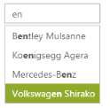
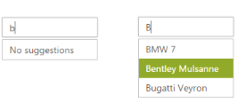

# Search Customization

## HighlightSearch

AutoComplete control allows you to highlight the search text in the AutoComplete suggestions list by using the HighlightSearch property. When this property is set to True, the suggestions list appears, with the search text it contains, highlighted.

### Enabling highlightSearch option

The following steps explain how you can enable the highlightSearch property for an AutoComplete textbox.

In the design page define the AutoComplete control and enable the HightlightSearch property by using MinCharacter you can set the minimal number of characters to be enter for searching the list items.



<%--Refer the ObjectDataSource binding for DataBinding to this code snippet--%>

<ej:Autocomplete ID="AutoComplete" runat="server" DataSourceID="ObjectDataSource1" DataTextField="Text" DataUniqueKeyField="ID" HighlightSearch="true" FilterType="Contains" MinCharacter="2"/>



The following screenshot is the output for AutoComplete when HighlightSearch is set to True.

## Case sensitive Search

AutoComplete allows you to enable case sensitivity, to filter the suggest list items based on the entered text casing. This property enables strict filtering of list items, based on entered text. To enable it, set CaseSensitiveSearch value as True. It is False, by default.

### Configure case sensitivity for AutoComplete

The following steps explain how to enable the CaseSensitiveSearch property for an AutoComplete textbox.

In the design page, define the AutoComplete control and enable the CaseSensitiveSearch property.



<%--Refer the ObjectDataSource binding for DataBinding to this code snippet--%>

<ej:Autocomplete ID="AutoComplete" runat="server" DataSourceID="ObjectDataSource1" DataTextField="Text" DataUniqueKeyField="ID" CaseSensitiveSearch="true" />



The following screenshot is the output for AutoComplete when CaseSensitiveSearch is set to True.

 

