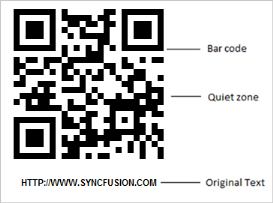

# Getting Started

This section explains you briefly on how to create a Barcode in your application with ASP.NET.

## Control Structure

 

## Create your first Barcode in ASP.NET

The ASP.NET Barcode provides you support to encode data and display it in your web page; it takes text and symbology as input and renders the encoded text as barcode.

The following guideline explains you on how to create a QR barcode for a real time scenario of encoding a url. The following screenshot demonstrates a two dimensional barcode encoding the value “HTTP://WWW.SYNCFUSION.COM”.

 

By default, ASP.NET Barcode renders gray scale colors with predefined Quiet zone. Quiet zone is the blank margin on the side(s) that denotes the start and stop of the Barcode. It also provides you flexible API’s to customize the appearance of the Barcode. 

### Referencing Assemblies

You can create a Web Project, add necessary assemblies and Scripts with the help of the following Getting Started Documentation.

Add the following assemblies in your Web application for using Barcode control:

* Syncfusion.Core.dll
* Syncfusion.EJ.dll
* Syncfusion.EJ.Web.dll

These Syncfusion assemblies can either be referenced from Global Assembly Cache (GAC) or from the installed folder.

[Installed Drive]:\Program Files (x86)\Syncfusion\Essential Studio\X.X.X.X\precompiledassemblies\X.X.X.X

### Configuring Web.Config

Web.config file is configured according to the referenced assemblies. The steps to configure the file are as follows.

* On the Solution Explorer, double-click the Web.config file in the root folder. The Web.config page appears.
* Add the following assemblies in the Web.config page under the &lt;compilation&gt; tag:

  * Syncfusion.Core
  * Syncfusion.EJ
  * Syncfusion.EJ.Web



<system.web>

    <compilation>

      <assemblies>

         <add assembly="Syncfusion.Core, Version=x.x.x.x, Culture=neutral, PublicKeyToken=632609b4d040f6b4"/>

        <add assembly="Syncfusion.EJ, Version=x.x.x.x, Culture=neutral, PublicKeyToken=3d67ed1f87d44c89"/>

        <add assembly="Syncfusion.EJ.Web, Version=x.x.x.x, Culture=neutral, PublicKeyToken=3d67ed1f87d44c89"/>

      </assemblies>

    </compilation>

</system.web>



> Note: X.X.X.X in the above code corresponds to the correct version number of the Essential Studio version that you are currently using.

* Add the following namespaces under the &lt;namespaces&gt; tag.

  * Syncfusion.JavaScript
  * Syncfusion.JavaScript.Web
  * Syncfusion.JavaScript.DataVisualization



<system.web>

<pages>

      <namespaces>

        <add namespace="Syncfusion.JavaScript"/>

        <add namespace="Syncfusion.JavaScript.Web"/>

        <add namespace="Syncfusion.JavaScript.DataVisualization"/>

      </namespaces>

   </pages>

</system.web>



* Open the Default.aspx file and add the following code in the aspx file for Barcode rendering.



<ej:BarcodeID="Barcode1"runat=serverText="HTTP://WWW.SYNCFUSION.COM"SymbologyType="qrbarcode"></ej:Barcode>



* Run the project and to render the following output.

 

The following symbols are supported by Barcode control.

* QR Barcode
* DataMatrix
* Code 39
* Code 39 Extended
* Code 11
* Codabar
* Code 32
* Code 93
* Code 93 Extended
* Code 128 A
* Code 128 B
* Code 128 C
