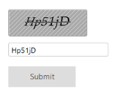

# Enabling Validation in ASP.NET Webforms Captcha

## Auto Validation

You can validate the Captcha characters by default, when you click the submit button without adding any validation code. You can achieve this by enabling EnableAutoValidation property to true. By default, this property is set to false. When this property is set to true,Captcha renders with textbox.  Here, you can also customize the error message by using the CustomErrorMessage property that accepts the string value. 

Next, define the target button that performs validation. You can achieve this by using the TargetButton property. The button ID that performs the click action should be assigned in the TargetButton. 

In the ASPX page, include the following Captcha control code example for auto validation support.





<ej:Captcha ID="captcha" EnableAutoValidation="true" CustomErrorMessage="Invalid captcha code entered. Please try again." TargetButton="submit" Mapper="Refresh"  runat="server"></ej:Captcha>      <ej:Button ID="submit" runat="server" Type="Button" Text="Submit" Size="Large" ShowRoundedCorner="true"></ej:Button>




  
	public static string Refresh(Dictionary<object, object> captchaModel)    
	{	       
      	return Syncfusion.JavaScript.Web.Captcha.GetModel(captchaModel).ExecuteResult();  
		}





The following screenshot illustrates the Captcha with Auto-Validation support. 

## Validation by Method

Validation by method is used when EnableAutoValidation is set to false. Here, you can include the TargetButton to validate the Captcha. CaptchaService.IsValid() method is used to validate the Captcha. It requires three arguments namely as captcha, textbox, case sensitivity.

In the ASPX page, include the following Captcha control code example for manual validation.





<ej:Captcha ID="captcha" TargetButton="submit"  runat="server"></ej:Captcha>   <asp:Label ID="Label1" runat="server"></asp:Label>   <asp:TextBox ID="TextBox1" runat="server"></asp:TextBox>   <ej:Button ID="submit" runat="server" Type="Button" Text="Submit" OnClick="submit_Click" Size="Large" ShowRoundedCorner="true" ></ej:Button>





     protected void submit_Click(object Sender, Syncfusion.JavaScript.Web.ButtonEventArgs e)        
	 {          
    	if (!captcha.IsValid(TextBox1.Text, true))           
		{               
    		Label1.Text = "Invalid characters.Try again";         
			}       
			}  





The following screenshot illustrates the Captcha with manual validation support. 

## Case Sensitive Validation 

Captcha supports to check case sensitivity (Upper case and lower case) of the Captcha characters at the time of validation. You can achieve this by enabling EnableCaseSensitivity property to true. By default this value is set as true.

In the ASPX page, include the following Captcha control code-snippet for case sensitive validation.





<ej:Captcha ID="captcha" ShowAudioButton="true" CustomErrorMessage="Invalid captcha code entered. Please try again." TargetButton="submit" EnableCaseSensitivity="true" Mapper="Refresh"  runat="server"></ej:Captcha>      <ej:Button ID="submit" runat="server" Type="Button" Text="Submit" Size="Large" ShowRoundedCorner="true"></ej:Button>





    [System.Web.Services.WebMethod]  
	public static string Refresh(Dictionary<object, object> captchaModel)  
	{	     
    	return Syncfusion.JavaScript.Web.Captcha.GetModel(captchaModel).ExecuteResult();    
		}





The following screenshot illustrates the Captcha with Case sensitive validation support. 

