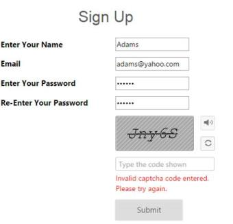

# Getting Started

## Create your first Captcha in ASP.NET 

This section enables you to configure the Captcha control in your ASP.NET WEB application and also in learning how to use Captcha with auto validation in web forms.

{  | markdownify }
{:.image }

Create Captcha Control

The Captcha is one of the ways to prevent dictionary attacks. It basically comes with the random text. 

The following steps are used to create the Captcha control.  

You can create a WEB Project and add necessary Dll and script with the given [ASP-Getting Started Documentation.](http://help.syncfusion.com/ug/js/documents/creatingyourfirstapp.htm)

Add the following code to the corresponding ASPX page for Captcha rendering.



    <ej:Captcha ID="SignUpCaptcha" runat="server"></ej:Captcha>



Add the following handler codes to the web.config file for the Captcha rendering.



<!--Add the following code in <system.web>-->

 <system.web>

    <httpHandlers>

      <add verb="*" path="captimage.axd" type="Syncfusion.JavaScript.ImageHandler, Syncfusion.EJ, Version={{ site.450esreleaseversion }}, Culture=neutral, PublicKeyToken=3D67ED1F87D44C89" />

    </httpHandlers>

</system.web>

<!--Add the following code in <system.webserver>-->

<system.webserver>    

-----------------------

-----------------------

    <handlers>      

      <add verb="*" path="captimage.axd" name="syncfusion_generatetools" type="Syncfusion.JavaScript.ImageHandler, Syncfusion.EJ, Version= {{ site.450esreleaseversion }}, Culture=neutral, PublicKeyToken=3d67ed1f87d44c89" />      

    </handlers>

</system.webserver>

Note: Version= {{ site.450esreleaseversion }} - It will vary depend up on .Net frame work version and Essential studio version you have using. If you are using Essential studio version as- {{ site.releaseversion }} and .Net frame work is 4.5 use like following Version= {{ site.450esreleaseversion }}



The following screenshot displays the output of the above codes.

{  | markdownify }
{:.image }

Show AudioButton and Refresh

The Captcha controlsupports captcha in the form of audio. When you click the audio button, it readouts the captcha characters. You can achieve this by setting the ShowAudioButton property to true. ShowRefreshButton is used to refresh or change the captcha image without full page refresh. This is achieved by adding the ShowRefreshButton property to true. Also include Mapper to refresh support.

Add the following code example to ASPX to render captcha with Audio and Refresh.



<ej:Captcha ID="SignUpCaptcha" ShowAudioButton="true" ShowRefreshButton="true" Mapper="Refresh"runat="server"></ej:Captcha>



Add the following code example to the corresponding CS page to render Captcha with Audio and Refresh.

This method is used to handle Ajax post when refresh and validation actions are performed. When these actions are performed, the following values are received from client-side by Ajax post and the values are forwarded to source to perform the corresponding action. The following values are required to perform validation and refresh action.



    [System.Web.Services.WebMethod]

    public static string GetCurrentItme(Dictionary<object, object> captchaModel)

    {

        return Syncfusion.JavaScript.Web.Captcha.GetModel(captchaModel).ExecuteResult();

    }



The following screenshot displays the output of the above codes.

{  | markdownify }
{:.image }

Auto Validation   

The Captcha supports automatic validation by enabling the property EnableAutoValidation. When this property is set to true, captcha validation is done automatically. When the validation fails, CustomErrorMessage property supports to display the customized error message.

Add the following code example to ASPX page for auto validation.



<div class="frame" style="width: 500px">

    <div class="control">

        <table class="tabprop">

            <h1>Sign Up </h1>

            <tr>

                <td><span class="NodeText">Enter Name

                </td>

                <td>

                    <asp:textbox id="Name" runat="server"></asp:textbox>

                    <span id="Uname" runat="server" style="color: red; display: block; width: 200px;float: right">

                </td>

            </tr>

            <tr>

                <td><span class="NodeText" style="width: 200px">Email

                </td>

                <td>

                    <asp:textbox id="Email" textmode="Email" runat="server"></asp:textbox>

                    <span id="Emailid" runat="server" style="color: red; width: 200px; display: block;float: right">

                </td>

            </tr>

            <tr>

                <td><span class="NodeText" style="width: 200px">Enter Password

                </td>

                <td>

                    <asp:textbox id="Password" textmode="Password" runat="server"></asp:textbox>

                    <span id="Pwd" runat="server" style="color: red; width: 200px; display: block;float: right">

                </td>

            </tr>

            <tr>

                <td><span runat="server" class="NodeText">Re-Enter Password

                </td>

                <td>

                    <asp:textbox id="RePassword" textmode="Password" runat="server"></asp:textbox>

                    <span id="RePwd" runat="server" style="color: red; width: 200px; display: block;float: right">

                </td>

            </tr>

            <tr>

                <td></td>

                <td>

                    <div style="width: 185px;">

                        <ej:captcha id="SignUpCaptcha" ShowAudioButton="true" ShowRefreshButton="true" mapper="Refresh" EnableAutoValidation="true" CustomErrorMessage="InValid Captcha code entered.Please try again" targetbutton="btnSubmit" runat="server"></ej:captcha>

                    

                </td>

            </tr>

            <tr style="height: 30px; display: block">

                <td></td>

                <td></td>

            </tr>

            <tr>

                <td></td>

                <td>

                    <ej:button id="btnSubmit" runat="server" text="submit" size="Large" type="Button" ClientSideOnClick="onValidate"></ej:button>

                </td>

            </tr>

        </table>

    



Add the following code example to ASPX to render Captcha with Audio and Refresh.



  



Add the following code example to ASPX to render Captcha with Audio and Refresh.





Add the following code example to the corresponding CS page for Captcha with Auto-Validation support.



    [System.Web.Services.WebMethod]

    public static string Refresh(Dictionary<object, object> captchaModel)

    {	

        return Syncfusion.JavaScript.Web.Captcha.GetModel(captchaModel).ExecuteResult();

    }



The following screenshot is the output for the above code example.

{  | markdownify }
{:.image }

