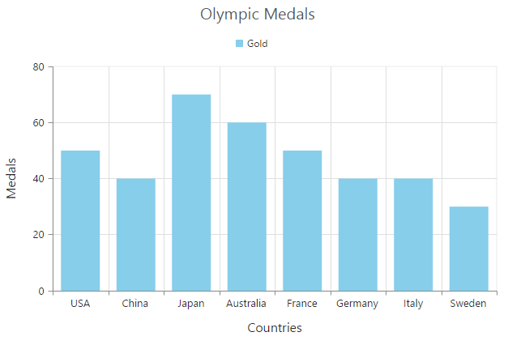
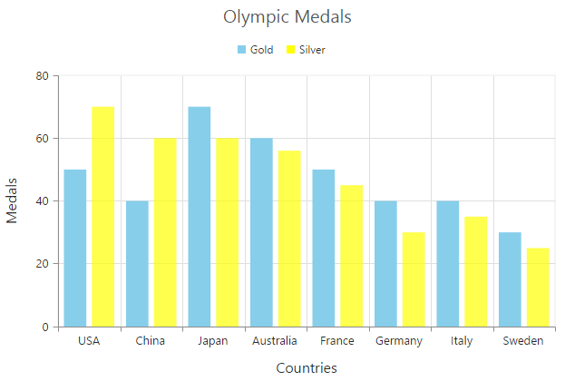

# Appearance

## Custom Color Palette

The Chart displays different series in different colors by default. You can customize the color of each series by providing a custom color palette of your choice by using the **Palette** property. 



  <ej:Chart ID="Chart1" runat="server" Palette="grey,skyblue,orange">
  </ej:Chart>



N> The Color palette is applied to the points in accumulation type series

## Built-in Themes

Following are the built-in themes available in the Chart

* Azure
* Azuredark
* Flatdark
* Flatlight
* GradientDark
* GradientLight
* Lime
* LimeDark
* Saffron
* SaffronDark

You can set your desired theme by using the **Theme** property. FlatLight is the default theme used in the Chart.



  <ej:Chart ID="Chart1" runat="server" Theme="GradientLight">
  </ej:Chart>



## Point level customization

Marker, DataLabel and Fill color of each point in a series can be customized individually by using the **Points** collection.



    <ej:Chart ID="Chart1" runat="server">
        <Series>
            <ej:Series>
                <Points>
                    <ej:Points X="0" Y="210" Fill="#E27F2D">
                         <%--//Customizing marker and fill color of a point--%>
                        <Marker Visible="true"></Marker>
                    </ej:Points>
                </Points>
            </ej:Series>
        </Series>
    </ej:Chart>



## Column Width customization

Width of any column type series can be customized by using the **ColumnWidth** property. Default value of *ColumnWidth* is 0.7. Value ranges from 0 to 1. Here 1 corresponds to 100% of available width and 0 corresponds to 0% of available width.

N> Width of a column also depends upon the *ColumnSpacing* property, because *ColumnSpacing* will reduce the space available for drawing a column



	<ej:Chart ID="Chart1" runat="server">
		<Series>
			<ej:Series ColumnWidth = "0.8">            
			</ej:Series>
		</Series>
	</ej:Chart>	



## Spacing between Column Series

Spacing between column type series can be customized using the **ColumnSpacing** property. Default value of *ColumnSpacing* is 0. Value ranges from 0 to 1. Here 1 corresponds to 100% available space and 0 corresponds to 0% available space.

N> Space between columns will also affect the width of the column. For example, setting 20% spacing and 100% width will render columns with 80% of total width.



	<ej:Chart ID="Chart1" runat="server">
		<Series>
			<ej:Series ColumnWidth = "0.2">            
			</ej:Series>
		</Series>
	</ej:Chart>	



## Series border customization

To customize the series border color, width and dashArray, you can use **Series.Border** option. 

N> Series border can be applied to all the series (except line, spline, hilo, hiloopenclose and stepline series).



<ej:Chart ID="Chart1" runat="server">
    <Series>
        <ej:Series>
            <Border Color="blue" Width="2" DashArray="5,3" /> 
        </ej:Series>
    </Series>
</ej:Chart>



## Chart area customization

### Customize chart background

The Chart background can be customized by using the **Background** property of the Chart. To customize the chart border, use **Border** option of the chart. 



 <ej:Chart ID="Chart1" runat="server" Background="skyblue">
   <ChartBorder Color="#FF0000" Width="2" Opacity="0.35" />
 </ej:Chart>

 

**Chart Margin**

The Chart **Margin** property is used to add the margin to the chart area at the Left, Right, Top and Bottom position.



<ej:Chart ID="Chart1" runat="server" Background="skyblue">
   <Margin Left="40" Right="40" Top="40" Bottom="40" />
</ej:Chart>

 

**Setting background image**

Background image can be added to the chart by using the **BackGroundImageUrl** property.



<ej:Chart ID="Chart1" runat="server" BackgroundImgUrl="images/chart/wheat.png">
</ej:Chart>

 

[Click](http://asp.syncfusion.com/demos/web/chart/tooltiptemplate.aspx) here to view our online demo sample for setting Chart background image.

**Chart area background**

The Chart area background can be customized by using the **Background** property in the chart area. 



<ej:Chart ID="Chart1" runat="server">
    <ChartArea Background="skyblue"></ChartArea>
</ej:Chart>

 

### Customize chart area grid bands

You can provide different color for alternate grid rows and columns formed by the grid lines in the chart area by using the **AlternateGridBand** property of the axis. The properties **Odd** and **Even** are used to customize the grid bands at odd and even positions respectively. 



<ej:Chart ID="Chart1" runat="server">
    <PrimaryYAxis>
        <AlternateGridBand>
            <%--Customizing horizontal grid bands at even position--%>
            <Even Fill="#A7A9AB" Opacity="0.1" />
        </AlternateGridBand>
    </PrimaryYAxis>
</ej:Chart>

 

[Click](http://asp.syncfusion.com/demos/web/chart/alternategridband.aspx) here to view the AlternateGridBand online demo sample.

### Animation

You can enable animation by using the **EnableAnimation** property of the series. This animates the chart series on two occasions – when the chart is loaded for the first time or whenever you change the series type by using the type property.



<ej:Chart ID="Chart1" runat="server">
   <Series>
       <%--Enabling animation of series--%>
       <ej:Series EnableAnimation="true"></ej:Series>
   </Series>
</ej:Chart>



However, you can force the chart to animate series by calling the animate method as illustrated in the following code example,



<ej:Chart ID="Chart1" runat="server">
   <Series>
       <%--Enabling animation of series--%>
       <ej:Series EnableAnimation="true"></ej:Series>
   </Series>
</ej:Chart>





     //Dynamically animating Chart
      function animateChart(){

           //Calling the animate method for dynamic animation
           $("#Chart1").ejChart("animate");      
        
      }

