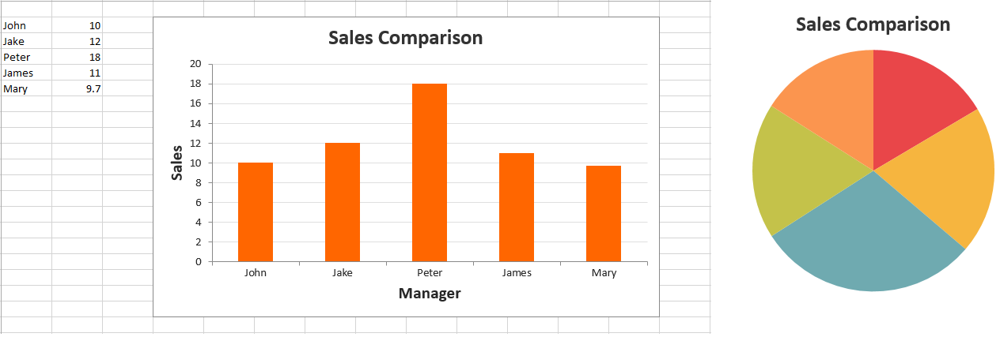
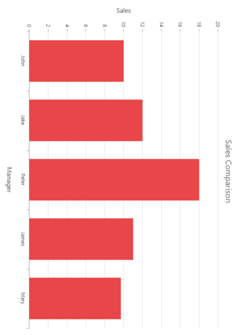

# Exporting Chart

Exporting a chart can be done in both client-side and in server-side. This can be modified by setting values to the property “mode” in exporting. Default value for mode is client. 

## Client-side exporting

In client-side rendered chart can be exported as PNG image or as SVG file.

* Export as PNG - The chart can be exported to image when it is rendered in HTML5 Canvas. To render a chart in canvas, set the EnableCanvasRendering option to true. To export the chart, you can use the export method of the chart. Refer to the online KB link of exporting chart to know more about chart exporting.

* Export as SVG - Chart can be exported as SVG if it is rendered as a scalable vector graphics element. By default chart will be rendered as SVG. 



<body>
    <!--Chart download link-->
    <a id="download" style="cursor: pointer; position: absolute;right: 150px;">ExportChart</a>

         <ej:Chart ID="Chart1" runat="server" Width="600" Height="600" CanResize="true" ClientIDMode="Static" EnableCanvasRendering="true" >
           <Exporting FileName="ChartSnapshot" Type="PNG" 
      </ej:Chart>

    
</body>



[Click](http://asp.syncfusion.com/demos/web/chart/export.aspx) here to view the Export chart online demo sample.

## Server-side exporting

Server-side operations can be done at the code behind page.

### Server side implementation

* To convert the chart data from client to server-side, refer to the following steps.
* Create an ASP application and add a controller.
* Add Syncfusion.EJ, Syncfusion.EJ.Web and Syncfusion.EJ.Export as references to the application.
* Create server side event **OnServerExporting** and write the code to export the chart in server side. 


<body>
    <!--Export Chart-->
        <button onclick="download()" value="Export">Export</button>

<ej:Chart ID="Chart1" runat="server" Width="600" Height="600" CanResize="true" OnServerExporting="ExportChart"  OnServerImageExporting="image" ClientIDMode="Static" EnableCanvasRendering="true" >
           <Exporting FileName="ChartSnapshot" Mode="Server" Type="JPG" />
      </ej:Chart>

    
</body>




protected void ExportChart(object sender, Syncfusion.JavaScript.Web.ChartEventArgs e)
        {
            string Format = e.Arguments["Format"].ToString();
            string FileName = e.Arguments["FileName"].ToString();
            string DataURL = e.Arguments["Data"].ToString();
            string Orientation = e.Arguments["Orientation"].ToString();
            
            if (Format == "svg")       // for svg export
            {
                StringWriter oStringWriter = new StringWriter();
                oStringWriter.WriteLine(System.Uri.UnescapeDataString(DataURL));
                Response.ContentType = "text/plain";
                Response.AddHeader("Content-Disposition", String.Format("attachment;filename={0}", ("Chart.svg")));
                Response.Clear();
                using (StreamWriter writer = new StreamWriter(Response.OutputStream))
                {
                    writer.Write(oStringWriter.ToString());
                }
                Response.End();
            }

            else if (Format == "xlsx")   // to export as excel     
            {
                ExcelExport exp = new ExcelExport();
                exp.Export(this.Chart1.Model, (IEnumerable)Chart1.DataSource,  FileName + ".xlsx", ExcelVersion.Excel2010, null, null);
            }

            else
            {
               DataURL = DataURL.Remove(0, DataURL.IndexOf(',') + 1);
               MemoryStream stream = new MemoryStream(Convert.FromBase64String(DataURL));

                if (Format == "docx")     // to export as word document
                {
                    WordDocument document = new WordDocument();
                    IWSection section = document.AddSection();
                    IWParagraph paragraph = section.AddParagraph();
                    if (Orientation == "landscape")
                        section.PageSetup.Orientation = PageOrientation.Landscape;
                    else
                        section.PageSetup.Orientation = PageOrientation.Portrait;
                    paragraph.AppendPicture(System.Drawing.Image.FromStream(stream));
                    document.Save(FileName + ".doc", Syncfusion.DocIO.FormatType.Doc, Response, Syncfusion.DocIO.HttpContentDisposition.Attachment);
                }
                else if (Format == "pdf")    // to export as PDF
                {
                    PdfDocument pdfDoc = new PdfDocument();
                    pdfDoc.Pages.Add();
                    if (Orientation == "landscape")
                        pdfDoc.Pages[0].Section.PageSettings.Orientation = PdfPageOrientation.Landscape;
                    else
                        pdfDoc.Pages[0].Section.PageSettings.Orientation = PdfPageOrientation.Portrait;
                    pdfDoc.Pages[0].Graphics.DrawImage(PdfImage.FromStream(stream), new PointF(10, 30));
                    pdfDoc.Save(FileName + ".pdf", Response, HttpReadType.Save);
                    pdfDoc.Close();
                }
                else                        // to export as image
                {
                    stream.WriteTo(Response.OutputStream);
                    Response.ContentType = "application/octet-stream";
                    Response.AddHeader("Content-Disposition", String.Format("attachment;filename={0}", FileName + "." + Format));
                    Response.Flush();
                    stream.Close();
                    stream.Dispose();
                }
            }
        }



### Excel Exporting

To convert the chart data from client to server-side, refer to the following steps.

1. Create an ASP application.

2. Add Syncfusion.EJ, Syncfusion.EJ.Web, Syncfusion.EJ.Export and Syncfusion.XlsIO dll’s as references to the application.

Currently, the chart data can be exported at server-side only through the helper functions in the “.Net”. So to use exporting in your projects, it is required to create a server with any of the following.
 
	i). ASP.NET MVC Controller
    
    ii). ASP.NET Web Forms
    
    iii). WebAPI
    
    iv). WCF Service

#### Multiple Excel Exporting

EjChart supports exporting more than one charts in a page, with the *third* argument for the **export** method.

N> Refer to the MultipleExportType.AppendToSheet, MultipleExportType.NewSheet. 



//Render Chart1
<ej:Chart ID="chartContainer1" runat="server" EnableCanvasRendering="true"> 
   
</ej:Chart>

//Render Chart2
<ej:Chart ID="chartContainer2" runat="server" EnableCanvasRendering="true"> 
   
</ej:Chart>




       //Export multiple chart to excel
        function downloadExcel() {
            var chart = $("#chartContainer1").ejChart("instance");
            var exportChart = chart["export"];
                exportChart.call(chart, "Excel" , "ExportToExcel", true);
        }



Export multiple chart to excel at server-side



    public void ExportToExcel(string[] ChartModel)
        {
            List<ExportChartData> data = new List<ExportChartData>();

            data.Add(new ExportChartData("John", 10));
            data.Add(new ExportChartData("Jake", 12));
            data.Add(new ExportChartData("Peter", 18));
            data.Add(new ExportChartData("James", 11));
            data.Add(new ExportChartData("Mary", 9.7));

            ExcelExport exp = new ExcelExport();
            ChartProperties obj = ConvertChartObject(ChartModel);
            bool initial = true;
            IWorkbook book = null;
            foreach (string chartProperty in ChartModel)
            {
                ChartProperties obj = ConvertChartObject(ChartModel);
                if(intial)
                {
                    var book= exp.Export(obj, null, "Export.xlsx", ExcelVersion.Excel2010, true, null, null);
                    initial = false;
                 }   
           else{
                    exp.Export(obj, null, "Export.xlsx", ExcelVersion.Excel2010, false, book, MultipleExportType.NewSheet, null, null);
               }
            
        }

        private ChartProperties ConvertChartObject(string ChartModel)
        {
            JavaScriptSerializer serializer = new JavaScriptSerializer();

            IEnumerable div = (IEnumerable)serializer.Deserialize(ChartModel, typeof(IEnumerable));

            ChartProperties chartProp = new ChartProperties();
            foreach (KeyValuePair<string, object> ds in div)
            {

                var property = chartProp.GetType().GetProperty(ds.Key, BindingFlags.Instance | BindingFlags.Public | BindingFlags.IgnoreCase);
                if (property != null)
                {
                    Type type = property.PropertyType;
                    string serialize = serializer.Serialize(ds.Value);
                    object value = serializer.Deserialize(serialize, type);

                    property.SetValue(chartProp, value, null);
                }
            }
            return chartProp;
        }

    }



## Naming the exported file

EjChart provides options to customize the name of the file to be exported. This can be done by setting the name of the file to the property “fileName” in exporting.

## Rotating the chart

We can also rotate the chart and can export it. Possible angles of rotation are 0, 90, -90 and 180 degree. This can be achieved by setting values to the “angle” property in exporting.



 <ej:Chart ID="Chart1" runat="server">

        <ExportSettings Angle="180" Action="http://js.syncfusion.com/ExportingServices/api/JSChartExport/Export" />
      
    </ej:Chart>


	

## Setting orientation for the document

This is applicable for PDF, excel and word documents. By setting values to the “orientation” property in exporting, we can change the orientation of those documents. By default it will export with portrait orientation.
