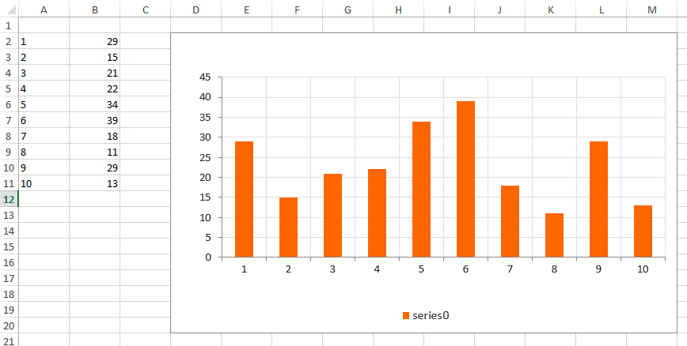

# Exporting Chart

## Image Exporting

The chart can be exported to image when it is rendered in canvas. To render a chart in canvas, set the **EnableCanvasRendering** option to *true*. To export the chart, you can use the [`export`](../api/ejchart#methods:export) method of the chart. Refer to the online [`KB for exporting`](http://www.syncfusion.com/kb/5045) to know more about chart exporting. 

N> Exporting chart as an image is supported in all major browsers except Internet Explorer due to its restriction towards client side download.



<!--Chart download link-->
    <a id="download" download="Chart.png" style="cursor: pointer; position: absolute;right: 150px;">ExportChart</a>
   
<ej:Chart ID="chartContainer" runat="server" EnableCanvasRendering="true"> 
   
</ej:Chart>
 
 



[Click](http://mvc.syncfusion.com/demos/web/chart/exports) here to view the Export chart online demo sample.

## Excel Exporting

Exporting to excel is a server-side operation, so you can use the controller to achieve the excel exporting.

### Server side implementation

To convert the chart data from client to server-side, refer to the following steps.

1. Create an ASP application.

2. Add Syncfusion.EJ, Syncfusion.EJ.Web, Syncfusion.EJ.Export and Syncfusion.XlsIO dll’s as references to the application.
 



      public void ExportToExcel(string ChartModel)
        {
            List<ExportChartData> data = new List<ExportChartData>();

            data.Add(new ExportChartData("John", 10));
            data.Add(new ExportChartData("Jake", 12));
            data.Add(new ExportChartData("Peter", 18));
            data.Add(new ExportChartData("James", 11));
            data.Add(new ExportChartData("Mary", 9.7));

            ExcelExport exp = new ExcelExport();
            ChartProperties obj = ConvertChartObject(ChartModel);
            exp.Export(obj, (IEnumerable)data, "Export.xlsx", ExcelVersion.Excel2010, null, null);
        }

        private ChartProperties ConvertChartObject(string ChartModel)
        {
            JavaScriptSerializer serializer = new JavaScriptSerializer();

            IEnumerable div = (IEnumerable)serializer.Deserialize(ChartModel, typeof(IEnumerable));

            ChartProperties chartProp = new ChartProperties();
            foreach (KeyValuePair<string, object> ds in div)
            {

                var property = chartProp.GetType().GetProperty(ds.Key, BindingFlags.Instance | BindingFlags.Public | BindingFlags.IgnoreCase);
                if (property != null)
                {
                    Type type = property.PropertyType;
                    string serialize = serializer.Serialize(ds.Value);
                    object value = serializer.Deserialize(serialize, type);

                    property.SetValue(chartProp, value, null);
                }
            }
            return chartProp;
        }



3. To export the chart server-side, you need to call the **export** method and pass export type (either image or excel) and server-side Post Action Name as an argument. The third argument of the export method is a Boolean property that specifies whether only the current chart should be exported or all charts in page should be exported.



    <!--Export Char to Excel-->
  <a id="downloadexcel" style="cursor: pointer; position:absolute;">
  <button onclick="downloadExcel()" title="Excel Export" value="Export">Export</button>
      </a>
      
<ej:Chart ID="chartContainer" runat="server"> 
   
</ej:Chart>
  
  
  
   
      
       //Export chart to excel
       if (document.getElementById('downloadexcel').addEventListener)
                document.getElementById('downloadexcel').addEventListener('click', downloadexcel, false);
            else
                document.getElementById('downloadexcel').attachEvent('click', downloadexcel, false);

            function downloadexcel()
            {               
                var chart = $("#chartContainer").ejChart("instance");
                var exportChart = chart["export"];
                exportChart.call(chart, "Excel" , "ExportToExcel");
            }



4.Currently, the chart data can be exported at server-side only through the helper functions in the “.Net”. So to use exporting in your projects, it is required to create a server with any of the following.
 
	i). ASP.Net MVC Controller
    
    ii). ASP.Net Webforms
    
    iii). WebAPI
    
    iv). WCF Service

## Multiple Chart Exporting

EjChart supports exporting more than one charts in a page, with the *third* argument for the **export** method.

N> Refer to the MultipleExportType.AppendToSheet, MultipleExportType.NewSheet. 



//Render Chart1
<ej:Chart ID="chartContainer1" runat="server" EnableCanvasRendering="true"> 
   
</ej:Chart>

//Render Chart2
<ej:Chart ID="chartContainer2" runat="server" EnableCanvasRendering="true"> 
   
</ej:Chart>




       //Export multiple chart to excel
        function downloadExcel() {
            var chart = $("#chartContainer1").ejChart("instance");
            var exportChart = chart["export"];
                exportChart.call(chart, "Excel" , "ExportToExcel", true);
        }



Export multiple chart to excel at server-side



    public void ExportToExcel(string[] ChartModel)
        {
            List<ExportChartData> data = new List<ExportChartData>();

            data.Add(new ExportChartData("John", 10));
            data.Add(new ExportChartData("Jake", 12));
            data.Add(new ExportChartData("Peter", 18));
            data.Add(new ExportChartData("James", 11));
            data.Add(new ExportChartData("Mary", 9.7));

            ExcelExport exp = new ExcelExport();
            ChartProperties obj = ConvertChartObject(ChartModel);
            bool initial = true;
            IWorkbook book = null;
            foreach (string chartProperty in ChartModel)
            {
                ChartProperties obj = ConvertChartObject(ChartModel);
                if(intial)
                {
                    var book= exp.Export(obj, null, "Export.xlsx", ExcelVersion.Excel2010, true, null, null);
                    initial = false;
                 }   
           else{
                    exp.Export(obj, null, "Export.xlsx", ExcelVersion.Excel2010, false, book, MultipleExportType.NewSheet, null, null);
               }
            
        }

        private ChartProperties ConvertChartObject(string ChartModel)
        {
            JavaScriptSerializer serializer = new JavaScriptSerializer();

            IEnumerable div = (IEnumerable)serializer.Deserialize(ChartModel, typeof(IEnumerable));

            ChartProperties chartProp = new ChartProperties();
            foreach (KeyValuePair<string, object> ds in div)
            {

                var property = chartProp.GetType().GetProperty(ds.Key, BindingFlags.Instance | BindingFlags.Public | BindingFlags.IgnoreCase);
                if (property != null)
                {
                    Type type = property.PropertyType;
                    string serialize = serializer.Serialize(ds.Value);
                    object value = serializer.Deserialize(serialize, type);

                    property.SetValue(chartProp, value, null);
                }
            }
            return chartProp;
        }

    }



