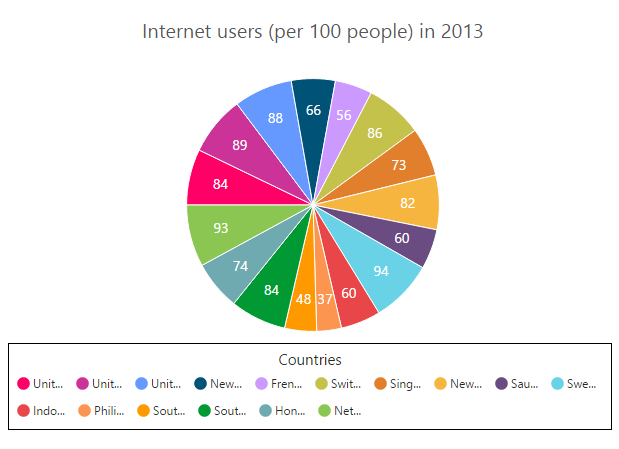
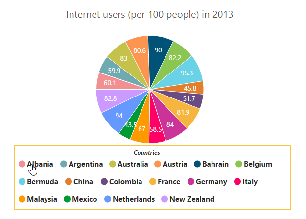

# Legend in ASP.NET Webforms Chart

The legend contains the list of Chart Series and Trendlines that appear in a chart. 

## Legend Visibility

By default, the legend is enabled in the chart. You can enable or disable it by using the *Visible* option of the **Legend**.



<ej:Chart ID="Chart1" runat="server"> 
   <%--Visible chart legend--%>
    <Legend Visible="true"></Legend>
</ej:Chart>



[Click](http://asp.syncfusion.com/demos/web/chart/legendposition1.aspx) here to view the online demo sample for legend customization.

## Legend title

To add the title to the legend, you have to specify the **Legend.Title.Text** option.



<ej:Chart ID="Chart1" runat="server"> 
   <%--Visible chart legend--%>
    <Legend>
        <%--Add title to the chart legend--%>
        <Title Text="Countries"></Title>
    </Legend>
</ej:Chart>



## Position and Align the Legend

By using the **Position** option, you can position the legend at *Left*, *Right*, *Top* or *Bottom* of the chart. The legend is positioned at the **Bottom** of the chart, by default.



<ej:Chart ID="Chart1" runat="server"> 
   <%--Place the legend at top of the chart--%>
    <Legend Position="Top">
    </Legend>
</ej:Chart>



**Legend Alignment**

You can align the legend to the *Center*, *Far* or *Near* based on its position by using the **Alignment** option.



<ej:Chart ID="Chart1" runat="server"> 
   <%--The below two settings will place the legend at the top-right corner of the chart--%>
    <Legend Position="Top" Alignment="Far">
    </Legend>
</ej:Chart>



## Arrange legend items in the rows and columns

You can arrange the legend items horizontally and vertically by using the **RowCount** and **ColumnCount** options of the legend.

* When only the RowCount is specified, the legend items are arranged according to the RowCount and number of columns may vary based on the number of legend items.

* When only the ColumnCount is specified, the legend items are arranged according to the ColumnCount and number of rows may vary based on the number of legend items.

* When both the options are specified, then the one which has higher value is given preference. For example, when the RowCount is 4 and ColumnCount is 3, legend items are arranged in 4 rows.

* When both the options are specified and have the same value, the preference is given to the ColumnCount when it is positioned at the top/bottom position. The preference is given to the RowCount when it is positioned at the left/right position.
 



<ej:Chart ID="Chart1" runat="server"> 
   <%--Arrange legend items in 4 rows and approximately 4 columns. Column couldn’t may vary based on number of items.--%>
    <Legend RowCount="4" ColumnCount="4">
    </Legend>
</ej:Chart>



## Customization

### Legend shape

To change the legend icon shape, you have to specify the shape in the **Shape** property of the legend. When you want the legend icon to display the prototype of the series, you have to set the **SeriesType** as shape.



<ej:Chart ID="Chart1" runat="server"> 
   <%--Change legend shape--%>
    <Legend Shape="SeriesType">
    </Legend>
</ej:Chart>



### Legend items size and border

You can change the size of the legend items by using the *ItemStyle.Width* and *ItemStyle.Height* options. To change the legend item border, use **Border** option of the legend ItemStyle.



<ej:Chart ID="Chart1" runat="server"> 
   
    <Legend>
        <%--Change legend items border, height and width--%>
        <ItemStyle Width="13" Height="13">
            <Border Width="1" Color="#FF0000" />
        </ItemStyle>
    </Legend>
</ej:Chart>



### Legend size

By default, legend takes 20% of the **Height** horizontally when it was placed on the top or bottom position and 20% of the **Width** vertically while placing on the left or right position of the chart. You can change this default legend size by using the **Size** option of the legend.  



<ej:Chart ID="Chart1" runat="server"> 
   
    <Legend>
        <%--Change legend size--%>
        <Size Height="100" Width="550" />
    </Legend>
</ej:Chart>



### Legend Item Padding

You can control the spacing between the legend items by using the **ItemPadding** option of the legend.  The default value is 10. 



<ej:Chart ID="Chart1" runat="server"> 
   <%--Add space between each legend item--%>
    <Legend ItemPadding="15">
    </Legend>
</ej:Chart>



### Legend border

You can customize the legend border by using the **Border** option in the legend. 



<ej:Chart ID="Chart1" runat="server"> 
   <%--Set border color and width to legend--%>
    <Legend>
        <Border Color="#FFC342" Width="2" />
    </Legend>
</ej:Chart>



### Scrollbar for legend

You can enable or disable the legend scrollbar by using the **EnableScrollbar** option of the legend. When you disable the scrollbar option, the legend does not consider the default size and chart draws in the remaining space. If you have specified the **size** to the legend with the scrollbar disabled, then the legends beyond this limit will get clipped. The default value of EnableScrollbar option is **true**.  



<ej:Chart ID="Chart1" runat="server"> 
   <%--Enable scrollbar option in for legend--%>
    <Legend EnableScrollbar="true">
        <Size Width="430" Height="80" />
    </Legend>
</ej:Chart>



### Customize the legend text

To customize the legend item text and title you can use the **Legend.Font** and **Legend.Title** options. You can change the legend title alignment by using the TextAlignment option of the legend title.



<ej:Chart ID="Chart1" runat="server"> 
    <Legend>
        <%--Customize the legend item text--%>
        
        <Title TextAlignment="Center">
            <%--Customize the legend title text--%>
            
        </Title>
    </Legend>
</ej:Chart>



### LegendItems Text Overflow

**Trim**

You can trim the legend item text when its width exceeds the **Legend.TextWidth**, by specifying *TextOverflow* as **Trim**. The original text will be displayed on mouse hover.



<ej:Chart ID="Chart1" runat="server"> 
    <%--trim the legend text--%>
    <Legend TextOverflow="Trim" TextWidth="34">
    </Legend>
</ej:Chart>



**Wrap**

By specifying *TextOverflow* as **Wrap**, you can wrap the legend text by word.

**WrapAndTrim**

You can wrap and trim the legend text by specifying *TextOverflow* as **WrapAndTrim**. The original text will be displayed on mouse hover.

## Handle the legend item clicked

You can get the legend item details such as *Index*, *Bounds*, *Shape* and *Series* by subscribing the **LegendItemClick** event on the chart. When the legend item is clicked, it triggers the event and returns the Legend information. 



<ej:Chart ID="Chart1" runat="server" OnClientLegendItemClick="onLegendClicked"> 
    <%--trim the legend text--%>
    <Legend TextOverflow="Trim" TextWidth="34">
    </Legend>
</ej:Chart>

 
     
   
     
     function onLegendClicked(sender) {
        //Get legend item details on legend item click.
        var legendItem = sender.data;
      }



## Series selection on legend item click

You can select a specific series or point while clicking on the corresponding legend item through disabling the **ToggleSeriesVisibility** option of the legend. The default value of toggleSeriesVisibility option is **true**. To customize the series selection refer to the series Selection.



<ej:Chart ID="Chart1" runat="server"> 
    <%--Disable series collapsing on legend item clicked--%>
    <Legend ToggleSeriesVisibility="false">
    </Legend>
</ej:Chart>      



## Collapsing legend item

You can collapse the specific series/point legend item displaying in the chart, by setting the **VisibleOnLegend** as *Hidden* in the point or series.



        <ej:Chart ID="Chart1" runat="server">
            <Series>
                <ej:Series>
                    <Points>
                        <ej:Points X="Albania" Y="60.1"></ej:Points>
                        <%--Collapse the point's legend item in the legend collection--%>
                        <ej:Points X="New Zealand" Y="82.8" VisibleOnLegend="Hidden"></ej:Points>
                    </Points>
                </ej:Series>
            </Series>            
        </ej:Chart>
      


