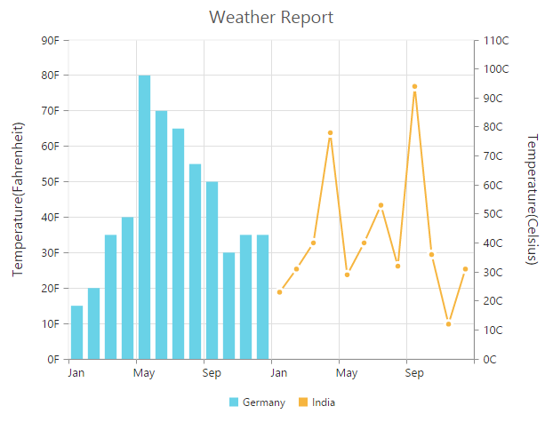

# Multiple panes

Chart area can be divided into multiple panes using the **RowDefinitions** and **ColumnDefinitions** properties.

### Row Definitions

To split the chart area vertically into a number of rows, use RowDefinitions of the chart. 

* You can allocate space for each row by using the **Unit** option that determines whether the chart area should be split by *percentage* or *pixels* for the given **RowHeight** value of the RowDefinitions.
 
* To associate a vertical axis to a row, specify the RowDefintions **Index** value to the RowIndex property of the chart axis.

* To customize each row’s horizontal line, use LineColor and LineWidth property.



<ej:Chart ID="Chart1" runat="server"> 
    <%--Splitting chart area into multiple rows--%>
    <RowDefinitions>
        <%--Split first row of the chart area--%>
        <ej:RowDefinitions Unit="percentage" LineColor="grey" LineWidth="0" RowHeight="50" />
        <%--Split second row of the chart area--%>
        <ej:RowDefinitions Unit="percentage" LineColor="green" LineWidth="0" RowHeight="50" />
    </RowDefinitions>

    <Axes>
        <%--Create secondary axis and bind it to second row of chart area--%>
        <ej:Axis Name="yAxis1" RowIndex="1">
        </ej:Axis>
    </Axes>

    <Series>
        <%--Binding vertical axis name--%>
        <ej:Series YAxisName="yAxis1">
        </ej:Series>
    </Series>
</ej:Chart>



[Click](http://asp.syncfusion.com/demos/web/chart/multipleaxes.aspx) here to view the online demo sample for multiple panes.

**Row Span**

For spanning the vertical axis along multiple panes vertically, you can use **RowSpan** property of axis. 



<ej:Chart ID="Chart1" runat="server"> 
    <%--Splitting chart area into multiple rows--%>
    <RowDefinitions>
        <%--add row definitions--%>
    </RowDefinitions>

    <Axes>
        <%--Create secondary axis and bind it to second row of chart area--%>
    </Axes>

    <PrimaryYAxis RowSpan="2"></PrimaryYAxis>

    <Series>
        <%-- add series--%>
    </Series>
</ej:Chart>



## Column Definitions

To split the chart area horizontally into a number of columns, use ColumnDefinitions of the chart.

* You can allocate space for each column by using the **Unit** option that determines whether the chart area should be split by *percentage* or *pixels* for the given **ColumnWidth** value of the ColumnDefinitions.
 
* To associate a horizontal axis to a column, specify the columnDefintions **Index** value to the **ColumnIndex** property of the chart axis.
 


<ej:Chart ID="Chart1" runat="server"> 
    <%--Splitting chart area into multiple columns--%>
    <ColumnDefinitions>
        <%--Split first column of the chart area--%>
        <ej:ColumnDefinitions Unit="percentage" ColumnWidth="50"/>
        <%--Split second column of the chart area--%>
        <ej:ColumnDefinitions Unit="percentage" ColumnWidth="50"/>
    </ColumnDefinitions>

    <Axes>
        <%--Create secondary axis and bind it to second row of chart area--%>
        <ej:Axis Name="xAxis1" ColumnIndex="1">
        </ej:Axis>
    </Axes>

    <Series>
        <%--Binding horizontal axis name--%>
        <ej:Series XAxisName="xAxis1">
        </ej:Series>
    </Series>
</ej:Chart>



**Column Span**

For spanning the horizontal axis along multiple panes horizontally, you can use **ColumnSpan** property of axis. 


 
<ej:Chart ID="Chart1" runat="server"> 
    <%--Splitting chart area into multiple columns--%>
    <ColumnDefinitions>
        <%-- split no.of column--%>
    </ColumnDefinitions>

    <Axes>
        <%-- add axis--%>
    </Axes>

   <PrimaryXAxis ColumnSpan="2" Name="xAxis1" ></PrimaryXAxis>
    <Series>
        <%--add series--%>
    </Series>
</ej:Chart>



