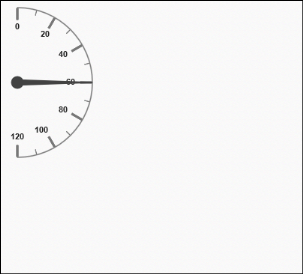

# Gauge Position

Semi-circular Gauge can be positioned within the canvas element which provides better appearance for the gauge in the canvas.

## Positioning

* Semi-circular Gauge can be positioned with the help of the attribute called gaugePosition. It is an enumerable value. You can position the gauge away from the corner with the help of the distanceFromCorner attribute. 
* The possible enum values for the gaugePosition are as follows:
  
  
  1. Topleft
  2. Topcenter
  3. Topright
  4. Middleleft
  5. Center
  6. Middleright
  7. Bottomleft
  8. Bottomcenter
  9. Bottomright

  

        <ej:CircularGauge runat="server" ID="SemiCircularGauge" Value="60"

        <%--setting basic dimension-- %>

        BackgroundColor="transparent" Width="500" Height="500" Radius="100"

        <%--setting gauge position-- %>

        GaugePosition="TopLeft"

        <%--setting gauge distance from corner-- %>

        DistanceFromCorner="25">

        <%--<setting frame values--%>

        <Frame FrameType="HalfCircle"

        HalfCircleFrameEndAngle="90"

        HalfCircleFrameStartAngle="270"/>

        <%--setting gauge distance from corner-- %>

        <Scales>

        <ej:CircularScales SweepAngle="180" StartAngle="270" Radius="100"

        ShowScaleBar="true" Size="1" Maximum="120"

        MajorIntervalValue="20" MinorIntervalValue="10">

        <%--setting scale border-- %>

        <Border Width="0.5">

        </Border>

        </ej:CircularScales>

        </Scales>

        </ej:CircularGauge>



Execute the above code to render the following output.

 

