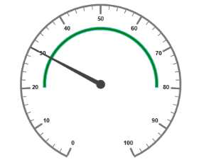
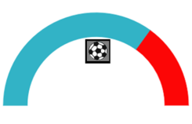

# Pointers

Pointer value points out the actual value set in the Circular Gauge. You can customize the pointers to improve the appearance of Gauge.

## Adding Pointer Collection

Pointer collection is directly added to the scale object. To add pointer collection in a Gauge control refer the following code example.  



<%--For Circular Gauge rendering-- %>

<ej:CircularGauge runat="server" ID="ScaleCircularGauge">

<Scales>

<ej:CircularScales>

<PointerCollection>

<ej:Pointers value="30"></ej:Pointers>

</PointerCollection>

</ej:CircularScales>

</Scales>

</ej:CircularGauge>



Execute the above code to render the following output.

  

## Adding Pointer Value

Pointer value is the important element in the Circular Gauge that indicates the Gauge value. Real purpose of the Circular Gauge is based on the pointer value. You can set the pointer value either directly during rendering the control or it can be achieved by public method too.



<%--For Circular Gauge rendering-- %>

<ej:CircularGauge runat="server" ID="ScaleCircularGauge">

<Scales>

<ej:CircularScales ShowRanges="true" ShowScalebar="true" Size="2" radius="150" MajorIntervalValue="10" MinorIntervalValue="2" >

<RangeCollection>

<ej:CircularRanges StartValue="20" EndValue="80" BackgroundColor="green"></ej:CircularRanges>

</RangeCollection>

<%--For setting ponter value-- %>

<PointerCollection>

<ej:Pointers Value="30"></ej:Pointers>

</PointerCollection>

</ej:CircularScales>

</Scales>

</ej:CircularGauge>



Execute the above code to render the following output.

 

## Pointer Styles

### Colors and Border

* The Pointers border is modified with the object called border as in scales. It has two border property called color and width which are used to customize the border color of the pointer and border width of the pointer. 
* You can set the background color to improve the look of the Circular Gauge and you can customize the background color of the scale using backgroundColor.



        <%--For Circular Gauge rendering-- %>

        <ej:CircularGauge runat="server" ID="ScaleCircularGauge">

        <Scales>

        <ej:CircularScales ShowScalebar="true" radius="110">

        <PointerCollection>

        <%--For setting pointer width, background color, pointer value, length -- %>

        <ej:Pointers Value="45" width="16" Opacity="0.6" BackgroundColor="yellow" Length="80"></ej:Pointers>

        </PointerCollection>

        </ej:CircularScales>

        </Scales>

        </ej:CircularGauge>



Execute the above code to render the following output.

 

### Appearance

* Based on the value, thepointer point out the label value. You can set the pointer length and width using length and width property respectively. 
* And you can also adjust the opacity of the pointer using the property opacity which holds the value between 0 and 1. You can add the gradient effects to the pointer using gradient object.



        <%--For Circular Gauge rendering-- %>

        <ej:CircularGauge runat="server" ID="ScaleCircularGauge">

        <Scales>

        <ej:CircularScales ShowscaleBar="true" BackgroundColor="orange" radius="110">

        <Border Width="2" Color="red" />

        <%--For setting pointer value.length, width and background color-- %>

        <PointerCollection>

        <ej:Pointers Value="45" width="16" Opacity="0.6" BackgroundColor="orange" ShowBackNeedle="true" Length="80" BackNeedleLength="0"></ej:Pointers>

        </PointerCollection>

        </ej:CircularScales>

        </Scales>

        </ej:CircularGauge>



Execute the above code to render the following output.

 

### Position the pointer

* Pointer can be positioned with the help of two properties such as distanceFromScale and placement. distanceFromScale property defines the distance between the scale and pointer.  Placement property is used to locate the pointer with respect to scale either inside the scale or outside the scale or along the scale. 
* It is an enumerable data type. Both the property is applied only if pointer type is marker. For needle type marker, it renders with default position that is unchangeable.



        <%--For Circular Gauge rendering-- %>

        <ej:CircularGauge runat="server" ID="ScaleCircularGauge">

        <Scales>

        <ej:CircularScales ShowscaleBar="true" BackgroundColor="#DCEBF9" Size="10" radius="110">

        <Border Width="2" Color="blue" />

        <%--For setting pointer type, placement, marker type, distance from scale-- %>

        <PointerCollection>

        <ej:Pointers Value="40" length="20" width="20" BackgroundColor="#DCEBF9" ShowBackNeedle="true" BackNeedleLength="0" DistanceFromScale="20" Placement="Near" Type="Marker" MarkerType="Triangle"></ej:Pointers>

        </PointerCollection>

        </ej:CircularScales>

        </Scales>

        </ej:CircularGauge>



Execute the above code to render the following output.

 

### Types

* Circular gauge pointer has two types such as,

  1. Needle
  
  2. Marker
  
* Needle type pointers are the default pointers that cannot be positioned and that is located at the center of the gauge. There are four different shapes of needle pointers such as 
  
  1. Rectangle
  
  2. Triangle
  
  3. Trapezoid 
  
  4. Arrow
  
* For marker pointer, the available dimensions are 

  1. Rectangle
  
  2. Triangle
  
  3. Ellipse
  
  4. Diamond
  
  5. Pentagon
  
  6. Circle 
  
  7. Slider
  
  8. Pointer
  
  9. Wedge
  
  10. Trapezoid
  
  11. Rounded Rectangle

### Pointer Image

In ASP Circular Gauge, it is possible to replace the pointer with some images. You can fix an image instead of rendering the pointer.

### ImageUrl

To implement the pointer image we need to give the API called ImageUrl. It is a string datatype. Image type pointer is applicable for both marker and needle type pointers and it is possible to combine the normal marker pointer type with an image type. The three possibilities are

1. Needle Image
2. Marker Image
3. Marker pointer with Image

#### Needle Image 

In this type, needle pointer is completely replaced by image. You can implement it with the help of thr following example.



<ej:CircularGauge runat="server" ID="CircularGauge1">

<%-- To set the Frame type as half circle --%>

<Frame FrameType="HalfCircle" />

<%-- To set the scale options --%>

<Scales>

<ej:CircularScales ShowRanges="true" SweepAngle="180" StartAngle="180" Radius="130" ShowScaleBar="false" ShowLabels="false">

<%-- To set the pointer options --%>

<PointerCollection>

<%-- To set the pointer type as needle --%>

<ej:Pointers Type="Needle"

<%-- To set the needle type as image --%>

NeedleType="Image"

<%-- To set the image url --%>

ImageUrl="nib.png"

<%-- To set the pointer value --%>

Value="60"

<%-- To set the pointer dimension --%>

Width="160" Length="30">

</ej:Pointers>

</PointerCollection>

<%-- To set the ticks options --%>

<TickCollection>

<ej:CircularTicks Height="0" Width="0" />

</TickCollection>

<%-- To set the range options --%>

<RangeCollection>

<ej:CircularRanges DistanceFromScale="-30"

StartValue="0" EndValue="70" Size="40">

</ej:CircularRanges>

<ej:CircularRanges BackgroundColor="#fc0606"

DistanceFromScale="-30" Size="40"

StartValue="70" EndValue="100">

<Border Color="#fc0606"></Border>

</ej:CircularRanges>

</RangeCollection>

</ej:CircularScales>

</Scales>

</ej:CircularGauge>



{{ '' | markdownify }}

#### Marker Image 

In this type, the marker pointer is completely replaced by the image. You can implement it with the help of the following example.



<ej:CircularGauge runat="server" ID="CircularGauge1">

<%-- To set the Frame type as half circle --%>

<Frame FrameType="HalfCircle" />

<%-- To set the scale options --%>

<Scales>

<ej:CircularScales ShowRanges="true" SweepAngle="180" StartAngle="180" Radius="130" ShowScaleBar="false" ShowLabels="false">

<%-- To set the pointer options --%>

<PointerCollection>

<%-- To set the pointer type as marker --%>

<ej:Pointers Type="Marker"

<%-- To set the needle type as image --%>

MarkerType="Image"

<%-- To set the image url --%>

ImageUrl="ball.png"

<%-- To set the pointer value --%>

Value="60"

<%-- To set the pointer dimension --%>

Width="160" Length="30">

</ej:Pointers>

</PointerCollection>

<%-- To set the ticks options --%>

<TickCollection>

<ej:CircularTicks Height="0" Width="0" />

</TickCollection>

<%-- To set the range options --%>

<RangeCollection>

<ej:CircularRanges DistanceFromScale="-30"

StartValue="0" EndValue="70" Size="40">

</ej:CircularRanges>

<ej:CircularRanges BackgroundColor="#fc0606"

DistanceFromScale="-30" Size="40"

StartValue="70" EndValue="100">

<Border Color="#fc0606"></Border>

</ej:CircularRanges>

</RangeCollection>

</ej:CircularScales>

</Scales>

</ej:CircularGauge>



 

#### Marker pointer with Image 

In this type, marker pointer is drawn first and then the image is loaded. You can implement it with the help of following example.



<ej:CircularGauge runat="server" ID="CircularGauge1">

            <%-- To set the Frame type as half circle --%>

            <Frame FrameType="HalfCircle" />

            <%-- To set the scale options --%>

            <Scales>

                <ej:CircularScales ShowRanges="true" SweepAngle="180" StartAngle="180" Radius="130" ShowScaleBar="false" ShowLabels="false">

                   <%-- To set the pointer options --%>

                    <PointerCollection>

                        <%-- To set the pointer type as marker --%>

                        <ej:Pointers Type="Marker" 

                         <%-- To set the needle type as rectangle --%>

                         MarkerType="Rectangle" 

                         <%-- To set the image url --%>

                         ImageUrl="ball.png" 

                         <%-- To set the pointer value --%>

                         Value="50" 

                         <%-- To set the pointer dimension --%>

                         Width="160" Length="30">

                         <Border Color="Black" Width="3" ></Border>

                        </ej:Pointers>

                    </PointerCollection>

                    <%-- To set the ticks options --%>

                    <TickCollection>

                        <ej:CircularTicks Height="0" Width="0" />

                    </TickCollection>

                    <%-- To set the range options --%>

                    <RangeCollection>

                        <ej:CircularRanges DistanceFromScale="-30" 

                                 StartValue="0" EndValue="70" Size="40">

                        </ej:CircularRanges>

                        <ej:CircularRanges BackgroundColor="#fc0606"  

                                  DistanceFromScale="-30" Size="40" 

                                  StartValue="70" EndValue="100">

                        <Border Color="#fc0606"></Border>

                        </ej:CircularRanges>

                    </RangeCollection>

                </ej:CircularScales>

            </Scales>

        </ej:CircularGauge>


 

## Multiple Pointers

Circular Gauge can have multiple pointers on it. You can use any combination and any number of pointers in a Gauge. That is, a Gauge can contain any number of marker pointer and any number of needle pointers. Refer the following code example containing two pointers.



<%--For Circular Gauge rendering-- %>

<ej:CircularGauge runat="server" ID="ScaleCircularGauge">

<Scales>

<ej:CircularScales ShowscaleBar="true" BackgroundColor="#DCEBF9" Size="10" radius="110">

<Border Width="2" Color="green" />

<%--For setting pointer1-- %>

<PointerCollection>

<ej:Pointers Value="40" length="80" width="16" Opacity="0.6" BackgroundColor="#DCEBF9" ></ej:Pointers>

</PointerCollection>

<%--For setting pointer2-- %>

<PointerCollection>

<ej:Pointers placement="Near" Type="Marker" distanceFromScale="20"  MarkerType="Triangle" Length="20" Width="20" Value="60" backgroundColor="#DCEBF9"></ej:Pointers>

</PointerCollection>

</ej:CircularScales>

</Scales>

</ej:CircularGauge>



Execute the above code to render the following output.

 

## Pointer Value Text

Gauge Pointer valuetext is used to display the current value of the pointer in the Circular Gauge control.

### Positioning the text

You can position the Circular Gauge pointer value with the gauge as center by using the API called distance. You can Disable/ Enable these pointers value by using the API showValue.



<%--Setting basic properties -- %>

<ej:CircularGauge runat="server" ID="CoreCircularGauge" Radius= "100" Value= "55" BackgroundColor= "transparent">

<%-- Setting scale properties-- %>

<Scales>

<ej:CircularScalesShowRanges= "true">

<%-- Setting ticks properties-- %>

<TickCollection>

<ej:CircularTicks Height= "0" Width= "0"/>

</TickCollection>

<%-- Setting pointers properties -- %>

<PointerCollection>

<ej:Pointers>

<PointerValueText

Color="#8c8c8c"

<%-- setting distance property -- %>

Distance="10"

<%--enable showValue property--%>

ShowValue="true">

</PointerValueText>

</ej:Pointers>

</PointerCollection>

<%--Setting range properties-- %>

<RangeCollection>

<ej:CircularRanges Size= "40" StartValue= "0" EndValue= "50" BackgroundColor= "#1B4279">

<Border Color= "#1B4279"></Border>

</ej:CircularRanges>

<ej:CircularRanges Size= "40" StartValue= "50" EndValue= "100" BackgroundColor= "#91B8F3">

<Border Color="#91B8F3"></Border>

</ej:CircularRanges>

</RangeCollection>

</ej:CircularScales>

</Scales>

</ej:CircularGauge>



Run the above code to render the output as follows.

 

## Appearance

Appearance of the Circular Gaugepointer value text is adjusted by using four properties. Such as color, angle, autoAngle and opacity.

* Color property is used to set the color of the pointer value text.
* Angle property is used to set the angle in which the text is displayed.
* Auto Angle is used to display the text in certain angle based on pointer position angle.
* Opacity is used to customize the brightness of the text. 



        <%-- Setting basic properties-- %>

        <ej:CircularGauge runat="server" ID="CoreCircularGauge" Radius= "100" Value= "55" BackgroundColor= "transparent">

        <%-- Setting scale properties -- %>

        <Scales>

        <ej:CircularScales ShowRanges= "true">

        <%-- Setting ticks properties-- %>

        <TickCollection>

        <ej:CircularTicks Height= "0" Width= "0"/>

        </TickCollection>

        <%-- Setting pointers properties-- %>

        <PointerCollection>

        <ej:Pointers>

        <PointerValueText

        Distance="-5"

        ShowValue="true"

        <%-- Setting color property-- %>

        Color="red"

        <%-- Setting opacity property-- %>

        Opacity= "0.7"

        <%--Setting angle property-- %>

        Angle="20"

        <%-- Setting auto angle property-- %>

        AutoAngle="false" >

        </PointerValueText>

        </ej:Pointers>

        </PointerCollection>

        <%--Setting range properties-- %>

        <RangeCollection>

        <ej:CircularRanges Size= "40" StartValue= "0" EndValue= "50" BackgroundColor= "#1B4279">

        <Border Color= "#1B4279"></Border>

        </ej:CircularRanges>

        <ej:CircularRanges Size= "40" StartValue= "50" EndValue= "100" BackgroundColor= "#91B8F3">

        <Border Color="#91B8F3"></Border>

        </ej:CircularRanges>

        </RangeCollection>

        </ej:CircularScales>

        </Scales>

        </ej:CircularGauge>



Run the above code to render the output as follows.

 

## Font Options

Similar to other collection, font option is also available in this pointer value text such as size, fontFamily and fontStyle. 



// Setting basic properties

<ej:CircularGauge runat="server" ID="CoreCircularGauge" Radius= "100" Value= "55" BackgroundColor= "transparent">

// Setting scale properties

<Scales>

<ej:CircularScales ShowRanges= "true">

// Setting ticks properties

<TickCollection>

<ej:CircularTicks Height= "0" Width= "0"/>

</TickCollection>

// Setting pointers properties

<PointerCollection>

<ej:Pointers>

<PointerValueText

Distance="-5"

ShowValue="true"

Color="red"

Opacity= "0.7"

Angle="20"

AutoAngle="false" >

// Setting font option

</PointerValueText>

</ej:Pointers>

</PointerCollection>

// Setting range properties

<RangeCollection>

<ej:CircularRanges Size= "40" StartValue= "0" EndValue= "50" BackgroundColor= "#1B4279">

<Border Color= "#1B4279"></Border>

</ej:CircularRanges>

<ej:CircularRanges Size= "40" StartValue= "50" EndValue= "100" BackgroundColor= "#91B8F3">

<Border Color="#91B8F3"></Border>

</ej:CircularRanges>

</RangeCollection>

</ej:CircularScales>

</Scales>

</ej:CircularGauge>



Run the above code to render the output as follows.

 

