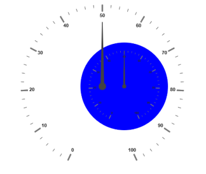

# Sub Gauges

A Circular Gauge containing another circular gauge is said to be Sub Gauges. In order to make  a sample like watch that has second gauge, minute gauge and hour gauge, sub gauges are used.

## Adding Sub Gauges

Sub gauge collection is directly added to the scale object. Refer the following code example to add custom sub gauge collection in a Gauge control



<%--For Circular Gauge rendering-- %>

<%--For setting sub gauge -- %>

<ej:CircularGauge  runat="server" ID="Subgauge1" value="50" BackgroundColor="blue"  Radius="150"></ej:CircularGauge>

<ej:CircularGauge runat="server" Value="50" ID="CircularGauge1">

<Scales>

<ej:CircularScales radius="190">

<PointerCollection>

<ej:Pointers  Value="0"  length="110"></ej:Pointers>

</PointerCollection>

<labelCollection>

<ej:CircularLabels type="major" />

</labelCollection>

<SubGaugeCollection>

<ej:SubGauge ControlID="Subgauge1" Height="200"  Width="200">

<Position X="100" Y="120"/>

</ej:SubGauge>

</SubGaugeCollection>

</ej:CircularScales>

</Scales>

</ej:CircularGauge>



### Basic Customization

Basic attributes such as height and width property are used to set height and width of the sub gauge. You can easily position the gauge in another gauge using the position object and by giving the X and Y Coordinates value. controlID attribute is used to specify the sub gauge ID.



<%--For Circular Gauge rendering-- %>

<ej:CircularGauge  runat="server" ID="Subgauge1" value="50" BackgroundColor="blue" radius="110">

<Scales>

<ej:CircularScales radius="110">

</ej:CircularScales>

</Scales>

</ej:CircularGauge>

<ej:CircularGauge runat="server" ID="CircularGauge1" Height="500" Width="500" Value="50">

<Scales>

<ej:CircularScales radius="190">

<SubGaugeCollection>

<%--For enabling animation and setting animation speed-- %>

<ej:SubGauge ControlID="Subgauge1" Height="200"  Width="200">

<Position X="200" Y="150"/>

</ej:SubGauge>

</SubGaugeCollection>

</ej:CircularScales>

</Scales>

</ej:CircularGauge>



Execute the above code to render the following output.

 

### Multiple Sub Gauges

You can set multiple sub gauges in a single Circular Gauge by adding an array of sub gauge objects. Refer the following code example for multiple sub gauges functionality.



<%--For Circular Gauge rendering-- %>

<ej:CircularGauge  runat="server" ID="Subgauge1"  BackgroundColor="#f5b43f" >

</ej:CircularGauge>

<ej:CircularGauge  runat="server" ID="Subgauge2"  BackgroundColor="#f5b43f" >

</ej:CircularGauge>

<ej:CircularGauge runat="server" ID="CircularGauge1" Height="500" Width="500" >

<Scales>

<ej:CircularScales ShowRanges="true"  ShowscaleBar="false" radius="250" Size="5" Maximum="100">

<SubGaugeCollection>

<%--subgauge1--%>

<ej:SubGauge ControlID="Subgauge1" Height="200"  Width="200">

<Position X="200" Y="150"/>

</ej:SubGauge>

<%--subgauge2-- %>

<ej:SubGauge ControlID="Subgauge2" Height="200"  Width="200">

<Position X="50" Y="200"/>

</ej:SubGauge>

</SubGaugeCollection>

</ej:CircularScales>

</Scales>

</ej:CircularGauge>



Execute the above code to render the following output.

 

