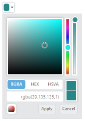
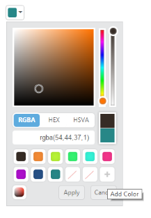
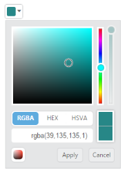
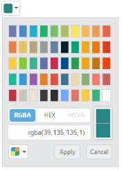
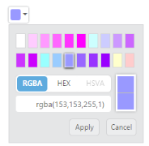
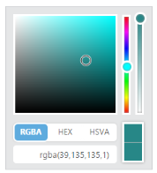
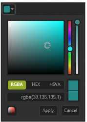
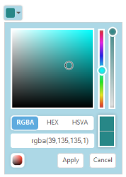

# Behavior Settings

## ShowPreview

The ColorPicker control provides live preview support for current cursor selection color and selected color. “ShowPreview” property allows you to preview the selected color in the picker or from the palette.

The “ShowPreview” property is a Boolean type and its default value is true.

Add the following code example in the corresponding ASPX page to render the ColorPicker control.



<ej:ColorPicker runat="server" ID="colorpicker" Value="#278787" ShowPreview="true"> </ej:ColorPicker>



The following screenshot displays the output of the above code example                                  

## ShowRecentColors

The ColorPicker Control allows you to store the color values in custom list by using “ShowRecentColors” property. The ColorPicker keeps up to 11 colors in a custom list.  By clicking the add button, the selected color from picker or palette gets added in the recent color list.  

The “ShowRecentColors” property is Boolean type and its default value is false.

Add the following code example to the corresponding ASPX page to render the ColorPicker control with recent colors.



<ej:ColorPicker runat="server" ID="colorpicker" Value="#278787" ShowRecentColors="true"> </ej:ColorPicker>



The following screenshot displays the output of the above code example.  

## EnableOpacity

The ColorPicker control allows you to enable or disable the opacity slider. You can achieve this by using the “EnableOpacity” property. 

The “EnableOpacity” property is Boolean type and its default value is true.

Add the following code example to the corresponding ASPX page to render ColorPicker control with Opacity disabled.



<ej:ColorPicker runat="server" ID="colorpicker" Value="#278787" EnableOpacity="false"> </ej:ColorPicker>



The following screenshot displays the output of the above code example.  

## Columns

The Palette model consists of color values in the rows and columns order. Palette consists of predefined colors and allows you to select anyone color from it. The “Columns” property allow you to modify the number of columns in palette model. 

The “Columns” property is the Number type and its default value is 10.

Add the following code example to the corresponding ASPX page to render the ColorPicker control as columns.



<ej:ColorPicker runat="server" ID="colorpicker" Value="#278787" Columns="9"> </ej:ColorPicker>



The following screenshot displays the output of the above code example.  

 

### Configure Values

#### OpacityValue

The ColorPicker control allows you to change the opacity value by using the “OpacityValue“ property. The selected color opacity is adjusted by using the OpacityValue. 

The “OpacityValue” property is the Number type and its default value is 10.

Add the following code example to the corresponding ASPX page to render the ColorPicker control with opacity value.



<ej:ColorPicker runat="server" ID="colorpicker" Value="#278787" OpacityValue="40"> </ej:ColorPicker> 



The following screenshot displays the output of the above code example.

### Button and TooltipText

#### ButtonText

The ColorPicker control allows you to define the text to be displayed in button elements. You can specify the text by using the “ButtonText” property. In the ColorPicker control, the popup contains two button elements “Apply” and “Cancel”.

To configure the ButtonText property for the button elements, use the corresponding default values listed in the following table. 

<table>
<tr>
<th>
{{ '**Element**' | markdownify }}</th><th>
{{ '**Default value**' | markdownify }}</th></tr>
<tr>
<td>
apply</td><td>
Apply</td></tr>
<tr>
<td>
cancel</td><td>
Cancel</td></tr>
</table>

#### TooltipText

The ColorPicker control consists of more number of sub controls and elements. To provide some information about each element and sub control you can use the tooltip concept and you can achieve this by using the “TooltipText” property.

To configure the TooltipText, use the following listed elements and its corresponding default value.

<table>
<tr>
<th>
{{ '**Element**' | markdownify }}</th><th>
{{ '**Default value**' | markdownify }}</th></tr>
<tr>
<td>
Switcher</td><td>
Switcher</td></tr>
<tr>
<td>
AddButton</td><td>
Add Color</td></tr>
<tr>
<td>
Basic</td><td>
Basic</td></tr>
<tr>
<td>
MonoChrome</td><td>
Mono Chrome</td></tr>
<tr>
<td>
FlatColors</td><td>
Flat Colors</td></tr>
<tr>
<td>
SeaWolf</td><td>
Sea Wolf</td></tr>
<tr>
<td>
WebColors</td><td>
Web Colors</td></tr>
<tr>
<td>
Sandy</td><td>
Sandy</td></tr>
<tr>
<td>
PinkShades</td><td>
Pink Shades</td></tr>
<tr>
<td>
Misty</td><td>
Misty</td></tr>
<tr>
<td>
Vintage</td><td>
Vintage</td></tr>
<tr>
<td>
MoonLight</td><td>
Moon Light</td></tr>
<tr>
<td>
CandyCrush</td><td>
Candy Crush</td></tr>
<tr>
<td>
CurrentColor</td><td>
Current Color</td></tr>
<tr>
<td>
SelectedColor</td><td>
Selected Color</td></tr>
<tr>
<td>
Citrus</td><td>
Citrus</td></tr>
</table>

When it is necessary to set the button text and tooltip text values in Spanish culture, the ColorPicker allows you to define the culture values to ButtonText and TooltipText property. The following section is on how to define the Spanish culture values to the ColorPicker control.

Add the following code example to the corresponding ASPX page to render ColorPicker control.



<ej:ColorPicker runat="server" ID="colorpicker" Value="#278787">

      <ColorPickerButtonText Apply="aplicar" Cancel="cancelar" />

<ColorPickerTooltipText Sandy="arenoso" />

</ej:ColorPicker>



The following screenshot displays the output of the above code example.

## Appearance and Styling

### ModelType

The ColorPicker allows you to define the model type to be displayed in control at initial time by using the property called “ModelType”. 

The “ModelType” property is Enum type and its default value is “default”.

<table>
<tr>
<th>
{{ '**ModelType**' | markdownify }}</th><th>
{{ '**Syntax**' | markdownify }}</th><th>
{{ '**Description**' | markdownify }}</th></tr>
<tr>
<td>
Default</td><td>
ModelType="Default"</td><td>
Control rendered with both model. You can switch to palette or picker model.</td></tr>
<tr>
<td>
Picker</td><td>
ModelType="Picker"</td><td>
Control rendered with picker model only.</td></tr>
<tr>
<td>
Palette</td><td>
ModelType="Palette"</td><td>
Control rendered with palette model only.</td></tr>
</table>

In the following code example, the ColorPicker popup model type is set as palette when you drop down the ColorPicker popup.

Add the following code example to the corresponding ASPX page to render the ColorPicker control.



<ej:ColorPicker runat="server" ID="colorpicker" Value="#278787" ModelType="Palette"> </ej:ColorPicker>



The following screenshot displays the output of the above code example.

#### Palette

The ColorPicker allows you to define the palette type to be displayed in control at initial time by using the “palette” property. The “Palette” property is Enum type and its default value is “BasicPalette”.

<table>
<tr>
<th>
{{ '**Palette**' | markdownify }}</th><th>
{{ '**Syntax**' | markdownify }}</th><th>
{{ '**Description**' | markdownify }}</th><th>
{{ '**Dependent Property**' | markdownify }}</th></tr>
<tr>
<td>
BasicPalette</td><td>
Palette="BasicPalette"</td><td>
The palette model rendered with predefined color values.</td><td rowspan = "2">
ModelType="Palette"</td></tr>
<tr>
<td>
CustomPalette</td><td>
Palette="CustomPalette"</td><td>
The palette model rendered with user specified custom color values.</td></tr>
</table>

##### BasicPalette

The BasicPalette type rendered with predefined color values. The BasicPalette model has 12 different preset patterns. Each pattern consists of 50 colors, over 600 colors are available by default. 

##### PresetType

The ColorPicker control allows you to define the preset model to be rendered initially in palette type. This can be achieved by using the “PresetType” property. Totally 12 types of presets available.

The “PresetType” property is Enum type and its default value is “basic”.

<table>
<tr>
<td>
{{ '**PresetType**' | markdownify }}</td><td>
{{ '**Syntax**' | markdownify }}</td><td>
{{ '**Dependent Property**' | markdownify }}</td></tr>
<tr>
<td>
Basic</td><td>
PresetType="Basic"</td><td rowspan = "12">
Palette="BasicPalette"</td></tr>
<tr>
<td>
MonoChrome</td><td>
PresetType="MonoChrome"</td></tr>
<tr>
<td>
FlatColors</td><td>
PresetType="FlatColors"</td></tr>
<tr>
<td>
SeaWolf</td><td>
PresetType="SeaWolf"</td></tr>
<tr>
<td>
WebColors</td><td>
PresetType="WebColors"</td></tr>
<tr>
<td>
Sandy</td><td>
PresetType="Sandy"</td></tr>
<tr>
<td>
PinkShades</td><td>
PresetType="PinkShades"</td></tr>
<tr>
<td>
Misty</td><td>
PresetType="Misty"</td></tr>
<tr>
<td>
Citrus</td><td>
PresetType="Citrus"</td></tr>
<tr>
<td>
Vintage</td><td>
PresetType="Vintage"</td></tr>
<tr>
<td>
MoonLight</td><td>
PresetType="MoonLight"</td></tr>
<tr>
<td>
CandyCrush</td><td>
PresetType="CandyCrush"</td></tr>
</table>

Add the following code example to the corresponding ASPX page to render the ColorPicker control



<ej:ColorPicker runat="server" ID="colorpicker" Value="#278787" ModelType="Palette" PresetType="FlatColors"> </ej:ColorPicker>



The following screenshot displays the output of the above code example.

##### CustomPalette

The ColorPicker control allows you to define the custom colors in the palette model by using the “Palette” property. Custom palettes are created by passing a comma delimited string of HEX values or an array of colors in “custom” property. The CustomPalette model is only applicable when you set ModelType as “Palette”.

The CustomPalette property dependent property of “Palette” and “ModelType” property.



<ej:ColorPicker runat="server" ID="colorpicker" Value="#278787" ModelType="Palette" Palette="CustomPalette" Custom="ffffff,ffccff,ff99ff,ff66ff,ff33ff,ff00ff,ccffff,ccccff,cc99ff,cc66ff,cc33ff,cc00ff,99ffff,99ccff,9999ff,9966ff,9933ff,9900ff,ffffcc, ffcccc"> </ej:ColorPicker>



The following screenshot displays the output of the above code example.

### DisplayInline

The ColorPicker control allows to embed the popup in the order of DOM element flow by using the property called “DisplayInline”. By using DisplayInline property to make ColorPicker popup always in visible state. Also associate ColorPicker with 
 element instead of input. 

The “DisplayInline” property is Boolean type and its default value is false. The following steps explain you how to get the ColorPicker popup in DisplayInline state.



<ej:ColorPicker runat="server" ID="colorpicker" Value="#278787" DisplayInline="true" TagName="div"> </ej:ColorPicker>



The following screenshot displays the output of the above code example.

### Theme Support

The ColorPicker control support rich appearance. The ColorPicker supports 13 different themes of EssentialJavaScript and bootstrap themes. To use these twelve themes, refer to the themes files in HTML page. 

You need two style sheets to apply styles to ColorPicker control; ej.widgets.core.min.css and ej.theme.min.css. When you use ej.widgets.all.min.css then, you don’t need to use ej.widgets.core.min.css and ej.theme.min.css because ej.widgets.all.min.css is a combination of these two.

The core style sheet applies styles related to positioning and size, but are not related to the color scheme and always require the control to look correct and function properly. The theme style sheet applies theme-specific styles like colors and backgrounds.

The following list is of the 13 themes supported by the ColorPicker:

* default-theme
* bootstrap
* flat-azure-dark
* flat-lime
* flat-lime-dark
* flat-saffron
* flat-saffron-dark
* gradient-azure
* gradient-azure-dark
* gradient-lime
* gradient-lime-dark
* gradient-saffron
* gradient-saffron-dark

In the ASPX page, add the following code to render the ColorPicker control



<!doctype html>

<html>

<head>

    <title>Essential Studio for JavaScript : ColorPicker – Built-in ThemeSupport</title>

    <meta name="viewport" content="width=device-width, initial-scale=1.0" charset="utf-8"  />

    <link href=" http://cdn.syncfusion.com/ {{site.releaseversion}}/js/web/flat-lime-dark/ej.web.all.min.css" rel="stylesheet" />

    

    

    

</head>

<body>

    

     <ej:ColorPicker runat="server" ID="colorpicker" Value="#278787"> </ej:ColorPicker>

    
                    

</body>

</html>



The following screenshot displays the output of the above code example.

### CustomCss

The ColorPicker control also allows you to customize its appearance by using the user-defined CSS and custom skin options such as colors and backgrounds. To apply custom themes, you have a property called CssClass. CssClass property sets the root class for ColorPicker theme.

By using this CssClass, you can override the existing styles under the theme style sheet. The theme style sheet applies theme-specific styles like colors and backgrounds. In the following example, the value of CssClass property is set as “Light-Blue”. Light-Blue is added as the root class to ColorPicker control at the runtime. From this root class, you can customize the ColorPicker control theme.

Add the following code example to the corresponding ASPX page to render the ColorPicker control with CssClass.



<ej:ColorPicker runat="server" ID="colorpicker" Value="#278787" CssClass="Light-Blue"> </ej:ColorPicker>



Custom CSS Styles.



     .Light-Blue.e-colorwidget.e-widget, .Light-Blue.e-colorpicker.e-popup,.Light-Blue.e-colorwidget .e-in-wrap.e-box .e-select, .Light-Blue.e-colorwidget .e-in-wrap.e-box, .Light-Blue.e-colorwidget .e-down-arrow {           

     background: none repeat scroll 0 0 lightblue;

      }

.Light-Blue.e-colorpicker .e-footer .e-cancelButton.e-btn, .Light-Blue.e-colorpicker .e-footer .e-applyButton.e-btn {

            background: none repeat scroll 0 0 white;

}



The following screenshot displays the output of above steps.

