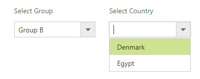
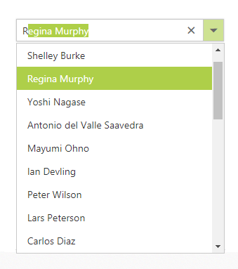

# How To

## Configure the Cascading ComboBox

The cascading ComboBox is a series of ComboBox, where the value of one ComboBox depends
upon  another's value. This can be configured by using the `ClientSideOnChange` event of the parent ComboBox.
Within that change event handler, data has to be loaded to the child ComboBox based on the selected
value of the parent ComboBox.

The following example, shows the cascade behavior of Group and Country ComboBox. Here, the `dataBind` method is used to reflect the property changes immediately
to the ComboBox.


	

	

    

        Select Group
        <ej:ComboBox ID="groupsList" runat="server" DataTextField="text" DataValueField="parentId" ClientSideOnChange="onChange"></ej:ComboBox>
    

    

        Select Country
        <ej:ComboBox ID="countryList" runat="server" DataTextField="text" Enabled="false"></ej:ComboBox>
    


    






protected void Page_Load(object sender, EventArgs e)
{
    List<GroupsList> groups = new List<GroupsList>();
    groups.Add(new GroupsList("a", "Group A"));
    groups.Add(new GroupsList("b", "Group B"));
    groups.Add(new GroupsList("c", "Group C"));
    groups.Add(new GroupsList("d", "Group D"));
    groups.Add(new GroupsList("e", "Group E"));           
    this.groupsList.DataSource = groups;

    List<CountryList> countries = new List<CountryList>();            
    countries.Add(new CountryList(11, "a", "Algeria", "flag-dz"));
    countries.Add(new CountryList(12, "a", "Armenia", "flag-am"));
    countries.Add(new CountryList(13, "a", "Bangladesh", "flag-bd"));
    countries.Add(new CountryList(14, "a", "Cuba", "flag-cu"));
    countries.Add(new CountryList(15, "b", "Denmark", "flag-dk"));
    countries.Add(new CountryList(16, "b", "Egypt", "flag-eg"));
    countries.Add(new CountryList(17, "c", "Finland", "flag-fi"));
    countries.Add(new CountryList(18, "c", "India", "flag-in"));
    countries.Add(new CountryList(19, "c", "Malaysia", "flag-my"));
    countries.Add(new CountryList(20, "d", "New Zealand", "flag-nz"));
    countries.Add(new CountryList(21, "d", "Norway", "flag-no"));
    countries.Add(new CountryList(22, "d", "Poland", "flag-pl"));
    countries.Add(new CountryList(23, "e", "Romania", "flag-ro"));
    countries.Add(new CountryList(24, "e", "Singapore", "flag-sg"));
    countries.Add(new CountryList(25, "e", "Thailand", "flag-th"));
    countries.Add(new CountryList(26, "e", "Ukraine", "flag-ua"));                        
    this.countryList.DataSource = countries;
}
[Serializable]
class CountryList
{
    public int value { get; set; }
    public string parentId { get; set; }
    public string text { get; set; }
    public string sprite { get; set; }
    public CountryList(int value, string id, string country, string sprite)
    {
        this.value = value;
        this.parentId = id;
        this.text = country;
        this.sprite = sprite;

    }
}
[Serializable]
class GroupsList
{
    public string parentId { get; set; }
    public string text { get; set; }
    public GroupsList(string gID, string group)
    {
        this.parentId = gID;
        this.text = group;
    }
}





## Show the list items with icons

You can render **icons** to the list items by mapping the
DataIconCSSField field. This `DataIconCSSField` field create a span in the list item with mapped class name
to allow styling as per your need.

In the following sample, icon classes are mapped with `DataIconCSSField` field.


	

	

    <ej:ComboBox ID="selectIcon" runat="server" Placeholder="Select a icon" Width="100%"></ej:ComboBox>


    






public partial class Icons : System.Web.UI.Page
{
    protected void Page_Load(object sender, EventArgs e)
    {
        this.selectIcon.DataSource = IconCss.GetIconList();
        this.selectIcon.DataTextField = "Name";
        this.selectIcon.DataIconCSSField = "IconClass";
    }
}

public class IconCss
{
    public string Name { get; set; }
    public string IconClass { get; set; }
    public static List<IconCss> GetIconList()
    {
        List<IconCss> icon = new List<IconCss>();
        icon.Add(new IconCss { IconClass = "asc-sort", Name = "Sort A to Z" });
        icon.Add(new IconCss { IconClass = "desc-sort", Name = "Sort Z to A " });
        icon.Add(new IconCss { IconClass = "filter", Name = "Filter" });
        icon.Add(new IconCss { IconClass = "clear", Name = "Clear" });
        return icon;
    }
}





## Autofill supported with ComboBox

The ComboBox supports the `AutoFill` behavior with the help of AutoFill property. Whenever you change the input value, the ComboBox will autocomplete your data by matching the typed character. Suppose, if no matches
found then, comboBox doesn't suggest any item.

In the following sample, showcase that how to work autofill with ComboBox.


	

	

    <ej:ComboBox ID="searchCustomer" AutoFill="true" runat="server" Width="100%" DataTextField="ContactName" Placeholder="Search a customer">
        <DataManager URL="http://js.syncfusion.com/ejServices/wcf/NorthWind.svc/" CrossDomain="true"></DataManager>
    </ej:ComboBox>


    


 protected void Page_Load(object sender, EventArgs e)
{
    this.searchCustomer.Query = "ej.Query().from('Suppliers').select('SupplierID', 'ContactName')";
}		
		




