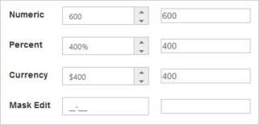

# Integration

## Angular Support

The CurrencyTextbox control supports two types of Angular JS support,

* One-way binding
* Two-way binding

One-way binding refers to the process of applying scope values to all the available properties of the CurrencyTextbox control, but the changes made in the CurrencyTextbox control are not reflected or triggered in turn to the scope collection. This kind of binding applies to all the properties of the CurrencyTextbox control.

Two-way binding supports both the processes. It applies the scope values to the CurrencyTextbox properties and the changes made in the CurrencyTextbox control are reflected back and triggered within the angular scope change function.

Apply the plugin and property assigning to the CurrencyTextbox control element through the directive that starts with the letter “e-“.

To know more details about the Angular binding, refer to the following link:

<http://docs.syncfusion.com/js/angularjs>

The following example shows the way to bind data to the CurrencyTextbox control through Angular Support.



<!DOCTYPE html>

<html xmlns="http://www.w3.org/1999/xhtml" ng-app="TextCtrl">

<head>

    <title></title>

    <link href="Content/bootstrap.min.css" rel="stylesheet" />

    <link href=" http://cdn.syncfusion.com/ {{site.releaseversion}}/js/web/flat-azure/ej.web.all.min.css" rel="stylesheet" />

    

    

    

      

    

    

    

</head>

<body ng-controller="TextboxCtrl">

    

        <table cellpadding="10">

            <tbody>

                 <tr>

                    <td>

                        <label for="currency">Currency</label>

                    </td>

                    <td>

                        <input id="currency" type="text" ej-currencytextbox e-value="cvalue" />

                    </td>

                    <td>

                        <input type="text" class="input ejinputtext" ng-model="cvalue" />

                    </td>

                </tr>

            </tbody>

        </table>

    

    

</body>

</html>



The following is the output of CurrencyTextbox control with two-way Angular binding.

## Knockout Support

Knockout support allows you to bind the HTML elements against any of the available data model. It is of two types.

* One-way binding
* Two-way binding

One-way binding refers to the process of applying observable values to all the available properties of the CurrencyTextbox control, but the changes made in CurrencyTextbox control are not reflected and triggered in turn to the observable collection. This kind of binding applies to all the properties of the CurrencyTextbox control.

Two-way binding supports both the processes. It applies the observable values to the CurrencyTextbox control properties and the changes made in the CurrencyTextbox control are reflected back and triggered within the observable collections.

For more information about the Knockout Binding, refer to the following online documentation in the given link location: <http://dous.syncfusion.com/js/knockoutjs>.

The following example depicts the way to bind data to the CurrencyTextbox control through Knockout Support that enables and populates data based on the value set to the other CurrencyTextbox controls.



 <!DOCTYPE html>

<html xmlns="http://www.w3.org/1999/xhtml">

<head>

    <title></title>

    <link href="Content/bootstrap.min.css" rel="stylesheet" />

    <link href=" http://cdn.syncfusion.com/ {{site.releaseversion}}/js/web/flat-azure/ej.web.all.min.css" rel="stylesheet" />

    

    

    

    

    

    

    

</head>

<body>

    

        <table cellpadding="10">

            <tbody>

               <tr>

                    <td>

                        <label for="currency">Currency</label>

                    </td>

                    <td>

                        <input id="currency" type="text" data-bind="ejCurrencyTextbox: { value: cvalue }" />

                    </td>

                    <td>

                        <input type="text" class="input ejinputtext" data-bind="value: cvalue" />

                    </td>

                </tr>

            </tbody>

        </table>

    

    

</body>

</html>



The output of Knockout binding in the CurrencyTextbox.

