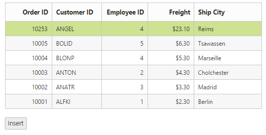
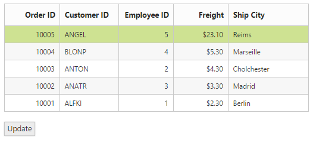
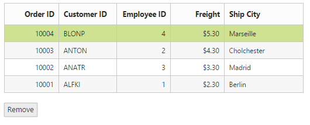
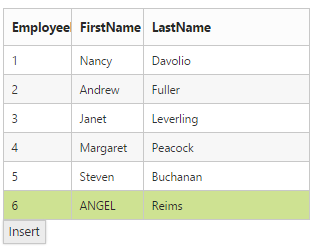
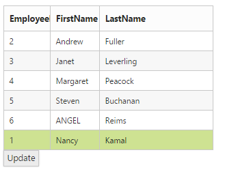
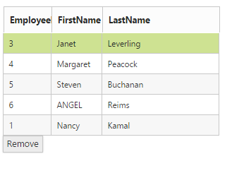

# CRUD Data Operations

The DataManager fully supports the CRUD (Create, Read, Update, Destroy) data operations. However, it must be combined with some user interface or another Syncfusion UI widget such as the Grid, ListView, etc.

## Local CRUD Operations

The information in this section is applicable to scenarios, in which the data is already available on the client, or when it is you that is going to take care of its retrieval and submission. In other words, DataManager will not make any HTTP requests on its own.

### Insert

The insert method of the data manager is used to add a new record to the table. The JSON data passed as a parameter to the insert method that is inserted to the data source of the data manager.



    public static List<Employee> emp = new List<Employee>();
    protected void Page_Load(object sender, EventArgs e)
    {

        BindDataSource();

    }
    public void BindDataSource()
    {
        int code = 10000;
        
            order.Add(new OrderDetails(code + 1, "ALFKI", 1 + 0, 2.3 * 1, "Berlin"));
            order.Add(new OrderDetails(code + 2, "ANATR", 1 + 2, 3.3 * 1, "Madrid"));
            order.Add(new OrderDetails(code + 3, "ANTON", 1 + 1, 4.3 * 1, "Cholchester"));
            order.Add(new OrderDetails(code + 4, "BLONP", 1 + 3, 5.3 * 1, "Marseille"));
            order.Add(new OrderDetails(code + 5, "BOLID", 1 + 4, 6.3 * 1, "Tsawassen"));

        this.FlatData.Json = order;
            
    }
    public class OrderDetails
    {
        public OrderDetails()
        {

        }
        public OrderDetails(int OrderID, string CustomerId, int EmployeeId, double Freight, string ShipCity)
        {
            this.OrderID = OrderID;
            this.CustomerID = CustomerId;
            this.EmployeeID = EmployeeId;
            this.Freight = Freight;
            this.ShipCity = ShipCity;
        }

        public int? OrderID { get; set; }
        public string CustomerID { get; set; }
        public int? EmployeeID { get; set; }
        public double? Freight { get; set; }
        public string ShipCity { get; set; }
    }
    
      




    <ej:DataManager ID="FlatData" runat="server" Adaptor="JsonAdaptor"/>

    <ej:Grid ID="OrdersGrid" runat="server"  DataManagerID="FlatData" 
        Query ="new ej.Query().select(['OrderID', 'CustomerID', 'EmployeeID', 'ShipCity', 'Freight']).take(5)">
        <Columns>
            <ej:Column Field="OrderID" HeaderText="Order ID" IsPrimaryKey="True" TextAlign="Right" Width="75" />
            <ej:Column Field="CustomerID" HeaderText="Customer ID" Width="75" />
            <ej:Column Field="EmployeeID" HeaderText="Employee ID" Width="75" />
            <ej:Column Field="ShipCity" HeaderText="Ship City" Width="75" />
            <ej:Column Field="Freight" HeaderText="Freight" Width="75" />
        </Columns>
    </ej:Grid>

    <ej:button id="submit" runat="server" text="Insert" size="Large" showroundedcorner="true"
                               clientsideonclick="onClick"></ej:button>

    



 

### Update

The update method is used to update the modified changes made to a record in the data source of the DataManager.



    public static List<Employee> emp = new List<Employee>();
    protected void Page_Load(object sender, EventArgs e)
    {

        BindDataSource();

    }
     public void BindDataSource()
    {
        int code = 10000;
        
            order.Add(new OrderDetails(code + 1, "ALFKI", 1 + 0, 2.3 * 1, "Berlin"));
            order.Add(new OrderDetails(code + 2, "ANATR", 1 + 2, 3.3 * 1, "Madrid"));
            order.Add(new OrderDetails(code + 3, "ANTON", 1 + 1, 4.3 * 1, "Cholchester"));
            order.Add(new OrderDetails(code + 4, "BLONP", 1 + 3, 5.3 * 1, "Marseille"));
            order.Add(new OrderDetails(code + 5, "BOLID", 1 + 4, 6.3 * 1, "Tsawassen"));
        this.FlatData.Json = order;
            
    }
    public class OrderDetails
    {
        public OrderDetails()
        {

        }
        public OrderDetails(int OrderID, string CustomerId, int EmployeeId, double Freight, string ShipCity)
        {
            this.OrderID = OrderID;
            this.CustomerID = CustomerId;
            this.EmployeeID = EmployeeId;
            this.Freight = Freight;
            this.ShipCity = ShipCity;
        }

        public int? OrderID { get; set; }
        public string CustomerID { get; set; }
        public int? EmployeeID { get; set; }
        public double? Freight { get; set; }
        public string ShipCity { get; set; }
    }
      




    <ej:DataManager ID="FlatData" runat="server" Adaptor="JsonAdaptor"/>

    <ej:Grid ID="OrdersGrid" runat="server"  DataManagerID="FlatData" 
        Query ="new ej.Query().select(['OrderID', 'CustomerID', 'EmployeeID', 'ShipCity', 'Freight']).take(5)">
        <Columns>
            <ej:Column Field="OrderID" HeaderText="Order ID" IsPrimaryKey="True" TextAlign="Right" Width="75" />
            <ej:Column Field="CustomerID" HeaderText="Customer ID" Width="75" />
            <ej:Column Field="EmployeeID" HeaderText="Employee ID" Width="75" />
            <ej:Column Field="ShipCity" HeaderText="Ship City" Width="75" />
            <ej:Column Field="Freight" HeaderText="Freight" Width="75" />
        </Columns>
    </ej:Grid>

    <ej:button id="submit" runat="server" text="Update" size="Large" showroundedcorner="true"
                               clientsideonclick="onClick"></ej:button>

    



 

### Remove

The remove function receives the items to be deleted in the Data Table. The function should remove the provided items from the data source of the DataManager.



    public static List<Employee> emp = new List<Employee>();
    protected void Page_Load(object sender, EventArgs e)
    {

        BindDataSource();

    }
    public void BindDataSource()
    {
        int code = 10000;
        
            order.Add(new OrderDetails(code + 1, "ALFKI", 1 + 0, 2.3 * 1, "Berlin"));
            order.Add(new OrderDetails(code + 2, "ANATR", 1 + 2, 3.3 * 1, "Madrid"));
            order.Add(new OrderDetails(code + 3, "ANTON", 1 + 1, 4.3 * 1, "Cholchester"));
            order.Add(new OrderDetails(code + 4, "BLONP", 1 + 3, 5.3 * 1, "Marseille"));
            order.Add(new OrderDetails(code + 5, "BOLID", 1 + 4, 6.3 * 1, "Tsawassen"));
        this.FlatData.Json = order;  
    }
    public class OrderDetails
    {
        public OrderDetails()
        {

        }
        public OrderDetails(int OrderID, string CustomerId, int EmployeeId, double Freight, string ShipCity)
        {
            this.OrderID = OrderID;
            this.CustomerID = CustomerId;
            this.EmployeeID = EmployeeId;
            this.Freight = Freight;
            this.ShipCity = ShipCity;
        }

        public int? OrderID { get; set; }
        public string CustomerID { get; set; }
        public int? EmployeeID { get; set; }
        public double? Freight { get; set; }
        public string ShipCity { get; set; }
    }
      




    <ej:DataManager ID="FlatData" runat="server" Adaptor="JsonAdaptor"/>

    <ej:Grid ID="OrdersGrid" runat="server"  DataManagerID="FlatData" 
        Query ="new ej.Query().select(['OrderID', 'CustomerID', 'EmployeeID', 'ShipCity', 'Freight']).take(5)">
        <Columns>
            <ej:Column Field="OrderID" HeaderText="Order ID" IsPrimaryKey="True" TextAlign="Right" Width="75" />
            <ej:Column Field="CustomerID" HeaderText="Customer ID" Width="75" />
            <ej:Column Field="EmployeeID" HeaderText="Employee ID" Width="75" />
            <ej:Column Field="ShipCity" HeaderText="Ship City" Width="75" />
            <ej:Column Field="Freight" HeaderText="Freight" Width="75" />
        </Columns>
    </ej:Grid>

    <ej:button id="submit" runat="server" text="Remove" size="Large" showroundedcorner="true"
                               clientsideonclick="onClick"></ej:button>

    



 

## Remote CRUD Operations

The information in this section is applicable to scenarios, in which the data should be retrieved from and submitted to a remote data service via HTTP requests made by the DataManager.
CRUD operations with remote data rely on server code to perform the read, update, create and destroy actions. Instead of configuring client functions, the DataManager defines remote service URLs and the expected format in which data should be sent and received. Theoretically, it is possible to use remote CRUD operations with transport functions, similar to the above examples that use local data, but this is rarely required.

Each of the CRUD operation settings—read, update, create, destroy—provides some common settings that need to be set accordingly:

* The client request type can be "get" or "post".
* Additional optional headers parameters can be sent to the server if needed.
* The client request and expected server response dataType can be "json", "jsonp", "odata", etc.

### Insert

The insert method of the data manager is used to add a new record to the table. The JSON data passed as a parameter to the insert method that is inserted to the data source of the data manager.



    //Employee Model class
     public class Employee
    {
        public int EmployeeID { get; set; }
        public string FirstName { get; set; }
        public string LastName { get; set; }

        public Employee()
        {

        }
        public Employee(int id, string LN, string FN)
        {
            this.EmployeeID = id;
            this.LastName = LN;
            this.FirstName = FN;

        }
    }
    //Employee Repository interface
     interface IEmployeeRepository
    {
        IEnumerable<Employee> GetAll();
        Employee Get(int EmployeeID);
        Employee Add(Employee emp);
        void Remove(int EmployeeID);
        bool Update(Employee emp);
    }

    //EmployeeRepository class
    public class EmployeeRepository : IEmployeeRepository
    {
        private List<Employee> emp = new List<Employee>();
       
        public EmployeeRepository()
        {
            emp.Add(new Employee(1, "Davolio", "Nancy"));
            emp.Add(new Employee(2, "Fuller", "Andrew"));
            emp.Add(new Employee(3, "Leverling", "Janet"));
            emp.Add(new Employee(4, "Peacock", "Margaret"));
            emp.Add(new Employee(5, "Buchanan", "Steven"));
        }

        public IEnumerable<Employee> GetAll()
        {
            return emp;
        }

        public Employee Get(int id)
        {
            return emp.Find(p => p.EmployeeID == id);
        }

        public Employee Add(Employee eObj)
        {
            if (eObj == null)
            {
                throw new ArgumentNullException("eObj");
            }
            emp.Add(eObj);
            return eObj;
        }

        public void Remove(int id)
        {
            emp.RemoveAll(p => p.EmployeeID == id);
        }

        public bool Update(Employee eObj)
        {
            if (eObj == null)
            {
                throw new ArgumentNullException("eObj");
            }
            int index = emp.FindIndex(p => p.EmployeeID == eObj.EmployeeID);
            if (index == -1)
            {
                return false;
            }
            emp.RemoveAt(index);
            emp.Add(eObj);
            return true;
        }
    }

    // Employee WebAPI controller
    public class EmployeeController : ApiController
    {
        static readonly IEmployeeRepository repository = new EmployeeRepository();
        // GET api/<controller>
        [HttpGet]
        public object Get()
        {

            var queryString = HttpContext.Current.Request.QueryString;
            var data = repository.GetAll().ToList();
            return new { Items = data, Count = data.Count() };
        }

        public Employee GetEmployee(int id)
        {
            Employee emp = repository.Get(id);
            if (emp == null)
            {
                throw new HttpResponseException(HttpStatusCode.NotFound);
            }
            return emp;
        }

        // POST api/<controller>
        public HttpResponseMessage PostEmployee(Employee emp)
        {
            emp = repository.Add(emp);
            var response = Request.CreateResponse<Employee>(HttpStatusCode.Created, emp);

            string uri = Url.Link("Employee", new { id = emp.EmployeeID });
            response.Headers.Location = new Uri(uri);
            return response;
        }
         [HttpPut]
        // PUT api/<controller>
        public void PutEmployee(Employee emp)
        {
            if (!repository.Update(emp))
            {
                throw new HttpResponseException(HttpStatusCode.NotFound);
            }

        }
        [HttpDelete]
        public void Delete(int id)
        {
            Employee emp = repository.Get(id);
            if (emp == null)
            {
                throw new HttpResponseException(HttpStatusCode.NotFound);
            }

            repository.Remove(id);
        }
    }
    




    <ej:DataManager runat="server" ID="FlatData" URL="/api/Employee" Adaptor="WebApiAdaptor"/>

    <ej:DataManager ID="FlatData" runat="server" Adaptor="JsonAdaptor"/>

    <ej:Grid ID="OrdersGrid" runat="server"  DataManagerID="FlatData" 
        Query ="new ej.Query().select(['EmployeeID', 'FirstName', 'LastName']).take(5)">
        <Columns>
            <ej:Column Field="EmployeeID" HeaderText="EmployeeID" IsPrimaryKey="True" TextAlign="Right" Width="75" />
            <ej:Column Field="FirstName" HeaderText="FirstName" Width="75" />
            <ej:Column Field="LastName" HeaderText="LastName" Width="75" />
        </Columns>
    </ej:Grid>

    <ej:button id="submit" runat="server" text="Insert" size="Large" showroundedcorner="true"
                               clientsideonclick="onClick"></ej:button>

    



 

### Update

The update method is used to update the modified changes made to a record in the data source of the DataManager.



    <ej:DataManager runat="server" ID="FlatData" URL="/api/Employee" Adaptor="WebApiAdaptor"/>

    <ej:DataManager ID="FlatData" runat="server" Adaptor="JsonAdaptor"/>

    <ej:Grid ID="OrdersGrid" runat="server"  DataManagerID="FlatData" 
        Query ="new ej.Query().select(['EmployeeID', 'FirstName', 'LastName']).take(5)">
        <Columns>
            <ej:Column Field="EmployeeID" HeaderText="EmployeeID" IsPrimaryKey="True" TextAlign="Right" Width="75" />
            <ej:Column Field="FirstName" HeaderText="FirstName" Width="75" />
            <ej:Column Field="LastName" HeaderText="LastName" Width="75" />
        </Columns>
    </ej:Grid>

    <ej:button id="submit" runat="server" text="Update" size="Large" showroundedcorner="true"
                               clientsideonclick="onClick"></ej:button>

    



 

### Remove

The remove action submits the data items that should be deleted, or just its IDs. 



    <ej:DataManager runat="server" ID="FlatData" URL="/api/Employee" Adaptor="WebApiAdaptor"/>

    <ej:DataManager ID="FlatData" runat="server" Adaptor="JsonAdaptor"/>

    <ej:Grid ID="OrdersGrid" runat="server"  DataManagerID="FlatData" 
        Query ="new ej.Query().select(['EmployeeID', 'FirstName', 'LastName']).take(5)">
        <Columns>
            <ej:Column Field="EmployeeID" HeaderText="EmployeeID" IsPrimaryKey="True" TextAlign="Right" Width="75" />
            <ej:Column Field="FirstName" HeaderText="FirstName" Width="75" />
            <ej:Column Field="LastName" HeaderText="LastName" Width="75" />
        </Columns>
    </ej:Grid>

    <ej:button id="submit" runat="server" text="Remove" size="Large" showroundedcorner="true"
                               clientsideonclick="onClick"></ej:button>

    



 

## Batch Edit

Batch Editing is a unique feature, where requests to add, remove and change are handled altogether at a time rather than passing the request separately for each operation.



    <asp:Content runat="server" ID="Content1" ContentPlaceHolderID="MainContent">

        <ej:DataManager ID="FlatData" runat="server" Adaptor="JsonAdaptor" />
        <ej:Grid ID="OrdersGrid" runat="server"  DataManagerID="FlatData"
             Query = "ej.Query()
            .take(5)">
            <Columns>
                <ej:Column Field="EmployeeID" HeaderText="Employee ID" IsPrimaryKey="True" TextAlign="Right" Width="75" />
                <ej:Column Field="FirstName" HeaderText="First Name" Width="75" />
                <ej:Column Field="LastName" HeaderText="Last Name" Width="75" />
            </Columns>
        </ej:Grid>

    Employee ID

    <input id="EmployeeID" class="e-ejinputtext" type="text" value="" />

    First Name

    <input id="FirstName" class="e-ejinputtext" type="text" value="" />

    Last Name 

    <input id="LastName" class="e-ejinputtext" type="text" value="" />

    <ej:Button runat="server" Type="Button" Text="Add" ClientSideOnClick="Click" ID="button"></ej:Button>
    <ej:Button runat="server" Type="Button" Text="Change" ClientSideOnClick="Click" ID="button1"></ej:Button>
    <ej:Button runat="server" Type="Button" Text="Delete" ClientSideOnClick="Click" ID="button2"></ej:Button>
    <ej:Button runat="server" Type="Button" Text="save all" ClientSideOnClick="Click" ID="button3"></ej:Button>

    </asp:Content>

    <asp:Content ID="Content2" ContentPlaceHolderID="ScriptSection" runat="server">

        

    </asp:Content>



Result of the above code example is illustrated as follows.

Batch Editing
{:.caption}