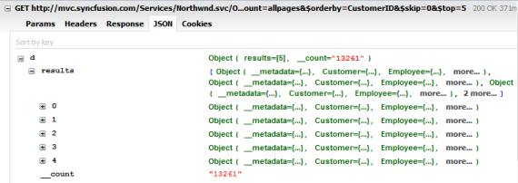

## Grouping

Grouping technique is also supported in DataManager. When you want to analyse any particular record based on its category, you can simply group that column and analyze the records based on category. The following code example illustrates the grouping behavior in table.

&lt;asp:Content runat="server" ID="Content1" ContentPlaceHolderID="MainContent"&gt;

        &lt;ej:DataManager ID="FlatData" runat="server" URL="http://mvc.syncfusion.com/Services/Northwnd.svc/Orders"/&gt;

        <ej:Grid ID="OrdersGrid" runat="server"  DataManagerID="FlatData"

             Query = "ej.Query()

            .page(1,5)

            .group('CustomerID')">

            &lt;Columns&gt;

                &lt;ej:Column Field="OrderID" HeaderText="Order ID" IsPrimaryKey="True" TextAlign="Right" Width="75" /&gt;

                &lt;ej:Column Field="CustomerID" HeaderText="Customer ID" Width="75" /&gt;

                &lt;ej:Column Field="EmployeeID" HeaderText="EmployeeID" Width="75" /&gt;

                &lt;ej:Column Field="ShipCity" HeaderText="Ship City" Width="75" /&gt;

                &lt;ej:Column Field="Freight" HeaderText="Freight" Width="75" /&gt;

            &lt;/Columns&gt;

        &lt;/ej:Grid&gt;

&lt;/asp:Content&gt;

Result of the above code example is illustrated as follows.

{  | markdownify }
{:.image }

