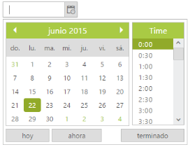

# Localization

You can globalize your DateTimePicker control. People of different culture can make use of it. All culture files are supported by Syncfusion components

Globalize.js is a simple JavaScript library that allows you to format and parse numbers and dates in a culture-specific fashion. The globalize cultures is the open source and you can get all the culture files online. Refer to the online link given,

[http://cdnjs.com/libraries/globalize/](http://cdnjs.com/libraries/globalize/)

You can get the script file of various cultures from the following path also:
"<Installed Location>\Syncfusion\Essential Studio\{{site.releaseversion}}\JavaScript\assets\external\cultures"

To use any cultures, add the script files of those corresponding culture in the sample. In order to add UK Culture in the DateTimePicker, you can refer to a script file globalize.culture.es-ES.js. 

You can also customize the culture to your own by using the following steps.

Open the Culture script file, included in your project.

Replace existing calendar locale information by your own culture information or to your customized format.

Refer to this section for more details: [localization](http://help.syncfusion.com/ug/js/default.htm)

For example, to change month names to your culture month, just replace month names with your culture month names or your customized format.

The following code example can be used to get Spanish culture in the DateTimePicker.

In the ASPX page, include the following DateTimePicker control code example.



<ej:DateTimePicker ID="DateTime" Locale="es-ES" runat="server"> </ej:DateTimePicker>





protected void Page_Load(object sender, EventArgs e)

    {

        DateTime.DateTimePickerButtonText = new ButtonText() { Today = "hoy", Now = "ahora", Done = "terminado" };

    }



 

