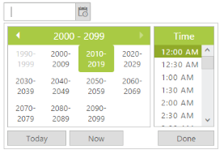

## Start and Depth level

### Start Level

DateTimePicker allows you to change the starting level view of Calendar inside the DateTimePicker popup. Consider you are creating a login form for your blog. When the “Birth date” field in the form starts from year, it is easy to select date from year, month and date. By default, the Start Level of DateTimePicker is “Month” level view. Refer to the following table to know the different types of start level.

<table>
<tr>
<td>
Start Level</td><td>
Syntax</td><td>
Description</td></tr>
<tr>
<td>
Month</td><td>
StartLevel: “Month”</td><td>
Starts from month level view.</td></tr>
<tr>
<td>
Year</td><td>
StartLevel: “Year”</td><td>
Starts from year level view.</td></tr>
<tr>
<td>
Decade</td><td>
StartLevel: “Decade”</td><td>
Starts from year decade level view.</td></tr>
<tr>
<td>
Century</td><td>
StartLevel: “Century”</td><td>
Starts from century level view.</td></tr>
</table>

In the following example, DateTimePicker popup start level view is set to century level when you drop down the DateTimePicker popup.

In the ASPX page, include the following DateTimePicker control code example.



<ej:DateTimePicker ID="DateTime" Startlevel="Century" runat="server"> </ej:DateTimePicker>



{  | markdownify }
{:.image }

### Depth Level

DateTimePicker enables you to set the drill down level of the DateTimePicker. Consider, you are going to take the monthly report of sales in your company. In that case, there is no need for selecting date from month view. You can restrict the drill-down of DateTimePicker popup to month view.

In the following example, start level is set from century and drill down is set to year view. So drill-down to month is restricted. So you can avoid selecting the day of the month. By default, the current day of the month is maintained in the day number field. Refer to the following code to set drill down value to year view.

The following code example is set to depth level in the DateTimePicker.

In the ASPX page, include the following DateTimePicker control code example.



<ej:DateTimePicker ID="DateTime" Startlevel="Century" DepthLevel="Year" runat="server"></ej:DateTimePicker>



{  | markdownify }
{:.image }

