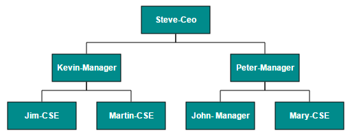
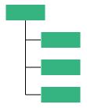
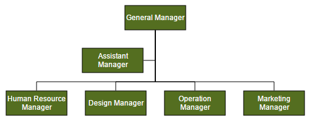

## Automatic Layout

Diagram automatically provides support to layout nodes. It includes the following:

* Hierarchical Layout
* Organization Chart
### Hierarchical Layout

The Hierarchical Tree Layout arranges nodes in a tree-like structure, where the nodes in the hierarchical layout may have multiple parents. There is no need to specify the layout root.

The following code illustrates how to arrange the nodes in a hierarchical structure.



// node template.

function nodeTemplate(diagram, node) {

       node.labels[0].text = node.Name;

  }

//Initializes the node template.

  $(window).load(function () {

      $("#DiagramWebControl1").ejDiagram

          ({  nodeTemplate: nodeTemplate });

 });





//Configures data source for diagram

  Diagram.Model.Layout.Type = LayoutTypes.HierarchicalLayout;

  Diagram.Model.DataSourceSettings.DataSource = GetData();

  Diagram.Model.DataSourceSettings.Parent = "ReportingPerson";

  Diagram.Model.DataSourceSettings.Id = "Id";

//set the default properties of the nodes.

 Diagram.Model.DefaultSettings.Node = new Node() {

     Width = 140, Height = 50, FillColor = "DarkCyan",

     Labels = new Collection(){

         new Label() { Name = "label1", Bold = true, 

                       FontColor= "white" }

    };

//set the default properties of the connectors.

 Diagram.Model.DefaultSettings.Connector = new Connector(){   

     Segments = new Collection() { 

         new Segment(Segments.Orthogonal) },

     TargetDecorator = new Decorator() { 

          Shape = DecoratorShapes.None  }

 };

 public Array GetOrgChartData(){

   //have to return dataSource

   }



Spacing

The following example illustrates the horizontal and vertical spacing of the Hierarchical Layout.

{  | markdownify }
{:.image }

Orientation

The Orientation property, LayoutOrientations, of layout is used to specify the tree orientation.

* TopToBottom- Places the root node at the top and the child nodes are arranged below the root node.
* BottomToTop- Places the root node at the bottom and the child nodes are arranged above the root node.
* LeftToRight- Places the root node at the left and the child nodes are arranged on the right side of the root node.
* RightToLeft- Places the root node at the right and the child nodes are arranged on the left side of the root node.

The following image displays Bottom to Top orientation of layout.

{  | markdownify }
{:.image }

### Organizational Chart

An organizational chart is a Diagram that displays the structure of an organization and the relationships. Diagram provides support to layout the nodes automatically. 

How to create a basic organizational chart

The following code example illustrates how to create an organizational chart.



//Data source

var data = [

        { "Id": "parent", "Role": "Project Management" },

        { "Id": 1, "Role": "R&D Team", "Team": "parent" },

        { "Id": 3, "Role": "Philosophy", "Team": "1" },

        { "Id": 4, "Role": " Organization", "Team": "1" },

        { "Id": 5, "Role": "Technology", "Team": "1" },

        { "Id": 7, "Role": " Funding", "Team": "1" },

        { "Id": 8, "Role": "Resource Allocation", "Team": "1" },

        { "Id": 9, "Role": "Targeting", "Team": "1" },

        { "Id": 11, "Role": "Evaluation", "Team": "1" },

        { "Id": 156, "Role": "HR Team", "Team": "parent" },

        { "Id": 13, "Role": "Recruitment", "Team": "156" },

        { "Id": 113, "Role": "Training", "Team": "12" },

        { "Id": 112, "Role": "Employee Relation", "Team": "156" },

        { "Id": 14, "Role": "Record Keeping", "Team": "12" },

        { "Id": 15, "Role": "Compensations & Benefits", "Team": "12" },

        { "Id": 16, "Role": "Compliances", "Team": "12" },

        { "Id": 17, "Role": "Production & Sales Team", "Team": "parent" },

        { "Id": 119, "Role": "Design", "Team": "17" },

        { "Id": 19, "Role": "Operation", "Team": "17" },

        { "Id": 20, "Role": "Support", "Team": "17" },

        { "Id": 21, "Role": "Quality Assurance", "Team": "17" },

        { "Id": 23, "Role": "Customer Interaction", "Team": "17" },

        { "Id": 24, "Role": "Support and Maintenance", "Team": "17" },

        { "Id": 25, "Role": "Task Coordination", "Team": "17" },

        ];

//Creates the node template

function nodeTemplate(diagram, node) {

     node.labels[0].text = node.Role;

}





//Sets the name of the methods defined in view

Diagram.model.NodeTemplate = "nodeTemplate"; 

//Sets layout type as organizational chart

Diagram.model.Layout.Type = LayoutTypes.OrganizationalChart;

Diagram.model.Layout.HorizontalSpacing = 30;

Diagram.model.Layout.VerticalSpacing = 30;

//Sets default node properties

//Sets the default properties of the nodes.

//Sets the default properties of the connectors.

//Initializes data source

//Sets data source

Diagram.model.DataSourceSettings.DataSource = data;

Diagram.model.DataSourceSettings.Id = "Id";

Diagram.model.DataSourceSettings.Parent = "Supervisor";



{  | markdownify }
{:.image }

Customizing the organizational chart

Organizational chart layout starts parsing from root and iterates through all its child elements. getLayoutInfo method provides necessary information of a node’s children and the way to arrange (direction, orientation, offsets, etc.,) them. You can customize the arrangements by overriding this function, explained as follows.

GetLayoutInfo

You can set Chart orientations, chart types, and offset to be left between parent and child nodes by overriding the method DiagramProperties.Model.Layout.GetLayoutInfo.

Arguments

The getLayoutInfo method is called to configure every subtree of the organizational chart, and it takes the following arguments.

1. Diagram (Reference of diagram)
2. Node (Parent node to that options are to be customized)
3. Options (object to set the customizable properties)

The following code example illustrates how to define the method getLayoutInfo.



//Defines getLayoutInfo

function getLayoutInfo(diagram, node, options) {

     options.orientation = "vertical"; 

     options.type = "alternate"

     options.offset = 10;

}





Diagram.model.Layout.Type = LayoutTypes.OrganizationalChart;

//Sets the name of the method defined in view

Diagram.model.Layout.GetLayoutInfo = "getLayoutInfo";



The following table illustrates the properties that options argument takes.

_Properties of argument "option"_

<table>
<tr>
<td>
Properties</td><td>
Description</td><td>
Default Value</td></tr>
<tr>
<td>
options.children</td><td>
Contains the list of child nodes.Children collection can be modified.</td><td>
Array of child nodes</td></tr>
<tr>
<td>
options.assistants</td><td>
By default, the collection is empty. When any of the child node has to be set as Assistant, you can remove from children collection and insert it into assistants collection. </td><td>
Empty array</td></tr>
<tr>
<td>
options.orientation</td><td>
Gets or sets the organizational chart orientation.</td><td>
ChartOrientation.Vertical </td></tr>
<tr>
<td>
options.type</td><td>
Gets or sets the chart organizational chart type </td><td>
For horizontal chart orientation:ChartType.CenterFor Vertical chart orientation:ChartType.Alternate</td></tr>
<tr>
<td>
options.offset</td><td>
Offset is the horizontal space to be left between parent and child nodes.</td><td>
20 pixels.Applicable only for vertical chart orientations.</td></tr>
<tr>
<td>
options.hasSubTree</td><td>
Gets whether the node contains sub trees.</td><td>
Boolean</td></tr>
<tr>
<td>
options.level</td><td>
Gets the depth of the node from layout root</td><td>
Number</td></tr>
<tr>
<td>
options.enableRouting</td><td>
By default, Connections are routed based on the chart type and orientations.This property gets or sets whether default routing is to be enabled or disabled.</td><td>
true</td></tr>
</table>
Orientations

Diagram provides the following orientation options.

1. Horizontal chart orientation
2. Vertical chart orientation

The following table illustrates the different chart orientations and chart types.

_Chart orientations and Chart types_

<table>
<tr>
<td>
Orientation</td><td>
Type</td><td>
Description</td><td>
Example</td></tr>
<tr>
<td rowspan = "3">
Horizontal</td><td>
Left</td><td>
Arranges the child nodes horizontally at the left side of parent.</td><td>

{:.image }
</td></tr>
<tr>
<td>
Right</td><td>
Arranges the child nodes horizontally at the right side of parent.</td><td>

{:.image }
</td></tr>
<tr>
<td>
Center</td><td>
Arranges the children at the bottom/left/right/top center of parent based on layout orientation.</td><td>

{:.image }
</td></tr>
<tr>
<td rowspan = "3">
Vertical</td><td>
Left</td><td>
Vertically arranges the children at the left side of parent.</td><td>

{:.image }
</td></tr>
<tr>
<td>
Right</td><td>
Vertically arranges the children at the right side of parent.</td><td>

{:.image }
</td></tr>
<tr>
<td>
Alternate</td><td>
Vertically arranges the children at both left and right sides of parent.</td><td>

{:.image }
</td></tr>
</table>

The following code example illustrates how to set the horizontal right arrangement to the leaf level trees.



//Horizontal right layout arrangement

function getLayoutInfo(diagram, node, options) {

      if (!options.hasSubTree) {

            options.type = "left";

            options.orientation = "horizontal";

      }

}



{  | markdownify }
{:.image }

Assistant Support

Diagram provides support to layout assistant nodes.

You can add assistants at runtime by using the GetLayoutInfo method. The assistants property of the options argument is an empty array by default.

When any of the child node is to be set as Assistant, move that node to options.assistants from options.children.

The following code example illustrates how to add assistants to layout.



//Defines getLayoutInfo

function getLayoutInfo(diagram, node, options) {

     if (node.hasAssistant) {

           options.assistants.push(options.children[0]);

           options.children.splice(0, 1);

     }

     options.orientation = "vertical"; 

     options.type = "left"

     options.offset = -60;

}



{  | markdownify }
{:.image }

