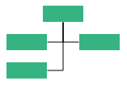
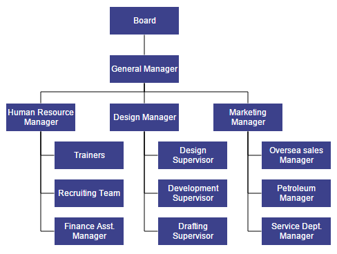
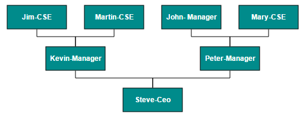
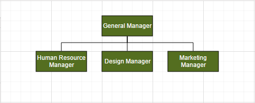

# Automatic Layout

Diagram provides support to auto-arrange the nodes in the Diagram area that is referred as **Layout**. It includes the following layout modes.

* Hierarchical Layout
* Organization Chart
* Radial Tree

## Hierarchical Layout

The Hierarchical Tree Layout arranges nodes in a tree-like structure, where the nodes in the hierarchical layout may have multiple parents. There is no need to specify the layout root.
To arrange the nodes in hierarchical structure, you need to specify the layout `Type` as hierarchical tree. The following example shows how to arrange the nodes in a hierarchical structure.



<ej:Diagram ClientIDMode="Static" ID="Diagram" runat="server" Height="600px" Width="100%" NodeTemplate="nodeTemplate" >
    <%--Uses layout to auto-arrange nodes on the Diagram page--%>
    <Layout Type="HierarchicalTree" HorizontalSpacing="30" VerticalSpacing="30" />

    <%--Configures data source for Diagram--%>
    <DataSourceSettings Id ="Id" Parent ="ReportingPerson" />      
</ej:Diagram>




protected void Page_Load(object sender, EventArgs e)
{
    if (!IsPostBack)
    {
        //Sets the default properties for nodes and connectors
        Label label = new Label() { Name = "label1", FontColor = "white" };
        Diagram.Model.DefaultSettings.Node = new Node() { Width = 100, Height = 40, FillColor = "darkcyan" };
        Diagram.Model.DefaultSettings.Node.Labels.Add(label);
        Diagram.Model.DefaultSettings.Connector = new Connector()
        {
            Segments = new Collection() { new Segment(Segments.Orthogonal) },
            TargetDecorator = new Decorator() { Shape = DecoratorShapes.None },
        };

        //Specifies the dataSource
        Diagram.Model.DataSourceSettings.DataSource = GetData();
    }
}

//returns datasource
public Array GetData()
{
    String allText = System.IO.File.ReadAllText(Server.MapPath("~/App_Data/Data.json"));
    Dictionary<string, object> requestArgs = (Dictionary<string, object>)new JavaScriptSerializer().DeserializeObject(allText);
    requestArgs = (Dictionary<string, object>)requestArgs["root"];
    return (Array)requestArgs.Values.ElementAt(0);
}



{root: {data: [ 
    {Name: "Steve-Ceo"},
    {Name: "Kevin-Manager", ReportingPerson: "Steve-Ceo"},
    {Name: "Peter-Manager", ReportingPerson: "Steve-Ceo"},
    {Name: "John- Manager", ReportingPerson: "Peter-Manager"},
    {Name: "Mary-CSE ", ReportingPerson: "Peter-Manager"},
    {Name: "Jim-CSE ", ReportingPerson: "Kevin-Manager"},
    {Name: "Martin-CSE", ReportingPerson: "Kevin-Manager"}
]}}




N> You can ignore a particular Node from layout arrangement by setting its **ExcludeFromLayout** property as true.

## Radial Tree Layout

The Radial Tree layout arranges nodes on a virtual concentric circles around a root node. Sub-trees formed by the branching of child nodes are located radially around the child nodes. This arrangement results in an ever-expanding concentric arrangement with radial proximity to the root node indicating the node level in the hierarchy. When no root node is set, the algorithm automatically considers one of the Diagram nodes as the root node.

To arrange nodes in a radial tree structure, you need to set the `Layout.Type` as `RadialTree`. The following code illustrates how to arrange the nodes in a radial tree structure.



<ej:Diagram ClientIDMode="Static" ID="Diagram" runat="server" Height="600px" Width="100%" NodeTemplate="nodeTemplate" >
    <%--Uses layout to auto-arrange nodes on the Diagram page--%>
    <Layout Type="RadialTree" HorizontalSpacing="30" VerticalSpacing="30" />

    <%--Configures data source for Diagram--%>
    <DataSourceSettings Id ="Id" Parent ="ReportingPerson" />
    
</ej:Diagram>




protected void Page_Load(object sender, EventArgs e)
{
    if (!IsPostBack)
    {
        //Sets the default properties for nodes
        Diagram.Model.DefaultSettings.Node = new ImageNode() { Width = 40, Height = 40, BorderColor = "transparent" };

        //Configures data source for Diagram
        Diagram.Model.DataSourceSettings.DataSource = GetData();
    }
}

public Array GetData(){
  //have to return dataSource
}



{root: {data: [ 
    {Id: "parent", ImageUrl: "images/Clayton.png"},
    {Id: 1, ImageUrl: "images/image55.png", ReportingPerson: "parent"},
    {Id: 2, ImageUrl: "images/Robin.PNG", ReportingPerson: "parent"},
    {Id: 3, ImageUrl: "images/Robin.PNG", ReportingPerson: "parent"},
    {Id: 4, ImageUrl: "images/Paul.png", ReportingPerson: "parent"},
    {Id: 5, ImageUrl: "images/image53.png", ReportingPerson: "parent"},
    {Id: 6, ImageUrl: "images/Maria.png", ReportingPerson: "parent"},
    {Id: 7, ImageUrl: "images/Jenny.png", ReportingPerson: 3},
    {Id: 8, ImageUrl: "images/Thomas.PNG", ReportingPerson: "parent"},
    {Id: 9, ImageUrl: "images/Jenny.png", ReportingPerson: 2},
    {Id: 10, ImageUrl: "images/Thomas.png", ReportingPerson: 2},
    {Id: 11, ImageUrl: "images/Maria.PNG", ReportingPerson: 4},
    {Id: 12, ImageUrl: "images/Thomas.PNG", ReportingPerson: 1},
    {Id: 13, ImageUrl: "images/Clayton.png", ReportingPerson: 6},
    {Id: 14, ImageUrl: "images/Jenny.png", ReportingPerson: 3},
    {Id: 15, ImageUrl: "images/Thomas.png", ReportingPerson: 3},
    {Id: 16, ImageUrl: "images/John.png", ReportingPerson: 6},
    {Id: 17, ImageUrl: "images/Jenny.png", ReportingPerson: 4},
    {Id: 18, ImageUrl: "images/Robin.png", ReportingPerson: 4},
    {Id: 19, ImageUrl: "images/Clayton.png", ReportingPerson: 4},
    {Id: 20, ImageUrl: "images/image57.png", ReportingPerson: 12},
    {Id: 21, ImageUrl: "images/Robin.png", ReportingPerson: 5},
    {Id: 22, ImageUrl: "images/image51.png", ReportingPerson: 6},
    {Id: 23, ImageUrl: "images/image55.png", ReportingPerson: 19},
    {Id: 24, ImageUrl: "images/Thomas.png", ReportingPerson: 8},
    {Id: 25, ImageUrl: "images/image56.png", ReportingPerson: 8},
    {Id: 26, ImageUrl: "images/image55.png", ReportingPerson: 1},
    {Id: 27, ImageUrl: "images/image57.png", ReportingPerson: 13},
    {Id: 28, ImageUrl: "images/Robin.PNG", ReportingPerson: 12},
    {Id: 29, ImageUrl: "images/Thomas.PNG", ReportingPerson: 13},
    {Id: 30, ImageUrl: "images/image57.png",ReportingPerson: 19}
]}}



 

## Organizational Chart

An **Organizational Chart** is a Diagram that displays the structure of an organization and relationships. To create an organizational chart, `Layout.Type` should be set as `OrganizationalChart`.
The following code example illustrates how to create an organizational chart.



<ej:Diagram ClientIDMode="Static" ID="Diagram" runat="server" Height="600px" Width="100%" NodeTemplate="nodeTemplate">
    <%--Uses layout to auto-arrange nodes on the Diagram page--%>
    <Layout Type="OrganizationalChart" HorizontalSpacing="30" VerticalSpacing="30" />

    <%--Configures data source for Diagram--%>
    <DataSourceSettings Id="Id" Parent="Team" />
    
</ej:Diagram>




protected void Page_Load(object sender, EventArgs e)
{
    if (!IsPostBack)
    {
        //Sets the default properties for nodes
        Label label = new Label() { Name = "label1", FontColor = "white" };
        Diagram.Model.DefaultSettings.Node = new Node() { Width = 100, Height = 40, FillColor = "#546e20" };
        Diagram.Model.DefaultSettings.Node.Labels.Add(label);

        //Sets the default properties for connectors
        Diagram.Model.DefaultSettings.Connector = new Connector()
        {
            Segments = new Collection() { new Segment(Segments.Orthogonal) },
            TargetDecorator = new Decorator() { Shape = DecoratorShapes.None },
        };

        //Configures data source for Diagram
        Diagram.Model.DataSourceSettings.DataSource = GetData();
    }
}

public Array GetData(){
  //have to return dataSource
}



{root: {data: [ 
    {Id: "parent", Role: "Project Management"},
    {Id: 1, Role: "R&D Team", Team: "parent"},
    {Id: 3, Role: "Philosophy", Team: "1"},
    {Id: 4, Role: "Organization", Team: "1"},
    {Id: 5, Role: "Technology", Team: "1"},
    {Id: 7, Role: "Funding", Team: "1"},
    {Id: 8, Role: "Resource Allocation", Team: "1"},
    {Id: 9, Role: "Targeting", Team: "1"},
    {Id: 11, Role: "Evaluation", Team: "1"},
    {Id: 156, Role: "HR Team", Team: "parent"},
    {Id: 13, Role: "Recruitment", Team: "156"},
    {Id: 113, Role: "Training", Team: "12"},
    {Id: 112, Role: "Employee Relation", Team: "156"},
    {Id: 14, Role: "Record Keeping", Team: "12"},
    {Id: 15, Role: "Compensations & Benefits", Team: "12"},
    {Id: 16, Role: "Compliances", Team: "12"},
    {Id: 17, Role: "Production & Sales Team", Team: "parent"},
    {Id: 119, Role: "Design", Team: "17"},
    {Id: 19, Role: "Operation", Team: "17"},
    {Id: 20, Role: "Support", Team: "17"},
    {Id: 21, Role: "Quality Assurance", Team: "17"},
    {Id: 23, Role: "Customer Interaction", Team: "17"},
    {Id: 24, Role: "Support and Maintenance", Team: "17"},
    {Id: 25, Role: "Task Coordination", Team: "17"}
]}}



Organizational chart layout starts parsing from root and iterate through all its child elements. ‘getLayoutInfo’ method provides necessary information of a node’s children and the way to arrange (direction, orientation, offsets, etc.) them. You can customize the arrangements by overriding this function as explained.

### GetLayoutInfo

You can set Chart orientations, chart types, and offset to be left between parent and child nodes by overriding the method, diagram.model.layout.getLayoutInfo. The getLayoutInfo method is called to configure every subtree of the organizational chart. It takes the following arguments.

* `diagram`: Reference of diagram
* `node`: Parent node to that options are to be customized
* `options`: object to set the customizable properties

The following code example illustrates how to define the method getLayoutInfo.


<ej:Diagram ClientIDMode="Static" ID="Diagram" runat="server" Height="600px" Width="100%" >
    <%--Uses layout to auto-arrange nodes on the Diagram page--%>
    <Layout Type="OrganizationalChart" HorizontalSpacing="30" VerticalSpacing="30" GetLayoutInfo="getLayoutInfo" />
</ej:Diagram>



The following table illustrates the properties that "options" argument takes.

Property|Description|Default Value
---|---|---
options.children|Contains the list of child nodes. Children collection can be modified.|Array of child nodes
options.assistants|By default, the collection is empty. When any of the child nodes have to be set as "Assistant", you can remove from children collection and have to insert into assistants collection. |Empty array
options.orientation|Gets or sets the organizational chart orientation. |ChartOrientation.Vertical
options.type|Gets or sets the chart organizational chart type |For horizontal chart orientation:ChartType.Center For Vertical chart orientation:ChartType.Alternate
options.offset|Offset is the horizontal space to be left between parent and child nodes.|20 pixels.Applicable only for vertical chart orientations.
options.hasSubTree|Gets whether the node contains sub trees.|Boolean
options.level|Gets the depth of the node from layout root|Number
options.enableRouting|By default, Connections are routed based on the chart type and orientations.This property gets or sets whether default routing is to be enabled or disabled.|true

The following table illustrates the different chart orientations and chart types.

| Orientation | Type | Description | Example |
|---|---|---|---|
| Horizontal | Left | Arranges the child nodes horizontally at the left side of parent. |  |
| | Right | Arranges the child nodes horizontally at the right side of parent. |  |
| | Center | Arranges the children like standard tree layout orientation. |  |
| Vertical | Left | Vertically arranges the children at the left side of parent |  |
| | Right | Vertically arranges the children at the right side of parent |  |
| | Alternate | Vertically arranges the children at both left and right sides of parent |  |

The following code example illustrates how to set the vertical right arrangement to the leaf level trees.



<ej:Diagram ClientIDMode="Static" ID="Diagram" runat="server" Height="600px" Width="100%" NodeTemplate="nodeTemplate">
    <%--Uses layout to auto-arrange nodes on the Diagram page--%>
    <Layout Type="OrganizationalChart" HorizontalSpacing="30" VerticalSpacing="30" GetLayoutInfo="getLayoutInfo" />

    <%--Configures data source for Diagram--%>
    <DataSourceSettings Id="Id" Parent="Manager" />
</ej:Diagram>




protected void Page_Load(object sender, EventArgs e)
{
    if (!IsPostBack)
    {
        //Sets the default properties for nodes
        Label label = new Label() { Name = "label1", FontColor = "white" };
        Diagram.Model.DefaultSettings.Node = new Node() { Width = 100, Height = 40, FillColor = "#546e20" };
        Diagram.Model.DefaultSettings.Node.Labels.Add(label);

        //Sets the default properties for connectors
        Diagram.Model.DefaultSettings.Connector = new Connector()
        {
            Segments = new Collection() { new Segment(Segments.Orthogonal) },
            TargetDecorator = new Decorator() { Shape = DecoratorShapes.None },
        };

        //Configures data source for Diagram
        Diagram.Model.DataSourceSettings.DataSource = GetData();
    }
}

public Array GetData(){
  //have to return dataSource
}



{root: {data: [ 
    { Id: "parent", Role: "Board" },
    { Id: "1", Role: "General Manager", Manager: "parent" },
    { Id: "2", Role: "Human Resource Manager", Manager: "1" },
    { Id: "3", Role: "Trainers", Manager: "2" },
    { Id: "4", Role: "Recruiting Team", Manager: "2" },
    { Id: "5", Role: "Finance Asst. Manager", Manager: "2" },
    { Id: "6", Role: "Design Manager", Manager: "1" },
    { Id: "7", Role: "Design Supervisor", Manager: "6" },
    { Id: "8", Role: "Development Supervisor", Manager: "6" },
    { Id: "9", Role: "Drafting Supervisor", Manager: "6" },
    { Id: "10", Role: "Marketing Manager", Manager: "1" },
    { Id: "11", Role: "Oversea sales Manager", Manager: "10" },
    { Id: "12", Role: "Petroleum Manager", Manager: "10" },
    { Id: "13", Role: "Service Dept. Manager", Manager: "10" }
]}}



### Assistant

**Assistants** are child item that have a different relationship with the parent node. They are laid out in a dedicated part of the tree. You can specify a node as an assistant of its parent by adding it to `assistants` property of the argument "options".

The following code example illustrates how to add assistants to layout.



<ej:Diagram ClientIDMode="Static" ID="Diagram" runat="server" Height="600px" Width="100%" NodeTemplate="nodeTemplate">
    <%--Uses layout to auto-arrange nodes on the Diagram page--%>
    <Layout Type="OrganizationalChart" HorizontalSpacing="30" VerticalSpacing="30" GetLayoutInfo="getLayoutInfo" />

    <%--Configures data source for Diagram--%>
    <DataSourceSettings Id="Id" Parent="Team" />
</ej:Diagram>




protected void Page_Load(object sender, EventArgs e)
{
    if (!IsPostBack)
    {
        //Sets the default properties for nodes
        Label label = new Label() { Name = "label1", FontColor = "white" };
        Diagram.Model.DefaultSettings.Node = new Node() { Width = 100, Height = 40, FillColor = "#546e20" };
        Diagram.Model.DefaultSettings.Node.Labels.Add(label);

        //Sets the default properties for connectors
        Diagram.Model.DefaultSettings.Connector = new Connector()
        {
            Segments = new Collection() { new Segment(Segments.Orthogonal) },
            TargetDecorator = new Decorator() { Shape = DecoratorShapes.None },
        };

        //Configures data source for Diagram
        Diagram.Model.DataSourceSettings.DataSource = GetData();
    }
}

public Array GetData(){
    //have to return dataSource
}



{root: {data: [ 
    { Id: 1, Role: "General Manager" },
    { Id: 2, Role: "Assistant Manager", Team: 1 },
    { Id: 3, Role: "Human Resource Manager", Team: 1 },
    { Id: 4, Role: "Design Manager", Team: 1 },
    { Id: 5, Role: "Operation Manager", Team: 1 },
    { Id: 6, Role: "Marketing Manager", Team: 1 }
]}}



## Customize Layout

Orientation, spacings, and position of layout can be customized with a set of properties.

To explore layout properties, refer to [Layout Properties](http://help.syncfusion.com/CR/cref_files/aspnet/ejweb/Syncfusion.EJ~Syncfusion.JavaScript.DataVisualization.Models.Diagram.Layout_members.html "Layout Properties").

### Layout Orientation

Diagram provides support to customize the orientation of layout. You can set the desired orinetation using `Layout.Orientation`. For more information about orientation, refer to [Layout Orientations](http://help.syncfusion.com/CR/cref_files/aspnet/ejweb/Syncfusion.EJ~Syncfusion.JavaScript.DataVisualization.Models.Diagram.Layout~Orientation.html "Layout Orientations")

The following code illustrates how to arrange the nodes in a "BottomToTop" orientation.



<ej:Diagram ClientIDMode="Static" ID="Diagram" runat="server" Height="600px" Width="100%" NodeTemplate="nodeTemplate">
    <%--Uses layout to auto-arrange nodes on the Diagram page--%>
    <%--Sets the orientation--%>
    <%--Sets the space to be horizontally left between nodes--%>
    <%--Sets the space to be vertically left between nodes--%>
    <Layout Type="HierarchicalTree" Orientation="BottomToTop" HorizontalSpacing="30" VerticalSpacing="30" GetLayoutInfo="getLayoutInfo" />

    <%--Configures data source for Diagram--%>
    <DataSourceSettings Id="Id" Parent="Manager" />
</ej:Diagram>




protected void Page_Load(object sender, EventArgs e)
{
    if (!IsPostBack)
    {
        //Sets the default properties for nodes and connectors
        Label label = new Label() { Name = "label1", FontColor = "white" };
        Diagram.Model.DefaultSettings.Node = new Node() { Width = 100, Height = 40, FillColor = "#546e20" };
        Diagram.Model.DefaultSettings.Node.Labels.Add(label);

        //Sets the default properties for connectors
        Diagram.Model.DefaultSettings.Connector = new Connector()
        {
            Segments = new Collection() { new Segment(Segments.Orthogonal) },
            TargetDecorator = new Decorator() { Shape = DecoratorShapes.None },
        };

        //Configures data source for Diagram
        Diagram.Model.DataSourceSettings.DataSource = GetData();
    }
}

public Array GetData(){
    //have to return dataSource
}



### Fixed Node

Layout provides support to arrange the nodes with reference to the position of a fixed node and the fixed node has to be set to the `Layout.FixedNode`.
This is helpful when you try to expand/collapse a node. It might be expected that the position of the double-clicked node should not be changed.



<ej:Diagram ClientIDMode="Static" ID="Diagram" runat="server" Height="600px" Width="100%" NodeTemplate="nodeTemplate">
    <%--Uses layout to auto-arrange nodes on the Diagram page--%>
    <Layout Type="OrganizationalChart" HorizontalSpacing="30" VerticalSpacing="30" FixedNode="parent" GetLayoutInfo="getLayoutInfo"/>

    <%--Configures data source for Diagram--%>
    <DataSourceSettings Id="name" Parent="Manager" />
    
</ej:Diagram>




protected void Page_Load(object sender, EventArgs e)
{
    if (!IsPostBack)
    {
        //Sets the default properties for nodes and connectors
        Label label = new Label() { Name = "label1", FontColor = "white" };
        Diagram.Model.DefaultSettings.Node = new Node() { Width = 100, Height = 40, FillColor = "#546e20" };
        Diagram.Model.DefaultSettings.Node.Labels.Add(label);

        //Sets the default properties for connectors
        Diagram.Model.DefaultSettings.Connector = new Connector()
        {
            Segments = new Collection() { new Segment(Segments.Orthogonal) },
            TargetDecorator = new Decorator() { Shape = DecoratorShapes.None },
        };

        //Configures data source for Diagram
        Diagram.Model.DataSourceSettings.DataSource = GetData();
    }
}
public Array GetData(){
    //have to return dataSource
}



{root: {data: [ 
    { name: "parent", Role: "General Manager", offsetX: 250, offsetY: 50 },
    { name: "1", Role: "Human Resource Manager", Manager: "parent" },
    { name: "2", Role: "Design Manager", Manager: "parent"},
    { name: "3", Role: "Marketing Manager", Manager: "parent"}
]}}




 

### Expand and collapse

Diagram allows to expand/collapse the sub trees of a layout. `Node.IsExpanded` allows you to expand/collapse its children. The following code example shows how to expand/collapse the children of a node.



<ej:Diagram ClientIDMode="Static" ID="Diagram" runat="server" Height="600px" Width="100%">
    <%--Uses layout to auto-arrange nodes on the Diagram page--%>
    <Layout Type="OrganizationalChart" HorizontalSpacing="30" VerticalSpacing="30" FixedNode="parent" GetLayoutInfo="getLayoutInfo"/>
</ej:Diagram>




protected void Page_Load(object sender, EventArgs e)
{
    if (!IsPostBack)
    {
        Diagram.OnClientDoubleClick = "onDoubleClick";
    }
}



In above example, while expanding/collapsing a node, it is set as fixed node in order to prevent it from repositioning.

### Refresh layout

Diagram allows to refresh the layout at runtime. To refresh the layout, refer to [Refresh layout](/js/api/ejDiagram#methods:layout "Refresh layout").