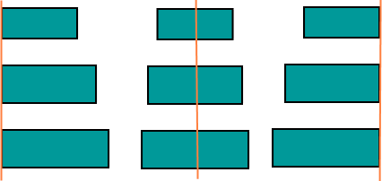
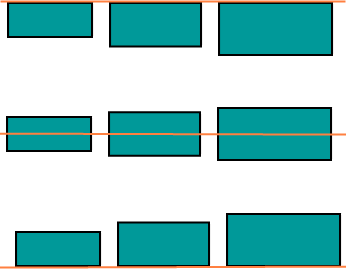
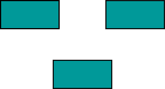
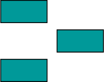
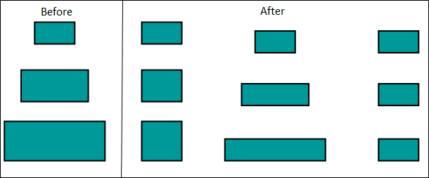
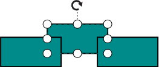

# Commands

There are several commands available in the Diagram. They are listed as follows.

* Alignment
* Spacing
* Sizing
* Clipboard
* Grouping
* Z-Order
* Zoom
* Nudge
* Undo/Redo

## Alignment Command

Alignment commands are used to align selected nodes/connectors on the Diagram page. The alignment is based on the selection boundary. The alignment command is as follows.

_Alignment Command_

<table>
<tr>
<td>
Command</td><td>
Parameter</td><td>
Description</td></tr>
<tr>
<td>
align</td><td>
direction (string)Values accepted-(“left”/”right”/”center”/”top”/”bottom”/”middle”)</td><td>
Aligns all the nodes/connectors in the selection list to the left/right/center/top/bottom/middle of the selection boundary</td></tr>
</table>
VerticalAlignment commands

The node is aligned vertically to left, right, and center by using alignment commands. The following code illustrates how to run the vertical alignment command.



[JS]

//Aligns left

diagram.align("left");

//Aligns right

diagram.align("right");

//Aligns center

diagram.align("center");



 
{:.image }

Horizontal Alignment commands

The node is aligned horizontally to top, bottom, and middle by using alignment commands. The following code illustrates how to run the horizontal alignment command.



[JS]

//Aligns top

diagram.align("top");

//Aligns bottom

diagram.align("bottom");

//Aligns middle

diagram.align("middle");



 
{:.image }

## Spacing Command

Spacing commands are used to place selected nodes on the Diagram at equal intervals from each other. The objects are spaced within the bounds of the first and last objects in the selection.

_Spacing Command_

<table>
<tr>
<td>
Commands</td><td>
Description</td></tr>
<tr>
<td>
spaceAcross</td><td>
Aligns the nodes/connectors in the selection list with equal horizontal distance between them.</td></tr>
<tr>
<td>
spaceDown</td><td>
Aligns the nodes/connectors in the selection list with equal vertical distance between them.</td></tr>
</table>

spaceAcross Command

The spaceAcrosscommand spaces selected nodes with equal horizontal distance between them.

The following code illustrates how to execute spaceAcrosscommand



[JS]
//SpaceAcross

diagram.spaceAcross();



 
{:.image }

spaceDown Command

The spaceDowncommand spaces selected nodes with equal vertical distance between them.

The following code illustrate how to execute spaceDowncommand



[JS]

//space down

diagram.spaceDown();



 
{:.image }

## Sizing Command

Sizingcommands are used to size the selected nodes on the Diagram.

The following are the sizing commands.

_Sizing Command_

<table>
<tr>
<td>
Commands</td><td>
Description</td></tr>
<tr>
<td>
sameSize</td><td>
Size of the nodes in the selection list is resized to size of first node in the selection list.</td></tr>
<tr>
<td>
sameHeight</td><td>
Height of the nodes in the selection list is resized to height of first node in the selection list.</td></tr>
<tr>
<td>
sameWidth</td><td>
Width of the nodes in the selection list is resized to width of first node in the selection list.</td></tr>
</table>

The following code illustrate how to execute Sizing commands



[JS]

//Same size

diagram.sameSize();

//Same height

diagram.sameHeight();

//Same width

diagram.sameWidth();



 
{:.image }

## Clipboard commands 

Clipboardcommands are used to cut, copy, and paste the selected elements on Diagram. The following are the Clipboardcommands.

* cut
* copy
* paste

Cut

Cuts the selected elements from the Diagram to the Diagram’s clipboard. 

The following code illustrates how to run Cutcommand



[JS]

//Cuts the selected nodes/connectors

diagram.cut();



Copy

Copies the selected elements from the Diagram to the Diagram’s clipboard. 

The following code illustrates how to run Copycommand



[JS]

//Copies the nodes/connectors

diagram.copy();



Paste

Pastes the Diagram’s clipboard data (nodes/connectors) into the Diagram.

The following code illustrates how to run Paste command.



[JS]

//Pastes the cut/copied nodes/connectors on diagram

diagram.paste();



 
{:.image }

## Grouping Commands

Grouping commands are used to group/ungroup the selected elements on Diagram.

Group

The following code illustrates how to Group the selected elements on Diagram.



[JS]

//Groups the selected nodes/connectors

diagram.group();



Ungroup

The following code illustrates how to Ungroup the selected group on Diagram.



[JS]

//Ungroups the selected group 

diagram.ungroup();



## Z-Order Commands

Z-order commands are used to move the selected elements to the front of other elements. To send it back, move it one step (z-index) forward and move it one step (z-index) backward. These commands provide support to control overlapping objects.

* bringToFront
* sendToBack
* moveForward
* sendBackward

bringToFront Commands

The bringToFront command moves the selected element over other elements by increasing the selected element’s z-index to Diagram element’s maximum value.

The following code illustrates how to run the BringToFront command.



[JS]

//Brings to front

diagram.bringToFront();



 
{:.image }

sendToBack Commands

The sendToBack command moves the selected element behind all other elements by setting the selected element’s z-index to zero.  

The following code illustrates how to execute sendToBack command.



[JS]

//Sends back

diagram.sendToBack();



 
{:.image }

moveForward Commands

The moveForward command increases the z-index value of the selected element by 1.

The following code illustrates how to execute moveForward Command.



[JS]

//Moves forward

diagram.moveForward();



 
{:.image }

sendBackwardCommands

The sendBackward command decreases the z-index value of the selected element by 1.

The following code illustrates how to execute sendBackward command.



[JS]

//Sends backward

diagram.sendBackward();



 
{:.image }

## Zoom Commands

Zoom feature is used to zoom-in and zoom-out of the Diagram view and also zooming based on the center of the current Diagram view. 

The following code illustrates how to zoom-in the Diagram.



[JS]

//ZoomIn

function ZoomIn() 

{

 var diagram = $("#diagram").ejDiagram("instance");

 var zoom = { zoomFactor: 0.2,zoomCommand: ej.datavisualization.Diagram.ZoomCommand.ZoomIn };

 diagram.zoomTo(zoom);    

}     



The following code illustrates how to zoom-out the Diagram.



[JS]

//ZoomOut       

function ZoomOut() 

{

 var diagram = $("#diagram").ejDiagram("instance");

 var zoom = { zoomFactor: 0.2, zoomCommand: ej.datavisualization.Diagram.ZoomCommand.ZoomOut };

 diagram.zoomTo(zoom);

}



## Nudge Commands

Nudge commands move selected elements on the Diagram up, down, left, or right by 1 pixel. The Nudge command is as follows.

_Nudge Commands_

<table>
<tr>
<td>
Command</td><td>
Parameter</td><td>
Description</td></tr>
<tr>
<td>
nudge</td><td>
direction (string)Value accepted-(“up”/”down”/ ”left”/”right”)delta(integer) </td><td>
Nudge command moves the selected elements up/ down/ left/ right by the number of pixels specified by the parameter delta.When delta is not specified, by default, it is considered as 1 pixel.</td></tr>
</table>

The following code illustrates how to execute Nudge command.



[JS]

//Nudges up

diagram.nudge("up" , 5);



Nudge by using Arrow Keys

The corresponding arrow keys are used to move the selected elements up, down, left, or right by 1 pixel.

 
{:.image }

Nudge commands are particularly useful for accurate placement of Diagram elements on the Diagram as it allows you to move by 1 pixel each time.

## FitToPage commands

FitToPage command fits the Diagram content into the view with respect to width, height, or the whole.

_FitToPage Commands_

<table>
<tr>
<td>
Command</td><td>
Parameter</td><td>
Description</td></tr>
<tr>
<td>
fitToPage</td><td>
mode (string)Value accepted- ej.datavisualization.Diagram.FitModeregion(string) Value accepted-ej.datavisualization.Diagram.Regionmargin(object) </td><td>
FitToPage command fits the Diagram into the view. The area/bounds to be fit into a view is specified through the parameters.mode – To specify whether to fit the Diagram into view either in terms of width, height, or entire page.region – To specify whether to fit the content based on the Diagram elements or page settings.margin – Space that is to be left in between the content and viewport.</td></tr>
</table>

The following code illustrates how to execute FitToPage command.



[JS]

//Fits to page – fits Diagram based on elements

diagram.fitToPage("page", "content", { "left": 25, "top": 25, "right": 25, "bottom": 25 });



FitToMode

Mode is to specify whether the Diagram content can be fit into view with respect to width, height or entire bounds of the Diagram.

_Fit To Modes_

<table>
<tr>
<td>
Modes</td><td>
Description</td></tr>
<tr>
<td>
Page</td><td>
Fits the entire Diagram content into view</td></tr>
<tr>
<td>
Width</td><td>
Fits the width of Diagram content into view </td></tr>
<tr>
<td>
Height</td><td>
Fits the height of Diagram content into view</td></tr>
</table>
Region

Region specifies the region/bounds of Diagram content to fit into view.

_Diagram Region_

<table>
<tr>
<td>
Regions</td><td>
Description</td></tr>
<tr>
<td>
Content</td><td>
Specifies the region covered by the Diagram elements </td></tr>
<tr>
<td>
PageSettings</td><td>
Specifies the region based on page settings</td></tr>
</table>
Undo/Redo
Refer to the Link for Undo/Redo Commands.

