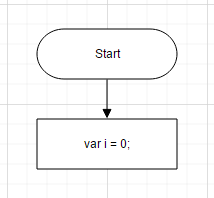

# Getting Started

This section explains briefly how to create the Diagram in your application with ASP.NET.

## Control Structure

The following screenshot illustrates the structure of the Diagram control.

 

## Create your first Diagram in ASP.NET

### Initialize Diagram

1. Create an ASPX file and add the necessary script and CSS files in the &lt;Head&gt; tag as shown in the following code example.


<html xmlns="http://www.w3.org/1999/xhtml">

    <head>

        <title>

            Getting Started with the Diagram control for ASP.Net

        </title>

        <!-- jQuery Script -->

        

<!--script to create Diagram-->

        

    </head>

    <body>
    </body>

</html>



2. Add the &lt;ej:Diagram&gt; element in the &lt;body&gt; tag to render the Diagram.


<html>

    <body>

        <ej:Diagram ID="DiagramContent" runat="server" Height="600px" Width="600px">

        </ej:Diagram>

</body>

</html>



3. This creates an empty Diagram. In the following section, you can learn how to add employee details in the Diagram.
   

### Initialize Data

Initially, you can create hierarchical employee information, JSONData, and assign it to a variable data.



<head>

    <!-- ... -->

    

</head>



### Populate Organizational Chart

You can populate the organizational chart by specifying the necessary fields of data source.



//Customizes node before rendering

function nodeTemplate(diagram, node) {

     node.labels[0].text = node.Name; 

 }

//Initializes the node template.

 $(window).load(function () {

     $("#DiagramWebControl1").ejDiagram({ nodeTemplate: nodeTemplate  });

 });  





  DiagramWebControl1.Model.Width = "70px";

  DiagramWebControl1.Model.Height = "30px";

//Uses automatic layout to arrange elements on the page

  DiagramWebControl1.Model.Layout.Type = LayoutTypes. HierarchicalTree;

  DiagramWebControl1.Model.Layout.MarginY = 50;

  DiagramWebControl1.Model.Layout.HorizontalSpacing = 50;

  DiagramWebControl1.Model.Layout.VerticalSpacing = 50;

//Configures data source for diagram

  DiagramWebControl1.Model.DataSourceSettings.DataSource = GetOrgChartData();

  DiagramWebControl1.Model.DataSourceSettings.Parent = "ReportingPerson";

  DiagramWebControl1.Model.DataSourceSettings.Id = "name";

//Sets the default properties of the nodes.

  DiagramWebControl1.Model.DefaultSettings.Node = new Node() { 

      Width = 70, 

      Height = 30,

      Shape = { type: "rectangle","cornerRadius": 5 },

  };

  Label label = new Label() { 

        Name = "label1",

        FontSize = 11, 

        Bold = true, 

        FontFamily = "Segoe UI", 

  };

 DiagramWebControl1.Model.DefaultSettings.Node.Labels.Add(label);

//Sets the default properties of the connectors.

 DiagramWebControl1.Model.DefaultSettings.Connector = new Connector() {

    Segments = new Collection() { new Segment(Segments.Orthogonal) },

    TargetDecorator = new Decorator() { Shape = DecoratorShapes.Arrow }

 },

 public Array GetOrgChartData(){

// Returns datasource

   }



The employee data is displayed in the following Diagram.

   

_Diagram_

