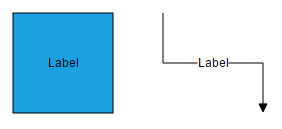
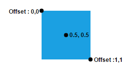
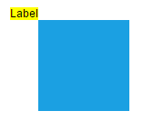
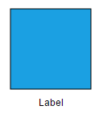
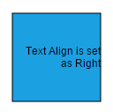
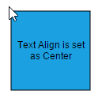

## Label

Label is a block of text that is displayed over a node or a connector. Label is used to textually represent an object with a string that can be edited at run time. Label has properties for text appearance, customization, and alignment. You can add MultipleLabels to a node/connector.

### Create Label

Node’s/Connector’s Labels property holds an array of Label objects.

The following code illustrates how to create a Label.



//Creates Label for node

Label label = new Label();

label.Text = "Label";

//Adds label to node labels collection

node.Labels.Add(label);

//Adds label to connector labels collection

connector.Labels.Add(label);



{  | markdownify }
{:.image }

### Displacement

A Label can be displaced from its original position, by dragging and programmatically. The following code illustrates how to enable Label Displacement through interaction.



//Enables Label Dragging for node.

Node node = new Node();

node.Constraints = NodeConstraints.Default| NodeConstraints.DragLabel;

//Enables Label Dragging for connector.

Connector connector = new Connector();

connector.Constraints = ConnectorConstraints.Default| ConnectorConstraints.DragLabel;



{  | markdownify }
{:.image }

The following code illustrates how to displace labels through API.



Node node = new Node()

{

     Name = "Meeting",

     Width = 150,

     Height = 60,

     Labels = new Collection(){

        new Label(){ 

          Text= "Progress",

          Margin=new LabelMargin { Left= 100,Top= 100 },

          Offset=new DiagramPoint(){ X= 0,Y= 0 },

          HorizontalAlignment= HorizontalAlignment.Left,

          VerticalAlignment= VerticalAlignment.Top }   }

};



{  | markdownify }
{:.image }

### Label Rotation

Diagram provides support to rotate labels. You can rotate labels to some specified angles. The following code illustrates how to specify the rotation angle for labels.



Label label = new Label();

label.Text = "Label";

//Label Rotate Angle.

label.RotateAngle = 45;



{  | markdownify }
{:.image }

> {  | markdownify }
{:.image }
_Note: No built-in support is added to rotate labels interactively._

### Appearance 

You cancustomizethe Labelappearance and position by using its properties.



//Sets various appearance properties to label

Label label = new Label();

label.Name = "label";

label.Text = "Label Text ";

label.FontSize = 12;

label.FontFamily = "TimesNewRoman";

label.Italic = true;

label.FontColor = "black";

label.FillColor = "white";

label.BorderColor = "black";

label.BorderWidth = 1;

label.WrapText = true;

label.TextDecoration = TextDecorations.LineThrough;



{  | markdownify }
{:.image }

### Label Editing

Labelcan be edited at runtime, programmatically or interactively. By default, label is in View mode. But, it can be brought to edit mode in two ways; by double clicking on the label, or by programmatically setting the mode to Edit as shown in the following code example. Label editing is automatically terminated when the Edit box loses its focus or by setting its mode back to View.



//Label edit mode

Label label = new Label();

label.Mode = LabelEditMode.Edit;

//Label view mode

Label label = new Label();

label.Mode = LabelEditMode.View;



{  | markdownify }
{:.image }

### Read-only Label

To prevent label editing, set Label’s ReadOnly property as True. After setting the Label to ReadOnly mode, when you double click the Label, it does not move to Edit mode. However, even after ReadOnly is set as true, you can programmatically move the label to edit mode.



//Label readOnly mode

Label label = new Label();

label.ReadOnly = true;



### Label Alignment

You can align the Label by using its alignment properties.

_Label Alignment_

<table>
<tr>
<td>
Name</td><td>
Type</td><td>
Description</td></tr>
<tr>
<td>
 TextAlign</td><td>
TextAlign</td><td>
Gets or sets text alignment of label</td></tr>
<tr>
<td>
 HorizontalAlignment</td><td>
HorizontalAlignment</td><td>
Gets or sets label horizontal alignment of node/connector.</td></tr>
<tr>
<td>
 VerticalAlignment</td><td>
VerticalAlignment</td><td>
Gets or sets label vertical alignment of  node/connector</td></tr>
<tr>
<td>
 Margin</td><td>
Margin</td><td>
Gets or sets the margin for the label.</td></tr>
<tr>
<td>
 Offset</td><td>
DiagramPoint</td><td>
Gets or sets the position for the label.</td></tr>
</table>



//Aligns label and its text

Label label = new Label();

label.Text = "Label";

label.VerticalAlignment = VerticalAlignment.Top;

label.HorizontalAlignment = HorizontalAlignment.Center;

label.Offset = new DiagramPoint(0.5f,0.5f);

label.Align = TextAlign.Left;



_Alignment_

<table>
<tr>
<td>
Horizontal Alignment</td><td>
Vertical Alignment</td><td>
Offset</td><td>
   Image</td></tr>
<tr>
<td>
Center</td><td>
Top</td><td>
(0.2,1)</td><td>

{:.image }
</td></tr>
<tr>
<td>
Right</td><td>
Middle</td><td>
(0.5,0.3)</td><td>

{:.image }
</td></tr>
<tr>
<td>
Left</td><td>
Bottom</td><td>
(0.5,0.7)</td><td>

{:.image }
</td></tr>
</table>

{  | markdownify }
{:.image }

{  | markdownify }
{:.image }

Text Wrapping

Wrapping property of label allows you to specify whether or not to wrap the text when it reaches the edge of the containing node. 

The following code illustrates how to wrap text.



Label label = new Label();

label.Wrapping = WrapText.Wrap;



{  | markdownify }
{:.image }

_Text Wrapping_

<table>
<tr>
<td>
Values</td><td>
Description</td><td>
Image</td></tr>
<tr>
<td>
NoWrap</td><td>
Text is not wrapped.</td><td>

{:.image }
</td></tr>
<tr>
<td>
Wrap (Default)</td><td>
Text-wrapping occurs when the text overflows beyond the available node width.</td><td>

{:.image }
</td></tr>
<tr>
<td>
WrapWithOverflow</td><td>
Text-wrapping occurs when the text overflows beyond the available node width. However, the text may overflow beyond the node width in the case of a very long word.</td><td>

{:.image }
</td></tr>
</table>
Width

By default, label wraps the text based on its parent element’s size (node/group/connector). You can override this by using Width property. When the label width is set, label acts like a container and wraps the label based on the width specified.

The following code example illustrates how to set the label width.



Label label = new Label();

label.Width = 50;



### Multiple Labels 

You can add Multiple Labels to the node /connector.

The following code illustrates how to create multiple labels to node 



 //Adds multiple labels to node

Node node = new Node();

Label label = new Label();

label.Offset = new DiagramPoint(0.1f,0.1f);

label.Text = "Left";

node.Labels.Add(label);

label = new Label();

label.Offset = new DiagramPoint(0.9f,1);

label.Text = "Right";

node.Labels.Add(label);

label = new Label();

label.Offset = new DiagramPoint(0.5f,05f);

label.Text = "Center";

node.Labels.Add(label);



{  | markdownify }
{:.image }

