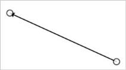

# Tools

When interacting on a diagram’s surface, the Tool property decides the action to be performed. When more than one tool is applied by using bitwise, OR, the necessary tool is picked based on the interaction gesture, the value of Tool property and precedence.

_Tools_

<table>
<tr>
<td>
{{ '**Precedence**' | markdownify }}</td><td>
{{ '**Tools**' | markdownify }}</td><td>
{{ '**Description**' | markdownify }}</td></tr>
<tr>
<td>
1st </td><td>
ContinuesDraw</td><td>
Allows you to draw the nodes or connectors continuously. </td></tr>
<tr>
<td>
2nd </td><td>
DrawOnce</td><td>
Allows you to draw single node or connector.</td></tr>
<tr>
<td>
3rd </td><td>
ZoomPan</td><td>
Allows you to pan or zoom diagram.</td></tr>
<tr>
<td>
4th </td><td>
MultipleSelect</td><td>
Allows you to select multiple nodes and connectors</td></tr>
<tr>
<td>
5th </td><td>
SingleSelect</td><td>
Allows you to select individual nodes or connectors.</td></tr>
<tr>
<td>
6th </td><td>
None</td><td>
Disables all tools</td></tr>
</table>

## Single Tool Selection

The following code illustrates how to enable SingleSelect tool.



// Enables SingleSelection

    <ej:Diagram ID="DiagramContent" runat="server" Height="100%" Width="100%">

    </ej:Diagram>





DiagramContent.Tool = Tool.SingleSelect;



## Multiple Diagram Tools

Diagram provides support to enable multiple tools at a time. The following code illustrates how to enable ZoomPan and SingleSelect tool at the same time.



DiagramContent.Tool = Tool.SingleSelect| Tool.ZoomPan;



## Drawing Tools

Drawing tool allows you to draw any node during runtime by clicking and dragging the diagram page. To draw a node by using the drawing tool, the required node is assigned to the drawType property.

### Rectangle Tool

The following code example illustrates how to draw the rectangle shape at run time. When drawing tool is defined and activated, you can click and drag on the page to draw the defined node.





  

Similarly, you can draw any node by using the drawing tool, assigning the required node to the diagram.model.drawType property.

### Connector Tool

To draw a connector, the required connector type is assigned to the drawType property.

### StraightLine

The following code example illustrates how to draw a straight connector at runtime.





  

