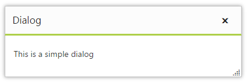
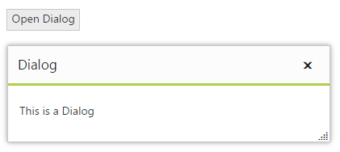

# Getting Started

## Create your first Dialog in ASP.NET

The ASP.NET Dialog displays a Dialog window within your web page. The Dialog control enables you to display a message in a supplementary content (such as images and text) and interactive content such as forms. The Dialog control displays the content in the model Dialog, where you cannot interact with the other items on the page. You can drag and resize the Dialog. In this section, you can learn how to customize a Dialog in a real time login form. The following screenshot displays a Dialog window.

 

### Create a Dialog

You can create an ASP Project and add the necessary Dlls and scripts with the help of the given [ASP-Getting Started](http://docs.syncfusion.com/aspnetmvc/captcha/getting-started#create-your-first-captcha-in-aspnet-mvc ) documentation.

You can add the following code example to the corresponding ASPX page to render the Dialog.



<ej:Dialog ID="loginForm" Title="Sign Up" runat="server" Width="330">

        <DialogContent>

        </DialogContent>

</ej:Dialog>



The following screenshot displays a Dialog control without any content.

 

By default, the Dialog control shows the header element. You can use the title text from the Dialog element.

### Set content

To display the content in the Dialog control, you can add the content in th Dialog element and design the login page by using the Dialog control. You can createHTML content for login page and add it in the Dialog element.

The following code example illustrates how to set the content in the Dialog control.



<ej:Dialog ID="loginForm" Title="Sign Up" runat="server" Width="330">

        <DialogContent>

            <div id="DialogLoginForm">

                <form method="get" name="signup" id="signup_form">

                <div class="heading">

                    <div class="text-center">

                        Sign Up

                    <div class="text-center content">

                        It's free and always will be

                

                <div class="information">

                    <div class="row">

                        <span class="info">

                            <input type="text" id="firstname" name="first name"class="input ejinputtext name"

                                placeholder="First Name" />

                        <span class="info last">

                            <input type="text" id="lastname" name="last name"class="input ejinputtext name"

                                placeholder="Last Name" />

                        

                    

                    <div class="row">

                        <input type="text" id="email" name="email" class="input ejinputtext email" placeholder="Your Email" />

                    

                    <div class="row">

                        <input type="text" id="reptemail" name="re-enter email"class="input ejinputtext email"

                            placeholder="Re-enter Email" />

                    

                    <div class="row">

                        <input type="password" maxlength="8" name="password"id="password" class="input ejinputtext"

                            placeholder="Password" />

                    

                

                <div class="signupbtn">

                    <input type="button" class="btn btn-lg btn-primary"onclick="onSignUp()" name="Submit"

                        value="Sign Up" />

                
               

                </form>

            

        </DialogContent>

    </ej:Dialog>



You can use the following styles to customize the styles of sign up form. You can use Bootstrap to align the login page header in the center and style the sign up button. You can also include bootstrap.min.css file from CDN location.



         #loginForm

        {

            background: linear-gradient(#FFFFFF, #D3D8E8) repeat scroll 0 0 rgba(0, 0, 0, 0);

        }

        .content

        {

            color: #999999;

        }

        .input

        {

            width: 100%;

            height: 32px;

            text-indent: 10px;

            border-radius: 3px;

            font-size: larger;

        }

        .heading

        {

            padding: 10px 0px;

        }

        .heading > div

        {

            font-size: 30px;

        }

        .heading div.content

        {

            font-size: 15px;

        }

        .information

        {

            padding: 5px 20px;

        }

        .signupbtn

        {

            padding: 10px 20px;

        }

        .information .row

        {

            padding: 5px 0px;

        }

        .info

        {

            float: left;

            width: 47%;

        }

        .info.last

        {

            float: right;

        }

        .signupbtn .btn

        {

            width: 100%;

            background-color: #a9ca44;

            border-radius: 6px;

            height: 40px;

        }

        .text-center

        {

            text-align: center;

        }



Run the above code example to render the following output. The screenshot displays the Dialog control with header and resizable option. These options are enabled in the Dialog control, by default.

 

### Configure a Dialog

To remove the header and resizable options from the Dialog, you can use the EnableResize and ShowHeader properties. By default, the width of the Dialog control is based on the content in it. You can also set the width of the Dialog control by using the Width property. To render the appearance of sign up control, you can set the width of the Dialog control.

Initialize the Dialog control by using the following code example.



    <ej:Dialog ID="loginForm" Title="SignUp" runat="server" Width="330"ShowHeader="false" EnableResize="false">

           <DialogContent>

           </DialogContent>

    </ej:Dialog>



Run the code example to render the following output. 

 

You can also add additional functions to Dialog control such as Ajax content, list of header icon actions such as close, minimize, maximize actions, and model Dialog.

### Add Validation

This section explains how to set the validation to each form element in the Dialog control. To validate each form element, click sign up button. The Dialog closes when you click the sign up button raising the ClientSideOnBeforeClose event. The ClientSideOnBeforeClose event validates each and every form element manually. Once the validation succeeds, the Dialog closes. When the validation fails, set args.cancel value to True. This prevents the Dialog from closing.

Initialize the Dialog control with the following code example.



    <ej:Dialog ID="loginForm" Title="Sign Up" runat="server" Width="330"ClientSideOnBeforeClose="onValidation" ShowHeader="false" EnableResize="false">

        <DialogContent>

        </DialogContent>

    </ej:Dialog>



 You can add a HTML element in the form to display the error message in the Dialog.



    <div class="errormsg">

    



 You can add the following code example in <script> tag to add validation to form elements.



        function onSignUp() {

            var obj = $("#loginForm").data("ejDialog");

            obj.close();

        }

        function onValidation(args) {

            var error = [], re, regEmail;

            re = /^[A-Za-z]+$/;

            regEmail = /^(([^<>()[\]\\.,;:\s@\"]+(\.[^<>()[\]\\.,;:\s@\"]+)*)|(\".+\"))@((\[[0-9]{1,3}\.[0-9]{1,3}\.[0-9]{1,3}\.[0-9]{1,3}\])|(([a-zA-Z\-0-9]+\.)+[a-zA-Z]{2,}))$/;

            $('#loginForm input.name[type=text]').each(function (n, element) {

                if (($(element).val() == '))

                    error.push('Please enter your ' + element.name);

                else if (!re.test($(element).val()))

                    error.push(element.name + ' must have a string value');

            });

            $('#loginForm input.email[type=text]').each(function (n, element) {

                if (($(element).val() == '))

                    error.push('Please enter your ' + element.name + ' address');

                else if (!regEmail.test($(element).val()))

                    error.push('Please enter a valid email address');

            });

            !($("#loginForm input#email").val() === $("#loginForminput#reptemail").val()) ? error.push("Email address not matched") : "";

            if ($("#loginForm  input#password").val() == ')

                error.push('Please provide a password');

            else if (($('#loginForm input#password').val().length < 5) || ($('#loginForm input#password').val().length > 8))

                error.push('Your password must be at least 5 and at most 8 characters long');

            ulTag = $(document.createElement('ul'));

            for (var i = 0; i < error.length; i++) {

                liTag = $(document.createElement('li'));

                liTag.append("-" + error[i] + "");

                ulTag.append(liTag);

            }

            (error.length != 0) ? ($(".errormsg").html(ulTag), args.cancel = true) 

            : alert("Sign Up Successfully Completed");

        }



 You can add the following styles to customize the styles of error message.


        .errormsg li

        {

            list-style: none outside none;

        }

        .errormsg span

        {

            color: #FF0000;

            font-size: 12px;

            font-style: italic;

            margin: 2px 0;

            font-weight: normal;

        }



 Run the code example to render the following output.

 

The above screenshot displays an error message when an invalid input is given to form elements. The Dialog is closed when the value is in a valid format or the Dialog is open.

