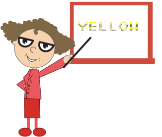

## Character Settings

### Appearance

The opacityof the character is adjustable with the help of opacity property. The space between two characters are adjusted with spacing property as like in the segment settings.

[ASP]

&lt;ej:DigitalGauge runat="server" ID="DigitalGauge1" Width="800"&gt;

&lt;Items&gt;

&lt;ej:DigitalGaugeItems Value="Syncfusion"&gt;

&lt;%-- Adding Basic character properties --%&gt;

&lt;CharacterSettings Opacity="0.3" Spacing="3" /&gt;

&lt;/ej:DigitalGaugeItems&gt;

&lt;/Items&gt;

&lt;/ej:DigitalGauge&gt;

Execute the above code examples to render the DigitalGauge as follows.

{  | markdownify }
{:.image }

### Count and Type

* The number of text to be displayed can be limited by the attribute called count. In Digital Gauge five different types of characters are supported. They are as follows, 
1. EightCrossEightDotMatrix
2. SevenSegment
3. FourteenSegment
4. SixteenSegment 
5. EightCrossEightSquareMatrix.

[ASP]

&lt;ej:DigitalGauge runat="server" ID="DigitalGauge1" Width="800"&gt;

&lt;Items&gt;

&lt;ej:DigitalGaugeItems Value="123456789"&gt;

&lt;%-- Adding character count and type --%&gt;

&lt;CharacterSettings Count="10" Type="SevenSegment" Spacing="10" /&gt;

&lt;SegmentSettings Length="8" Width="1"/&gt;

&lt;/ej:DigitalGaugeItems&gt;

&lt;/Items&gt;

&lt;/ej:DigitalGauge&gt;

Execute the above code examples to render the DigitalGauge as follows.

{  | markdownify }
{:.image }

### Text Positioning

The text in the DigitalGauge is positioned with position object. This object contains two attributes such as x and y. The x variable positions the text in the horizontal axis and the y variable positions the text in the vertical axis.

[ASP]

&lt;ej:DigitalGauge runat="server" ID="DigitalGauge1" Width="800" Height="300"&gt;

&lt;%-- Adding frame background image --%&gt;

&lt;Frame BackgroundImageUrl="../Content/images/gauge/Board1.jpg"/&gt;

&lt;Items&gt;

&lt;ej:DigitalGaugeItems Value="YELLOW"&gt;

&lt;%-- Adding gauge position --%&gt;

&lt;Position X="80" Y="10"/&gt;

&lt;SegmentSettings Color="Yellow"/&gt;

&lt;/ej:DigitalGaugeItems&gt;

&lt;/Items&gt;

&lt;/ej:DigitalGauge&gt;

Execute the above code examples to render the DigitalGauge as follows.

{  | markdownify }
{:.image }

### Shadow Effects

The text in the Digital Gauge is positioned with position object. This object contains two attributes such as x and y. The x variable positions the text in the horizontal axis and y variable positions the text in the vertical axis.

[ASP]

&lt;ej:DigitalGauge runat="server" ID="DigitalGauge1" Width="800"&gt;

&lt;Items&gt;

&lt;%-- Adding shadow effects --%&gt;

<ej:DigitalGaugeItems Value="WELCOME" ShadowColor="Yellow"

ShadowBlur="20" ShadowOffsetX="15" ShadowOffsetY="15">

&lt;SegmentSettings Length="3" Width="3"/&gt;

&lt;/ej:DigitalGaugeItems&gt;

&lt;/Items&gt;

&lt;/ej:DigitalGauge&gt;

Execute the above code examples to render the DigitalGauge as follows.

{  | markdownify }
{:.image }

