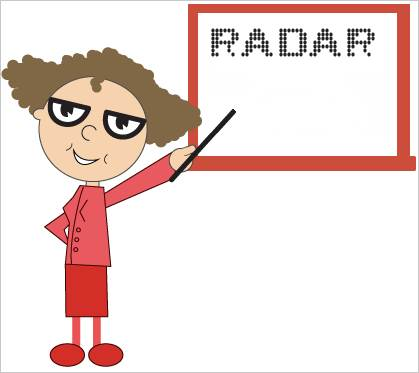

# Frames

## Inner and Outer Width Customization

Frames are space that enclose the Digital Gauge. The inner width of the Frame is the distance between the canvas element and the frame. The outer width is the distance from the frame. The code example to set frame’s innerWidth and outerWidth is as follow. 



<ej:DigitalGauge runat="server" ID="DigitalGauge1" Value="WELCOME">

<%-- Adding Frame properties --%>

<Frame InnerWidth="6" OuterWidth="10"/>

</ej:DigitalGauge>



Execute the above code examples to render the DigitalGauge as follows.

_Figure 27: Digital Gauge control with frame inner and outer width_

## Setting Background Image

For a better appearance, you can set the backgroundimage for the Digital Gauge using the property backgroundImageUrl. 



<ej:DigitalGauge runat="server" ID="DigitalGauge1" Value="RADAR">

<%-- Adding background image --%>

<Frame BackgroundImageUrl="../Content/images/gauge/board3.jpg"/>

<Items>

<ej:DigitalGaugeItems>

<%-- Adding gauge position --%>

<Position X="80" Y="10"/>

</ej:DigitalGaugeItems>

</Items>

</ej:DigitalGauge>



Execute the above code examples to render the DigitalGauge as follows.

_Figure 28: Digital Gauge control with frame background image_

