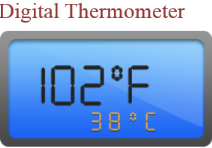
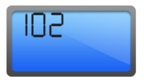
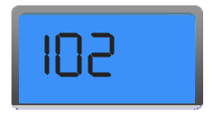
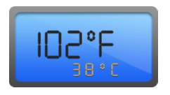

# Getting Started

* The ASP.NET Digital Gauge provides support to display the Digital gauge within your web page and allows you to customize it. This section encompasses the details on how to configure Digital Gauge. Here you will learn how to provide data for a Digital Gauge and display the data in the required way. 
* In addition, you will learn how to customize the default Digital gauge appearance to your requirements. As a result, you will get a Digital Gauge that shows like a Digital thermometer. 
* You can use this Digital Gauge in advertisement, decorative purpose, displaying share details in share market, game score boards, token systems, etc.

 

_Figure 16: Digital Thermometer_

## Creating a Digital Gauge

ASP.NET Digital Gauge widget basically renders flexible API’s. You can easily create the Digital Gauge widget by using simple code example as follows.

1. First create a ASP.NET Project and add necessary Dll’s and Scripts with the help of the given ASP.NET-Getting Started Documentation.
2. Add the mentioned code to the corresponding view page to render Digital Gauge .
   


<ej:DigitalGauge runat="server" ID="digital"></ej:DigitalGauge>



Run the above code example and you will get a default Digital Gauge as follows.

_Figure 17: Digital gauge_

## Set Height and Width values

Basic attributes of each canvas elements are height and width. You can set the height and width of the gauge. 

### Code:



<ej:DigitalGauge runat="server" ID="digital" Height="145" Width="260"></ej:DigitalGauge>



Run the above code example and you will see a default gauge with the specified height and width values.

 
 
_Figure 18: Digital gauge with height and width_

## Set Items Property

Items have different properties to customize the Digital Gauge.

### Adding Segment and Character Properties

* In the welcome board, the text color is attentive in nature. You are required to give some segment properties such as segment spacing, segment width, segment color, segment length and segment opacity.
* Character type is used to define the Digital representation of the character. The five types of character representation available are,
  1. EightCrossEightDotMatrix
  2. SevenSegment
  3. FourteenSegment
  4. SixteenSegment 
  5. EightCrossEightSquareMatrix.

#### Code:



<ej:DigitalGauge runat="server" ID="digital" Height="145" Width="260">

<Items>

<ej:DigitalGaugeItems Value="102">

<SegmentSettings Length="20" Width="2"/>

<CharacterSettings Spacing="12" Type="SevenSegment" />

</ej:DigitalGaugeItems>

</Items>

</ej:DigitalGauge>



Execute this code to render a gauge as follows.

_Figure 19: Digital gauge segment properties_

### Adding Background Image

* Add a div element to set the background for the Digital gauge.
* Add a style tag in the View page to display the background image for the Digital gauge. 
* Add the required properties such as position, margin, display, etc, to enhance the look of the background image.

> Important: The background image path is given in background-image url.

#### Code:



<ej:DigitalGauge runat="server" ID="digital" Height="145" Width="260">

<Items>

<ej:DigitalGaugeItems Value="102">

<SegmentSettings Length="20" Width="2"/>

<CharacterSettings Spacing="12" Type="SevenSegment" />

</ej:DigitalGaugeItems>

</Items>

</ej:DigitalGauge>



Execute this code to render a gauge as follows.

_Figure 20: Digital gauge Background image_

### Adding Location

Position property is used to positioning the digital letters inside the canvas element.

#### Code:



<ej:DigitalGauge runat="server" ID="digital" Height="145" Width="260">

<Items>

<ej:DigitalGaugeItems Value="102">

<SegmentSettings Length="20" Width="2"/>

<CharacterSettings Spacing="12" Type="SevenSegment" />

<Position X="15" Y="40"/>

</ej:DigitalGaugeItems>

</Items>

</ej:DigitalGauge>



Execute this code to render a Gauge as follows.

_Figure 21: Digiatl gauge with segment location_

### Adding the Items collection 

Similarly adding the further item collection will display the temperature value as in the Digital thermometer value.

#### Code:



<ej:DigitalGauge runat="server" ID="digital" Height="145" Width="260">

<Items>

<ej:DigitalGaugeItems Value="102">

<SegmentSettings Length="20" Width="2"/>

<CharacterSettings Spacing="12" Type="SevenSegment" />

<Position X="15" Y="40"/>

</ej:DigitalGaugeItems>

<ej:DigitalGaugeItems Value="0">

<SegmentSettings Length="5" Width="2"/>

<CharacterSettings Spacing="12" Type="SevenSegment" />

<Position X="85" Y="28"/>

</ej:DigitalGaugeItems>

<ej:DigitalGaugeItems Value="F">

<SegmentSettings Length="20" Width="2"/>

<CharacterSettings Spacing="12" Type="SevenSegment" />

<Position X="170" Y="40"/>

</ej:DigitalGaugeItems>

<ej:DigitalGaugeItems Value="38">

<SegmentSettings Length="9" Width="1" Color="#f5b43f"/>

<CharacterSettings Spacing="12" Type="SevenSegment" />

<Position X="70" Y="90"/>

</ej:DigitalGaugeItems>

<ej:DigitalGaugeItems Value="0">

<SegmentSettings Length="3" Width="1" Color="#f5b43f"/>

<CharacterSettings Spacing="12" Type="SevenSegment" />

<Position X="90" Y="80"/>

</ej:DigitalGaugeItems>

<ej:DigitalGaugeItems Value="c">

<SegmentSettings Length="9" Width="1" Color="#f5b43f"/>

<CharacterSettings Spacing="12" Type="SevenSegment" />

<Position X="120" Y="90"/>

</ej:DigitalGaugeItems>

</Items>

</ej:DigitalGauge>



Execute this code to render a Digital thermometer as follows.

_Figure 22: Digiatla gauge with item collection_

