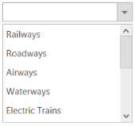
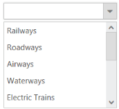
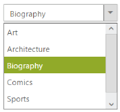

# Data-binding 

## Data fields and configuration 

The following sub-properties provide a way to bind the data either locally or remotly to the DropDown control.

<table>
<tr>
<th>
{{ '**Properties**' | markdownify }}</th><th>
{{ '**Description**' | markdownify }}</th><th>
{{ '**Default value**' | markdownify }}</th><th>
{{ '**Data type**' | markdownify }}</th></tr>
<tr>
<td>
DataSource</td><td>
The data source contains the list of data for generating the DropDownList items.</td><td>
Null</td><td>
object</td></tr>
<tr>
<td>
Query</td><td>
It specifies the query to retrieve the data from the online server.</td><td>
Null</td><td>
object</td></tr>
<tr>
<td>
ID</td><td>
It specifies the ID of the tag.</td><td>
Null</td><td>
String</td></tr>
<tr>
<td>
Text</td><td>
It specifies the text content of the tag.</td><td>
Null</td><td>
String</td></tr>
<tr>
<td>
Value</td><td>
It specifies the value of the tag.</td><td>
Null</td><td>
String</td></tr>
<tr>
<td>
Category</td><td>
Used to categorize the items. It is used when the grouping is enabled.</td><td>
Null</td><td>
String</td></tr>
<tr>
<td>
DataIdField</td><td>
It specifies the ID of the data.</td><td>
Null</td><td>
String</td></tr>
<tr>
<td>
DataSourceID</td><td>
Specifies the ID of the DataSource.</td><td>
Null</td><td>
String</td></tr>
<tr>
<td>
DataMember</td><td>
Specifies the member in a data source to bind to the data list control.</td><td>
Null</td><td>
String</td></tr>
<tr>
<td>
DataTextField</td><td>
It specifies the name of the column value that binds the DropDownList text.</td><td>
Null</td><td>
String</td></tr>
<tr>
<td>
DataValueField</td><td>
It specifies the ID of the value.</td><td>
Null</td><td>
String</td></tr>
<tr>
<td>
DataImageUrlField</td><td>
It defines the imageURL for the image location.</td><td>
Null</td><td>
String</td></tr>
<tr>
<td>
DataImageAttributesField</td><td>
It defines the image attributes such as height, width, styles, etc.</td><td>
Null</td><td>
String</td></tr>
<tr>
<td>
DataSpriteCssField</td><td>
It defines the sprite CSS for the image tag.</td><td>
Null</td><td>
String</td></tr>
<tr>
<td>
DataHtmlAttributesField</td><td>
It defines the html attributes such as ID, class, styles for the item.</td><td>
Null</td><td>
String</td></tr>
<tr>
<td>
DataSelectedField</td><td>
This field defines the tag value to be selected initially. Corresponding field that is mapped has boolean values to select the list items on control creation. The data with value true in this field is selected automatically when the control is initialized.</td><td>
Null</td><td>
String</td></tr>
<tr>
<td>
DataTableNameField</td><td>
It defines the table name for tag value or displays text while rendering remote data.</td><td>
Null</td><td>
object</td></tr>
</table>

## Local data

DropDown provides data binding support for DropDownList. Thus you can bind the data from JSON Data. To achieve this, map the corresponding file with their column names

Also, provide support to add and customize the images and list item by using the appropriate data fields. 

In an ASPX page, add an element to configure DropDownList.


<ej:DropDownList ID="dropdownlist" Width="200px" runat="server" DataIdField="Id"    DataTextField="Text"></ej:DropDownList>




  protected void Page_Load(object sender, EventArgs e)

        {

            List<vehicle> vehiclelist = new List<vehicle>();

            vehiclelist.Add(new vehicle() { Id = "1", Text = "Railways" });

            vehiclelist.Add(new vehicle() { Id = "2", Text = "Roadways" });

            vehiclelist.Add(new vehicle() { Id = "3", Text = "Airways" });

            vehiclelist.Add(new vehicle() { Id = "4", Text = "Waterways" });

            vehiclelist.Add(new vehicle() { Id = "5", Text = "Electric Trains" });

            dropdownlist.DataSource = vehiclelist;

        }

        public class vehicle

        {

            public string Text { get; set; }

            public string Id { get; set; }         

        }



Output of the above step.

 

## SQLDataSource

SqlDataSource is designed to work with SQL Server databases. It uses internally, the SQL Server .NET data provider. SQL Server .NET data provider classes are defined in the System.Data.SqlClient namespace. 

The following step explains the details about the data binding from SQLDataSource. 

In the ASPX page, add DropDownList.



<ej:DropDownList ID="dropdownlist" runat="server" DataTextField="text" DataValueField="id" DataSourceID="SqlDataSource1">

</ej:DropDownList>

<asp:SqlDataSource ID="SqlDataSource1" runat="server" SelectCommand="SELECT [id], [text] FROM [Vehicle]"ConnectionString='<%$ ConnectionStrings:DatabindingConnectionString %>'></asp:SqlDataSource>



 Create a data table in .mdf format with the following structure and add it in APP_Data folder 

Add connection string in the Web.config file.

Note: Change the username with your system name in the following connection string.



  <configuration>

  <connectionStrings>

    <add name="DatabindingConnectionString" connectionString="Data Source=SYNCLAPN4732;Initial Catalog=Databinding;Integrated Security=True"

      providerName="System.Data.SqlClient" />

  </connectionStrings>

</configuration>



Output of the above steps.

## LINQDataSource

LinqDataSource is designed to work with DataContext. It uses internally, the data model (dbml) file. Data model contains list of tables from specific database. 

The following step explains the details about the data binding from LinqDataSource. 

In the ASPX page, add DropDownList.



<ej:DropDownList ID="dropdownlist" Width="200px" DataTextField="text" DataValueField="id" DataSourceID="LinqDataSource1" runat="server">

</ej:DropDownList>

<asp:LinqDataSource ID="LinqDataSource1" runat="server" ContextTypeName="dropdownlist.Database.common_datamodelDataContext"

    TableName="Vehicles" EntityTypeName="">

</asp:LinqDataSource>



Create a table in .mdf format by using the following table structure. Create a dbml file in APP_DATA folder and drag and drop table into it. 

Add connection String in the Web.config file.

Note: Change the username with your system name in the following connection string.



  <configuration>

  <connectionStrings>

    <add name="DatabindingConnectionString" connectionString="Data Source=SYNCLAPN4732;Initial Catalog=Databinding;Integrated Security=True"

      providerName="System.Data.SqlClient" />

  </connectionStrings>

</configuration>



Output of the above steps

## ObjectDataSource

The ObjectDataSource control allows you to bind a specific data layer in a similar manner where other controls bind to the database.The ObjectDataSource control can bind to any method that returns a DataSet or an IEnumerable object. For example, a DataReader or a collection of Classes. The major advantage of binding via ObjectDataSource is only the records required in the current view are retrieved from the database, greatly optimizing the performance and runtime memory usage. 

The following steps explain the details about the data binding from ObjectDataSource.

In the ASPX page, add DropDownList.



<ej:DropDownList ID="dropdownlist" Width="200px" DataTextField="Text" DataValueField="ID" DataSourceID="ObjectDataSource1" runat="server">

</ej:DropDownList>

<asp:ObjectDataSource ID="ObjectDataSource1" runat="server" TypeName="TabData" SelectMethod="GetTabItems">

</asp:ObjectDataSource>



Create new CS file in App_Data folder and name as ‘Data.cs’ and add the following codes in the page. 



  [Serializable]

public class TabData

{

    public TabData(int _id,string _text)

    {

        this.ID = _id;

        this.Text = _text;

    }

    public TabData()

    {

    }

    [Browsable(true)]

    public int ID

    {

        get;

        set;

    }

    [Browsable(true)]

    public string Text

    {

        get;

        set;

    }

    public List<TabData> GetTabItems()

    {

        List<TabData> data = new List<TabData>();

        data.Add(new TabData(1, "Railways"));

        data.Add(new TabData(2, "Roadways"));

        data.Add(new TabData(3, "Airways"));

        data.Add(new TabData(4, "Waterways"));

        data.Add(new TabData(5, "Electric Trains"));

        data.Add(new TabData(6, "Diesel Trains"));

        data.Add(new TabData(7, "Heavy Motor Vehicles"));

        data.Add(new TabData(8, "Light Motor Vehicles"));

        data.Add(new TabData(9, "Aeroplanes"));

        data.Add(new TabData(10,"Helicopters"));

        data.Add(new TabData(11,"Ships"));

        data.Add(new TabData(12,"Submarines"));

        return data;

    }

}



Output of the above steps.

## XMLDataSource

XmlDataSource is used to work with XML documents. The following steps explain the details about the data binding from XmlDataSource.

In the ASPX page, add DropDownList. 



<ej:DropDownList ID="dropdownlist" runat="server" Width="200px" DataValueField="Id"

    DataTextField="Text" DataSourceID="XmlDataSource1" DataMember="Items">

</ej:DropDownList>

<asp:XmlDataSource ID="XmlDataSource1" runat="server" DataFile="~/App_Data/XMLData.xml">

</asp:XmlDataSource>



Create new xml file in App_Data folder as ‘XMLData.xml’ and add the following codes in the page. 



<Items>

 <Item Id="1" Text=" Railways">

  </Item>

  <Item Id="2" Text="Roadways">

  </Item>

  <Item Id="3" Text="Airways">

  </Item>

  <Item Id="4" Text="Waterways">

  </Item>

 <Item Id="5" Text="Electric Trains">

 </Item>

</Items>



Output of the above steps

## Remote data 

You can bind the data for the DropDownList from remote that can fetch the data from any other server located as remote web service. By using Query options, you can pass the query string to filter the data that helps to avoid the extensive properties look up. 

The following step explains the details of data binding from remote. 

In an ASPX page, add an element to configure the DropDownList.



    Select a Customer

<ej:DropDownList ID="dropdownlist" runat="server" DataTextField="CustomerID">

</ej:DropDownList>





protected void Page_Load(object sender, EventArgs e)

        {

            this.dropdownlist.DataSource = "http://mvc.syncfusion.com/Services/Northwnd.svc/";

            this.dropdownlist.Query = "ej.Query().from('Customers').take(6)";        

        }



Output of the above step.

