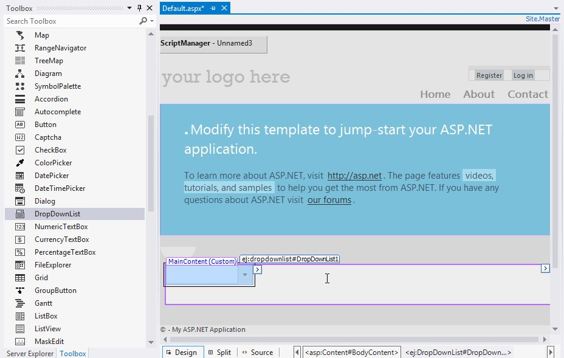
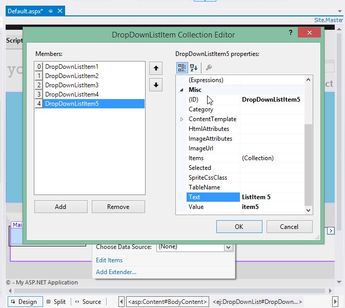
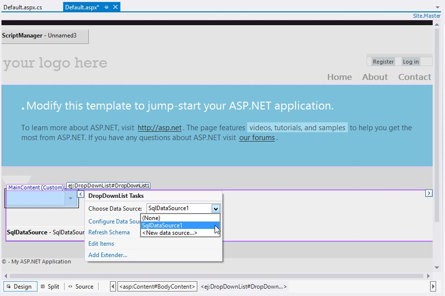
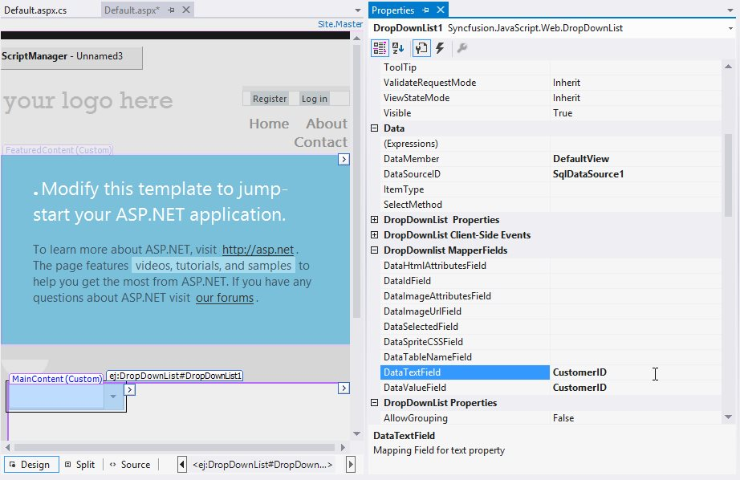

# Getting Started

## Creating your first DropDownList in ASP Web Forms

1. Create an ASP.Net Web Forms application and add DropDownList control to the Default.aspx page.

    

2. Once the control is dragged and dropped into the page the embedded resource will add dependent script and CSS files from Synfusion.EJ.Web assembly and the assembly will be referred from GAC. This will add the follwing appSetting key in web.config file to load resource files.

    
        
        <appSettings>
                <add key="LoadEJResourcesFromAssembly" value="true"/>
                <add key="EJResources" value="jsrender:true;jqueryeasing:true;globalize:true;themes:true;"/>
        </appSettings>
            
    
    >Refer the [ASP.NET-Getting Started](http://help.syncfusion.com/aspnet/getting-started#manual-integration-of-syncfusion-aspnet-controls-into-the-newexisting-application) Documentation to know further details about necessary DLLs, Script and CSS files.

3. Configure the DropDownList control using smart tag, to add DropDownList items

    

    Switching from Design view to Source the DropDownList code looks like the below. Synfusion namespace will be registered and control will be intialized from the Syncfusion.EJ.Web namespace tag prefix "ej". The items to DropDownList are added using the DropDownListItem child element under Items.

    

        <ej:DropDownList ID="DropDownList1" runat="server">
                <Items>
                    <ej:DropDownListItem ID="DropDownListItem1" runat="server" Text="ListItem 1" Value="item1">
                    </ej:DropDownListItem>
                    <ej:DropDownListItem ID="DropDownListItem2" runat="server" Text="ListItem 2" Value="item2">
                    </ej:DropDownListItem>
                    <ej:DropDownListItem ID="DropDownListItem3" runat="server" Text="ListItem 3" Value="item3">
                    </ej:DropDownListItem>
                    <ej:DropDownListItem ID="DropDownListItem4" runat="server" Text="ListItem 4" Value="item4">
                    </ej:DropDownListItem>
                    <ej:DropDownListItem ID="DropDownListItem5" runat="server" Text="ListItem 5" Value="item5">
                    </ej:DropDownListItem>
                </Items>
        </ej:DropDownList>
            
    

4. Execute the code to get the below output

    

## Populating data

The DropDownList can be bounded to both local list data binding like SQLDataSource, XMLDataSource, ObjectDataSource or LinqDataSource and remote data services. Assign the DataSourceID property with corresponding DataSource ID used and map the corresponding Data fields.

1. Configure the DropDownList control with SQL data source using smart tag.

    

2. Assign the values for DropDownList Mapper fields from the properties panel.

    

    > NOTE Create a connection string in Web.config file using SQL database.

    
        
        <connectionStrings>
            <add name="ConnectionString" connectionString="Data Source=(LocalDB)\v11.0;AttachDbFilename=|DataDirectory|\NORTHWND.MDF;Integrated Security=True"
            providerName="System.Data.SqlClient" />
        </connectionStrings>
        
    

    Switching from Design view to Source the DropDownList code looks like the below with DataSource, DataTextField and DataValueField mapped.

    
        
            <ej:DropDownList ID="DropDownList1" runat="server" DataMember="DefaultView" DataSourceCachingMode="None" DataSourceID="SqlDataSource1" DataTextField="CustomerID" DataValueField="CustomerID" EnableIncrementalSearch="False" FilterType="Contains" MaxPopupHeight="" MaxPopupWidth="" MultiSelectMode="None" SortOrder="Ascending" VirtualScrollMode="Normal">
        </ej:DropDownList>
         
        
        <asp:SqlDataSource ID="SqlDataSource1" runat="server" ConnectionString="<%$ ConnectionStrings:ConnectionString %>" SelectCommand="SELECT [CustomerID] FROM [Customers]"></asp:SqlDataSource>

    

3. Execute the code to get the below output 

    

## Setting Dimensions

DropDownList dimensions can be set using Width and Height Properties.
	

	
       <ej:DropDownList ID="DropDownList1" runat="server" Width="300px" Height="50px">
            <Items>
                <ej:DropDownListItem ID="DropDownListItem1" runat="server" Text="ListItem 1" Value="item1">
                </ej:DropDownListItem>
                <ej:DropDownListItem ID="DropDownListItem2" runat="server" Text="ListItem 2" Value="item2">
                </ej:DropDownListItem>
                <ej:DropDownListItem ID="DropDownListItem3" runat="server" Text="ListItem 3" Value="item3">
                </ej:DropDownListItem>
                <ej:DropDownListItem ID="DropDownListItem4" runat="server" Text="ListItem 4" Value="item4">
                </ej:DropDownListItem>
                <ej:DropDownListItem ID="DropDownListItem5" runat="server" Text="ListItem 5" Value="item5">
                </ej:DropDownListItem>
            </Items>
        </ej:DropDownList>
	


**Setting dimensions to Popup list**

PopupWidth and PopupHeight can be used to create a fixed size popup list.


    
        <ej:DropDownList ID="DropDownList1" runat="server" Height="50px" Width="500px" PopupHeight="200px" PopupWidth="300px">
            <Items>
                <ej:DropDownListItem ID="DropDownListItem1" runat="server" Text="ListItem 1" Value="item1">
                </ej:DropDownListItem>
                <ej:DropDownListItem ID="DropDownListItem2" runat="server" Text="ListItem 2" Value="item2">
                </ej:DropDownListItem>
                <ej:DropDownListItem ID="DropDownListItem3" runat="server" Text="ListItem 3" Value="item3">
                </ej:DropDownListItem>
                <ej:DropDownListItem ID="DropDownListItem4" runat="server" Text="ListItem 4" Value="item4">
                </ej:DropDownListItem>
                <ej:DropDownListItem ID="DropDownListItem5" runat="server" Text="ListItem 5" Value="item5">
                </ej:DropDownListItem>
            </Items>
        </ej:DropDownList>
        

    
## Setting and Getting Value

You can select single or multiple values from DropDownList control. To assign a value initially to the DropDownList, you can use <b>Value</b> property.


	
    
        
        <ej:DropDownList ID="DropDownList1" runat="server">
            <Items>
                <ej:DropDownListItem ID="DropDownListItem1" runat="server" Text="ListItem 1" Value="item1">
                </ej:DropDownListItem>
                <ej:DropDownListItem ID="DropDownListItem2" runat="server" Text="ListItem 2" Value="item2">
                </ej:DropDownListItem>
                <ej:DropDownListItem ID="DropDownListItem3" runat="server" Text="ListItem 3" Value="item3">
                </ej:DropDownListItem>
                <ej:DropDownListItem ID="DropDownListItem4" runat="server" Text="ListItem 4" Value="item4">
                </ej:DropDownListItem>
                <ej:DropDownListItem ID="DropDownListItem5" runat="server" Text="ListItem 5" Value="item5">
                </ej:DropDownListItem>
            </Items>
        </ej:DropDownList>
         
        <asp:Label runat="server" ID="Label1"></asp:Label> 
        <ej:Button runat="server" ID="Button1" OnClick="Button1_Click" Type="Button" Text="Get value"></ej:Button>
            
	
    
    
        protected void Button1_Click(object Sender, Syncfusion.JavaScript.Web.ButtonEventArgs e)
        {
            Label1.Text = "Selected item value is " + DropDownList1.Value;
        }
    



