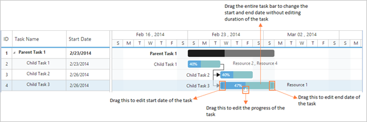
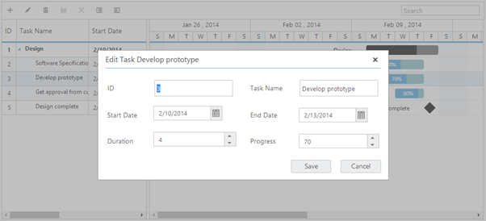

# Getting Started

This section explains briefly about how to create a Ganttchart in your application with ASP.NET.

## Create your first Gantt in ASP.NET

This section explains briefly about the control structure and how to create a Gantt chart.

### Control Structure

Gantt chart is used to edit and visualize project schedule and also to track progress of a task. The following screen shot illustrates the elements of a Gantt chart.

 

_Figure : Elements of a Gantt chart_

* Toolbar – It is a collection of toolbar buttons to add, edit, and delete a task. You can outdent and indent a task using outdent and indent buttons. Following screen shot illustrates the function of each toolbar button,

  
  _Figure : Toolbar of Gantt chart_
  
* Search Textbox – It is used to search tasks, which contains the search string.
* Resource Names – It displays the names of the resources assigned to that task.
* Task bar – It is a graphical representation of the duration of task.
* Task Progress – It displays the percentage of the task completed.
* Header – It represents time scale based on which a task bar is drawn.
* Tree Grid – It displays the tasks and its sub tasks in hierarchical table.
* Task Relationship – It determines when to start or finish a task.
* Interactive Editing – You can edit the duration of a task by dragging or resizing the task bar. Following screen shot illustrates this.

  

_Figure : Editing options Gantt chart_

### Create your Gantt chart

In this tutorial, you will learn how to create a simple Gantt chart, add tasks and subtasks, and set relationship between tasks for design phase of software project. The following screen shot displays the output after completing this tutorial.

 

_Figure : Simple Gantt chart_

1. First create a new ASP.NET Web Form project ; please refer the [ASP-Getting Started documentation](http://docs.syncfusion.com/js) to create new project and add necessary DLL’s and script files.
2. Create the web form  named as default and add the following template

   ~~~ html

        <%@ Page Language="C#" AutoEventWireup="true" CodeBehind="default.aspx.cs"Inherits="Gantt_ASP.Gantt._default" %>

        <!DOCTYPE html>

        <html xmlns="http://www.w3.org/1999/xhtml">

        <head runat="server">   

        <title>Getting started for ASP.NET Gantt Control</title>

        <!-- style sheet for default theme(flat azure) -->

        <link href="http://cdn.syncfusion.com/13.1.0.21/js/web/flat-azure/ej.web.all.min.css" rel="stylesheet" />

        <!--scripts-->   

        

        

        

        

        

        </head>

   ~~~
   {:.prettyprint }

3. Initialize the Gantt like the following code snippet

   ~~~ html

        //...    

        <body>

        <form id="form1" runat="server">    

            <ej:Gantt ID="GanttControlDefault" 

                runat="server"

                AllowSelection="true" 

                AllowColumnResize="true" 

                TaskIdMapping="TaskID" 

                TaskNameMapping="TaskName" 

                ScheduleStartDate="02/01/2014" 

                ScheduleEndDate="03/14/2014"

                StartDateMapping="StartDate"             

                DurationMapping="Duration"

                ProgressMapping="Progress" 

                ChildMapping="SubTasks"             

                TreeColumnIndex="1">

            </ej:Gantt>            

        </form>

        </body>

   ~~~
   {:.prettyprint }

4. Create a data source in default.aspx.cs file and assign the data source to the Gantt control.

   ~~~ cs

        protected void Page_Load(object sender, EventArgs e)

        {

            this.GanttControlDefault.DataSource = GanttDefaultData.GetData();

            this.GanttControlDefault.DataBind();

        }

        public class DefaultData

        {

            public string StartDate { get; set; }

            public int TaskID { get; set; }

            public string TaskName { get; set; }

            public string EndDate { get; set; }

            public int Duration { get; set; }

            public int Progress { get; set; }

            public List<DefaultData> SubTasks { get; set; }

            public string Predecessors { get; set; }

            public List<int> ResourceID { get; set; }

        }

        public class GanttDefaultData

        {

            public static List<DefaultData> GetData()

            {

                List<DefaultData> tasks = new List<DefaultData>();

                tasks.Add(new DefaultData()

                {

                    TaskID = 1,

                    TaskName = "Design",

                    StartDate = "02/10/2014",

                    EndDate = "02/14/2014",

                    Duration=5

                });

                tasks[0].SubTasks= new List< DefaultData >();

                tasks[0].SubTasks.Add(new DefaultData ()

                {

                    TaskID = 2,

                    TaskName = "Software Specification",

                    StartDate = "02/10/2014",

                    EndDate = "02/12/2014",

                    Duration = 3,

                    Progress = 60,                

                    ResourceID = new List<int>() { 2 }

                });

                tasks [0].SubTasks.Add(new DefaultData ()

                {

                    TaskID = 3,

                    TaskName = "Develop prototype",

                    StartDate = "02/10/2014",

                    EndDate = "02/12/2014",

                    Duration = 3,

                    Progress = 100,                

                    ResourceID = new List<int>() { 3 }

                });

                tasks[0].SubTasks.Add(new DefaultData ()

                {

                    TaskID = 4,

                    TaskName = "Get approval from customer",

                    StartDate = "02/13/2014",

                    EndDate = "02/14/2014",

                    Duration = 2,

                    Progress = 100,

                    Predecessors = "3FS",

                    ResourceID = new List<int>() { 1 }

                });

                tasks[0].SubTasks.Add(new DefaultData ()

                {

                    TaskID = 5,

                    TaskName = "Design complete",

                    StartDate = "02/14/2014",

                    EndDate = "02/14/2014",

                    Duration = 0,

                    Predecessors = "4FS"

                });

                return tasks;

            }

        }

   ~~~
   {:.prettyprint }

The following screenshot displays the Gantt.

_Figure 25: Gantt chart_

#### Enable Toolbar

Gantt control contains the toolbar options to edit, search, expand and collapse all records, indent, outdent, delete, and add a task. You can enable toolbar using Toolbar option.



<ej:Gantt ID="GanttControlDefault" 

    //...

    >

    <ToolbarSettings ShowToolbar="true" ToolbarItems="add,edit,delete,update,cancel,indent,outdent"/>

</ej:Gantt> 
           

The following screen shot displays a Tool bar in Gantt.

 

Note:add, edit, delete options are enabled when enabling the allowEditing, allowAdding, allowDelete in the edit Settings.

_Figure : Toolbar in Gantt chart_

#### Enable sorting 

Gantt control has the sorting functionality for arranging the tasks in ascending or descending based on the particular column.

#### Multicolumn sorting:

Enable the multicolumn sorting in Gantt by setting AllowMultiSorting to “True”. You can sort multiple columns in Gantt by selecting the desired column header while holding the CTRL key.



<ej:Gantt ID="GanttControlDefault" runat="server"

    //...

    AllowSorting="true"

    AllowMultiSorting="true" >            

</ej:Gantt>            



#### Enable Editing

You can enable editing using EditOption and AllowGanttChartEditing options.

#### Cell Editing:

Modify the task details through the grid cell editing by setting the EditMode as CellEditing.

#### Normal Editing:

Modify the task details through the edit dialog by setting the EditMode as Normal.

#### Taskbar Editing:

Modify the task details through user interaction like resizing and dragging the taskbar.



<ej:Gantt ID="GanttControlDefault" runat="server"

    //...

    AllowGanttChartEditing="true">

    <EditSettings  AllowEditing="true" AllowAdding="true" AllowDeleting="true" EditMode="cellEditing"/>

</ej:Gantt>            



The following screen shot displays the Gantt control with Enable Editing options.

Note: Both cellEditing and normal editing operations are performed through double click action.

#### Enable Context Menu

You can enable the context menu in Gantt by setting the EnableContextMenu to “True”.



<ej:Gantt ID="GanttControlDefault" runat="server"

    //...

    EnableContextMenu="true">            

</ej:Gantt>            



The following screen shot displays Gantt chart with Enable Context menu option.

  

_Figure : Gantt control with Enable Editing options_

#### Provide tasks relationship

In Gantt control, you have the predecessor support to show the relationship between two different tasks.

#### Types:

#### Start to Start (SS)

You cannot start a task until the other task is also started.

#### Start to Finish (SF)

You cannot finish a task until the other task is started.

#### Finish to Start (FS)

You cannot start a task until the other task is completed.

#### Finish to Finish (FF)

You cannot finish a task until the other task is completed.

You can show the relationship in tasks by using the PredecessorMapping as follows.



<ej:Gantt ID="GanttControlDefault" runat="server"

    //...

    PredecessorMapping="Predecessors">           

</ej:Gantt>            



The following screen shot displays the relationship between tasks.

_ Figure : Gantt chart with relationships between tasks_

#### Provide Resources

In ASP.NET MVCGantt, you can display and assign the resource for each task. Create a collection of JSON object, which contains id and name of the resource and assign it to ResourceCollection option. Then, specify the field name for id and name of the resource in the resource collection to ResourceIdMapping and ResourceNameMapping options. The name of the field which contains the actual resources assigned for a particular task in the DataSource is specified using ResourceInfoMapping.



protected void Page_Load(object sender, EventArgs e)

{

    this.GanttControlDefault.DataSource = GanttDefaultData.GetData();

    this.GanttControlDefault.Resources = ResourceList.GetData();

    this.GanttControlDefault.DataBind();     

}
   _Figure : Resource allocation for tasks in Gantt_

//...

public class ResourceListData

{

    public int ResourceID { get; set; }

    public string ResourceName { get; set; }

}

public class ResourceList

{

    public static List<ResourceListData> GetData()

    {

        List<ResourceListData> resourceDetails = new List<ResourceListData>();

        resourceDetails.Add(new ResourceListData() { ResourceID = 1, ResourceName = "Project Manager" });

        resourceDetails.Add(new ResourceListData() { ResourceID = 2, ResourceName = "Software Analyst" });

        resourceDetails.Add(new ResourceListData() { ResourceID = 3, ResourceName = "Developer" });

        resourceDetails.Add(new ResourceListData() { ResourceID = 4, ResourceName = "Testing Engi-neer" });

        return resourceDetails;

    }

}





<ej:Gantt ID="GanttControlDefault" runat="server"

    //...

    ResourceInfoMapping="ResourceID"

    ResourceNameMapping="ResourceName"

    ResourceIdMapping="ResourceID">

</ej:Gantt>            



The following screen shot displays resource allocation for tasks in Gantt.

