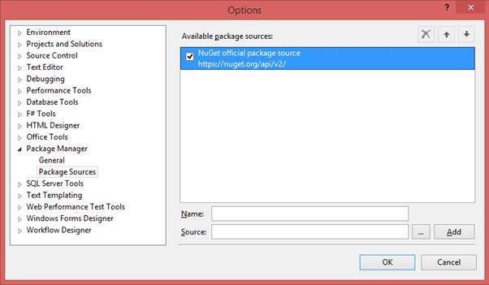
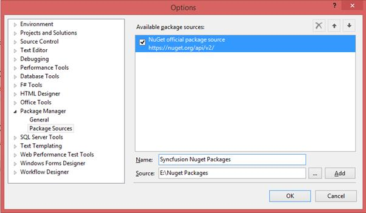
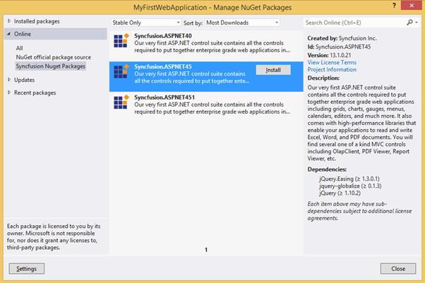
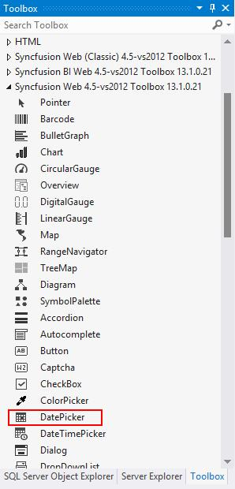
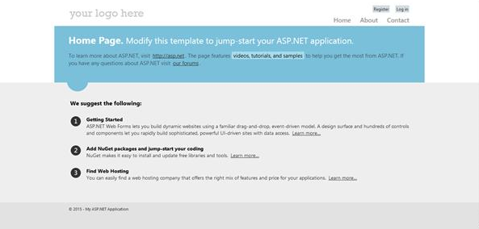
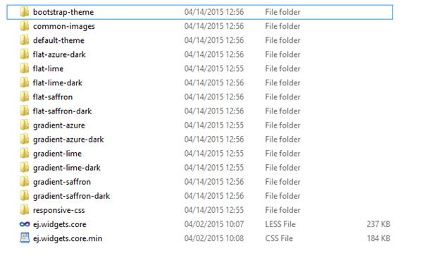

# Getting Started

This section describes how to configure the Syncfusion ASP.NET components into the ASP.NET applications. There are three ways for embedding our controls into ASP.NET application:

1. Using Syncfusion Project Template
2. Through Syncfusion NuGet Packages
3. Through Manual Integration into the new/existing Application

The procedure that are followed in manual integration process is entirely automated, when we create an application using Syncfusion Project template.

## Using Syncfusion Project Template
For creating new ASP.Net Website, you can use the Syncfusion’s Visual Studio project templates. Here, you will see how to add the `DatePicker` control into the ASP.NET Website selecting from the “New Web Site” pop-up,

* Start the Visual Studio and select File -> New -> Website. You can now see the built-in `Syncfusion ASP.NET Website` template in the "New Web Site" pop-up as shown below

* Type the application name and click `OK`. This will create a new Web Site with all the Syncfusion ASP.Net control’s client and server side dependencies are preconfigured and copied to it appropriate folders

* Now you can add your required controls in the ASPX Page. The code for adding `DatePicker` control within the "Default.aspx" file is follows



<ej:DatePicker ID="DatePicker" runat="server"></ej:DatePicker>



* Another way of adding control into the Default.aspx page is by making use of the Toolbox option present in the Visual Studio. You need to just drag the required control from the toolbox and then drop it into the Content section of the Default.aspx page and the required control code automatically gets generated

* Finally build and run the project by pressing F5, so that you can now see the output similar to the below screenshot in your web browser.

## Through Syncfusion NuGet Packages
This topic explains how to add the Syncfusion ASP.NET Web controls into the new ASP.NET Web Forms application by making use of Syncfusion NuGet Packages. 

### Configuring Syncfusion NuGet Packages
The steps to download and configure the required Syncfusion NuGet Packages in Visual Studio are as follows,

* Download the Syncfusion NuGet Packages for ASP.NET from [here](http://nuget.syncfusion.com/login#) and save it in your system. The downloaded file is a zip formatted file, therefore unzip the folders and copy only the below specified packages present within it. Create a new folder namely NuGet Packages in any of the particular location in your system and place the below specified files into it

N> For rendering Syncfusion ASP.NET components within the web application, the script and stylesheet references are mandatory. Installing ASP.NET NuGet package automatically includes all the required scripts as well as the stylesheets to the application.

* In Visual Studio, navigate to Tools -> Library Package Manager -> Package Manager Settings, the Options pop-up will appear on the screen as below

* Select Package Manager -> Package Sources in the above pop-up and click on the 
button to navigate to the location where the above collection of NuGet packages are located (namely, within the NuGet Packages folder) in your system

N> The Source textbox in the above image denotes the location of the NuGet packages in your machine and the Name section, allows you to provide a unique name which we will refer in the package installation section later.

* Now click the Add button and the package name will be listed in the Available package sources list as shown below and then Click OK.

### Creating ASP.NET Web Application
Start the Visual Studio. Create a new Web Forms application by using File -> New -> Project and run the application by pressing Ctrl+F5, which shows something similar to the following screenshot in your web browser,

### Installing the NuGet Package
The following steps will help you to add the references of the Syncfusion assemblies, required scripts and CSS files into your Project.

* Right click on your project in the Solution Explorer and select Manage NuGet Packages options from the sub-menu that pop-up on the screen. Select the Syncfusion NuGet Packages within the Online tab, which will display the list of available packages in it, as shown below

* Install the Syncfusion.ASPNET45 (based on the .NET framework (4.5) used in our sample application) package now. The below image depicts that the NuGet Package for ASP.NET (with .NET framework version 4.5) has been successfully installed into your project.

Once the package installation is completed, all the required assembly references, scripts and CSS files will be automatically added to your application. Also, it configures the web.config file automatically. The remaining changes that you need to do in your application are as follows.

### Adding dependent Scripts and CSS references in Site.Master
Syncfusion NuGet package will copy all the dependent Scripts and CSS files in the appropriate folders of the project. However you need to manually add the references for those files in the Site.Master page. The code snippet for this is follows.


<head runat="server">
  <!-- Insert the following content within "head" tag -->
  <link href="Content/ej/web/default-theme/ej.web.all.min.css" rel="stylesheet" />
  <!-- If you head section already contain jQuery reference, please remove this jQuery reference -->
  
  
  
  
  
  
</head>


### Adding Syncfusion ASP.NET control
Here, you will see how to add the `DatePicker` control into the newly created Syncfusion ASP.NET Web Application. To add the control in the Application, you can use either of the following two ways,

* Add the below `DatePicker` code within the “Default.aspx” file


<ej:DatePicker ID="DatePicker" runat="server"></ej:DatePicker>


* Another way of adding control into the Default.aspx page is by making use of the Toolbox option present in the Visual Studio. When you install Essential Studio or ASP.NET setup in your machine, all the available ASP.NET controls are automatically configured into the Visual Studio Toolbox. You just need to drag the required control from the toolbox and then drop it into the Content section of the Default.aspx page, so that the required control code automatically gets generated

* Now build and run the project by pressing F5, so that you can now see the output similar to the below screenshot in your web browser,

## Manual Integration of Syncfusion ASP.NET controls into the new/existing Application
This topic mainly focus on how to integrate the Syncfusion ASP.NET controls manually into the newly created/existing ASP.NET Web Forms application.

### Creating ASP.NET Web Application
Start the Visual Studio. Create a new Web Forms application by using File -> New -> Project and run the application by pressing Ctrl+F5, which shows something similar to the following screenshot in your web browser,

### For Existing Applications
If you want to add our Syncfusion ASP.NET controls into your existing application, open your application and proceed with the following steps.

### Adding required CSS files
To render the Syncfusion ASP.NET controls with its unique style and theme, it is necessary to refer the required CSS files into your application. You need to copy all the required CSS files into your application from the following location,

N> <installed location>\Syncfusion\Essential Studio\13.1.0.21\JavaScript\assets\css\web
N> For example, If you have installed the Essential Studio within C:\Program Files (x86), then navigate to the below location,
N> C:\Program Files (x86)\Syncfusion\Essential Studio\13.1.0.21\JavaScript\assets\css\web

When you navigate to the above location, you can find the files shown in the below image, which you need to copy entirely and paste it into your root application. 

Before pasting it into your application, create a folder structure with names ej/web within the Content folder of your application and place all the copied files into it as shown below,

N> The common-images folder is needed to be copied into your application mandatorily, as it includes all the common font icons and other images required for the control to render.  </td></tr>

Once the CSS files are added in your application, include the reference to ej.web.all.min.css file in the Site.Master page, within the head section.



<link href="Content/ej/web/default-theme/ej.web.all.min.css" rel="stylesheet" /> </td></tr>



### Adding required Script files
Essential ASP.Net controls has the following list of external JavaScript dependencies. 

* jquery-1.10.2.min.js
* jquery.easing.1.3.min.js
* jquery.globalize.min.js
* jsrender.min.js

Apart from the above external dependencies, each control has its own list of internal dependencies. This dependencies are listed within each component documentation. For the getting started, you can use “ej.web.all.min.js” file which encapsulates all the `ej` controls and frameworks in one single file. Also, Essential ASP.Net controls has additional script dependency to “ej.webform.min.js” which is responsible for raising server-side events.
The dependencies are available in the following locations of your machine. Please copy these files from location given

<table>
<tr>
<th>Files</th><th>Location</th></tr>
<tr>
<td colspan=1 rowspan=1>
jquery-1.10.2.min.js jquery.easing.1.3.min.js jquery.globalize.min.js jsrender.min.js</td><td>
<Syncfusion Installed Location>\Essential Studio\13.1.0.21\JavaScript\assets\external</td></tr>
<tr>
<td colspan=1 rowspan=1>
ej.web.all.min.js </td><td>
&lt;Syncfusion Installed Location&gt;\Essential Studio\13.1.0.21\JavaScript\assets\scripts\web</td></tr>
<tr>
<td>
ej.web.all.min.js</td><td>
<Syncfusion Installed Location>\Essential Studio\13.1.0.21\JavaScript\assets\scripts\common</td></tr>
</table>

N> Example for "Syncfusion Installed location" is "C:\Program Files (x86)\Syncfusion"

Now, create a folder named ej under the Scripts folder of your application and place the copied files ej.web.all.min.js and ej.webform.min.js into it as shown below,

Once the scripts are added in your application, now it is necessary to include the reference to it in your application. This should be done within the Site.Master file, as we did previously for CSS files. 
Add the below script references in the Site.Master file within the head section,



<link href="Content/ej/web/default-theme/ej.web.all.min.css" rel="stylesheet" />



### Assembly Reference
Refer the following assemblies in your newly created ASP.NET application, which allows you to use any of the Syncfusion ASP.NET controls within it.

* Syncfusion.EJ
* Syncfusion.EJ.Web

Once you have installed the Essential Studio package in your system, the Syncfusion assemblies are automatically registered in the GAC. You can easily add the reference to your application using `Project -> Add Reference` and selecting the mentioned Assemblies in dialog shown

### Adding Control to the Page
When you install Essential Studio or ASP.NET setup in your machine, all the available ASP.NET controls are automatically configured into the Visual Studio Toolbox. 
You just need to drag the required control from the toolbox and then drop it into the Content section of the Default.aspx page, so that the required control code gets generated automatically.

### Registering Syncfusion Assemblies within the Web.config
In your application’s web.config file, add the below assembly information within the &lt; assemblies &gt; tag.


<system.web>
  <compilation debug="true" targetFramework="4.5">
    <assemblies>
	  <add assembly="Syncfusion.EJ, Version=13.1450.0.21, Culture=neutral, PublicKeyToken=3d67ed1f87d44c89" />
	  <add assembly="Syncfusion.EJ.Web, Version=13.1450.0.21, Culture=neutral, PublicKeyToken=3d67ed1f87d44c89" />
	</assemblies>
  </compilation>
</system.web>


Finally build and run the project by pressing F5, so that you can now see the output similar to the below screenshot in your web browser,

