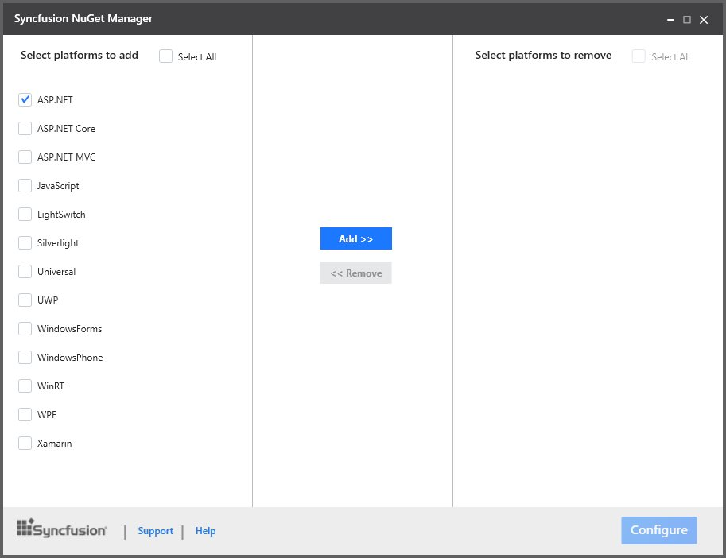
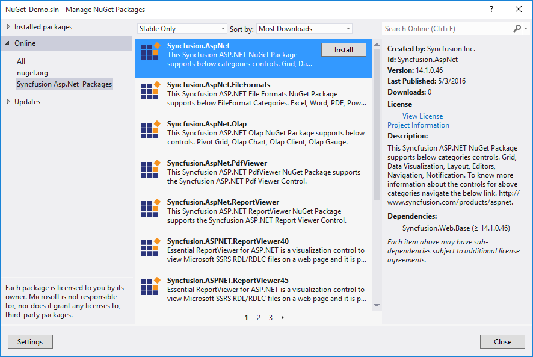
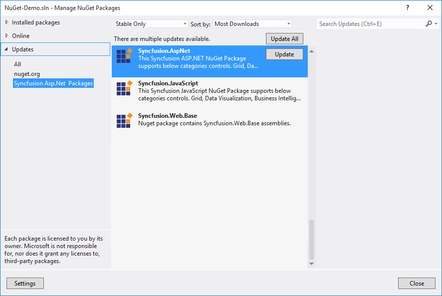
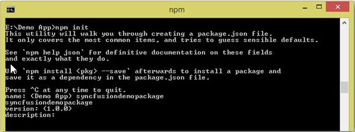
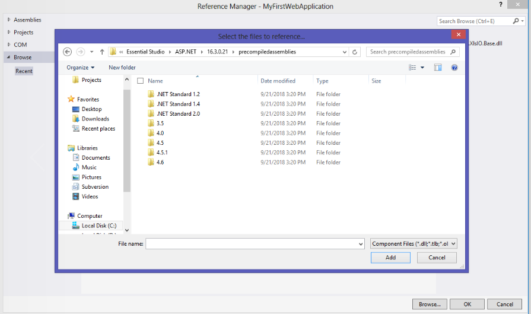
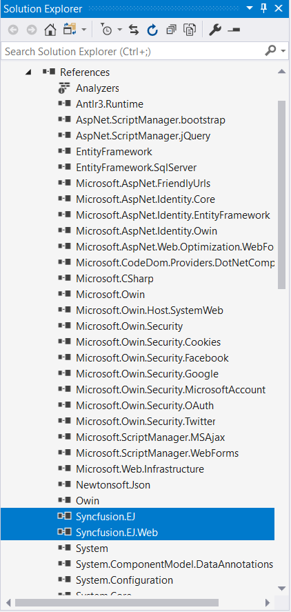

# Getting Started

This section describes how to configure the Syncfusion ASP.NET components into the ASP.NET applications. There are three ways for embedding our controls into ASP.NET application:

1. Using Syncfusion Project Template
2. Through Syncfusion NuGet Packages
3. Through Manual Integration into the new/existing Application

The procedure that are followed in manual integration process is entirely automated, when we create an application using Syncfusion Project template.

## Using Syncfusion Project Template

Syncfusion provides the Visual Studio Project Template support for ASP.NET (EJWEB) components, which will automatically include all the Syncfusion ASP.NET control’s client and server side dependencies are preconfigured and copied to it appropriate folders. Below are listed the steps for you to follow when creating an ASP.NET web site.

Step 1 Select File > New > Web Site.  
Step 2 Choose Templates > Visual C# > Syncfusion ASP.NET Web Site  
Step 3 Set a name and location for the project. 
Step 4 Click OK to create the project.  

Add your required controls in the ASPX Page. Let see the code for adding DatePicker control within the “Default.aspx” file as follows.



<ej:DatePicker ID="DatePicker" runat="server"></ej:DatePicker>



* Another way of adding control into the Default.aspx page is by making use of the Toolbox option present in the Visual Studio. You need to just drag the required control from the toolbox and then drop it into the Content section of the Default.aspx page and the required control code automatically gets generated

* Finally build and run the project by pressing F5, so that you can now see the output similar to the below screenshot in your web browser.

N> The Script Manager is mandatory in order to place our control initialization script in the page. 
Ensure whether the “ScriptManager” is added in the “Site.Master” or else add the “ScriptManager” to your web page.  
You just need to drag the “ScriptManager” from the toolbox under the “AJAX Extension” and then drop it into the Content section of the Default.aspx page, so that the required scripts to initiate our component will be added to your web page. 



     <asp:ScriptManager ID="ScriptManager1" runat="server"> 
     </asp:ScriptManager> 
     


N> Refer to [Embedded Resources](https://help.syncfusion.com/aspnet/embeded-resources) section for more information on automatically loading script files from assemblies

## Configuring Syncfusion NuGet Packages in Visual Studio 

This topic explains how to add the Syncfusion ASP.NET Web controls into the new ASP.NET Web Forms application by making use of Syncfusion NuGet Packages. 

Syncfusion ASP.NET Web Forms NuGet packages are available [here](http://nuget.syncfusion.com/package/aspnet).

N> If you wish to use the ASP.NET NuGet packages then Essential Studio or ASP.NET platform installation not required to implement with Syncfusion ASP.NET controls. 

### NuGet Configuration  

Syncfusion NuGet Package feed links are configured in Visual Studio in the following ways,

1. Syncfusion NuGet Package Manager
2. NuGet Package Manager settings

#### Syncfusion NuGet Package Manager

The steps to configure the Syncfusion ASP.NET Web Forms NuGet Packages in Visual Studio are as follows,

1. **Syncfusion NuGet Manager** is allows you to **add** the Syncfusion NuGet sources (for available platforms) to NuGet Package Manager. Download the [Syncfusion NuGet Manager](http://www.syncfusion.com/downloads/support/directtrac/general/ze/SyncfusionNugetManager-1610952973.zip) utility.
2. Extract zip file and run the SyncfusionNuGetManager.exe
3. Syncfusion NuGet Manager Window will be opened.
4. Select the platform **ASP.NET** from **“Select platforms to add”** (Left side of the window) column and click **Add>>** button. Then click **Configure** button.

   

5. Once Syncfusion NuGet Manager added the Syncfusion NuGet sources, the changes will be reflected in package sources of your Visual Studio. 

   

**Note:** Get the more details about Syncfusion NuGet Manager utility from [here](https://help.syncfusion.com/extension/syncfusion-nuget-packages/syncfusion-nuget-manager).

#### NuGet Package Manager settings

The steps to configure the Syncfusion ASP.NET Web Forms NuGet Packages in Visual Studio are as follows,

1. In Visual Studio, navigate to `Tools | NuGet Package Manager | Package Manager Settings`, the options dialog will appear on the screen as shows below,

   

2. Select `NuGet Package Manager | Package Sources` and click `Add` button to add the `Package Name` and `Package Source` of Syncfusion NuGet Packages.    

   **Name**: Name of the package that listed in Available package sources  
   **Source**: Syncfusion ASP.NET Web Forms NuGet Package feed URL 
   [http://nuget.syncfusion.com/aspnet](http://nuget.syncfusion.com/aspnet)
    
   

   N> The `Source` text box in the above image denotes the location of the NuGet packages and the `Name` section, allows you to provide a unique name for NuGet Packages Source.
    
I> Syncfusion other platforms NuGet packages feed links are available [here](http://nuget.syncfusion.com/)

### Creating ASP.NET Web Application
Start the Visual Studio. Create a new Web Forms application by using File -> New -> Project and run the application by pressing Ctrl+F5, which shows something similar to the following screenshot in your web browser,

Empty Application when run on the web browser
{:.caption}

### NuGet Installation

Syncfusion ASP.NET Web Forms NuGet can install once configured the package source. The NuGet installation steps as below,

1. Once configured the Package source with Syncfusion NuGet Packages, right click on project and choose `Manage NuGet Packages | Online | <Package Source Name>`.

   

2. The NuGet Packages are listed which are available in package source location. Install the required packages to your application by clicking `Install` button.

   N> NuGet packages can be install directly through the **command line** (Package Manager Console). Further details click [here](http://help.syncfusion.com/extension/syncfusion-nuget-packages/nuget-install-and-configuration#install-from-package-manager-console)

### Adding dependent Scripts and CSS references in Site.Master
Syncfusion NuGet package will copy all the dependent Scripts and CSS files in the appropriate folders of the project. However you need to manually add the references for those files in the Site.Master page. The code snippet for this is follows.


<head runat="server">
  <!-- Insert the following content within "head" tag -->
  <link href="Content/ej/web/default-theme/ej.web.all.min.css" rel="stylesheet" />
  <!-- If your head section already contain jQuery reference, please remove  jQuery reference from ScriptManager in master page-->
  
  
  
  
</head>


N> As like the above mentioned order, the script file of ej.webform.min.js should be referred at last whether we use individual script reference or ej.web.all.min.js script reference.

### Adding Syncfusion ASP.NET control
Here, you will see how to add the `DatePicker` control into the newly created Syncfusion ASP.NET Web Application. To add the control in the Application, you can use either of the following two ways,

* Add the below `DatePicker` code within the “Default.aspx” file


<ej:DatePicker ID="DatePicker" runat="server"></ej:DatePicker>


* Another way of adding control into the Default.aspx page is by making use of the Toolbox option present in the Visual Studio. When you install Essential Studio or ASP.NET setup in your machine, all the available ASP.NET controls are automatically configured into the Visual Studio Toolbox. You just need to drag the required control from the toolbox and then drop it into the Content section of the Default.aspx page, so that the required control code automatically gets generated

Toolbox
{:.caption}

* Now build and run the project by pressing F5, so that you can now see the output similar to the below screenshot in your web browser,

 DatePicker control displayed on the web browser
 {:.caption}
 
N> The Script Manager is mandatory in order to place our control initialization script in the page. 
Ensure whether the “ScriptManager” is added in the “Site.Master” or else add the “ScriptManager” to your web page.  
You just need to drag the “ScriptManager” from the toolbox under the “AJAX Extension” and then drop it into the Content section of the Default.aspx page, so that the required scripts to initiate our component will be added to your web page. 



     <asp:ScriptManager ID="ScriptManager1" runat="server"> 
     </asp:ScriptManager> 
     


### Updating a NuGet Package

Using the `Manage NuGet Packages` in Visual Studio, NuGet packages can be update.
 
1. Right click on Project and Navigate to the `Manage NuGet Packages` and click on the `Updates` tab to check for updates.

2. Select the `Updates -> <Syncfusion Package Source>`. Refer to the following screenshot for more information.

   

3. If there is a new version of NuGet you will see it in the list of available updates.

4. Select NuGet Package in the list and click `Update`. When the update is complete, close and re-open all open instances of Visual Studio.

   N> By clicking `Update All` button, all NuGet packages are getting update. When the update is complete, close and re-open all open instances of Visual Studio.

## Configure client side resources

### Configuring Syncfusion Bower Packages

### Overview

[Bower](http://bower.io) is a package manager for the Web. Syncfusion Bower package allows you to use the Syncfusion JavaScript Widgets in an efficient way.

I>Syncfusion JavaScript Bower package is available as [public Git Repository](https://github.com/syncfusion/JavaScript-Widgets) and also registered as Syncfusion-JavaScript in the Bower registry.

### Bower Installation

To configure the Bower in your machine you need to install [node, npm](http://nodejs.org) and [git](http://git-scm.org). For more information to configure the Bower package please refer the official site for [bower](http://bower.io/#install-bower). 
Syncfusion JavaScript Bower package can be configured in the following ways.

1. Using command prompt.

2. Using bower.json file.

3. From local directory.

#### Using command prompt

Perform the below steps to install Syncfusion Bower Package via command prompt in your web application.

1. Open your web project’s location in a command prompt window.

2. Then run the command Bower install <package name>.

   ~~~
   bower install syncfusion-javascript
   ~~~
   
   

3. The Bower will install the Syncfusion JavaScript files into the project location to develop with Syncfusion controls.

N>To install a particular version of a Bower package, you need to provide the version as suffix of the package name while installing. For instance, run the below command, Eg: To install the package of version 13.3.0.18. 
N>'bower install Syncfusion-javascript#13.3.0.18'

#### Using bower.json file

In another way, you can add the packages to the bower.json file by simply specify the package name. This will install/restore the packages to your project. Please refer the below image.
 

N>ASP.NET 5 (preview) projects have bower.json file by default. If your project doesn’t have bower.json file then run the below command from your project directory by Command prompt. 
N>'bower init'

#### From local directory

You can install the Syncfusion Bower package from a local directory. To perform this follow the below steps.

1. Navigate the [Syncfusion JavaScript Bower repository](https://github.com/syncfusion/JavaScript-Widgets/) location on GitHub and download the repository as zip by click the “Download ZIP” button and extract the contents in your computer’s any of the local directory.

   

2. Then run the install command by providing the package content’s location. 

   

### Bower Update

To update the installed Bower packages, run the command Bower update <package name>.

~~~
bower update syncfusion-javascript
~~~

### Configuring Syncfusion npm Packages

### Overview

npm is the Package Manager for JavaScript. npm makes it easy for JavaScript developers to share and reuse the code and it makes it easy to update the code that you're sharing.

### Syncfusion npm package

Syncfusion JavaScript npm package is available as [public Git Repository](https://github.com/syncfusion/JavaScript-Widgets) and also registered as syncfusion-javaScript in the npm registry.

### Syncfusion npm Installation 

To configure the npm,  install the [Nodejs](http://nodejs.org/) and update the npm. For more information to configure the npm packages refer the official site of [npm](https://docs.npmjs.com/getting-started/installing-node). 

syncfusion-javascript npm package can be configured in following ways.

1. Using Command prompt

2. Using package.json file.

3. From local directory

#### Using command prompt

Follow the below steps to install Syncfusion JavaScript npm package via command prompt in required web application location.

1. Open project’s location in command prompt window.

2. Run the installation command for npm.

   ~~~
   npm install syncfusion-javascript
   ~~~

   

3. npm install the Syncfusion JavaScript assets into the project location to develop with Syncfusion controls.  

N> As per standard Syncfusion used the 3 digit version for npm packages. To install a particular version of npm package, provide the version as suffix of the package name while installing. For instance, run the below command, 
N> E.g. The below command installs Syncfusion JavaScript package of version 14.1.0.46. 
N> 'npm install Syncfusion-javascript@14.1.46'

#### Using package.json file

Add the Syncfusion JavaScript packages to the package.json by simply specify the package name. This will install/restore the package to the Visual Studio project. Refer the below image.

N> ASP.NET 5 (preview) projects have package.json file by default. Visual Studio project doesn’t have package.json file then, run the below command using the project command prompt.  
N> 'npm init'

#### From Local Directory

Install the Syncfusion JavaScript npm package from a local directory.

1. Navigate the [Syncfusion JavaScript repository](https://github.com/syncfusion/JavaScript-Widgets) location on GitHub and download the repository as zip by click the “Download ZIP” button and extract the contents in your computer’s any of the local directory.

   

2. Run the install command by providing the package content location.

   

### npm Update

#### Updating global packages

To update the globally installed npm packages, run the below command to update the package by globally.

~~~
npm install g- syncfusion-javascript
~~~

### Updating local packages

To update the locally installed npm packages, run the below command to update the package by local location.

~~~
npm update
~~~

### Configuring Syncfusion JSPM Packages

### Overview

JSPM is a package manager for [SystemJS universal module loader](https://github.com/systemjs/systemjs), built on top of the dynamic [ES6 module loader](https://github.com/ModuleLoader/es6-module-loader). This can load any module format (ES6, AMD, CommonJS and globals) directly from any registry such as npm and GitHub with flat versioned dependency management. Any custom registry endpoints can be created through the Registry API.

### Syncfusion JavaScript JSPM

Syncfusion JavaScript JSPM package is available as [public Git Repository](https://github.com/syncfusion/JavaScript-Widgets) and also registered as Syncfusion-JavaScript in the npm registry too.

### Syncfusion JSPM Installation 

#### Using Command prompt 

Follow the below steps to install Syncfusion JavaScript JSPM package via command prompt in required web application location.

1. Open project’s location in command prompt window.

2. A) To install the Syncfusion JavaScript JSPM package via GitHub repository.

   ~~~
   jspm install syncfusion=github:syncfusion/Javascript-Widgets
   ~~~
   
   

   B) To install the Syncfusion JavaScript JSPM package via npm repository.
   
   ~~~
   jspm install npm:syncfusion-javascript
   ~~~
   
N> As per standard Syncfusion used the 3 digit version for JSPM packages. To install a particular version of JSPM package, need to provide the version as suffix of the package name while installing. For instance, run the below command,  
N> E.g. The below command installs Syncfusion JavaScript package of version 14.1.0.46.  
N> 'JSPM install syncfusion=github:syncfusion/JavaScript-Widgets@14.1.46'

### JSPM Update

To update all the installed packages by using below command.

~~~
jspm update
~~~

To update specific package by using below commands.

~~~
jspm update npm:syncfusion-javascript
~~~

  (Or)
  
~~~
jspm update syncfusion=github:syncfusion/JavaScript-Widgets
~~~

## Manual Integration of Syncfusion ASP.NET controls into the new/existing Application

This topic mainly focuses on how to integrate the Syncfusion ASP.NET controls manually into the newly created/existing ASP.NET Web Forms application. Let’s look onto the procedure for making use of any of our ASP.NET controls within the ASP.NET Web application. 

### Creation of First ASP.NET Web Application

Follow the below steps to create a normal ASP.NET Web application

1. Start the Visual Studio. Create a new Web Forms application by selecting File -> New -> Project and save it with a meaningful name as shown below,

2. ASP.NET Web application is created successfully. Now you can build and run your application by pressing Ctrl+F5, which shows something similar to the following screenshot in your web browser,

You have successfully created your first simple ASP.NET web application and now it’s time to add some other essential things to your application that allows you to make use of our Syncfusion ASP.NET controls into it.

### For Existing Applications

If you want to add our Syncfusion ASP.NET controls into your existing application, then you just need to open your existing application and proceed with the following steps.

### Adding required CSS files

To render the Syncfusion ASP.NET controls with its unique style and theme, it is necessary to refer the required CSS files into your application. You need to copy all the required CSS files into your application from the following location,

N> <installed location>\Syncfusion\Essential Studio\13.1.0.21\JavaScript\assets\css\web
N> For example, If you have installed the Essential Studio within C:\Program Files (x86), then navigate to the below location,
N> C:\Program Files (x86)\Syncfusion\Essential Studio\13.1.0.21\JavaScript\assets\css\web

When you navigate to the above location, you can find the files shown in the below image, which you need to copy entirely and paste it into your root application. 

Before pasting it into your application, create a folder structure with names ej/web within the Content folder of your application and place all the copied files into it as shown below,

Solution Explorer - Project with CSS files copied into the Content folder
{:.caption}

N> The common-images folder is needed to be copied into your application mandatorily, as it includes all the common font icons and other images required for the control to render.

Once the CSS files are added in your application, include the reference to "ej.web.all.min.css" file in the Site.Master page, within the head section.



<link href="Content/ej/web/default-theme/ej.web.all.min.css" rel="stylesheet" />



### Adding the required JavaScript files

Adding the required JavaScript files into your application plays an important role, without which the Syncfusion controls cannot be created. It requires the following mandatory common script files,

*	jquery-1.10.2.min.js 
* jquery.easing.1.3.min.js
*	jquery.globalize.min.js
*	jsrender.min.js

Apart from the above common scripts, it is also necessary to refer the ej.web.all.min.js file in your application, which plays a major role in control creation. It also requires reference to the ej.webform.min.js file in your application, as it is responsible for the server-side event functionalities of the ASP.NET controls.

The dependencies are available in the following locations of your machine. Please copy these files from location given

<table>
<tr>
<th>Files</th>
<th>Location</th>
</tr>
<tr>
<td>jquery-1.10.2.min.js jsrender.min.js</td>
<td>&lt;Syncfusion Installed Location&gt;\Essential Studio\13.1.0.21\JavaScript\assets\external</td>
</tr>
<tr>
<td>ej.web.all.min.js</td>
<td>&lt;Syncfusion Installed Location&gt;\Essential Studio\13.1.0.21\JavaScript\assets\scripts\web</td>
</tr>
<tr>
<td>ej.webform.min.js</td>
<td>&lt;Syncfusion Installed Location&gt;\Essential Studio\13.1.0.21\JavaScript\assets\scripts\common</td>
</tr>
</table>

N> Example for "Syncfusion Installed location" is "C:\Program Files (x86)\Syncfusion"

Now, create a folder named `ej`, under the Scripts folder of your application and place the copied files ej.web.all.min.js and ej.webform.min.js into it as shown below,

Solution Explorer - Script files copied into the Scripts folder of the project
{:.caption}

Once the scripts are added in your application, now it is necessary to include the reference to it in your application. This should be done within the Site.Master file, as we did previously for CSS files. 
Add the below script references in the Site.Master file within the head section,



<link href="Content/ej/web/default-theme/ej.web.all.min.css" rel="stylesheet" />



N> As like the above mentioned order, the script file of ej.webform.min.js should be referred at last whether we use individual script reference or ej.web.all.min.js script reference.

### CDN Link reference

If you want to refer the CDN links instead of the direct script and CSS references in your application, then you need to make use of the below references in the Site.Master file,



<head>

    <meta charset="utf-8" />

    <title><%: Page.Title %> - My ASP.NET Application</title>

    <link href="http://cdn.syncfusion.com/13.1.0.21/js/web/flat-azure/ej.web.all.min.css" rel="stylesheet" />

    

    

    

    

     

    

</head>    



### Adding Syncfusion ASP.NET control

Here, we will see how to add the DatePicker control into the newly created Syncfusion ASP.NET Web Application. To add the control, we can use either of the following two ways

i.	Drag and drop the control from the toolbox  
ii.	Manually using the control code.  

#### Drag and drop the control from the toolbox

1.	An easy way of adding control into the Default.aspx page is by making use of the Toolbox option present in the Visual Studio. When you install Essential Studio Package or ASP.NET setup in your machine, all the available ASP.NET controls are automatically configured into the Visual Studio Toolbox. 

You just need to drag the required control from the toolbox and then drop it into the Content section of the Default.aspx page, so that the required control code gets generated automatically and also the required dependent assembly get registered automatically.

Toolbox
{:.caption}

2.	When you drag and drop the DatePicker control into the Default.aspx page, the page looks as the image shown below with the automatic control code generated and the required assemblies registered,

Default.aspx page with DatePicker control code and assembly registered for it at the top
{:.caption}

#### Manually using the control code

If you want to add the control code manually, follow the below steps.

##### Assembly Reference

Refer the following assemblies in your newly created ASP.NET application, which allows you to use any of the Syncfusion ASP.NET controls within it.

* Syncfusion.EJ
* Syncfusion.EJ.Web

The reference to the Syncfusion assemblies can be added to your application in either of the following ways, 
-	Referring from GAC
-	Referring from the installed location

##### Referring from GAC

1.	Once you have installed the Essential Studio package in your system, the Syncfusion assemblies are automatically registered in the GAC. You can easily add the reference assemblies to your project by choosing Add Reference option as shown below,

Right click on the References --> choose Add Reference option
{:.caption}

2.	Now the Reference Manager pop-up will appear on the screen. In that pop-up, select the required assemblies from the Extensions tab as below, by choosing the appropriate versions (13.1450.0.21). The version to be chosen for the reference assemblies is based on the Framework used in the application.

Reference Manager Pop-up
{:.caption}

##### Referring from the installed location

1.	Add the reference assemblies to your project by choosing Add Reference option as shown below,

Right click on the References --> choose Add Reference option
{:.caption}

2.	Now the Reference Manager pop-up will appear on the screen. Select the Browse tab in it and navigate to the installed location of the Syncfusion Essential Studio package in your system. (As depicted in the below image.)

N> <installed location>\Syncfusion\Essential Studio\13.1.0.21\precompiledassemblies\13.1.0.21

N> For example, If you have installed the Essential Studio package within C:\Program Files (x86), then navigate to the below location,

N> C:\Program Files (x86)\Syncfusion\Essential Studio\13.1.0.21\precompiledassemblies\13.1.0.21

Reference Manager Pop-up with Browse button clicked
{:.caption}

N> In the above image, the folders 3.5, 4.0, 4.5, 4.5.1 denotes the .NET Framework version. Based on the Framework version used in your application, you can choose assemblies from the appropriate folders. The Syncfusion.EJ.Web and other core assemblies like Syncfusion.Core, Syncfusion.EJ are available within these folders.

3.	Add the Syncfusion.EJ, Syncfusion.EJ.Web and Syncfusion.Core assemblies to your application from the below specified location,

N> <installed location>\Syncfusion\Essential Studio\13.1.0.21\precompiledassemblies\13.1.0.21\4.5  
For example, If you have installed the Essential Studio package within C:\Program Files (x86), then navigate to the below location,  
C:\Program Files (x86)\Syncfusion\Essential Studio\13.1.0.21\precompiledassemblies\13.1.0.21\4.5

Reference Manager Pop-up with assemblies selected
{:.caption}

4.	Once the assembly selection is done, click OK to add the selected references to your project. You can view the assembly references added to your application, in the solution explorer as shown below,

Selected Assemblies added to the Project reference
{:.caption}

##### Registering Syncfusion Assemblies within the Web.config

In your application’s web.config file, add the below assembly information within the <assemblies> tag.



<system.web>
    <compilation debug="true" targetFramework="4.5">
          <assemblies>

            <add assembly="Syncfusion.EJ, Version=13.1450.0.21, Culture=neutral, PublicKeyToken=3d67ed1f87d44c89" />

            <add assembly="Syncfusion.EJ.Web, Version=13.1450.0.21, Culture=neutral, PublicKeyToken=3d67ed1f87d44c89" />

          </assemblies>
    </compilation>
    <authentication mode="Forms">
   …
</system.web>



1.	Add the below DatePicker code within the Default.aspx file, as shown in the image following it,



   <ej:DatePicker ID="DatePicker" runat="server"></ej:DatePicker>



N> Add the DatePicker code within the Content section, by removing the unwanted code within it.

2.	Also register the required assemblies within the Default.aspx page at the top where you are using the control as shown below,

3. Finally build and run the project by pressing F5, so that you can now see the output similar to the below screenshot in your web browser,

DatePicker control displaying on the web browser
{:.caption}

Thus the DatePicker control is rendered successfully with its default appearance. You can then use its various properties to set its value and also make use of its available events to trigger when necessary.

N> The Script Manager is mandatory in order to place our control initialization script in the page. 
Ensure whether the “ScriptManager” is added in the “Site.Master” or else add the “ScriptManager” to your web page.  
You just need to drag the “ScriptManager” from the toolbox under the “AJAX Extension” and then drop it into the Content section of the Default.aspx page, so that the required scripts to initiate our component will be added to your web page. 



     <asp:ScriptManager ID="ScriptManager1" runat="server"> 
     </asp:ScriptManager> 
     

