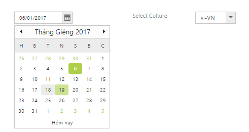

# Globalization

Globalization involves designing and developing a world-ready app that supports localized interfaces and regional data for users in multiple cultures. 

As developers, we all have assumptions about user interfaces and data that are formed by our cultures. For example, for an English-speaking developer in the United States, serializing date and time data as a string in the format MM/dd/yyyy hh:mm:ss seems perfectly reasonable. However, deserializing that string on a system in a different culture is likely to throw a [FormatException](https://msdn.microsoft.com/en-us/library/system.formatexception) exception or produce inaccurate data. Globalization enables us to identify such culture-specific assumptions and ensure that they do not affect our app's design or code.

Globalization is a combination of localization and internationalization. so we have achieved with locale property of Syncfusion components.

More than 350 culture specific files are available to localize the date. To know more about EJ globalization support, please refer EJ globalize support

EJWEB DatePicker has been provided with Built-in localization support, so that it will be able adapt based on culture specific locale defined for it.

To translate DatePicker content from default English to any of the culture, for an example - German language, then you need to refer the ej.culture.de-DE.min.js file in your application. Let see a simple example. 

DatePicker control has been rendered in “en-US” and DatePicker control content will be translated to the following cultures en-US, vi-VN and fr-FR.



    <ej:DatePicker ID="datelocalization" Value="05/28/2016" Locale="en-US" ButtonText="Today" HeaderFormat="MMMM yyyy" runat="server"></ej:DatePicker>



Rendered the DropDownList to showcase the different cultures as follows



    <ej:DropDownList runat="server" ID="culture" TargetID="culturelist" ClientSideOnChange="onChange" Width="100px" SelectedItemIndex="0"></ej:DropDownList>
    

        <ul>
            <li>en-US</li>
            <li>vi-VN</li>
            <li>fr-FR</li>
        </ul>
    



Upon changing the cultures in DropDownList, the DatePicker control will be reflected based on the option in DropDownList.



    



N> Sever Culture-specific script files are available in the below specified location. For all other culture files, please download from the GitHub location.
N> <installed location>\ Syncfusion\Essential Studio\13.1.0.21\JavaScript\assets\external\cultures\minified 
N> For example, If you have installed the Essential Studio package within C:\Program Files (x86), then navigate to the below location,
N> C:\Program Files (x86)\Syncfusion\Essential Studio\13.1.0.21\JavaScript\assets\external\cultures\minified

Copy the required file globalize.culture.fr-FR.min.js into the Scripts folder of your application and then refer it along with the other script and css references in the head section of Site.Master page as shown below,



    

    

    



