---
layout: post
title: Columns with Grid widget for Syncfusion Essential ASP.NET
description: How to define the columns and its features
platform: aspnet
control: Grid
documentation: ug
--- 
# Columns

Column definitions are used as the `DataSource` schema in Grid and it plays vital role in rendering column values in required format. Grid operations such as sorting, filtering, editing would be performed based on the column definitions. The [`Field`] property of the [`Columns`] is necessary to map the datasource values in Grid columns.

N> 1. If the column with `Field` is not in the datasource, then the column values will be displayed as empty.
N> 2. If the `Field` name contains "dot" operator then it is considered as complex binding.

## Auto generation

The `Columns` are automatically generated when `Columns` declaration is empty or undefined while initializing the Grid. Also, all the columns which are in [`DataSource`] are bound as a Grid columns.

The following code example shows auto-generate columns behavior.



  	<asp:Content ID="BodyContent" ContentPlaceHolderID="MainContent" runat="server">
       <ej:Grid id="FlatGrid"  runat="server"  allowpaging="True">
     </ej:Grid>
   </asp:Content>          


   namespace WebSampleBrowser.Grid
   {
    public partial class _Default : Page
    {
        List<Orders> order = new List<Orders>();
        protected void Page_Load(object sender, EventArgs e)
        {
           BindDataSource();
		}
		 private void BindDataSource()
        {
               int orderId = 10643;
                int empId = 0;
                for (int i = 1; i < 9; i++)
                {
                    order.Add(new Orders(orderId + 1, empId + 1,"Reims", 32.38, "Germany"));
                    order.Add(new Orders(orderId + 2, empId + 2,"Munster", 11.61, "Mexico"));
                    order.Add(new Orders(orderId + 3, empId + 3,"Rio de janerio" , 45.34,  "Mexico"));
                    order.Add(new Orders(orderId + 4, empId + 4,"Lyon",37.28,  "UK"));
                    order.Add(new Orders(orderId + 5, empId + 5,"Bern", 67.00,  "Sweden"));
                    order.Add(new Orders(orderId + 6, empId + 6,"Graz", 23.32,  "France"));
                    orderId += 6;
                    empId += 6;
                }
            this.FlatGrid.DataSource = order;
            this.FlatGrid.DataBind();
        }
        [Serializable]
        public class Orders
        {
            public Orders()
            {

            }
            public Orders(int orderId,  int empId, string shipCity,double freight,  string shipCountry)
            {
                this.OrderID = orderId;
                this.EmployeeID = empId;
                this.ShipCity = shipCity;
                this.ShipCountry = shipCountry;
                this.Freight = freight;
            }
            public int OrderID { get; set; }
            public int EmployeeID { get; set; }
            public string ShipCity { get; set; }
            public string ShipCountry { get; set; }
            public double Freight { get; set; }
        }
    }
}

  

The following output is displayed as a result of the above code example.

### How to set isPrimaryKey for auto generated columns when editing is enabled:

Using `DataBound` event, you can set `IsPrimaryKey` value as `True` by two ways. The following code example demonstrates the above behavior.

1. If primary key "column index" is known then refer the following code example



<asp:Content ID="BodyContent" ContentPlaceHolderID="MainContent" runat="server">
    <ej:Grid ID="FlatGrid" runat="server" AllowPaging="True" >
       <ClientSideEvents Databound="dataBound" />
       <EditSettings AllowEditing="True"></EditSettings>
    </ej:Grid>
</asp:Content>


     


namespace WebSampleBrowser.Grid
{
    public partial class _Default : Page
    {
         protected void Page_Load(object sender, EventArgs e)
        {
            var data = new NorthWndDataContext().Orders.ToList();
            FlatGrid.DataSource = data;
            FlatGrid.DataBind();
        }
    }
}

 

2. If primary key "column field name" is known then refer the following code example


<asp:Content ID="BodyContent" ContentPlaceHolderID="MainContent" runat="server">
    <ej:Grid ID="FlatGrid" runat="server" AllowPaging="True" >
       <ClientSideEvents Databound="dataBound" />
        <EditSettings AllowEditing="True"></EditSettings>
    </ej:Grid>
</asp:Content>


     


namespace WebSampleBrowser.Grid
{
    public partial class _Default : Page
    {
        protected void Page_Load(object sender, EventArgs e)
        {
            var data = new NorthWndDataContext().Orders.ToList();
            FlatGrid.DataSource = data;
            FlatGrid.DataBind();
        }   
    }
}

 

## Headers

### HeaderText

It represents the title for particular column. To enable header text, set `HeaderText` property of `Columns`. The following code example describes the above behavior.

N> If `HeaderText` is not defined then the `Field` name is considered as header text for that particular column. If both `Field` name and `HeaderText` are not defined then the column is rendered with "empty" header text.

The following code example describes the above behavior.




<asp:Content ID="BodyContent" ContentPlaceHolderID="MainContent" runat="server">
    <ej:Grid ID="FlatGrid" runat="server" AllowPaging="True">
        <Columns>
            <ej:Column Field="OrderID" HeaderText="Order ID" />
            <ej:Column Field="EmployeeID" HeaderText="Emp ID" />
            <ej:Column Field="Freight" HeaderText="Freight" />
            <ej:Column Field="ShipCountry" HeaderText="Country" />
            <ej:Column Field="ShipCity" HeaderText="City" />
        </Columns>
    </ej:Grid>
</asp:Content>       


namespace WebSampleBrowser.Grid
{
    public partial class _Default : Page
    {
        protected void Page_Load(object sender, EventArgs e)
        {
            var data = new NorthWndDataContext().Orders.ToList();
            FlatGrid.DataSource = data;
            FlatGrid.DataBind();
        }
    }
}

  

The following output is displayed as a result of the above code example.

### Header Text alignment

`Align` the header text of column header using `HeaderTextAlign` property of `columns`. There are four possible ways to align header text, they are

1. Right
2. Left
3. Center
4. Justify

N> For `HeaderTextAlign` property you can assign either `string` value ("Right") or `enum` value (`ej.TextAlign.Right`).

The following code example describes the above behavior.



<asp:Content ID="BodyContent" ContentPlaceHolderID="MainContent" runat="server">
    <ej:Grid ID="FlatGrid" runat="server" AllowPaging="True">
        <Columns>
            <ej:Column Field="OrderID" HeaderText="Order ID" />
            <ej:Column Field="EmployeeID" HeaderText="Emp ID"  HeaderTextAlign = "Right" />
            <ej:Column Field="Freight" HeaderText="Freight"/>
            <ej:Column Field="ShipCountry" HeaderText="Country" HeaderTextAlign = "Center"/>
            <ej:Column Field="ShipCity" HeaderText="City"  HeaderTextAlign = "Right" />
        </Columns>
    </ej:Grid>
</asp:Content>


namespace WebSampleBrowser.Grid
{
    public partial class _Default : Page
    {
        protected void Page_Load(object sender, EventArgs e)
        {
            var data = new NorthWndDataContext().Orders.ToList();
            FlatGrid.DataSource = data;
            FlatGrid.DataBind();
        }
    }
}

  
The following output is displayed as a result of the above code example.

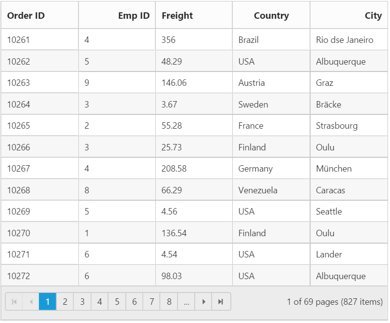

### Header Template

The template design that applies on for the column header. To render template, set `HeaderTemplateID` property of the `Columns`.

You can use JsRender syntax in the template. For more information about JsRender syntax, please refer [the link](http://www.jsviews.com/#jsrapi "the link").

N> It's a standard way to enclose the `Template` within the `script` tag with `type` as `text/x-jsrender`.

The following code example describes the above behavior.




<asp:Content ID="BodyContent" ContentPlaceHolderID="MainContent" runat="server">
    <ej:Grid ID="FlatGrid" runat="server" AllowPaging="True">
        <Columns>
            <ej:Column Field="OrderID" HeaderText="Order ID" />
            <ej:Column Field="EmployeeID" HeaderText="Emp ID" HeaderTemplateID="#empTemplate" />
            <ej:Column Field="Freight" HeaderText="Freight" />
            <ej:Column Field="ShipCountry" HeaderText="Country" />
            <ej:Column Field="ShipCity" HeaderText="City" />
        </Columns>
    </ej:Grid>
</asp:Content>        


            


namespace WebSampleBrowser.Grid
{
    public partial class _Default : Page
    {
        protected void Page_Load(object sender, EventArgs e)
        {
            var data = new NorthWndDataContext().Orders.ToList();
            FlatGrid.DataSource = data;
            FlatGrid.DataBind();
        }
    }
}

  

The following output is displayed as a result of the above code example.

## Text alignment

You can `Align` both content and header text of particular column using `TextAlign` property of `Columns`. There are four possible ways to align content and header text of column, they are 

1. Right
2. Left
3. Center
4. Justify

N> 1. For `TextAlign` property you can assign either `string` value ("Right") or `enum` value (`ej.TextAlign.Right`).
N> 2. The `TextAlign` property will affect both content and header text of the grid.

The following code example describes the above behavior.



<asp:Content ID="BodyContent" ContentPlaceHolderID="MainContent" runat="server">
    <ej:Grid ID="FlatGrid" runat="server" AllowPaging="True">
        <Columns>
            <ej:Column Field="OrderID" TextAlign="Right" />
            <ej:Column Field="EmployeeID" TextAlign="Right" />
            <ej:Column Field="Freight" TextAlign="Right" />
            <ej:Column Field="ShipCountry" TextAlign="Center" />
            <ej:Column Field="ShipCity" TextAlign="Justify" />
        </Columns>
    </ej:Grid>
</asp:Content>    


namespace WebSampleBrowser.Grid
{
    public partial class _Default : Page
    {
        protected void Page_Load(object sender, EventArgs e)
        {
            var data = new NorthWndDataContext().Orders.ToList();
            FlatGrid.DataSource = data;
            FlatGrid.DataBind();
        }
    }
}

 

The following output is displayed as a result of the above code example.

## Format

`Format` is the process of customizing the particular column data with specified jquery recognized globalize formats, such as currency, numeric, decimal, percentage or dates. The globalize format can be specified by using [`Format`] property of [`Columns`].

The `Format` value should be wrapped within "{0:" and "}". (For ex: "{0:C3}"). The [data format] strings are available for the Date and Number types.

The following code example describes the above behavior.




<asp:Content ID="BodyContent" ContentPlaceHolderID="MainContent" runat="server">
    <ej:Grid ID="FlatGrid" runat="server" AllowPaging="True">
        <Columns>
            <ej:Column Field="OrderID" />
            <ej:Column Field="EmployeeID" />
            <ej:Column Field="Freight" Format="{0:C2}" />
            <ej:Column Field="OrderDate"  Format="{0:dd/MM/yyyy}"/>
            <ej:Column Field="ShipCity"/>
        </Columns>
    </ej:Grid>
</asp:Content> 


namespace WebSampleBrowser.Grid
{
    public partial class _Default : Page
    {
        protected void Page_Load(object sender, EventArgs e)
        {
            var data = new NorthWndDataContext().Orders.ToList();
            FlatGrid.DataSource = data;
            FlatGrid.DataBind();
        }
    }
}

 

The following output is displayed as a result of the above code example.

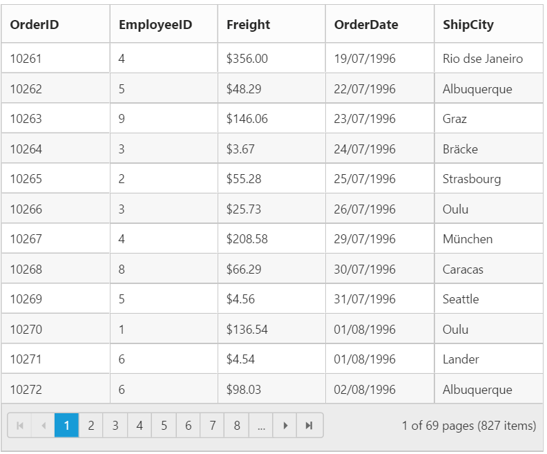

## Width

You can specify the width for particular column by setting `Width` property of `Columns` as in pixel (ex: 100) or in percentage (ex: 40%).

The following code example describes the above behavior.



<asp:Content ID="BodyContent" ContentPlaceHolderID="MainContent" runat="server">
    <ej:Grid ID="FlatGrid" runat="server" AllowPaging="True">
        <Columns>
            <ej:Column Field="OrderID" Width="10%" />
            <ej:Column Field="EmployeeID" Width="15%" />
            <ej:Column Field="Freight" Width="100" />
            <ej:Column Field="ShipCity" Width="150" />
            <ej:Column Field="ShipCountry" Width="100" />
        </Columns>
    </ej:Grid>
</asp:Content>


namespace WebSampleBrowser.Grid
{
    public partial class _Default : Page
    {
        protected void Page_Load(object sender, EventArgs e)
        {
            var data = new NorthWndDataContext().Orders.ToList();
            FlatGrid.DataSource = data;
            FlatGrid.DataBind();
        }
    }
}

 

The following output is displayed as a result of the above code example.

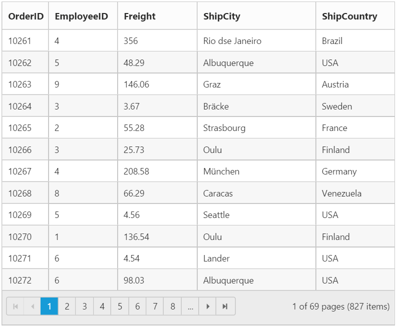

## Resize to fit 

The `AllowResizeToFit` property enable the Grid to set width to columns based on maximum width of the particular column's content to facilitate full visibility of data in all the grid rows. This automatic behavior is applicable only for the columns which does not have width specified. 

On columns where "width is defined", double click on the particular column header's resizer symbol to resize the column to show the whole text. For example, refer the "ShipCity" column in the below code snippet and output screen shot. 

The following code example describes the above behavior. 



<asp:Content ID="BodyContent" ContentPlaceHolderID="MainContent" runat="server">
    <ej:Grid ID="FlatGrid" runat="server" AllowPaging="True" AllowResizeToFit="True">
        <Columns>
            <ej:Column Field="OrderID" Width="100" />
            <ej:Column Field="EmployeeID" />
            <ej:Column Field="Freight" Width="75" />
            <ej:Column Field="ShipCity" Width="50" />
            <ej:Column Field="ShipAddress"  />
        </Columns>
    </ej:Grid>
</asp:Content>


namespace WebSampleBrowser.Grid
{
    public partial class _Default : Page
    {
        protected void Page_Load(object sender, EventArgs e)
        {
            var data = new NorthWndDataContext().Orders.ToList();
            FlatGrid.DataSource = data;
            FlatGrid.DataBind();
        }
    }
}

 

The following output is displayed as a result of the above code example.

## Auto wrap column

`AllowTextWrap` property enables the Grid to wrap cell content to next line when the content exceeds the boundary of the cell width. 

The following code example describes the above behavior.



<asp:Content ID="BodyContent" ContentPlaceHolderID="MainContent" runat="server">
    <ej:Grid ID="FlatGrid" runat="server" AllowPaging="True"  AllowTextWrap="True">
        <Columns>
                <ej:Column Field="OrderID"   Width="90" />
                <ej:Column Field="CustomerID" Width="100" />
                <ej:Column Field="EmployeeID" Width="100" />
                <ej:Column Field="Freight" Width="90"  />
                <ej:Column Field="ShipAddress"  Width="110" />
         </Columns>
     </ej:Grid>
</asp:Content>


namespace WebSampleBrowser.Grid
{
    public partial class _Default : Page
    {
        protected void Page_Load(object sender, EventArgs e)
        {
            var data = new NorthWndDataContext().Orders.ToList();
            FlatGrid.DataSource = data;
            FlatGrid.DataBind();
        }
    }
}

 

The following output is displayed as a result of the above code example.

## Reorder

Reordering can be done by drag and drop the particular column header from one index to another index within the Grid. Reordering can be enabled by setting [`AllowReordering`] property as `True`.

The following code example describes the above behavior.



</asp:Content>
<asp:Content ID="BodyContent" ContentPlaceHolderID="MainContent" runat="server">
    <ej:Grid ID="FlatGrid" runat="server" AllowPaging="True"  AllowReordering="True">
        <Columns>
            <ej:Column Field="OrderID" />
            <ej:Column Field="EmployeeID"  />
            <ej:Column Field="ShipCity" />
            <ej:Column Field="ShipCountry" />
            <ej:Column Field="Freight" />
        </Columns>
    </ej:Grid>
</asp:Content>


namespace WebSampleBrowser.Grid
{
    public partial class _Default : Page
    {
        protected void Page_Load(object sender, EventArgs e)
        {
            var data = new NorthWndDataContext().Orders.ToList();
            FlatGrid.DataSource = data;
            FlatGrid.DataBind();
        }
    }
}

 

The following output is displayed as a result of the above code example.

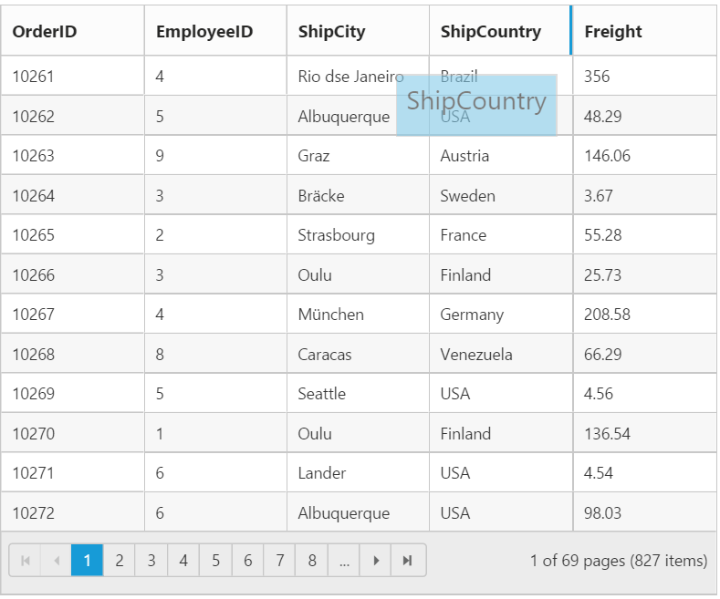

## Visibility

You can hide particular column in Grid view by setting `Visible` property of it as `False`.

The following code example describes the above behavior.



<asp:Content ID="BodyContent" ContentPlaceHolderID="MainContent" runat="server">
    <ej:Grid ID="FlatGrid" runat="server" AllowPaging="True">
        <Columns>
            <ej:Column Field="EmployeeID" />
            <ej:Column Field="OrderID" Visible="False" />
            <ej:Column Field="Freight" />
            <ej:Column Field="ShipCity" />
            <ej:Column Field="ShipCountry" />
         </Columns>
    </ej:Grid>
</asp:Content>


namespace WebSampleBrowser.Grid
{
    public partial class _Default : Page
    {
        protected void Page_Load(object sender, EventArgs e)
        {
            var data = new NorthWndDataContext().Orders.ToList();
            FlatGrid.DataSource = data;
            FlatGrid.DataBind();
        }
    }
}

 

The following output is displayed as a result of the above code example.

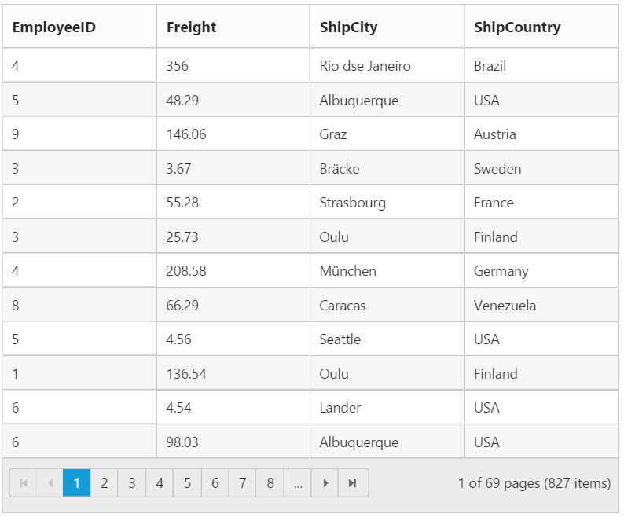

## Cell Merging

The Grid has options to merge the Grid cells based on the required conditions. This can be enabled by setting `AllowCellMerging` property as `true` and the merge conditions can be defined in `MergeCellInfo` event. In this event, you can get the column details and data of that particular row and column which is helpful in defining conditions. 

You can merge the rows and cells of grid, using `rowMerge`, `colMerge` and `merge` functions available in `MergeCellInfo` event's argument.

The following code example describes the above behavior.



<asp:Content ID="BodyContent" ContentPlaceHolderID="MainContent" runat="server">
    <ej:Grid ID="FlatGrid" runat="server" AllowPaging="True" AllowCellMerging="true">
        <ClientSideEvents MergeCellInfo="mergeCellInfo" />
        <Columns>
            <ej:Column Field="OrderID" />
            <ej:Column Field="EmployeeID" />
            <ej:Column Field="ShipCity" />
            <ej:Column Field="ShipCountry" />
            <ej:Column Field="Freight" />
        </Columns>
    </ej:Grid>
</asp:Content>


    


namespace WebSampleBrowser.Grid
{
    public partial class _Default : Page
    {
         protected void Page_Load(object sender, EventArgs e)
        {
            var data = new NorthWndDataContext().Orders.ToList();
            FlatGrid.DataSource = data;
            FlatGrid.DataBind();
        }
    }
}

 

The following output is displayed as a result of the above code example.

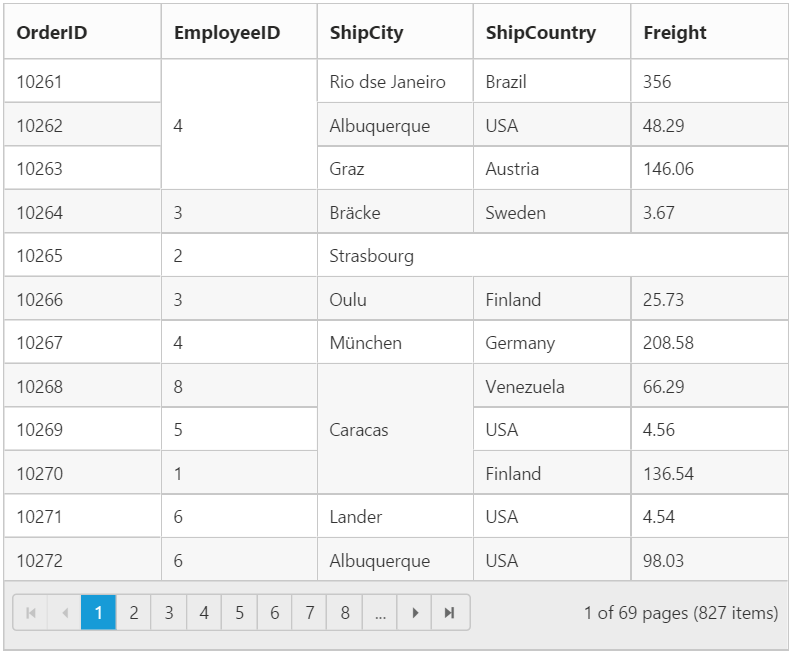

## Unbound Column

You can define the unbound columns in Grid by not defining `Field` property for that particular column. Value for these columns can be populated either manually using `queryCellInfo` event or by using column `template` or by column `format` property.

N> Editing, grouping, filtering, sorting, summary and searching support are not available for unbound columns.

The following code example describes the above behavior. 



<asp:Content ID="BodyContent" ContentPlaceHolderID="MainContent" runat="server">
    <ej:Grid ID="FlatGrid" runat="server" AllowPaging="True">
        <EditSettings AllowDeleting="True"></EditSettings>
        <Columns>
            <ej:Column Field="OrderID" IsPrimaryKey="True" />
            <ej:Column Field="CustomerID" />
            <ej:Column Field="EmployeeID" />
            <ej:Column Field="Freight" />
            <ej:Column HeaderText="" Format="<a onclick = clk(this) href=#>Delete</a>" />
        </Columns>
    </ej:Grid>
</asp:Content>

	
    


namespace WebSampleBrowser.Grid
{
    public partial class _Default : Page
    {
        protected void Page_Load(object sender, EventArgs e)
        {
            var data = new NorthWndDataContext().Orders.ToList();
            FlatGrid.DataSource = data;
            FlatGrid.DataBind();
        }
    }
}

 

The following output is displayed as a result of the above code example.

## Column Template

Html templates can be specified in the `Template` property of the particular column as a string (HTML element) or ID of the template's HTML element.

You can use JsRender syntax in the template. For more information about JsRender syntax, please refer [this link](http://www.jsviews.com/#jsrapi "this link"). 

N> If `Field` is not specified, you will not able to perform editing, grouping, filtering, sorting, search and summary functionalities in particular column.

The following code example describes the above behavior.



<asp:Content ID="BodyContent" ContentPlaceHolderID="MainContent" runat="server">
    <ej:Grid ID="FlatGrid" runat="server" AllowPaging="True">
        <PageSettings PageSize="4"></PageSettings>
        <Columns>
            <ej:Column HeaderText="Photo" Template="True" TemplateID="#columnTemplate" TextAlign="Center" />
            <ej:Column Field="EmployeeID" />
            <ej:Column Field="FirstName" />
            <ej:Column Field="LastName" />
            <ej:Column Field="Country" />
        </Columns>
    </ej:Grid>
</asp:Content>

	
    


namespace WebSampleBrowser.Grid
{
    public partial class _Default : Page
    {
        List<Orders> order = new List<Orders>();
        protected void Page_Load(object sender, EventArgs e)
        {
            BindDataSource();
        }
        private void BindDataSource()
        {
            order.Add(new Orders(1, "Nancy", "Davolio", "USA"));
            order.Add(new Orders(2, "Andrew", "Fuller", "USA"));
            order.Add(new Orders(3, "Janet", "Leverling", "USA"));
            order.Add(new Orders(4, "Margaret", "Peacock", "USA"));
            order.Add(new Orders(5, "Steven", "Buchanan", "UK"));
            order.Add(new Orders(6, "Michael", "Suyama", "UK"));
            order.Add(new Orders(7, "Robert", "King", "UK"));
            order.Add(new Orders(8, "Laura", "Callahan","USA"));
            this.FlatGrid.DataSource = order;
            this.FlatGrid.DataBind();
        }
        [Serializable]
        public class Orders
        {
            public Orders()
            {

            }
            public Orders(int EmployeeId, string FirstName, string LastName, string Country)
            {
                this.EmployeeID = EmployeeId;
                this.FirstName = FirstName;
                this.LastName = LastName;
                this.Country = Country;
            }
            public int EmployeeID { get; set; }
            public string FirstName { get; set; }
            public string LastName { get; set; }
            public string Country { get; set; }
        }
    }
}

 
The following output is displayed as a result of the above code example.

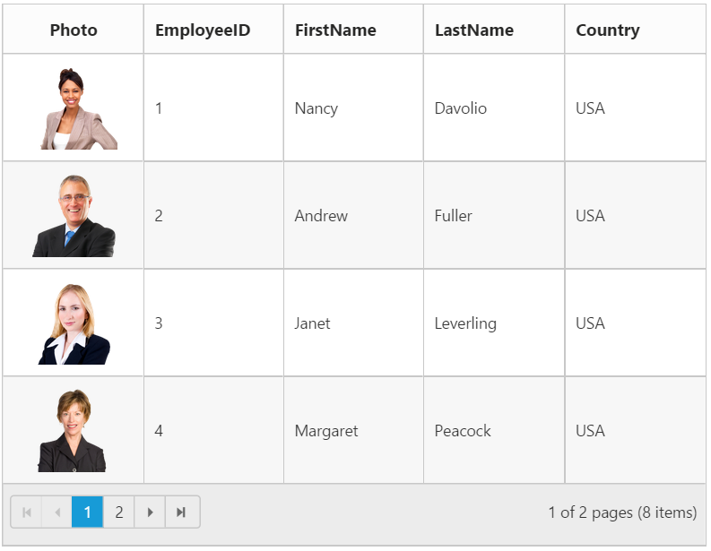

## Controlling Grid actions

You can control the Grid actions of a particular column by setting `AllowSorting`, `AllowGrouping`, `AllowFiltering`, `AllowResizing` and `AllowEditing` properties.

The following code example describes the above behavior.



<asp:Content ID="BodyContent" ContentPlaceHolderID="MainContent" runat="server">
    <ej:Grid ID="FlatGrid" runat="server" AllowPaging="True" AllowFiltering="true" AllowGrouping="true" AllowSorting="true" AllowResizing="true">
        <EditSettings AllowEditing="True"></EditSettings>
        <Columns>
            <ej:Column Field="OrderID" IsPrimaryKey="True" />
            <ej:Column Field="EmployeeID" AllowEditing="True" AllowGrouping="true" AllowFiltering="true" AllowSorting="true" AllowResizing="true" />
            <ej:Column Field="Freight" />
            <ej:Column Field="ShipCity" />
            <ej:Column Field="ShipCountry" />
        </Columns>
    </ej:Grid>
</asp:Content>


namespace WebSampleBrowser.Grid
{
    public partial class _Default : Page
    {
        protected void Page_Load(object sender, EventArgs e)
        {
            var data = new NorthWndDataContext().Orders.ToList();
            FlatGrid.DataSource = data;
            FlatGrid.DataBind();
        }
    }
}

 

## Read only

To make a column as "read-only" then set `AllowEditing` property of `Columns` as `False`.

The following code example describes the above behavior.



<asp:Content ID="BodyContent" ContentPlaceHolderID="MainContent" runat="server">
    <ej:Grid ID="FlatGrid" runat="server" AllowPaging="True">
        <EditSettings AllowEditing="True"></EditSettings>
        <Columns>
            <ej:Column Field="OrderID" IsPrimaryKey="True" />
            <ej:Column Field="EmployeeID" AllowEditing="False" />
            <ej:Column Field="Freight" />
            <ej:Column Field="ShipCity" />
            <ej:Column Field="ShipCountry" />
        </Columns>
    </ej:Grid>
</asp:Content>


namespace WebSampleBrowser.Grid
{
    public partial class _Default : Page
    {
        protected void Page_Load(object sender, EventArgs e)
        {
            var data = new NorthWndDataContext().Orders.ToList();
            FlatGrid.DataSource = data;
            FlatGrid.DataBind();
        }
    }
}

 

The following output is displayed as a result of the above code example.

## Expression Column

`Expression` column is possible only for `Template` column.

You can use JsRender syntax in the template.For more information about JsRender syntax, please refer [the link](http://www.jsviews.com/#jsrapi "the link"). 

N> This expression column is supported at read only mode.

The following code example describes the above behavior.



<asp:Content ID="BodyContent" ContentPlaceHolderID="MainContent" runat="server">
    <ej:Grid ID="FlatGrid" runat="server" AllowPaging="True">
        <EditSettings AllowEditing="True"></EditSettings>
        <Columns>
            <ej:Column Field="FoodName" />
            <ej:Column Field="Protein" />
            <ej:Column Field="Fat" />
            <ej:Column Field="Carbohydrate" />
            <ej:Column HeaderText="Calories In Take" Template="{{"{{"}}:Protein * 4  + Fat * 4 + Carbohydrate * 9 {{}}}}" />
        </Columns>
    </ej:Grid>
</asp:Content>


namespace WebSampleBrowser.Grid
{
    public partial class _Default : Page
    {
        List<Orders> order = new List<Orders>();
        protected void Page_Load(object sender, EventArgs e)
        {
            BindDataSource();
        }
        private void BindDataSource()
        {
            order.Add(new Orders("CHEESE BURGER", 15, 15, 28));
            order.Add(new Orders("PIZZA", 15, 9, 39));
            order.Add(new Orders("CHICKEN NOODLE", 4, 2, 9));
            order.Add(new Orders("YOGURT", 10, 2, 43));
            order.Add(new Orders("BEEF SANDWICH", 22, 13, 34));
            order.Add(new Orders("CHICKEN BURGER", 15, 10, 25));
            this.FlatGrid.DataSource = order;
            this.FlatGrid.DataBind();
        }
        [Serializable]
        public class Orders
        {
            public Orders()
            {

            }
            public Orders(string foodname, int protein, int fat, int carbohydrate)
            {
                this.FoodName = foodname;
                this.Protein = protein;
                this.Fat = fat;
                this.Carbohydrate = carbohydrate;
            }
            public string FoodName { get; set; }
            public int Protein { get; set; }
            public int Fat { get; set; }
            public int Carbohydrate { get; set; }

        }
    }
}

 

The following output is displayed as a result of the above code example.

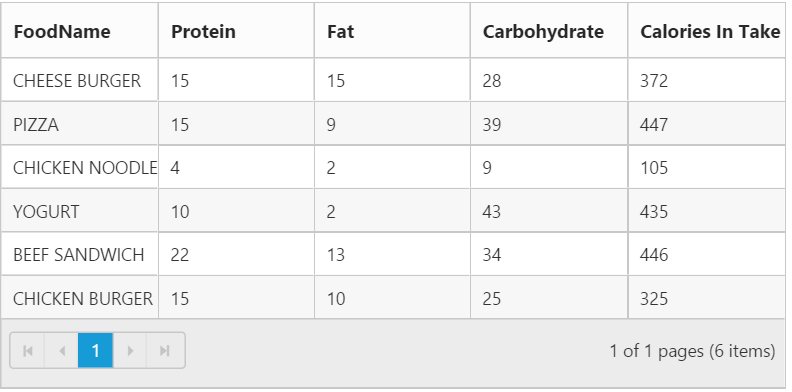

## Command Column

### Default action buttons

Using `Command` column, you can add CRUD action buttons as one of the Grid column, through `Type` property of `Commands`. The type property supports the below default `UnboundType` buttons.

1. Edit
2. Save
3. Delete
4. Cancel

Through `ButtonOptions` property of `Commands`, you can specify all the button options which are supported by Essential Studio JavaScript `Button` control. 

The following code example describes the above behavior.



<asp:Content ID="BodyContent" ContentPlaceHolderID="MainContent" runat="server">
    <ej:Grid ID="FlatGrid" runat="server" AllowPaging="True">
        <EditSettings AllowEditing="True" AllowAdding="True" AllowDeleting="True"></EditSettings>
        <Columns>
            <ej:Column Field="OrderID" IsPrimaryKey="True" />
            <ej:Column Field="EmployeeID" />
            <ej:Column Field="Freight" />
            <ej:Column Field="ShipCountry" />
            <ej:Column HeaderText="Manage Records" IsUnbound="True" Width="130">
                <Command>
                    <ej:Commands Type="edit">
                        <ButtonOptions Text="Edit"></ButtonOptions>
                    </ej:Commands>
                    <ej:Commands Type="delete">
                        <ButtonOptions Text="Delete"></ButtonOptions>
                    </ej:Commands>
                    <ej:Commands Type="save">
                        <ButtonOptions Text="Save"></ButtonOptions>
                    </ej:Commands>
                    <ej:Commands Type="cancel">
                        <ButtonOptions Text="Cancel"></ButtonOptions>
                    </ej:Commands>
                </Command>
            </ej:Column>
        </Columns>
    </ej:Grid>
</asp:Content>


namespace WebSampleBrowser.Grid
{
    public partial class _Default : Page
    {
        protected void Page_Load(object sender, EventArgs e)
        {
            var data = new NorthWndDataContext().Orders.ToList();
            FlatGrid.DataSource = data;
            FlatGrid.DataBind();
        }
    }
}

 
The following output is displayed as a result of the above code example.

### Custom buttons

You can add custom button in the command column by specifying the `Type` property of `commands` as "empty" or any other `string` which does not corresponds to default `UnboundType` buttons.

N> 1. For `Type` property you can assign either `string` value ("edit") or `enum` value (`ej.Grid.UnboundType.Edit`).
N> 2. In command column you can add only buttons.

The following code example describes the above behavior.



<asp:Content ID="BodyContent" ContentPlaceHolderID="MainContent" runat="server">
    <ej:Grid ID="FlatGrid" runat="server" AllowPaging="True">
        <EditSettings AllowEditing="True" AllowAdding="True" AllowDeleting="True"></EditSettings>
        <Columns>
            <ej:Column Field="EmployeeID" />
            <ej:Column HeaderText="Employee Details" IsUnbound="True" Width="130" TextAlign="Center">
                <Command>
                    <ej:Commands Type="detail">
                        <ButtonOptions Text="Details" Width="100" Click="onClick"></ButtonOptions>
                    </ej:Commands>
                </Command>
            </ej:Column>
        </Columns>
    </ej:Grid>
</asp:Content>


    


namespace WebSampleBrowser.Grid
{
    public partial class _Default : Page
    {
        protected void Page_Load(object sender, EventArgs e)
        {
            var data = new NorthWndDataContext().Orders.ToList();
            FlatGrid.DataSource = data;
            FlatGrid.DataBind();
        }
    }
}

 

The following output is displayed as a result of the above code example.

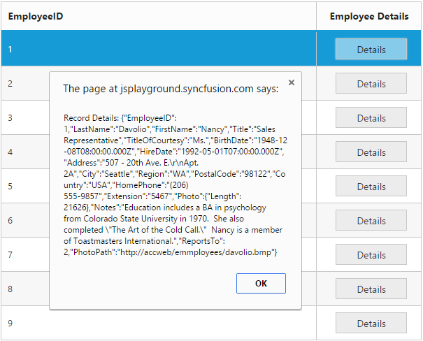

## Column Chooser

Column chooser contains the list of all the columns which are defined in the `Columns` property. Using this you can control the visibility of columns in Grid. You can prevent to show the particular column name in column chooser by setting `ShowInColumnChooser` property of `Columns` as `false`. 

Column Chooser would be shown in the top right corner of Grid. To enable column chooser, set `ShowColumnChooser` property as `True`. 

The following code example describes the above behavior.



<asp:Content ID="BodyContent" ContentPlaceHolderID="MainContent" runat="server">
    <ej:Grid ID="FlatGrid" runat="server" AllowPaging="True" ShowColumnChooser="true">
        <Columns>
            <ej:Column Field="OrderID" HeaderText="Order ID" />
            <ej:Column Field="EmployeeID" HeaderText="Employee Name" ShowInColumnChooser="false" />
            <ej:Column Field="Freight" HeaderText="Freight" />
            <ej:Column Field="ShipCity" HeaderText="Ship City" />
            <ej:Column Field="ShipCountry" HeaderText="Ship Country" />
        </Columns>
    </ej:Grid>
</asp:Content>


namespace WebSampleBrowser.Grid
{
    public partial class _Default : Page
    {
        protected void Page_Load(object sender, EventArgs e)
        {
            var data = new NorthWndDataContext().Orders.ToList();
            FlatGrid.DataSource = data;
            FlatGrid.DataBind();
        }
    }
}

 

The following output is displayed as a result of the above code example.

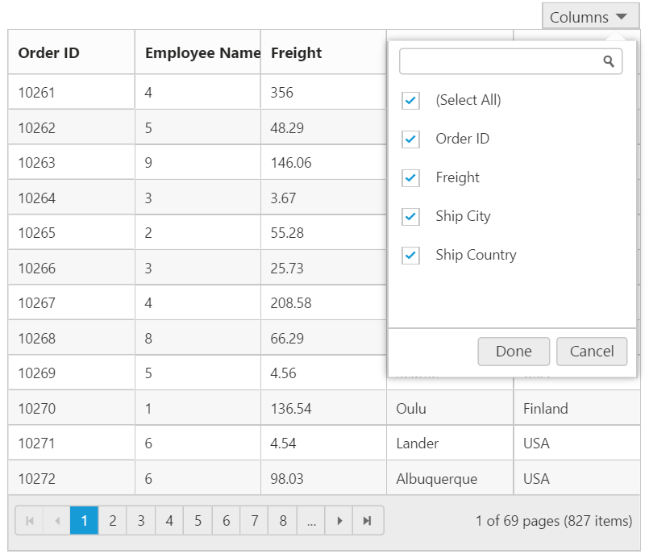

## Foreign Key Column

Lookup data source can be bound to `DataSource` property of `Columns`. Data `Field` and `Text` can be set using `ForeignKeyField` and `ForeignKeyValue` property of `Columns`.

I> For foreign key column the sorting and grouping is based on `ForeignKeyField` instead of `ForeignKeyValue`.

I> `ForeignKeyField` and `Field` key name must be same.

The following code example describes the above behavior.



<asp:Content ID="BodyContent" ContentPlaceHolderID="MainContent" runat="server">
    <ej:Grid ID="FlatGrid" runat="server" AllowPaging="True">
	  <EditSettings AllowEditing="True" AllowAdding="True" AllowDeleting="True"></EditSettings>
        <Columns>
            <ej:Column Field="OrderID" HeaderText="Order ID" />
            <ej:Column Field="EmployeeID" HeaderText="Employee Name" ForeignKeyField="EmployeeID"
                ForeignKeyValue="FirstName" TextAlign="Left" />
            <ej:Column Field="Freight" HeaderText="Freight" />
            <ej:Column Field="ShipCity" HeaderText="Ship City" />
            <ej:Column Field="ShipCountry" HeaderText="Ship Country" />
        </Columns>
    </ej:Grid>
</asp:Content>


namespace WebSampleBrowser.Grid
{
 public partial class _Default : Page
    {
        List<Orders> order = new List<Orders>();
        List<Employee> employee = new List<Employee>();
        protected void Page_Load(object sender, EventArgs e)
        {
            BindDataSource();
        }

        private void BindDataSource()
        {
            int code = 10000;
            for (int i = 1; i < 10; i++)
            {
                order.Add(new Orders(code + 1, "ALFKI", i + 2, 32.38, "Berlin", "Germany"));
                order.Add(new Orders(code + 2, "ANATR", i + 1, 11.61, "Madrid", "Spain"));
                order.Add(new Orders(code + 3, "ANTON", i + 4, 4.36, "Cholchester", "UK"));
                order.Add(new Orders(code + 4, "BLONP", i + 1, 52.3, "Marseille", "France"));
                order.Add(new Orders(code + 5, "BOLID", i + 3, 60.34, "Tsawassen", "Canada"));
                code += 3;
            }
            this.FlatGrid.DataSource = order;
            this.FlatGrid.DataBind();

            employee.Add(new Employee(4, "Michael"));
            employee.Add(new Employee(2, "Anne"));
            employee.Add(new Employee(3, "Janet"));
            employee.Add(new Employee(4, "Andrew"));
            employee.Add(new Employee(5, "Margaret"));
            employee.Add(new Employee(6, "Nancy"));
            employee.Add(new Employee(7, "Robert"));
            employee.Add(new Employee(8, "Laura"));
            employee.Add(new Employee(9, "Steven"));
            employee.Add(new Employee(10, "James"));
            employee.Add(new Employee(11, "Smith"));
            employee.Add(new Employee(12, "Jhonson"));
            employee.Add(new Employee(13, "George"));

            var index = this.FlatGrid.Columns.FindIndex(col => col.Field == "EmployeeID");
            this.FlatGrid.Columns.ElementAt(index).DataSource = employee;
        }

        [Serializable]
        public class Orders
        {
            public Orders()
            {

            }
            public Orders(long OrderId, string CustomerId, int EmployeeId, double Freight, string ShipCity, string ShipCountry)
            {
                this.OrderID = OrderId;
                this.CustomerID = CustomerId;
                this.EmployeeID = EmployeeId;
                this.Freight = Freight;
                this.ShipCity = ShipCity;
                this.ShipCountry = ShipCountry;
            }
            public long OrderID { get; set; }
            public string CustomerID { get; set; }
            public int EmployeeID { get; set; }
            public double Freight { get; set; }
            public string ShipCity { get; set; }
            public string ShipCountry { get; set; }
        }
        [Serializable]
        public class Employee
        {
            public Employee()
            {

            }
            public Employee(int EmployeeId, string FirstName)
            {
                this.EmployeeID = EmployeeId;
                this.FirstName = FirstName;
            }
            public int EmployeeID { get; set; }
            public string FirstName { get; set; }
        }
    }
}

 

The following output is displayed as a result of the above code example.

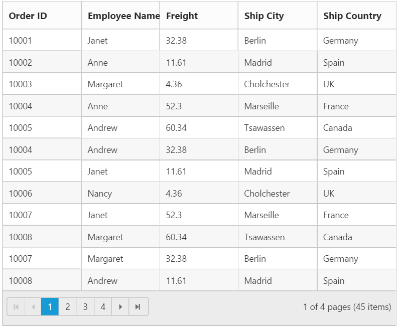

## Custom Attribute

You can add `Custom attribute` for particular column `td` element by using `CustomAttributes` property of the column.

Based on custom attribute you can customize the style and appearance of the `td` element or handling Jquery functionalities. 

You can use JsRender syntax in the template.For more information about JsRender syntax, please refer [the link](http://www.jsviews.com/#jsrapi "the link").

The following code example describes the above behavior.



<asp:Content ID="BodyContent" ContentPlaceHolderID="MainContent" runat="server">
    <ej:Grid ID="FlatGrid" runat="server" AllowPaging="True">
        <Columns>
            <ej:Column Field="OrderID" />
            <ej:Column Field="CustomerID" />
            <ej:Column Field="EmployeeID" HeaderText="Employee Name">
                <CustomAttribute>
                    <ej:KeyValue Key="employeeid" Value="''" />
                </CustomAttribute>
            </ej:Column>
            <ej:Column Field="ShipCity" />
            <ej:Column Field="ShipCountry" />
        </Columns>
    </ej:Grid>
</asp:Content>


  .e-rowcell[employeeid = "5"] {
            color: red;
        }	
    </style>


namespace WebSampleBrowser.Grid
{
    public partial class _Default : Page
    {
        protected void Page_Load(object sender, EventArgs e)
        {
            var data = new NorthWndDataContext().Orders.ToList();
            FlatGrid.DataSource = data;
            FlatGrid.DataBind();
        }
    }
}

 
The following output is displayed as a result of the above code example.

## Displaying HTML content

This will helps you to show actual `HTML` value in grid content and header. To disable html code, set `disableHtmlEncode` property of `Columns` as true. 

The following code example describes the above behavior.



<asp:Content ID="BodyContent" ContentPlaceHolderID="MainContent" runat="server">
    <ej:Grid ID="FlatGrid" runat="server" AllowPaging="True">
        <Columns>
            <ej:Column Field="OrderID" />
            <ej:Column Field="CustomerID" HeaderText="
Cust ID
" disableHtmlEncode="true"/>
            <ej:Column Field="EmployeeID" HeaderText="
Employee ID
" disableHtmlEncode="false"/>
            <ej:Column Field="ShipCountry" />
        </Columns>
    </ej:Grid>
</asp:Content>


namespace WebSampleBrowser.Grid
{
    public partial class _Default : Page
    {
        protected void Page_Load(object sender, EventArgs e)
        {
            var data = new NorthWndDataContext().Orders.ToList();
            FlatGrid.DataSource = data;
            FlatGrid.DataBind();
        }
    }
}

 
The following output is displayed as a result of the above code example.

## Customize column

You can `Customize` the header and content of the particular column by `CssClass` property of the column.

The following code example describes the above behavior.



    


<asp:Content ID="BodyContent" ContentPlaceHolderID="MainContent" runat="server">
    <ej:Grid ID="FlatGrid" runat="server" AllowPaging="True">
        <Columns>
            <ej:Column Field="OrderID" />
            <ej:Column Field="CustomerID" />
            <ej:Column Field="EmployeeID" CssClass="customcss" />
            <ej:Column Field="Freight" />
        </Columns>
    </ej:Grid>
</asp:Content>


namespace WebSampleBrowser.Grid
{
    public partial class _Default : Page
    {
       protected void Page_Load(object sender, EventArgs e)
        {
            var data = new NorthWndDataContext().Orders.ToList();
            FlatGrid.DataSource = data;
            FlatGrid.DataBind();
        }
    }
}

 

The following output is displayed as a result of the above code example.

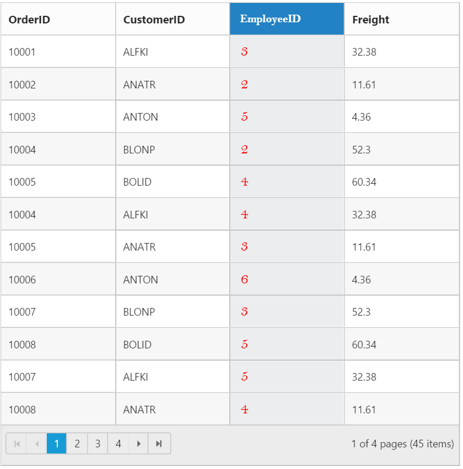

## Type

Used to define the type of the particular column data. If the `Type` property of `Columns` is not specified then its type is automatically defined based on the first row data of that column.

N> The `Type` is needed for filtering feature when first row of the data is "null" or "empty".

The following code example describes the above behavior.



<asp:Content ID="BodyContent" ContentPlaceHolderID="MainContent" runat="server">
    <ej:Grid ID="FlatGrid" runat="server" AllowPaging="True">
        <Columns>
            <ej:Column Field="OrderID" />
            <ej:Column Field="CustomerID" Type="string" />
            <ej:Column Field="EmployeeID" Type="number" />
            <ej:Column Field="Freight" />
            <ej:Column Field="ShipCountry" />
        </Columns>
    </ej:Grid>
</asp:Content>


namespace WebSampleBrowser.Grid
{
    public partial class _Default : Page
    {
       protected void Page_Load(object sender, EventArgs e)
        {
            var data = new NorthWndDataContext().Orders.ToList();
            FlatGrid.DataSource = data;
            FlatGrid.DataBind();
        }
    }
}

 

The following output is displayed as a result of the above code example.

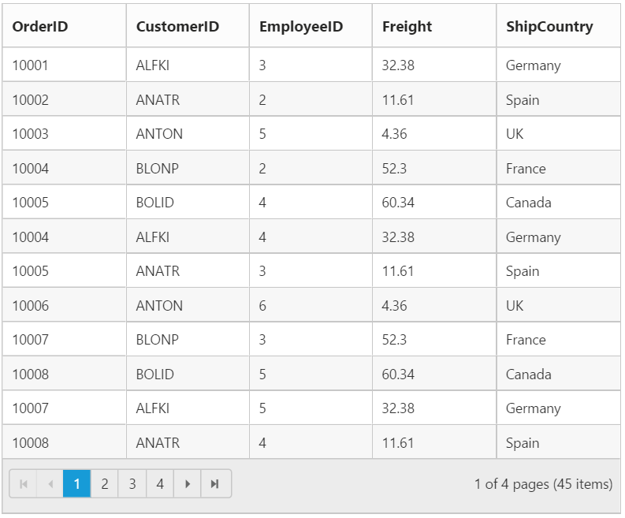

