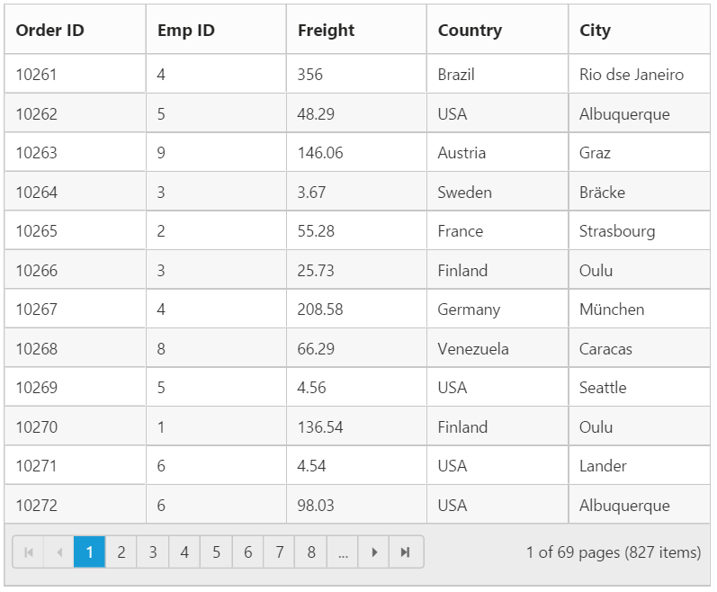
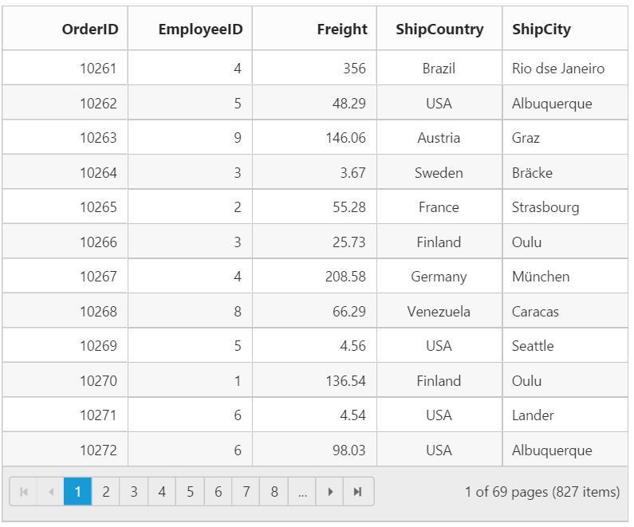
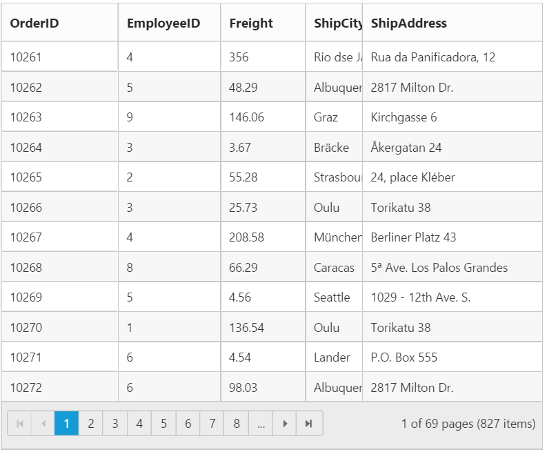
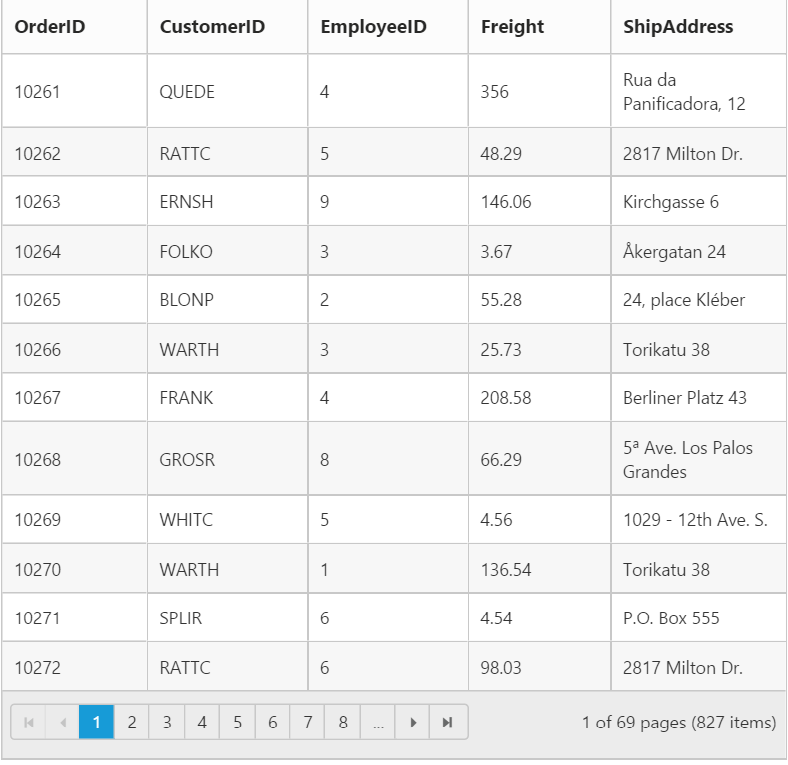
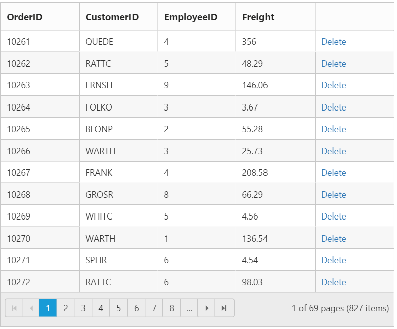

# Columns

Colums are a key feature in Grid to define schema in a control based on datasource. It is useful to map field to datasource values.

## Formatting

Formatting is used to convert data values to human readable formats using specific culture settings. In Grid, you have an option to format a particular column through the Format property. For more details about globalize.js, refer to the link ([https://github.com/jquery/globalize](https://github.com/jquery/globalize)). The following code example shows you how to use formatting in Grid.


[ASP]

[aspx]

  &lt;ej:Grid ID="FormatGrid" runat="server"&gt;

      &lt;Columns&gt;

            &lt;ej:Column Field="Number" HeaderText="Number" Format="{0:n2}" TextAlign="Right" Width="110" /&gt;

            &lt;ej:Column Field="Currency" HeaderText="Currency" Format="{0:c2}" TextAlign="Right" Width="110" /&gt;

            &lt;ej:Column Field="Date" HeaderText="Date" Format="{0:MM/dd/yyyy}" TextAlign="Right" Width="110" /&gt;

        &lt;/Columns&gt;

    &lt;/ej:Grid&gt;



[cs]

  public partial class ColumnFormatting : System.Web.UI.Page

    {

        List<Orders> order = new List<Orders>();

        protected void Page_Load(object sender, EventArgs e)

        {

            BindDataSource();

        }

        private void BindDataSource()

        {

            order.Add(new Orders(3233333.233876, 3500044, DateTime.Today));

            order.Add(new Orders(16166662, 175002, DateTime.Today));

            order.Add(new Orders(107777774,1166681,DateTime.Today));

            order.Add(new Orders(80833331, 875011, DateTime.Today));

            order.Add(new Orders(64666665, 700008, DateTime.Today));

            order.Add(new Orders(53888887, 583340, DateTime.Today));

            order.Add(new Orders(46190475, 500006, DateTime.Today));

            order.Add(new Orders(40416665, 437505, DateTime.Today));

            order.Add(new Orders(35925925, 388893, DateTime.Today));

            this.FormatGrid.DataSource = order;

            this.FormatGrid.DataBind();

        }

        [Serializable]

        public class Orders

        {

            public Orders()

            {

            }

            public Orders(double Number, long Currency, DateTime Date)

            {

                this.Number = Number;

                this.Currency = Currency;

                this.Date = Date;

            }

            public double Number { get; set; }

            public long Currency { get; set; }

            public DateTime Date { get; set; }

        }

    }



The following is the result of column formatting.

{:.image }

## Template

A Template is used to render a specific template to a particular column using Template and TemplateID property. These columns are not bound to Grid.

[ASP]

[aspx]

&lt;asp:Content ID="ControlContent" runat="server" ContentPlaceHolderID="ControlsSection"&gt;

    &lt;div&gt;

        &lt;ej:Grid ID="EmployeesGrid" runat="server" AllowPaging="True"&gt;

            &lt;PageSettings PageSize="4"&gt;&lt;/PageSettings&gt;

            &lt;Columns&gt;

                &lt;ej:Column HeaderText="Employee Image" Template="True" TemplateID="#columnTemplate" TextAlign="Center" Width="110" /&gt;

                &lt;ej:Column Field="EmployeeID" HeaderText="Employee ID" IsPrimaryKey="True" TextAlign="Right" Width="100" /&gt;

                &lt;ej:Column Field="FirstName" HeaderText="First Name" Width="100" /&gt;

                &lt;ej:Column Field="LastName" HeaderText="Last Name" Width="100" /&gt;

                &lt;ej:Column Field="BirthDate" HeaderText="Birth Date" TextAlign="Right" Width="100" Format="{0:MM/dd/yyyy}" /&gt;

                &lt;ej:Column Field="Country" Width="100" HeaderText="Country" /&gt;

            &lt;/Columns&gt;

        &lt;/ej:Grid&gt;

    &lt;/div&gt;

&lt;/asp:Content&gt;

&lt;asp:Content ID="ScriptContent" runat="server" ContentPlaceHolderID="ScriptSection"&gt;

    &lt;script type="text/x-jsrender" id="columnTemplate"&gt;

     &lt;img style="width: 75px; height: 70px" src="../Content/images/Employees/{{:EmployeeID}}.png" alt="{{ : EmployeeID }}" /&gt;

    &lt;/script&gt;

&lt;/asp:Content&gt;


[cs]

  public partial class ColumnTemplate : System.Web.UI.Page

    {

        List<Orders> order = new List<Orders>();

        protected void Page_Load(object sender, EventArgs e)

        {

            BindDataSource();

        }

        private void BindDataSource()

        {

            order.Add(new Orders(1, "Nancy", "Davolio", new DateTime(1948, 12, 08), "USA"));

            order.Add(new Orders(2, "Andrew", "Fuller", new DateTime(1952, 02, 19), "USA"));

            order.Add(new Orders(3, "Janet", "Leverling", new DateTime(1963, 08, 30), "USA"));

            order.Add(new Orders(4, "Margaret", "Peacock", new DateTime(1937, 09, 19), "USA"));

            order.Add(new Orders(5, "Steven", "Buchanan", new DateTime(1955, 03, 04), "UK"));

            order.Add(new Orders(6, "Michael", "Suyama", new DateTime(1963, 07, 02), "UK"));

            order.Add(new Orders(7, "Robert", "King", new DateTime(1960, 05, 29), "UK"));

            order.Add(new Orders(8, "Laura", "Callahan", new DateTime(1958, 01, 09), "USA"));

            this.EmployeesGrid.DataSource = order;

            this.EmployeesGrid.DataBind();

        }

        [Serializable]

        public class Orders

        {

            public Orders()

            {

            }

            public Orders(int EmployeeId, string FirstName, string LastName, DateTime BirthDate, string Country)

            {

                this.EmployeeID = EmployeeId;

                this.FirstName = FirstName;

                this.LastName = LastName;

                this.BirthDate = BirthDate;

                this.Country = Country;

            }

            public int EmployeeID { get; set; }

            public string FirstName { get; set; }

            public string LastName { get; set; }

            public DateTime BirthDate { get; set; }

            public string Country { get; set; }

        }

    }



The following output is displayed as a result of the above code example.

 
{:.image }

## Custom Attribute

Custom attribute is a powerful feature of Columns. This is used to modify the styles and appearance of a particular column. Using CustomAttribute property of Columns to achieve custom attribute feature.

[ASP]

 [aspx]

&lt;style&gt;

        .e-rowcell[employeeid = "5"] {

            color: red;

        }	

&lt;/style&gt;

  &lt;ej:Grid ID="OrdersGrid" runat="server" AllowFiltering="True" AllowPaging="True"&gt;

&lt;DataManager URL="http://mvc.syncfusion.com/Services/Northwnd.svc/Orders/"&gt;&lt;/DataManager&gt;

        &lt;Columns&gt;

            &lt;ej:Column Field="OrderID" HeaderText="Order ID" IsPrimaryKey="true" TextAlign="Right" Width="90" /&gt;

            &lt;ej:Column Field="CustomerID" HeaderText="Customer ID" Width="100" /&gt;

            &lt;ej:Column Field="EmployeeID" HeaderText="Employee ID" TextAlign="Right" Width="110"&gt;

&lt;CustomAttribute &gt;

                     &lt;ej:KeyValue Key="employeeid" Value="'{{:EmployeeID}}'" /&gt;

                &lt;/CustomAttribute&gt;

            &lt;/ej:Column&gt;

            &lt;ej:Column Field="OrderDate" HeaderText="Order Date" Width="100" TextAlign="Right" Format="{0:MM/dd/yyyy}" /&gt;

            &lt;ej:Column Field="ShipCity" HeaderText="Ship Country" Width="100" /&gt;

        &lt;/Columns&gt;

        &lt;FilterSettings FilterBarMode="OnEnter" ShowFilterBarStatus="True" StatusBarWidth="300"&gt;&lt;/FilterSettings&gt;

    &lt;/ej:Grid&gt; 



The following output is displayed as a result of the above code example.

{:.image }

## Read only

AllowEditing enables you to edit a column, but it prevents the fields from showing it as editable. If you want to make a column as read-only then set AllowEditing as False for that column. The following code example shows Essential Javascript column as read-only.

[ASP]

[aspx]

&lt;ej:Grid ID="OrdersGrid" runat="server" AllowPaging="True"&gt;

&lt;DataManager URL="http://mvc.syncfusion.com/Services/Northwnd.svc/Orders/"&gt;&lt;/DataManager&gt;

&lt;PageSettings PageSize="5" /&gt;

            &lt;Columns&gt;

                &lt;ej:Column Field="OrderID" HeaderText="Order ID" IsPrimaryKey="True" TextAlign="Right" Width="90" /&gt;

                <ej:Column Field="CustomerID" AllowEditing="false" HeaderText="Customer ID"

Width="90" />

                &lt;ej:Column Field="EmployeeID" HeaderText="Employee ID" TextAlign="Right" Width="75" /&gt;

                &lt;ej:Column Field="Freight" HeaderText="Freight" TextAlign="Right" Width="75" Format="{0:C}" /&gt;

             &lt;/Columns&gt;

            &lt;EditSettings AllowEditing="True" AllowAdding="True" AllowDeleting="True"&gt;                           &lt;/EditSettings&gt;

        &lt;/ej:Grid&gt;



The following output is displayed as a result of the above code example.

 
{:.image }

## Controlling Grid actions

In Grid, you can control Grid actions through AllowSorting, AllowGrouping, AllowFiltering. The following code example shows you how to disable a particular column. The following example has controlled grouping action in CustomerID column, filtering in EmployeeID column and sorting in Freight column.

[ASP]

[aspx]

  &lt;ej:Grid ID="OrdersGrid" runat="server" AllowPaging="True" AllowFiltering="true" AllowSorting="true" AllowGrouping="true"&gt;

 &lt;DataManager URL="http://mvc.syncfusion.com/Services/Northwnd.svc/Orders/"&gt;&lt;/DataManager&gt;

            &lt;PageSettings PageSize="5" /&gt;

            &lt;GroupSettings GroupedColumns="OrderID" /&gt;

            &lt;Columns&gt;

                &lt;ej:Column Field="OrderID" HeaderText="Order ID" IsPrimaryKey="True" TextAlign="Right" Width="90" /&gt;

                &lt;ej:Column Field="CustomerID" AllowGrouping="false" HeaderText="Customer ID" Width="90" /&gt;

                &lt;ej:Column Field="EmployeeID" AllowFiltering="false" HeaderText="Employee ID" TextAlign="Right" Width="75" /&gt;

                &lt;ej:Column Field="Freight" AllowSorting="false" HeaderText="Freight" TextAlign="Right" Width="75" Format="{0:C}" /&gt;

            &lt;/Columns&gt;

        &lt;/ej:Grid&gt;


The following output is displayed as a result of the above code example.

 
{:.image }

## Auto-generate column

The columns are automatically generated from the datasource and you do not need specific column declarations. The following code example shows auto-generate column behavior with Grid.

[ASP]

[aspx]

&lt;div&gt;

        &lt;ej:Grid ID="OrdersGrid" runat="server" AllowPaging="True"&gt;

            &lt;PageSettings PageSize="5" /&gt;

        &lt;/ej:Grid&gt;

&lt;/div&gt;



[cs]

namespace WebSampleBrowser.Grid

{

    public partial class DefaultFunctionalities : System.Web.UI.Page

    {

         protected void Page_Load(object sender, EventArgs e)

          {

             var DataSource = OrderRepository.GetAllRecords().ToList();

            OrdersGrid.datasource = DataSource;

            OrdersGrid.DataBind();

           } 

    }

}



The following output is displayed as a result of the above code example.

{:.image }

## Foreign key columns

Foreign key is a field in relational table. It matches the specific key columns of another table. Foreign key column feature can be achived using ForeignKeyField and FoeriegnKeyValue property of Columns.

[ASP]

[aspx]

&lt;ej:Grid ID="OrdersGrid" runat="server" AllowPaging="True" &gt;

            &lt;Columns&gt;

                &lt;ej:Column Field="OrderID" HeaderText="Order ID" IsPrimaryKey="True" TextAlign="Right" Width="90" /&gt;

                <ej:Column Field="EmployeeID" HeaderText="Employee Name" ForeignKeyField="EmployeeID"

ForeignKeyValue="FirstName" TextAlign="Left" Width="90" />

                &lt;ej:Column Field="Freight" AllowSorting="false" HeaderText="Freight" TextAlign="Right" Width="75" Format="{0:C}" /&gt;   

                 &lt;ej:Column Field="ShipCity" HeaderText="Ship City" Width="80" /&gt;

            &lt;/Columns&gt;

        &lt;/ej:Grid&gt;



[cs]

    public partial class ForeignKeyColumn : System.Web.UI.Page

    {

        List<Orders> order = new List<Orders>();

        List<Employee> employee = new List<Employee>(); 

        protected void Page_Load(object sender, EventArgs e)

        {

            BindDataSource();

        }

        private void BindDataSource()

        {

            int code = 10000;

            for (int i = 1; i < 35; i++)

            {

                order.Add(new Orders(code + 1, i + 2, 2.3 * i, "Berlin"));

                order.Add(new Orders(code + 2, i + 0, 3.3 * i, "Madrid"));

                order.Add(new Orders(code + 3, i + 4, 4.3 * i, "Cholchester"));

                order.Add(new Orders(code + 4, i + 1, 5.3 * i, "Marseille"));

                order.Add(new Orders(code + 5, i + 3, 6.3 * i, "Tsawassen"));

                code += 5;

            }

            this.OrdersGrid.DataSource = order;

            this.OrdersGrid.DataBind();

                employee.Add(new Employee(1, "Michael"));

                employee.Add(new Employee(2, "Anne"));

                employee.Add(new Employee(3, "Janet"));

                employee.Add(new Employee(4, "Andrew"));

                employee.Add(new Employee(5, "Margaret"));

                employee.Add(new Employee(6, "Nancy"));

                employee.Add(new Employee(7, "Robert"));

                employee.Add(new Employee(8, "Laura"));

                employee.Add(new Employee(9, "Steven"));

                employee.Add(new Employee(10, "James"));

                employee.Add(new Employee(11, "Smith"));

                employee.Add(new Employee(12, "Jhonson"));

                employee.Add(new Employee(13, "George"));

            var index = this.OrdersGrid.Columns.FindIndex(col => col.Field == "EmployeeID");

            this.OrdersGrid.Columns.ElementAt(index).DataSource = employee;

        }

        [Serializable]

        public class Orders

        {

            public Orders()

            {

            }

            public Orders(long OrderId, int EmployeeId, double Freight, string ShipCity)

            {

                this.OrderID = OrderId;                

                this.EmployeeID = EmployeeId;

                this.Freight = Freight;

                this.ShipCity = ShipCity;

            }

            public long OrderID { get; set; }            

            public int EmployeeID { get; set; }

            public double Freight { get; set; }

            public string ShipCity { get; set; }            

        }

        [Serializable]

        public class Employee

        {

            public Employee()

            {

            }

            public Employee(int EmployeeId, string FirstName)

            {

                this.EmployeeID = EmployeeId;

                this.FirstName = FirstName;

            }

            public int EmployeeID { get; set; }

            public string FirstName { get; set; }

        }

    }



The following output is displayed as a result of the above code example.

{:.image }

## Cell Merging

Cell merging feature enables to merge cells based on your requirement. The following code example illustrates Cell Merging. Using AllowCellMerging propertyand MergeCellInfo event to achieve cell merging feature.

[ASP.NET]

    &lt;div&gt;

        &lt;ej:Grid ID="OrdersGrid" runat="server" AllowScrolling="True" AllowCellMerging="True" &gt;

&lt;ClientSideEvents MergeCellInfo ="cellmerge" /&gt;

            &lt;Columns&gt;

                &lt;ej:Column Field="OrderID" HeaderText="Order ID" TextAlign="Right" Width="90"   /&gt;

                &lt;ej:Column Field="EmployeeID" HeaderText="Employee ID" TextAlign="Right"  Width="100" /&gt;

&lt;ej:Column Field="ShipCity" HeaderText="Ship City" Width="110"  /&gt;

&lt;ej:Column Field="ShipName" HeaderText="Ship Name" Width="80" /&gt;

                &lt;ej:Column Field="Freight" HeaderText="Freight " TextAlign="Right" Width="90"  /&gt; 

            &lt;/Columns&gt;

        &lt;/ej:Grid&gt;

    &lt;/div&gt;

&lt;script type="text/javascript"&gt;

    function cellmerge(args) {

                       if (args.column.field == "EmployeeID" && args.data.OrderID == 10248) {

                           args.rowMerge(3);

                       }

                       else if (args.column.field == "ShipCity" && args.data.OrderID == 10252) {

                           args.colMerge(3);

                       }

                       else if (args.column.field == "ShipCity" && args.data.OrderID == 10255) {

                           args.merge(0, 3);

                       }

    	}

&lt;/script&gt;



[ASP.NET CS]

using System;

using System.Collections.Generic;

using System.Linq;

using System.Web;

using System.Web.UI;

using System.Web.UI.WebControls;

namespace WebSampleBrowser.Grid

{

    public partial class CellMerging: System.Web.UI.Page

    {

        List<Orders> order = new List<Orders>();

        protected void Page_Load(object sender, EventArgs e)

        {

            BindDataSource();

        }

        private void BindDataSource()

        {

            int code = 10000;

            for (int i = 1; i < 10; i++)

            {

order.Add(new Orders(code + 1, i + 0, "Berlin", "Alfreds Futterkiste ", 2.3 * i));

                order.Add(new Orders(code + 2, i + 2, "Madrid", "Ana Trujillo Emparedados y helados", 3.3 * i));

                order.Add(new Orders(code + 3, i + 1, "Cholchester", "Antonio Moreno Taquería",  4.3 * i));

                order.Add(new Orders(code + 4, i + 3, "Marseille", "Around the Horn",  5.3 * i));

                order.Add(new Orders(code + 5, i + 4, "London", "Berglunds snabbköp", 6.3 * i));

                code += 5;       

     }

            this.OrdersGrid.DataSource = order;

            this.OrdersGrid.DataBind();

        }

        [Serializable]

        public class Orders

        {

            public Orders()

            {

            }

            public Orders(long OrderId, int EmployeeId, string ShipCity, string ShipName, double Freight)

            {

                this.OrderID = OrderId;

                this.EmployeeID = EmployeeId;

                this.ShipCity = ShipCity;

this.ShipName = ShipName;

                this.Freight = Freight;

            }

            public long OrderID { get; set; }

            public int EmployeeID { get; set; }

            public string ShipCity { get; set; }

            public string ShipName { get; set; }

            public double Freight { get; set; }

        }

    }

}



Execute the above code to render the following output.

 
{:.image }

_Figure 29: Cell Merging_

## AutoWrap Column Cells

AutoWrap feature allows you to wrap cell content to next line when the content exceeds the boundary of the Column cells. Use the following code example for Auto wrap in column cells. AtutoWrap feature was enabled by setting AutoTextWrap property as true.

[ASP.NET]

    &lt;div&gt;

        &lt;ej:Grid ID="OrdersGrid" runat="server" AllowScrolling="True" AllowTextWrap="True"&gt;

            &lt;Columns&gt;

                &lt;ej:Column Field="OrderID" HeaderText="Order ID" TextAlign="Right" Width="90"   /&gt;

                &lt;ej:Column Field="EmployeeID" HeaderText="Employee ID" TextAlign="Right"  Width="100"  /&gt;

&lt;ej:Column Field="ShipCity" HeaderText="Ship City" Width="110"  /&gt;

&lt;ej:Column Field="ShipName" HeaderText="Ship Name" Width="80" /&gt;

                &lt;ej:Column Field="Freight" HeaderText="Freight " TextAlign="Right" Width="90"  /&gt; 

            &lt;/Columns&gt;

        &lt;/ej:Grid&gt;

    &lt;/div&gt;



[ASP.NET CS]

using System;

using System.Collections.Generic;

using System.Linq;

using System.Web;

using System.Web.UI;

using System.Web.UI.WebControls;

namespace WebSampleBrowser.Grid

{

    public partial class AutoWrap: System.Web.UI.Page

    {

        List<Orders> order = new List<Orders>();

        protected void Page_Load(object sender, EventArgs e)

        {

            BindDataSource();

        }

        private void BindDataSource()

        {

            int code = 10000;

            for (int i = 1; i < 10; i++)

            {

              order.Add(new Orders(code + 1, i + 0, "Berlin", "Alfreds Futterkiste ", 2.3 * i));

              order.Add(new Orders(code + 2, i + 2, "Madrid", "Ana Trujillo Emparedados y helados", 3.3 * i));

              order.Add(new Orders(code + 3, i + 1, "Cholchester","Antonio Moreno Taquería",  4.3 * i));

              order.Add(new Orders(code + 4, i + 3, "Marseille","Around the Horn",  5.3 * i));

              order.Add(new Orders(code + 5, i + 4, "London","Berglunds snabbköp",  6.3 * i));

              code += 5;

            }

            this.OrdersGrid.DataSource = order;

            this.OrdersGrid.DataBind();

        }

        [Serializable]

        public class Orders

        {

            public Orders()

            {

            }

            public Orders(long OrderId, int EmployeeId, string ShipCity, string ShipName, double Freight)

            {

                this.OrderID = OrderId;

                this.EmployeeID = EmployeeId;

                this.ShipCity = ShipCity;

                this.ShipName = ShipName;

                this.Freight = Freight;

            }

            public long OrderID { get; set; }

            public int EmployeeID { get; set; }

            public string ShipCity { get; set; }

            public string ShipName { get; set; }

            public double Freight { get; set; }

        }

    }

}


Execute the above code to render the following output.

{:.image }

## Column Chooser

Column Chooser is used to view or hide particular column. To enable column chooser set ShowColumnChooser property as true. Use the following code example to enable column Chooser.


[ASP]

[ASPX]

&lt;ej:Grid ID="FlatGrid" runat="server" ShowColumnChooser="true" ShowStackedHeader="true" AllowSorting="True" AllowPaging="True"&gt;

            &lt;ClientSideEvents ActionComplete="ActionComplete" /&gt;

            &lt;Columns&gt;

                &lt;ej:Column Field="OrderID" HeaderText="Order ID"TextAlign="Right" Visible="False"  /&gt;

                &lt;ej:Column Field="CustomerID" HeaderText="Customer ID" Width="80" /&gt;

                &lt;ej:Column Field="EmployeeID" HeaderText="Employee ID" TextAlign="Right" /&gt;

                &lt;ej:Column Field="Freight" HeaderText="Freight" TextAlign="Right" Width="75" /&gt;

                &lt;ej:Column Field="OrderDate" HeaderText="Order Date" TextAlign="Right" Width="80" /&gt;

            &lt;/Columns&gt;

        &lt;/ej:Grid&gt;




[CS]

public partial class ColumnChooser : System.Web.UI.Page

    {

        List<Orders> order = new List<Orders>();

        protected void Page_Load(object sender, EventArgs e)

        {

            BindDataSource();

        }

        private void BindDataSource()

        {

            int code = 10000;

            for (int i = 1; i < 10; i++)

            {

                order.Add(new Orders(code + 1, "ALFKI", i + 0, 2.3 * i, new DateTime(1991, 05, 15), "Berlin"));

                order.Add(new Orders(code + 2, "ANATR", i + 2, 3.3 * i, new DateTime(1990, 04, 04), "Madrid"));

                order.Add(new Orders(code + 3, "ANTON", i + 1, 4.3 * i, new DateTime(1957, 11, 30), "Cholchester"));

                order.Add(new Orders(code + 4, "BLONP", i + 3, 5.3 * i, new DateTime(1930, 10, 22), "Marseille"));

                order.Add(new Orders(code + 5, "BOLID", i + 4, 6.3 * i, new DateTime(1953, 02, 18), "Tsawassen"));

                code += 5;

            }

            this.FlatGrid.DataSource = order;

            this.FlatGrid.DataBind();

        }

        [Serializable]

        public class Orders

        {

            public Orders()

            {

            }

            public Orders(long OrderId, string CustomerId, int EmployeeId, double Freight, DateTime OrderDate, string ShipCity)

            {

                this.OrderID = OrderId;

                this.CustomerID = CustomerId;

                this.EmployeeID = EmployeeId;

                this.Freight = Freight;

                this.OrderDate = OrderDate;

                this.ShipCity = ShipCity;

            }

            public long OrderID { get; set; }

            public string CustomerID { get; set; }

            public int EmployeeID { get; set; }

            public double Freight { get; set; }

            public DateTime OrderDate { get; set; }

            public string ShipCity { get; set; }

        }

    }



Execute the above code to render the following output.

{:.image }

_Figure 31: Grid with Column chooser_

## DisableHtmlEncode

DisableHtmlEncode property helps you show the encoded HTML view of Grid content and header elements. 

The following code example shows you how to set DisableHtmlEncode:

[ASPX]

        &lt;ej:Grid ID="Grid" runat="server" DataSourceID="ObjectData" AllowScrolling="True"&gt;

      &lt;Columns&gt;

     &lt;ej:Column Field="OrderID" HeaderText="Order ID" TextAlign="Right"   /&gt;

     <ej:Column Field="CustomerID" HeaderText="
Customer ID
" disableHtmlEncode="True"  /> 

     <ej:Column Field="EmployeeID" HeaderText="
Employee ID
" disableHtmlEncode="True" TextAlign="Right"     />

     &lt;ej:Column Field="Freight" HeaderText="Freight" TextAlign="Right"   /&gt;

     &lt;ej:Column Field="ShipCountry" HeaderText="Ship Country" /&gt;

     &lt;/Columns&gt;

            &lt;ScrollSettings Height="300" Width="900" &gt;&lt;/ScrollSettings&gt;

            &lt;EditSettings AllowEditing="True” AllowAdding="True” AllowDeleting="True”  &gt;&lt;/EditSettings&gt;

        &lt;/ej:Grid&gt;



[CS]

using System;

using System.Collections.Generic;

using System.Linq;

using System.Web;

using System.Web.UI;

using System.Web.UI.WebControls;

namespace WebSampleBrowser.Grid

{

    public partial class RowPosition: System.Web.UI.Page

    {

        List<Orders> order = new List<Orders>();

        protected void Page_Load(object sender, EventArgs e)

        {

            BindDataSource();

        }

        private void BindDataSource()

        {

            int code = 10000;

            for (int i = 1; i < 10; i++)

            {

                order.Add(new Orders(code + 1, i + 0, "Berlin", 2.3 * i));

                order.Add(new Orders(code + 2, i + 2, "Madrid", 3.3 * i));

                order.Add(new Orders(code + 3, i + 1, "Cholchester", 4.3 * i));

                order.Add(new Orders(code + 4, i + 3, "Marseille", 5.3 * i));

                order.Add(new Orders(code + 5, i + 4, "London", 6.3 * i));

                code += 5;

            }

            this.OrdersGrid.DataSource = order;

            this.OrdersGrid.DataBind();

        }

        [Serializable]

        public class Orders

        {

            public Orders()

            {

            }

            public Orders(long OrderId, string CustomerId int EmployeeId, string ShipCity, string ShipCountry double Freight)

            {

                this.OrderID = OrderId;

                this.CustomerID = CustomerId;

                this.EmployeeID = EmployeeId;

                this.ShipCountry = ShipCountry;

                this.Freight = Freight;

            }

            public long OrderID { get; set; }

            public string CustomerID { get; set; }

            public int EmployeeID { get; set; }

            public string ShipCountry { get; set; }

            public double Freight { get; set; }

        }

    }

}


The following output is displayed as a result of the above code example.

 
{:.image }

## Stacked Header

The Stacked Header feature allows additional header rows that span across the grid columns. Columns can be grouped under such headers. You can effectively group extensive data with the help of multilevel Stacked Headers as well. Enable the Stacked Header by setting the ShowStackedHeader property to true and set the stacked header row by using the StakedHeaderRows property. The Stacked Header feature also supports all other grid features including Grouping, Sorting, Filtering, Reordering, etc. 

[ASP]

[ASPX]

&lt;ej:Grid ID=”FlatGrid” runat=”server” DataSourceID=”SqlData”  ShowStackedHeader=”true” AllowPaging=”True”&gt;

            &lt;Columns&gt;

                &lt;ej:Column Field=”OrderID” HeaderText=”Order ID” TextAlign=”Right” /&gt;

                &lt;ej:Column Field=”Freight” HeaderText=”Freight” TextAlign=”Right” /&gt;

                &lt;ej:Column Field=”ShipName” HeaderText=”Ship Name” Width=”110” /&gt;

                &lt;ej:Column Field=”ShipCity” HeaderText=”Ship City” Width=”110” /&gt;

                &lt;ej:Column Field=”ShipCountry” HeaderText=”Ship Country” Width=”110” /&gt;

            &lt;/Columns&gt;

&lt;StackedHeaderRows&gt;

                &lt;ej:StackedHeaderRow&gt;

                    &lt;StackedHeaderColumn&gt;

                        &lt;ej:StackedHeaderColumn Column=”OrderID,OrderDate,Freight” StackedHeaderText=”Order Details” /&gt;

                        &lt;ej:StackedHeaderColumn Column=”ShipName,ShipCity,ShipCountry” StackedHeaderText=”Ship Details” /&gt;

                    &lt;/StackedHeaderColumn&gt;

                &lt;/ej:StackedHeaderRow&gt;

&lt;/StackedHeaderRows&gt;

        &lt;/ej:Grid&gt;

&lt;asp:SqlDataSource ID=”SqlData” runat=”server” ConnectionString=”&lt;%$ ConnectionStrings:SQLConnectionString %&gt;”

            SelectCommand=”SELECT * FROM [Orders]”>&lt;/asp:SqlDataSource&gt;



The following output is displayed as a result of the above code example.

 
{:.image }

 
{:.image }

