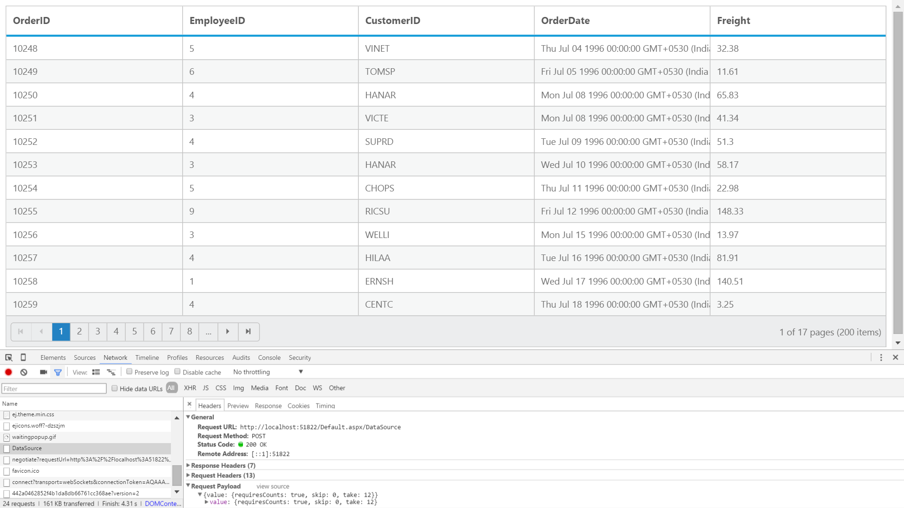
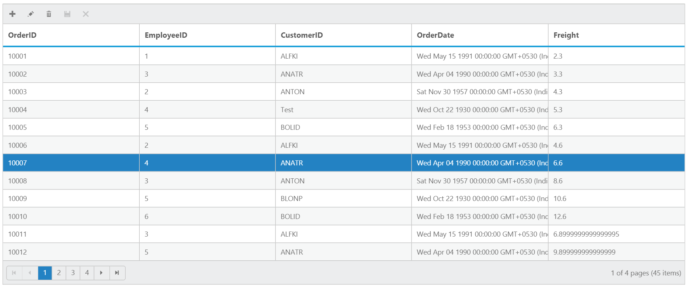
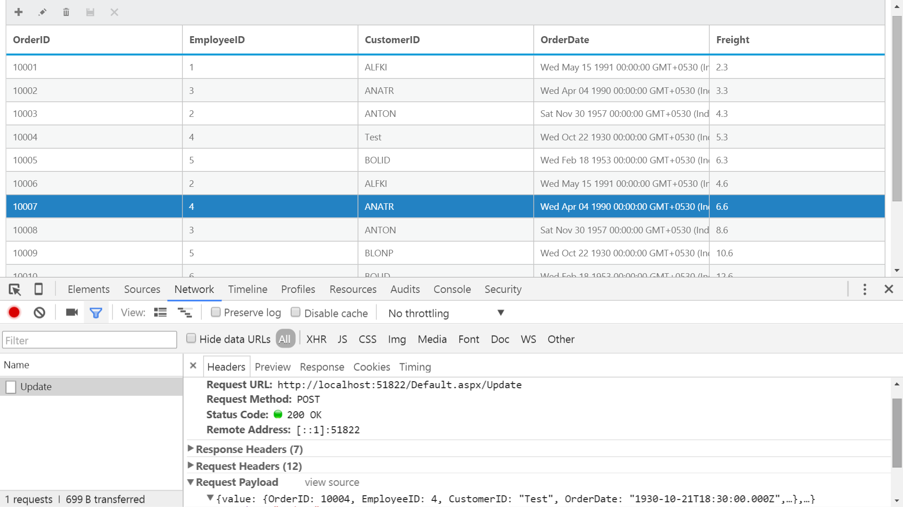
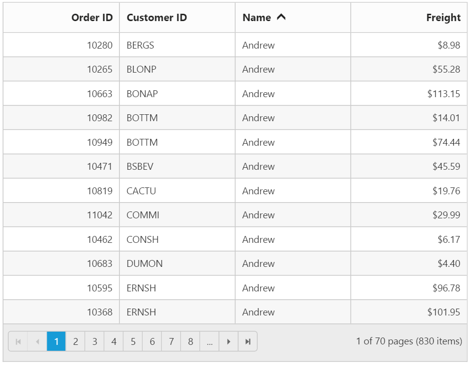

#  Data Adaptors

The Data adaptor is a mechanism through which the `DataManager` interact with the remote service or local dataSource. The `DataManager` has several preconfigured Data Adaptors, refer to the [link](http://help.syncfusion.com/aspnetmvc/datamanager/data-adaptors).

In Grid, the adaptor can be specified using the `Adaptor` property of the `DataManager`.

##  Json Adaptor

The Json Adaptor is used when the grid is bound with local datasource. It can be enabled in Grid using `Adaptor` property as ` JsonAdaptor`. The `JsonAdaptor` is the default adaptor used by `DataManager` when bind with datasource controls such as SqlDataSource, ObjectDataSource and also while using datasource such as IEnumerable, DataTable etc.

The following code example describes the above behavior.

 


     <ej:Grid runat="server" ID="Grid">                        
             <Columns>
                 <ej:Column Field="FirstName" HeaderText="First Name"></ej:Column>
                 <ej:Column Field="LastName" HeaderText="Last Name"></ej:Column>
                 <ej:Column Field="Email" HeaderText="Email"></ej:Column>
             </Columns>          
     </ej:Grid>
 


         namespace Grid
         {
         public partial class _Default : Page
          { 
          protected void Page_Load(object sender, EventArgs e)
           {
              List<Person> Persons = new List<Person>();
              Persons.Add(new Person() { FirstName = "John", LastName = "Beckett", Email = "john@syncfusion.com" });
              Persons.Add(new Person() { FirstName = "Ben", LastName = "Beckett", Email = "ben@syncfusion.com" });
              Persons.Add(new Person() { FirstName = "Andrew", LastName = "Beckett", Email = "andrew@syncfusion.com" });
              this.Grid.DataSource = Persons;
            }
          }
        }

 

The following output is displayed as a result of the above code example.

##  WebMethod Adaptor

The WebMethod Adaptor is used to bind data source from remote services and code behind methods. It can be enabled in Grid using `Adaptor` property of `DataManager` as `WebMethodAdaptor`.

For every operations, an AJAX post will be send to the specified data service. 

When using `WebMethodAdaptor`, grid actions such as Paging, Filtering and Sorting should be handled at the server side itself. We have `DataOperation` class to handle the server side operations. Refer to the kb [link](https://www.syncfusion.com/kb/4300). These operations can also be done using the QueryableDataOperations class which accepts the IQueryable Data. Please refer the Kb [link](https://www.syncfusion.com/kb/8434/server-side-api-for-datamanager-operations-with-iqueryable-data).

WebMethod Adaptor supports Model Binding, using `DataManager` class, for the Grid queries, such as sort, paging queries, etc., 
 

N> • The response from server should be wrapped in object with properties named `result` to hold the data and `count` to hold the total records count.

N> • The `count` must be returned along with response when paging is enabled in Grid.

N> • The data parameter name must be “value” 

You can use the following code example to use WebMethod adaptor.

 


        <ej:Grid ID="EmployeesGrid2" runat="server" AllowPaging="true">
          <DataManager URL="Default.aspx/DataSource" Adaptor="WebMethodAdaptor" />
            <Columns>
                <ej:Column Field="OrderID" />
                <ej:Column Field="EmployeeID" />
                <ej:Column Field="CustomerID" />
                <ej:Column Field="OrderDate" />
                <ej:Column Field="Freight" />
           </Columns>
      </ej:Grid>
 

 
       namespace EJGrid
        {
         public partial class _Default : Page
         {        
          [WebMethod]
          [ScriptMethod(ResponseFormat = ResponseFormat.Json)]
          public static object DataSource(DataManager value)
          {
             IEnumerable data = OrderRepository.GetAllRecords();
             var count = data.AsQueryable().Count();
             DataOperations ds = new DataOperations();
             data = ds.Execute(data, value);
             return new { result = data, count = count };
          }
        }
      }

    

The following output is displayed as a result of the above code example.

##  Url Adaptor

The Url Adaptor is the base adaptor that would interact with remote services. It can be enabled in Grid using `Adaptor` property of `DataSource` as `UrlAdaptor`. For every operations, an AJAX post will be send to the specified data service. 

When using `UrlAdaptor`, grid actions such as Paging, Filtering and Sorting should be handled at the server side itself. We have `DataOperation` class to do these server side operations. Please refer to the kb [link](https://www.syncfusion.com/kb/4300). These operations can also be done using the QueryableDataOperations class which accepts the IQueryable Data. Please refer the Kb [link](https://www.syncfusion.com/kb/8434/server-side-api-for-datamanager-operations-with-iqueryable-data).

The following code example describes the above behavior.

 


        <ej:Grid runat="server" ID="Grid" AllowPaging="true">
            <DataManager URL="Default.aspx/DataSource" Adaptor="UrlAdaptor"/>              
            <Columns>
                <ej:Column Field="OrderID" HeaderText="Order ID" TextAlign="Right" />
                <ej:Column Field="CustomerID" HeaderText="Customer ID" />
                <ej:Column Field="EmployeeID" HeaderText="Employee ID" TextAlign="Right" />
                <ej:Column Field="Freight" HeaderText="Freight" Format="{0:C2}" TextAlign="Right" />
            </Columns>         
     </ej:Grid>
 

        
     namespace Grid
      {
       using Syncfusion.JavaScript;
       using Syncfusion.JavaScript.DataSources;    
       public partial class _Default : Page
       { 
        protected void Page_Load(object sender, EventArgs e)
         {           
         }
         [WebMethod]
         [ScriptMethod(ResponseFormat = ResponseFormat.Json)]
         public static object DataSource(int skip, int take)
          {
             var db = new NorthwindDataContext().OrdersViews.ToList();        
             var res = db.Skip(skip).Take(take).ToList();
             return new { result = res, count = db.Count };
          }
        }
      }

  

N> 1. The response from server should be wrapped in an object with properties named `result` to hold the data and `count` to hold the total records count.

N> 2. The `count` must be returned along with response when paging is enabled in Grid.

The following output is displayed as a result of the above code example.

##  OData Adaptor

OData Adaptor that is extended from `UrlAdaptor`, is used for consuming data through OData Service. 
We have an online OData Service “http://js.syncfusion.com/demos/ejServices/Wcf/Northwind.svc/Orders” created specifically for Syncfusion Controls

N> `ODataAdaptor` is the default adaptor of `DataManager` and so no need to specify adaptor when binding OData service

You can use the following code example to use OData adaptor.

 


     <ej:Grid ID="OrdersGrid" runat="server" AllowPaging="true">
         <DataManager URL=http://js.syncfusion.com/demos/ejServices/Wcf/Northwind.svc/Orders/ Adaptor="ODataAdaptor></DataManager>   
           <Columns>
                <ej:Column Field="OrderID" />
                <ej:Column Field="EmployeeID" />
                <ej:Column Field="CustomerID" />
                <ej:Column Field="ShipCountry" />
                <ej:Column Field="Freight" />
           </Columns>
   </ej:Grid>
 
 

The following output is displayed as a result of the above code example.

##  ODataV4 Adaptor

OData V4 Adaptor that is extended from `ODataAdaptor`, is used for consuming data from OData V4 Service

To consume OData V4 service, set the service link to the `Url` property and you can set adaptor type as `ODataV4Adaptor` to the `Adaptor` Property of Grid `DataManager`

You can use the following code example to use ODataV4 adaptor.

 


        <ej:Grid ID="OrdersGrid" runat="server" AllowPaging="true">
            <DataManager URL= http://js.syncfusion.com/demos/ejServices/Wcf/Northwind.svc/Orders/ Adaptor="ODataAdaptor></DataManager>   
              <Columns>
                  <ej:Column Field="OrderID" />
                  <ej:Column Field="EmployeeID" />
                  <ej:Column Field="CustomerID" />
                  <ej:Column Field="ShipCountry" />
                  <ej:Column Field="Freight" />
             </Columns>
      </ej:Grid>
 
 

The following output is displayed as a result of the above code example. 

##  WebAPI Adaptor

WebAPI Adaptor that is extended from `ODataAdaptor`, is used for consuming data from WebApi Service

To consume Web API service, set the service link to the `Url` property and set the adaptor type as ` WebApiAdaptor` to the `Adaptor` Property of Grid `DataManager`.

You can use the following code example to use WebAPI adaptor.

 

	
        <ej:Grid ID="OrdersGrid" runat="server" AllowPaging="true">
            <DataManager URL=http://js.syncfusion.com/demos/ejServices/Wcf/Northwind.svc/Orders/ Adaptor="WebApiAdaptor></DataManager>   
               <Columns>
                   <ej:Column Field="OrderID" />
                   <ej:Column Field="EmployeeID" />
                   <ej:Column Field="CustomerID" />
                   <ej:Column Field="ShipCountry" />
                   <ej:Column Field="Freight" />
              </Columns>
         </ej:Grid>
 

        
         namespace EJGrid.Controllers
          {
            public class OrdersController: ApiController 
             { 
               // GET: api/Orders 
               NORTHWNDEntities db = new NORTHWNDEntities(); 
               public object Get() 
               { 
                var queryString = HttpContext.Current.Request.QueryString; 
                int skip = Convert.ToInt32(queryString["$skip"]); 
                int take = Convert.ToInt32(queryString["$top"]); 
                var data = db.Orders.Skip(skip).Take(take).ToList(); 
                return new { Items = data.Skip(skip).Take(take), Count = data.Count() }; 
               } 
             } 
           }
 
 

The following output is displayed as a result of the above code example. 

##  RemoteSave Adaptor

Sometimes you may need to perform all Grid Actions in client-side except the CRUD operations that should be interacted with server-side to persist data. It can be achieved in Grid by using `RemoteSaveAdaptor`.

Datasource must be set to `Json` Property and set adaptor type as `remoteSaveAdaptor` to the `Adaptor` Property of Grid `DataManager`.
 
CRUD operations can be mapped to server-side using `UpdateUrl`, `InsertUrl`, `RemoveUrl`, `BatchUrl`, `CrudUrl` properties.
 
You can use the following code example to use RemoteSave adaptor.
 
 

    
       <ej:Grid ID="OrdersGrid" runat="server" AllowPaging="true"> 
            <EditSettings AllowEditing="true" AllowAdding="true" AllowDeleting="true"></EditSettings>
            <ToolbarSettings ShowToolbar="true" ToolbarItems="add,edit,delete,update,cancel"></ToolbarSettings>
            <Columns>
                <ej:Column Field="OrderID" IsPrimaryKey="true" />
                <ej:Column Field="EmployeeID" />
                <ej:Column Field="CustomerID" />
                <ej:Column Field="ShipCountry" />
                <ej:Column Field="Freight" />
          </Columns>
     </ej:Grid>
 


       namespace Sample
        {
          public partial class _Default : Page
          {
           protected void Page_Load(object sender, EventArgs e)
           {
            this.OrdersGrid.DataManager = new DataSource() {Json= OrderRepository.GetAllRecords()};
           }
          [WebMethod]
          [ScriptMethod(ResponseFormat = ResponseFormat.Json)]
          public static object Update(EditableOrder value)
          {
            OrderRepository.Update(value);
            return value;
          } 
         [WebMethod]
         [ScriptMethod(ResponseFormat = ResponseFormat.Json)]
         public static object Insert(EditableOrder value)
         {
            OrderRepository.Insert (value);
            return value;
         } 
         [WebMethod]
         [ScriptMethod(ResponseFormat = ResponseFormat.Json)]
         public static void Remove(int key)   
         {
            OrderRepository.Delete(key);
         } 
       }
     }
 
 

The following output is displayed as a result of the above code example.

On performing CRUD operations in Grid, the record changes will be sent to server-side as in the following screenshot.

##  Foreign Key Adaptor

The Grid can have a look up column. The Foreign key column using `ForeignKeyField` has some limitations such as sort/group operations on column will happen based on `Field` instead of `ForeignKeyField`. The `ForeignKeyAdaptor` can be used to overcome this limitation.

It works by specifying a virtual column (which is not in the grid datasource) in the Grid. This adaptor should be initialized in the `Load` event of the grid. `ForeignKeyAdaptor` supported for only local data binding.

The following code example describes the above behavior.

 


          <ej:Grid runat="server" ID="Grid" AllowPaging="true" AllowSorting="true">
            <Columns>
                <ej:Column Field="OrderID" HeaderText="Order ID" TextAlign="Right" />
                <ej:Column Field="CustomerID" HeaderText="Customer ID" />
                <ej:Column Field="FirstName" HeaderText="FirstName"/>
                <ej:Column Field="Freight" HeaderText="Freight" Format="{0:C2}" TextAlign="Right" />
            </Columns>
            <ClientSideEvents Load="OnLoad" />
    </ej:Grid>
 


        namespace Grid
         {      
          public partial class _Default : Page
          { 
          public IEnumerable<EmployeeView> EmployeeView 
           {
             get 
             {
                return new NorthwindDataContext().EmployeeViews.ToList();
             }
           }
         protected void Page_Load(object sender, EventArgs e)
        {
            this.Grid.DataSource = new NorthwindDataContext().OrdersViews.ToList();
        }
       }
     }
 


        
 
 

N> 1. The `Field` name of the virtual column should be the name of the field to display from foreign datasource, in the above code example, FirstName column is the virtual column.

N> 2. By default, the `ForeignKeyAdaptor` uses `JsonAdaptor`, to use other adaptors specify the adaptor name as the second argument during initialization.
 
The following output is displayed as a result of the above code example.

