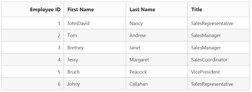
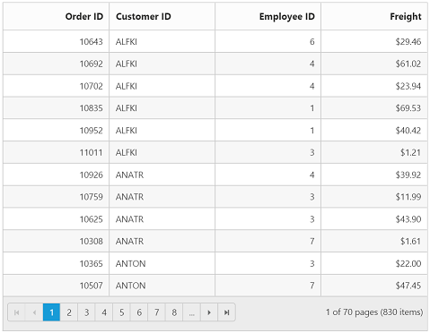
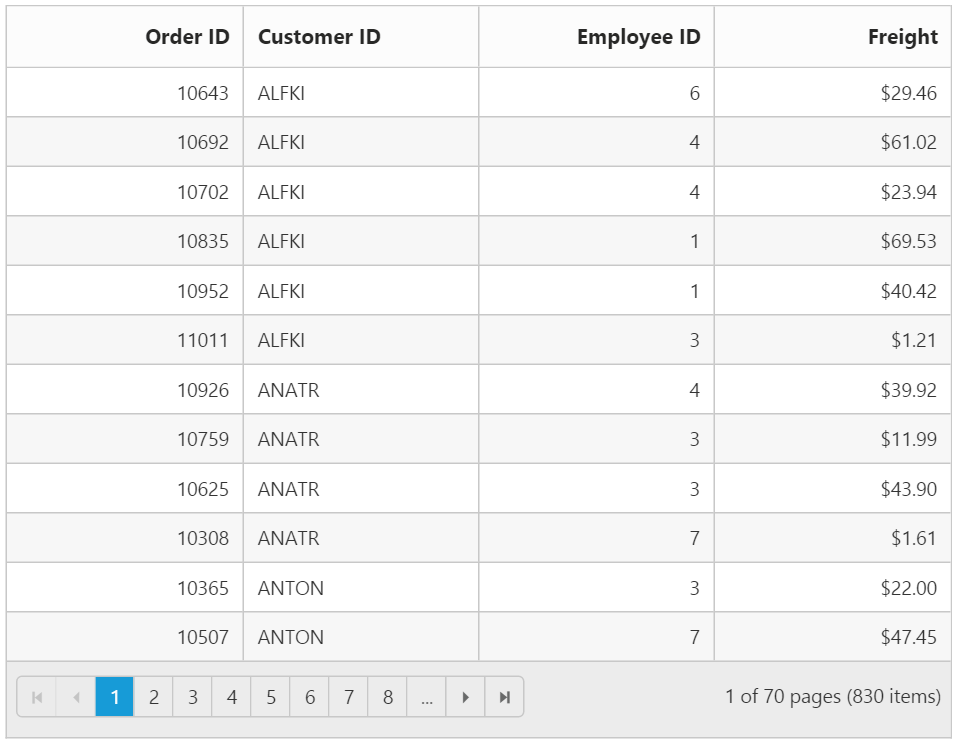
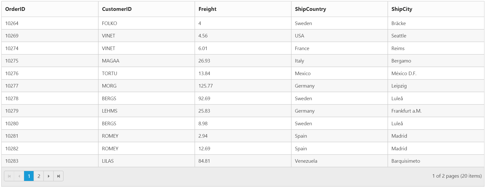

# Data Binding

## Local data

Grid data source can be set List collection and local datasource. It has full support for List binding and local datasource binding binding. 





<ej:Grid ID="Grid" runat="server">

    <Columns>

        <ej:Column Field="FirstName" HeaderText="First Name" />

        <ej:Column Field="LastName" HeaderText="Last Name" />

        <ej:Column Field="Email" HeaderText="Email" />

    </Columns>

</ej:Grid>





public partial class _Default : System.Web.UI.Page

{

    List<Person> Persons = new List<Person>();

    protected void Page_Load(object sender, EventArgs e)

    {

        BindDataSource();

    }

    private void BindDataSource()

    {       

        Persons.Add(new Person() { FirstName = "John", LastName = "Beckett", Email = "john@syncfusion.com" });

        Persons.Add(new Person() { FirstName = "Ben", LastName = "Beckett", Email = "ben@syncfusion.com" });

        Persons.Add(new Person() { FirstName = "Andrew", LastName = "Beckett", Email = "andrew@syncfusion.com" });

        this.Grid.DataSource = Persons;

        this.Grid.DataBind();

    }

    public class Person

    {

        public Person()

        {

        }

        public Person(string firstName, string lastName, string email)

        {

            this.FirstName = firstName;

            this.LastName = lastName;

            this.Email = email;          

        }       

        public string FirstName { get; set; }

        public string LastName { get; set; }

        public string Email { get; set; }       

    }

}





Result of the above code example.

## Remote data

### oData Binding	

oData is standardized protocol for creating and consuming data. You can retrieve data from oDataservice using DataManager. The following code is a simple example of remote data binding using oDataservice.



<ej:Grid ID="Grid" runat="server">

<DataManager URL="http://mvc.syncfusion.com/Services/Northwnd.svc/Products" />

    <Columns>

        <ej:Column Field="ProductID" HeaderText="Product ID" />

        <ej:Column Field="ProductName" HeaderText="Product Name" />

        <ej:Column Field="SupplierID" HeaderText="Supplier ID" />

        <ej:Column Field="UnitPrice" HeaderText="Unit Price" />

    </Columns>

</ej:Grid>



The following output is the result of the above code example.

 

N> For information about DataManager with Grid check DataAdaptors concept.

### Load at once

Through this load at once technique, you can load all remote data from the server to the Grid and process records in client-side. The following code example shows load at once with Grid. To enable load at once feature we need to set offline property of DataManager as true.



<ej:Grid ID="Grid" runat="server" AllowPaging="True">

    <DataManager URL="http://mvc.syncfusion.com/Services/Northwnd.svc/Products" Offline="True" />

    <Columns>

        <ej:Column Field="ProductID" HeaderText="Product ID" TextAlign="Right" />

        <ej:Column Field="ProductName" HeaderText="Product Name" />

        <ej:Column Field="SupplierID" HeaderText="Supplier ID" TextAlign="Right" />

        <ej:Column Field="UnitPrice" HeaderText="Unit Price" TextAlign="Right" />

    </Columns>

</ej:Grid>



The following output is the result of the above code example.

### Load on demand

Load on demand is a powerful technique that is used to reduce bandwidth size of consuming data. In Grid, you have support to use load on demand. In the following example, oDataservice is used. At load time, it retrieves required data from service, only for the visible page and not for all records. And if you move to another page, it loads for current page. You do not have to configure Grid to enable load on demand, since load on demand is enabled by default in Grid. The following code example shows you how load on demand works with Grid.



<ej:Grid ID="Grid1" runat="server" AllowPaging="True">

<DataManager URL="http://mvc.syncfusion.com/Services/Northwnd.svc/Products" />

    <Columns>

        <ej:Column Field="ProductID" HeaderText="Product ID" TextAlign="Right" />

        <ej:Column Field="ProductName" HeaderText="Product Name" />

        <ej:Column Field="SupplierID" HeaderText="Supplier ID" TextAlign="Right" />

        <ej:Column Field="UnitPrice" HeaderText="Unit Price" TextAlign="Right" />

    </Columns>

</ej:Grid>



The following screenshot is the result of the above code example.

If you have developer tools, you can capture network transfer to check Grid consumed data. The following screenshot shows demanded data being loaded in Grid.

### Cross domain

Grid can use cross domain data service with the help of DataManager. The given configuration is for configuring in client-side. You must configure the server as well, to retrieve data from server code. For server configuration, you can refer this link ([https://developer.mozilla.org/en-US/docs/Web/HTTP/Access_control_CORS](https://developer.mozilla.org/en-US/docs/Web/HTTP/Access_control_CORS)). The following code example shows you how to use or retrieve cross domain data from Grid.



<ej:Grid ID="Grid" runat="server" AllowPaging="True">

    <DataManager URL="http://mvc.syncfusion.com/UGService/api/Orders/" CrossDomain="True"

        Offline="True"></DataManager>

    <Columns>

        <ej:Column Field="OrderID" HeaderText=" OrderID" TextAlign="Right" />

        <ej:Column Field="CustomerID" HeaderText="Customer ID" />

        <ej:Column Field="ShipName" HeaderText="Ship Name" />

        <ej:Column Field="ShipCity" HeaderText="Ship City" />

    </Columns>

</ej:Grid>



The following screenshot is the result of the above code example.

### HTTP additional parameters

In this section, you can learn how to customize or add an extra parameter for HTTP request. You can add parameter to oDataserviceURL using the Query property in Grid. DataManager uses this Query internally in Grid.



<ej:Grid ID="Grid" runat="server" AllowPaging="True" Query="new ej.Query().addParams('$filter', 'ProductID gt 50')">

    <DataManager URL="http://mvc.syncfusion.com/Services/Northwnd.svc/Products" />

    <Columns>

        <ej:Column Field="ProductID" HeaderText="Product ID" TextAlign="Right" />

        <ej:Column Field="ProductName" HeaderText="Product Name" />

        <ej:Column Field="SupplierID" HeaderText="Supplier ID" TextAlign="Right" />

        <ej:Column Field="CategoryID" HeaderText="Category ID" TextAlign="Right" />

    </Columns>

</ej:Grid>



The following screenshot is the result of the above code example.

 

### Supported DataTypes

Grid supports various DataTypes such as string, number, datetime and Boolean. By default, Grid reads DataTypes from Grid data source. Using these data types, Grid uses it at to edit, add, save, filter and other such operations. You can also customize these DataTypes through column property type. It can override default data type reading.



<ej:Grid ID="FlatGrid" runat="server">

       <Columns>

             <ej:Column Field="FirstName" Type="string" />

             <ej:Column Field="LastNmae" Type="string" />

             <ej:Column Field="Email" />

       </Columns>

  </ej:Grid>



## HTML binding

Grid provides support to form Grid from HTML table. It is flexible to convert from table to Grid with the help of the DataManager.



<ej:Grid ID="Grid" runat="server">

    <DataManager Table="#Table1"></DataManager>

    <Columns>

        <ej:Column Field="Laptop" HeaderText="Laptop Brands" />

        <ej:Column Field="Model" HeaderText="Model" />

        <ej:Column Field="Price" HeaderText="Price" TextAlign="Right" Width="90" Format="{0:C}" />

        <ej:Column Field="OS" HeaderText="Operating System" />

        <ej:Column Field="RAM" HeaderText="RAM" Width="120" TextAlign="Right" />

        <ej:Column Field="ScreenSize" HeaderText="Screen Size" TextAlign="Right" Width="100" Format="{0:N1}inch" />

    </Columns>

</ej:Grid>



The following screenshot is the result of the above code example.

