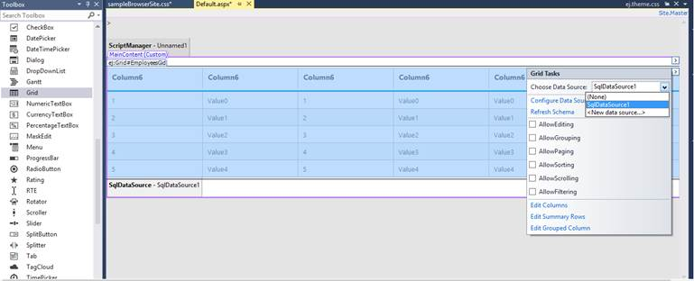
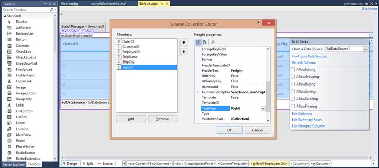
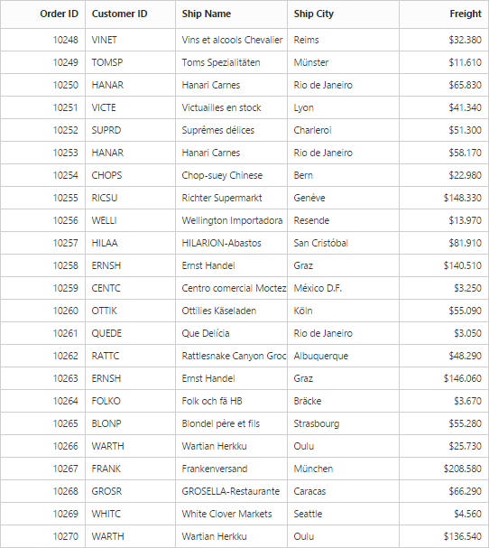
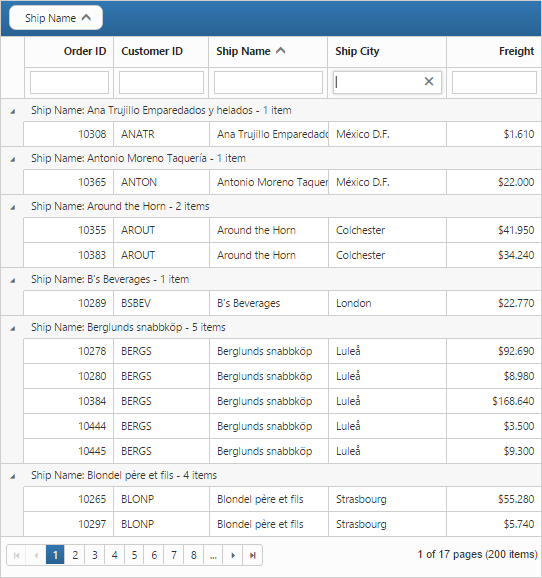
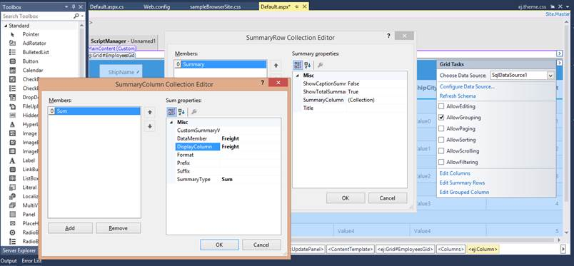

# Getting Started

This section explains briefly about how to create a Grid in your application with ASP.NET.

## Create your first Grid ASP.NET Web Forms Application

You can create a Grid with a highly customizable look and feel. You can use the Grid control to generate complex, grid-based reports, with rich formatting. In the following example, you can take a look at how the transaction of a product is managed, analysis of a particular sale using filtering and grouping feature. This section describes how you can add a group, filter and page sales products.

1. Create a Syncfusion ASP.NET Web Forms application.
2. Add a Grid in the Index.aspx page. 

   

3. Configure the Grid control with SQL data source using smart tag.

   

   ~~~ html
		<ej:Grid ID="FlatGrid" runat="server" DataSourceID="SqlData">
		</ej:Grid>
		<asp:SqlDataSource runat="server" ID="SqlData" ConnectionString="<%$ ConnectionStrings:SQLConnectionString %>" SelectCommand="SELECT * FROM [Orders]"></asp:SqlDataSource>
   ~~~
   
   N> Create a connection string in Web.config file using SQL database.

   ~~~ html
		<connectionStrings>
			 <add name="SQLConnectionString" connectionString="Data Source=(LocalDB)\V11.0;AttachDbFilename=|DataDirectory|\NORTHWND.MDF; Integrated Security=True"  
				 providerName="System.Data.SqlClient" />
		</connectionStrings>

   ~~~
   
   For more information about SQL data source configuration refer the following link: [http://msdn.microsoft.com/en-us/library/vstudio/w1kdt8w2(v=vs.100).aspx](http://msdn.microsoft.com/en-us/library/vstudio/w1kdt8w2(v=vs.100).aspx)

4. By Columns definition, the TextAlign property allows you to align the text of the columns. The Width property is used to define the width of the columns and the Format property allows you to format the particular column’s value.

    

   ~~~ html

		<ej:Grid ID="FlatGrid" runat="server" DataSourceID="SqlData" >
		    <Columns>
		        <ej:Column Field="OrderID" HeaderText="Order ID" IsPrimaryKey="True" TextAlign="Right" Width="75" />
		        <ej:Column Field="CustomerID" HeaderText="Customer ID" Width="80" />
		        <ej:Column Field="ShipName" HeaderText="Ship Name" Width="100" />
		        <ej:Column Field="ShipCity" HeaderText="Ship City" Width="100" />
		        <ej:Column Field="Freight" HeaderText="Freight" TextAlign="Right" Width="80" Format="{0:C3}" /> 
		    </Columns>
		</ej:Grid>

   ~~~

The following screenshot displays a Grid with the sales data.

 

## Enable Paging

The Paging feature in Grid offers complete navigation support to easily switch between the pages, using the page bar available at the bottom of the Grid control. To enable paging, use AllowPaging property of Grid as follows.



<ej:Grid ID="FlatGrid" runat="server" DataSourceID="SqlData" AllowPaging="true">
    <Columns>
       <ej:Column Field="OrderID" HeaderText="Order ID" IsPrimaryKey="True" TextAlign="Right" Width="75" />
       <ej:Column Field="CustomerID" HeaderText="Customer ID" Width="80" />
       <ej:Column Field="ShipName" HeaderText="Ship Name" Width="100" />
       <ej:Column Field="ShipCity" HeaderText="Ship City" Width="100" />
       <ej:Column Field="Freight" HeaderText="Freight" TextAlign="Right" Width="80" Format="{0:C3}" />
    </Columns>
</ej:Grid>



The following screenshot displays a Grid with paging.

## Enable Filtering

The Filtering feature in Grid is used to facilitate the extraction of a subset of records that meet a certain criteria. You can apply Filters to one or more columns. This feature is used to filter particular sales data, in order to review the details.

To enable filtering, use the AllowFiltering property of Grid as follows.



<ej:Grid ID="FlatGrid" runat="server" DataSourceID="SqlData" AllowPaging="true" AllowFiltering="true">
    <Columns>
        <ej:Column Field="OrderID" HeaderText="Order ID" IsPrimaryKey="True" TextAlign="Right" Width="75" />
        <ej:Column Field="CustomerID" HeaderText="Customer ID" Width="80" />
        <ej:Column Field="ShipName" HeaderText="Ship Name" Width="100" />
        <ej:Column Field="ShipCity" HeaderText="Ship City" Width="100" />
        <ej:Column Field="Freight" HeaderText="Freight" TextAlign="Right" Width="80" Format="{0:C3}" />
    </Columns>
    <FilterSettings FilterType="FilterBar" />
</ej:Grid>



The following screenshot shows Grid with filtering option.

## Enable Grouping

The Grouping feature in Grid is used to consolidate the Grid data into groups. Grouping allows the categorization of records based on specified columns. You can easily group a particular column by simply dragging the column to the upper portion of the Grid. The Grid data is automatically grouped when you drop a particular column.  In this example, the Grouping feature is used to analyze the shipment details of products.

To enable grouping, use the AllowGrouping property of Grid as follows.

 



<ej:Grid ID="FlatGrid" runat="server" DataSourceID="SqlData"
         AllowPaging="true" AllowFiltering="true" AllowGrouping="true">
    <Columns>
        <ej:Column Field="OrderID" HeaderText="Order ID" 
            IsPrimaryKey="True" TextAlign="Right" Width="75" />
        <ej:Column Field="CustomerID" HeaderText="Customer ID" Width="80" />
        <ej:Column Field="ShipName" HeaderText="Ship Name" Width="100" />
        <ej:Column Field="ShipCity" HeaderText="Ship City" Width="100" />
        <ej:Column Field="Freight" HeaderText="Freight" TextAlign="Right" Width="80" Format="{0:C3}" />
    </Columns>
    <FilterSettings FilterType="FilterBar" />
    <GroupSettings GroupedColumns="ShipName" />
</ej:Grid>



The following screenshot shows the analysis of shipment details by grouping ShipName.

## Enable Group Summary

The Show Summary property allows you to summarize the grid data into groups. Grouping allows the categorization of records based on specified columns. Group Summary summarizes the data present in the group. In the following example, Group Summary is used to summarize freight data of grouped ShipName category.

The following code example shows how you can enable ShowSummary.



<ej:Grid ID="FlatGrid" runat="server" DataSourceID="SqlData" AllowPaging="true" AllowFiltering="true" AllowGrouping="true" ShowSummary="true">
    <Columns>
        <ej:Column Field="OrderID" HeaderText="Order ID" IsPrimaryKey="True" TextAlign="Right" Width="75" />
        <ej:Column Field="CustomerID" HeaderText="Customer ID" Width="80" />
        <ej:Column Field="ShipName" HeaderText="Ship Name" Width="100" />
        <ej:Column Field="ShipCity" HeaderText="Ship City" Width="100" />
        <ej:Column Field="Freight" HeaderText="Freight" TextAlign="Right" Width="80" Format="{0:C3}" />
    </Columns>
    <FilterSettings FilterType="FilterBar" />
    <GroupSettings GroupedColumns="ShipName" />
    <SummaryRows>
        <ej:SummaryRow ShowTotalSummary="false">
            <SummaryColumn>
                <ej:SummaryColumn SummaryType="Sum" DisplayColumn="Freight" DataMember="Freight" Prefix="Sum = " Format="{0:C3}" />
            </SummaryColumn>
        </ej:SummaryRow>
    </SummaryRows>
</ej:Grid>



The following screenshot shows the group summary.

 