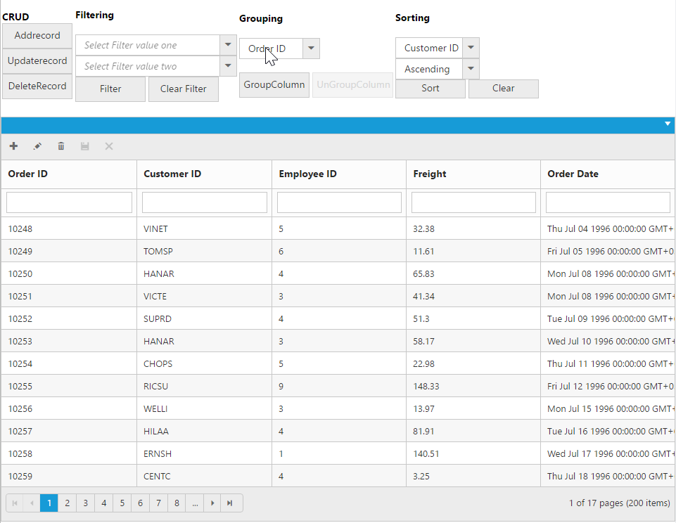

## Perform Grid Actions on External button click

### CRUD operations

Using [`addRecord`](https://help.syncfusion.com/api/js/ejgrid#methods:addRecord “addRecord”) method of Grid, you can add a record to a Grid externally without using in-built toolbar add support. While using [`addRecord`](https://help.syncfusion.com/api/js/ejgrid#methods:addRecord “addRecord”) method it is necessary to set `AllowAdding` property as `true`.
Using [`deleteRecord`](https://help.syncfusion.com/api/js/ejgrid#methods:deleteRecord “deleteRecord”) method of Grid, you can delete a record to a Grid externally without using in-built toolbar delete support. While using [`deleteRecord`](https://help.syncfusion.com/api/js/ejgrid#methods:deleteRecord “deleteRecord”) method it is necessary to set `AllowDeleting` property as `true`.
Using [`updateRecord`](https://help.syncfusion.com/api/js/ejgrid#methods:updateRecord “updateRecord”) method of Grid, you can update a record to a Grid externally without using in-built toolbar update support. While using [`updateRecord`](https://help.syncfusion.com/api/js/ejgrid#methods:updateRecord “updateRecord”) method it is necessary to set `AllowEditing` property as `true`.

### Filtering

Using [`filterColumn`](https://help.syncfusion.com/api/js/ejgrid#methods:filterColumn “filterColumn”) method of Grid, you can filter the data in the Grid externally without using in-built filter support. While using [`filterColumn`](https://help.syncfusion.com/api/js/ejgrid#methods:filterColumn “filterColumn”) method it is necessary to set `AllowFiltering` property as `true`.

### Grouping

Using [`groupColumn`](https://help.syncfusion.com/api/js/ejgrid#methods:groupColumn “groupColumn”) and [`ungroupColumn`](https://help.syncfusion.com/api/js/ejgrid#methods:ungroupColumn “ungroupColumn”) method of Grid, you can group/ungroup the Grid externally without using in-built grouping support. While using [`groupColumn`](https://help.syncfusion.com/api/js/ejgrid#methods:groupcolumn “groupColumn”) and [`ungroupColumn`](https://help.syncfusion.com/api/js/ejgrid#methods:ungroupcolumn “ungroupColumn”) method it is necessary to set `AllowGrouping` property as `true`.

### Sorting

Using [`sortColumn`](https://help.syncfusion.com/api/js/ejgrid#methods:sortcolumn “sortColumn”) method of Grid, you can sort the Grid externally without using in-built sorting support. While using [`sortColumn`](https://help.syncfusion.com/api/js/ejgrid#methods:sortcolumn “sortColumn”) method it is necessary to set `AllowSorting` property as `true`.

The following code example explains the above behavior.



<table>
    <tr>
        <td><b>CRUD</b> <ej:Button Type="Button" ClientSideOnClick="addRecord" runat="server" Text="AddRecord"></ej:Button> <ej:Button Type="Button" ClientSideOnClick="deleteRecord" runat="server" Text="DeleteRecord"></ej:Button> <ej:Button Type="Button" ClientSideOnClick="deleteRecord" runat="server" Text="DeleteRecord"></ej:Button></td>
        <td><b>Filtering</b>  <ej:DropDownList ID="filtercolumnone" runat="server" DataTextField="OrderID" SelectedItemIndex=0  WatermarkText="Select ID" Width="230" >
             <Items>
                    <ej:DropDownListItem Text="10001" Value="10001"></ej:DropDownListItem>
                    <ej:DropDownListItem Text="10002" Value="10002"></ej:DropDownListItem>
                    <ej:DropDownListItem Text="10003" Value="10003"></ej:DropDownListItem>
                    <ej:DropDownListItem Text="10004" Value="10004"></ej:DropDownListItem>
                    <ej:DropDownListItem Text="10005" Value="10005"></ej:DropDownListItem>
                </Items>
            </ej:DropDownList>
      <ej:DropDownList ID="filtercolumntwo" runat="server" DataTextField="EmployeeID" SelectedItemIndex=0  WatermarkText="Select ID" Width="230" >
             <Items>
                    <ej:DropDownListItem Text="1" Value="1"></ej:DropDownListItem>
                    <ej:DropDownListItem Text="2" Value="2"></ej:DropDownListItem>
                    <ej:DropDownListItem Text="3" Value="3"></ej:DropDownListItem>
                    <ej:DropDownListItem Text="4" Value="4"></ej:DropDownListItem>
                    <ej:DropDownListItem Text="5" Value="5"></ej:DropDownListItem>
                </Items>
            </ej:DropDownList> <ej:Button Type="Button" ClientSideOnClick="Filterfn" runat="server" Text="Filter"></ej:Button><ej:Button Type="Button" ClientSideOnClick="clearfilterfn" runat="server" Text="Clear Filter"></td>
        <td><b>Grouping</b>  
            <ej:DropDownList ID="groupcolumnname" runat="server" ClientSideOnChange="Onchange" SelectedItemIndex="0" Width="115px">
                <Items>
                    <ej:DropDownListItem Text="Order ID" Value="0" />
                    <ej:DropDownListItem Text="Customer ID" Value="1" />
                    <ej:DropDownListItem Text="Freight" Value="2" />
                    <ej:DropDownListItem Text="Verified" Value="3" />
                    <ej:DropDownListItem Text="Ship Name" Value="4" />
                </Items>
            </ej:DropDownList>
            <ej:Button ID="groupColumn" runat="server" Text="GroupColumn" Width="100px" Size="Medium" Type="Button" ClientSideOnClick="clicktoGroup"></ej:Button>
            <ej:Button ID="ungroupColumn" runat="server" Text="UnGroupColumn" Width="115px" Size="Medium" Type="Button" ClientSideOnClick="clicktoGroup"></ej:Button>
        </td>
        <td><b>Sorting</b>  
            <ej:DropDownList ID="columnName" runat="server" SelectedItemIndex="0" Width="120px">
                <Items>
                    <ej:DropDownListItem Text="Order ID" Value="0" />
                    <ej:DropDownListItem Text="Customer ID" Value="1" />
                    <ej:DropDownListItem Text="Employee ID" Value="2" />
                    <ej:DropDownListItem Text="Freight" Value="3" />
                    <ej:DropDownListItem Text="Order Date" Value="4" />
                    <ej:DropDownListItem Text="Ship City" Value="5" />
                </Items>
            </ej:DropDownList>
            <ej:DropDownList ID="directions" runat="server" SelectedItemIndex="0" Width="120px">
                <Items>
                    <ej:DropDownListItem Text="Ascending" Value="0" />
                    <ej:DropDownListItem Text="Descending" Value="1" />
                </Items>
            </ej:DropDownList>
            <ej:Button ID="doSorting" runat="server" Type="Button" Text="Sort" ClientSideOnClick="Sortfn" Width="100px"></ej:Button>
            <ej:Button ID="clearSorting" runat="server" Type="Button" Text="Clear" ClientSideOnClick="Sortfn" Width="100px"></ej:Button>
        </td>
    </tr>
</table>

<ej:Grid ID="FlatGrid" runat="server" AllowFiltering="True" AllowGrouping="true" AllowSorting="true"  AllowPaging="True">
     <EditSettings AllowEditing="True" AllowAdding="True" AllowDeleting="True" EditMode="Normal"></EditSettings>
     <ToolbarSettings ShowToolbar="True" ToolbarItems="add,edit,delete,update,cancel"></ToolbarSettings>
     <Columns>
            <ej:Column Field="OrderID" HeaderText="Order ID" IsPrimaryKey="True" TextAlign="Right" Width="75" />
            <ej:Column Field="CustomerID" HeaderText="Customer ID" Width="110"  />
            <ej:Column Field="EmployeeID" HeaderText="Employee ID" Priority="2" Width="90" />
            <ej:Column Field="Freight" HeaderText="Freight" TextAlign="Right" Width="85" Format="{0:n}" Priority="3" />
            <ej:Column Field="OrderDate" HeaderText="Order Date" TextAlign="Right" Width="70" Priority="4"  Format="{0:MM/dd/yyyy}" />
     </Columns>
</ej:Grid>




    namespace WebSampleBrowser.Grid
        {
            public partial class _Default : Page
              { 
                 List<Orders> order = new List<Orders>();
                 protected void Page_Load(object sender, EventArgs e)
                 {
                   BindDataSource();
                  }
                 private void BindDataSource()
                  {   
                     int code = 10000;
                     for (int i = 1; i < 10; i++)
                     {
                      order.Add(new Orders(code + 1, "ALFKI", i + 0, new DateTime(1991, 05, 15),34.3 * i));
                      order.Add(new Orders(code + 2, "ANATR", i + 2, new DateTime(1990, 04, 04),35.3 * i));
                      order.Add(new Orders(code + 3, "ANTON", i + 1, new DateTime(1990, 04, 04) ,325.3 * i));
                      order.Add(new Orders(code + 4, "BLONP", i + 3, new DateTime(1990, 04, 04),435.3 * i));
                      order.Add(new Orders(code + 5, "BOLID", i + 4, new DateTime(1990, 04, 04),46.3 * i));
                      code += 5;
                     }
                    this.FlatGrid.DataSource = order;
                    this.FlatGrid.DataBind();
                  }
                  [Serializable]
                  public class Orders
                   {
                     public Orders()
                      {

                      }
                     public Orders(long OrderId, int EmployeeId, string CustomerId, DateTime OrderDate,double Freight)
                      {
                        this.OrderID = OrderId;
                        this.EmployeeID = EmployeeId;
                        this.CustomerID = CustomerId;
                        this.Freight = Freight;
                        this.OrderDate = OrderDate;
                      }
                     public long OrderID { get; set; }
                     public int EmployeeID { get; set; }
                     public string CustomerID { get; set; }
                     public DateTime OrderDate { get; set; }
                     public double Freight { get; set; }
                   }
              }
        } 







The following output is displayed as a result of the above code example.
