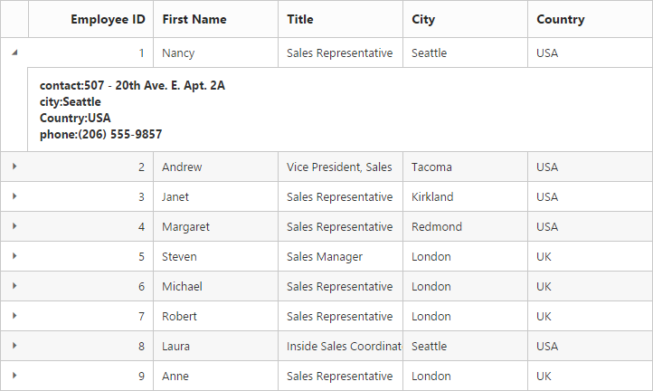
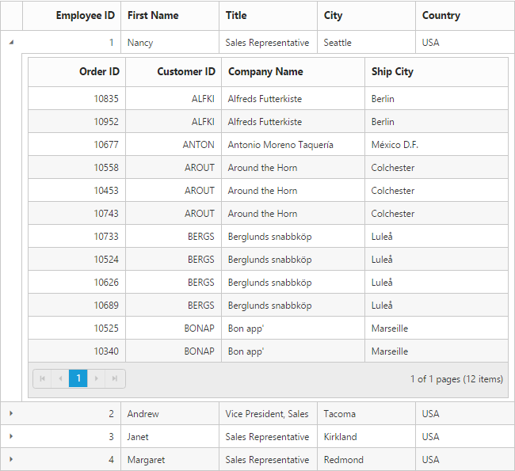
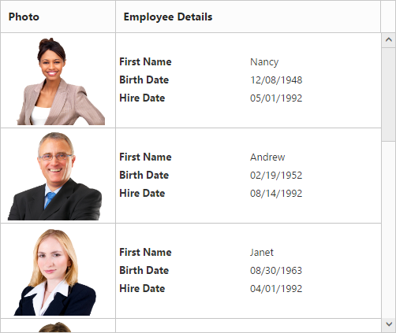

# Row

## Details Template

Details Template feature provides a detailed view about additional information of each row. If you want to view the detailed information, you can expand a row. Using DetailsTemplate property to achieve detail template feature.





<asp:Content runat="server" ID="BodyContent" ContentPlaceHolderID="MainContent">

    

<ej:Grid ID="DetailTemplate" runat="server" DetailsTemplate="#tabGridContents">

    <Columns>

        <ej:Column Field="EmployeeID" HeaderText="Employee ID" />

        <ej:Column Field="FirstName" HeaderText="First Name" />

        <ej:Column Field="Title" HeaderText="Title" />

        <ej:Column Field="City" HeaderText="City" />

        <ej:Column Field="Country" HeaderText="Country" />

    </Columns>

</ej:Grid>



protected void Page_Load(object sender, EventArgs e)

    {

        this.DetailTemplate.DataSource = new NorthwindDataContext().Employees.Take(9).ToList();

        this.DetailTemplate.DataBind();

    }




The following output is displayed as a result of the above code example.

## Hierarchy

In this section, you can learn how to use the Hierachytree in GridView. The following code example is of HierachyGrid.





<ej:Grid ID="DetailTemplate" runat="server" DetailsTemplate="#tabGridContents" >

  <ClientSideEvents DetailsDataBound="detailGridData" />

    <Columns>

        <ej:Column Field="EmployeeID" HeaderText="Employee ID" />

        <ej:Column Field="FirstName" HeaderText="First Name" />

        <ej:Column Field="Title" HeaderText="Title" />

        <ej:Column Field="City" HeaderText="City" />

        <ej:Column Field="Country" HeaderText="Country" />

    </Columns>

</ej:Grid>




public partial class DetailTemplate : System.Web.UI.Page

    {

        List<Orders> order = new List<Orders>();

        protected void Page_Load(object sender, EventArgs e)

        {

            BindDataSource();

        }

        private void BindDataSource()

        {

            order.Add(new Orders(1, "Nancy", "Sales Representative", "Seattle", "USA"));

            order.Add(new Orders(2, "Andrew", "Vice President, Sales", "Tacoma", "USA"));

            order.Add(new Orders(3, "Janet", "Sales Representative", "Kirkland", "USA"));

            order.Add(new Orders(4, "Margaret", "Sales Representative", "Redmond", "USA"));

            order.Add(new Orders(5, "Steven", "Sales Manager", "London", "UK"));

            order.Add(new Orders(6, "Michael", "Sales Representative", "London", "UK"));

            order.Add(new Orders(7, "Robert", "Sales Representative", "London", "UK"));

            order.Add(new Orders(8, "Laura", "Inside Sales Coordinator", "Seattle", "USA"));

            order.Add(new Orders(9, "Anne", "Sales Representative", "London", "UK"));

            this.EmployeesGrid.DataSource = order;

            this.EmployeesGrid.DataBind();

        }

        [Serializable]

        public class Orders

        {

            public Orders()

            {

            }

            public Orders(int EmployeeId, string FirstName, string Title, string City, string Country)

            {

                this.EmployeeID = EmployeeId;

                this.FirstName = FirstName;

                this.Title = Title;

                this.City = City;

                this.Country = Country;

            }

            public int EmployeeID { get; set; }

            public string FirstName { get; set; }

            public string Title { get; set; }

            public string City { get; set; }

            public string Country { get; set; }

        }

    }




The following output is displayed as a result of the above code example.

## Row Template

Row template is used to render your template in every row. It is used to place elements inside Grid rows. This feature makes it easier to customise Grid rows with HTML elements. Using RowTemplate property achieve row template feature.












<ej:Grid ID="Grid" runat="server" AllowScrolling="True" RowTemplate="#templateData">

    <ScrollSettings Height="480" Width="500" />

    <Columns>

        <ej:Column HeaderText="Photo" Width="30" />

        <ej:Column HeaderText="Employee Details" Width="70" />

    </Columns>

</ej:Grid>



public partial class RowTemplate : System.Web.UI.Page

    {

        List<Orders> order = new List<Orders>();

        protected void Page_Load(object sender, EventArgs e)

        {

            BindDataSource();

        }

        private void BindDataSource()

        {

            order.Add(new Orders(1, "Nancy", "Davolio","Sales Representative", new DateTime(1948, 12, 08),new DateTime(1992,05,01)));

            order.Add(new Orders(2, "Andrew", "Fuller","Vice President, Sales", new DateTime(1952, 02, 19),new DateTime(1992,08,14) ));

            order.Add(new Orders(3, "Janet", "Leverling","Sales Representative", new DateTime(1963, 08, 30),new DateTime(1992,04,01)));

            order.Add(new Orders(4, "Margaret", "Peacock",	"Sales Representative", new DateTime(1937, 09, 19),new DateTime(1993,05,03)));

            order.Add(new Orders(5, "Steven", "Buchanan",	"Sales Manager", new DateTime(1955, 03, 04),new DateTime(1993,10,17)));

            order.Add(new Orders(6, "Michael", "Suyama", "Sales Representative", new DateTime(1963, 07, 02), new DateTime(1993, 10, 17)));

            order.Add(new Orders(7, "Robert", "King", "Sales Representative",new DateTime(1960, 05, 29),new DateTime(1994,01,02)));

            order.Add(new Orders(8, "Laura", "Callahan", "Inside Sales Coordinator", new DateTime(1958, 01, 09),new DateTime(1994,03,05)));

            order.Add(new Orders(9, "Anne", "Dodsworth", "Sales Representative", new DateTime(1966, 01, 27), new DateTime(1994, 11, 15)));

            this.EmployeesGrid.DataSource = order;

            this.EmployeesGrid.DataBind();

        }

        [Serializable]

        public class Orders

        {

            public Orders()

            {

            }

            public Orders(int EmployeeID, string FirstName, string LastName, string Title, DateTime BirthDate, DateTime HireDate)

            {

                this.EmployeeID = EmployeeID;

                this.FirstName = FirstName;

                this.LastName = LastName;

                this.Title = Title;

                this.BirthDate = BirthDate;

                this.HireDate = HireDate;

            }

            public int EmployeeID { get; set; }

            public string FirstName { get; set; }

            public string LastName { get; set; }

            public string Title { get; set; }

            public DateTime BirthDate { get; set; }

            public DateTime HireDate { get; set; }

        }

    }





The following output is displayed as a result of the above code example.

## Customize Hover and AltRow 

EnableAltRow and EnableRowHover are graphical features in Grid that are used to enable alternate row color in Grid and enable hover effects while hovering over row cells. By default, these two features are enabled in Grid. In this section, you can learn how to cutomize alternative rows color and hover color in the Grid controls.







<ej:Grid ID="Grid" runat="server" AllowPaging="True" EnableAltRow="True" EnableRowHover="True">

    <PageSettings PageSize="5"></PageSettings>

</ej:Grid>




protected void Page_Load(object sender, EventArgs e)

    {

        this.Grid.DataSource = new NorthwindDataContext().Orders.ToList();

        this.Grid.DataBind();

    }





The following output is displayed as a result of the above code example.

