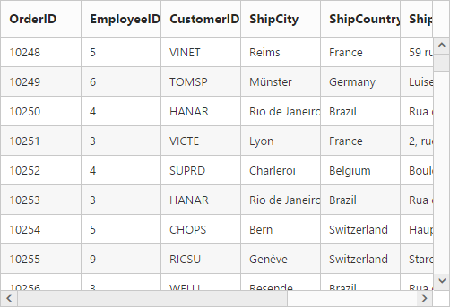
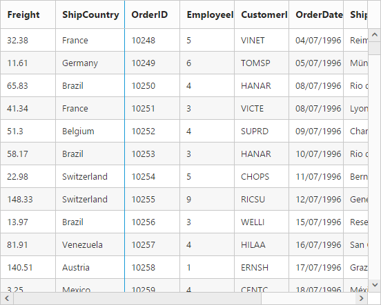
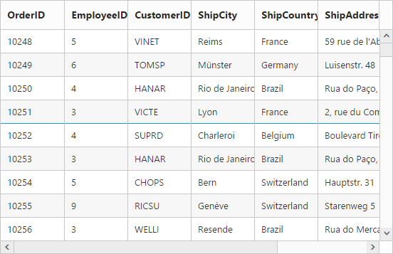

# Scrolling

## Default Scrolling

Scrolling is an important feature in Grid. It makes Grid more compatible with layout and design. The AllowScrolling property is used to enable scrolling functionality to the Grid. The default value for AllowScrolling is false.

In this following code example, ScrollSettings property is used to adjust the Grid width and height. 



   

<ej:Grid ID="Grid" runat="server" AllowScrolling="true">

        <ScrollSettings Width="886" Height="300" />

        <Columns>

            <ej:Column Field="OrderID" HeaderText="Order ID" TextAlign="Right" Width="100" />

            <ej:Column Field="CustomerID" HeaderText="Customer ID" Width="100" />

            <ej:Column Field="EmployeeID" HeaderText="Employee ID" TextAlign="Right" Width="100" />

            <ej:Column Field="Freight" HeaderText="Freight" TextAlign="Right" Width="100" Format="{0:C}" />

            <ej:Column Field="ShipCity" HeaderText="Ship City" Width="100" />

            <ej:Column Field="ShipName" HeaderText="Ship Name" Width="100" />

            <ej:Column Field="OrderDate" HeaderText="Order Date" TextAlign="Right" Width="100" Format="{0:MM/dd/yyyy}" />

            <ej:Column Field="ShipCountry" HeaderText="Ship Country" Width="100" />

            <ej:Column Field="ShipPostalCode" HeaderText="Postal Code" TextAlign="Right" Width="100" />

            <ej:Column Field="Verified" HeaderText="Verified" Width="100" />

        </Columns>

    </ej:Grid>




public partial class _Default : Page

{

    List<Orders> order = new List<Orders>();

    protected void Page_Load(object sender, EventArgs e)

    {

        BindDataSource();

    }

    private void BindDataSource()

    {

        int code = 10000;

        for (int i = 1; i < 10; i++)

        {

            order.Add(new Orders(code + 1, "TOMSP", i + 0, 2.3 * i, "Münster", "Toms Spezialitäten", new DateTime(1991, 05, 15), "Germany", "44087", false));

            order.Add(new Orders(code + 2, "HANAR", i + 2, 3.3 * i, "Rio de Janeiro", "Hanari Carnes", new DateTime(1990, 04, 04), "Brazil", "05454-876", true));

            order.Add(new Orders(code + 3, "VICTE", i + 1, 4.3 * i, "Lyon", "Victuailles en stock", new DateTime(1957, 11, 30), "France", "69004", true));

            order.Add(new Orders(code + 4, "VINET", i + 3, 5.3 * i, "Reims", "Vins et alcools Chevalier", new DateTime(1930, 10, 22), "France", "51100", true));

            order.Add(new Orders(code + 5, "SUPRD", i + 4, 6.3 * i, "Charleroi", "Suprêmes délices", new DateTime(1953, 02, 18), "Belgium", "B-6000", false));

            code += 5;

        }

        this.Grid.DataSource = order;

        this.Grid.DataBind();

    }

    [Serializable]

    public class Orders

    {

        public Orders()

        {

        }

        public Orders(long OrderId, string CustomerId, int EmployeeId, double Freight, string ShipCity, string ShipName,

            DateTime OrderDate, string ShipCountry, string ShipPostalCode, bool Verified)

        {

            this.OrderID = OrderId;

            this.CustomerID = CustomerId;

            this.EmployeeID = EmployeeId;

            this.Freight = Freight;

            this.ShipCity = ShipCity;

            this.ShipName = ShipName;

            this.OrderDate = OrderDate;

            this.ShipCountry = ShipCountry;

            this.ShipPostalCode = ShipPostalCode;

            this.Verified = Verified;

        }

        public long OrderID { get; set; }

        public string CustomerID { get; set; }

        public int EmployeeID { get; set; }

        public double Freight { get; set; }

        public string ShipCity { get; set; }

        public string ShipName { get; set; }

        public DateTime OrderDate { get; set; }

        public string ShipCountry { get; set; }

        public string ShipPostalCode { get; set; }

        public bool Verified { get; set; }

    }

}



The following output is displayed as a result of the above code example.

## Scroll Settings

The ScrollSettings contains the properties to enable scrolling related functionalities in the Grid.

### To Enable Vertical Scrolling

The Height property in the ScrollSettings is used to enable the vertical scroll bar in the Grid. The scroll height should be less than the Grid content height. That is, total rows height for enabling vertical scroll bar.

The Height property can support percentage, pixel and auto values in scrollSettings. The default value for height in ScrollSettings is 0.

The following code example illustrates how to enable vertical scrolling in the Grid. 



  

<ej:Grid ID="Grid" runat="server" AllowScrolling="true">

        <ScrollSettings Height="300" />

        <Columns>

            <ej:Column Field="OrderID" HeaderText="Order ID" TextAlign="Right" Width="100" />

            <ej:Column Field="CustomerID" HeaderText="Customer ID" Width="100" />

            <ej:Column Field="EmployeeID" HeaderText="Employee ID" TextAlign="Right" Width="100" />

            <ej:Column Field="Freight" HeaderText="Freight" TextAlign="Right" Width="100" Format="{0:C}" />

            <ej:Column Field="ShipCity" HeaderText="Ship City" Width="100" />

            <ej:Column Field="ShipName" HeaderText="Ship Name" Width="100" />

            <ej:Column Field="OrderDate" HeaderText="Order Date" TextAlign="Right" Width="100" Format="{0:MM/dd/yyyy}" />

            <ej:Column Field="ShipCountry" HeaderText="Ship Country" Width="100" />

            <ej:Column Field="ShipPostalCode" HeaderText="Postal Code" TextAlign="Right" Width="100" />

            <ej:Column Field="Verified" HeaderText="Verified" Width="100" />

        </Columns>

    </ej:Grid>



The following output is displayed as a result of the above code example.

### To Enable Horizontal Scrolling

The Width property in the ScrollSettings is used to enable the horizontal scroll bar in the Grid. The scroll width should be less than the Grid content width. That is, total columns width for enabling horizontal scroll bar.

The Width property can support percentage, pixel and auto values in ScrollSettings. The default value for width in ScrollSettings is auto. The default Grid content width is 100%, when you don’t specify the width to the columns it takes its width value from the Grid content.

When you set Width as auto, it renders Grid with browser calculate value.

The following code example illustrates how to enable horizontal scrolling in the Grid. 

  

<ej:Grid ID="Grid" runat="server" AllowScrolling="true">

        <ScrollSettings Width="800" />

        <Columns>

            <ej:Column Field="OrderID" HeaderText="Order ID" TextAlign="Right" Width="100" />

            <ej:Column Field="CustomerID" HeaderText="Customer ID" Width="100" />

            <ej:Column Field="EmployeeID" HeaderText="Employee ID" TextAlign="Right" Width="100" />

            <ej:Column Field="Freight" HeaderText="Freight" TextAlign="Right" Width="100" Format="{0:C}" />

            <ej:Column Field="ShipCity" HeaderText="Ship City" Width="100" />

            <ej:Column Field="ShipName" HeaderText="Ship Name" Width="100" />

            <ej:Column Field="OrderDate" HeaderText="Order Date" TextAlign="Right" Width="100" Format="{0:MM/dd/yyyy}" />

            <ej:Column Field="ShipCountry" HeaderText="Ship Country" Width="100" />

            <ej:Column Field="ShipPostalCode" HeaderText="Postal Code" TextAlign="Right" Width="100" />

            <ej:Column Field="Verified" HeaderText="Verified" Width="100" />

        </Columns>

    </ej:Grid>



The following output is displayed as a result of the above code example.

## Virtual scrolling on demand

Virtual scrolling is powerful technique in Grid. It makes Grid more compatible with layout and its loading record performance is high. The AllowVirtualScrolling property in ScrollSettings is used to enable virtual scroll functionality in the Grid. The default value for AllowVirtualScrolling is false.

Essential Asp.NetGrid supports two mode of virtualization. They are,

* Normal Mode
* Continuous Mode

### Normal Mode

This feature allows you to load the Grid with data while scrolling. The following code example illustrates how to set VirtualScrollMode as Normal. 


<ej:Grid ID="Grid" runat="server" AllowScrolling="True">

      <Columns>                

          <ej:Column Field="OrderID" HeaderText="Order ID" IsPrimaryKey="true" TextAlign="Right" />

          <ej:Column Field="CustomerID" HeaderText="Customer ID" />

          <ej:Column Field="EmployeeID" HeaderText="Employee ID" TextAlign="Right" />

           <ej:Column Field="Freight" HeaderText="Freight" TextAlign="Right" Format="{0:C}" />

           <ej:Column Field="ShipCity" HeaderText="Ship City" />

           <ej:Column Field="ShipName" HeaderText="Ship Name" TextAlign="Right" />

      </Columns>

      <ScrollSettings AllowVirtualScrolling="True" Height="0" Width="300" VirtualScollMode="Normal"></ScrollSettings>

</ej:Grid>




public partial class _Default : Page

    {       

        protected void Page_Load(object sender, EventArgs e)

        {

            this.Grid.DataSource = "http://mvc.syncfusion.com/Services/Northwnd.svc/Orders";

            this.Grid.DataBind();

        }

}



The following screenshot displays the Grid while scrolling. The request is sent to the server to fetch data.

The following screenshot displays the Grid after it is loaded with data.

### Continuous Mode

You can enable the continuous mode by setting the VirtualScrollMode property as Continuous. In Continuous mode, the data is loaded in Grid when the scrollbar reaches the end. The following code example illustrates how to set the continuous mode in virtualization. 


<ej:Grid ID="Grid" runat="server" AllowScrolling="True">

      <Columns>                

          <ej:Column Field="OrderID" HeaderText="Order ID" IsPrimaryKey="true" TextAlign="Right" />

          <ej:Column Field="CustomerID" HeaderText="Customer ID" />

          <ej:Column Field="EmployeeID" HeaderText="Employee ID" TextAlign="Right" />

           <ej:Column Field="Freight" HeaderText="Freight" TextAlign="Right" Format="{0:C}" />

           <ej:Column Field="ShipCity" HeaderText="Ship City" />

           <ej:Column Field="ShipName" HeaderText="Ship Name" TextAlign="Right" />

      </Columns>

      <ScrollSettings AllowVirtualScrolling="True" Height="0" Width="300" VirtualScollMode="Continuous">

      </ScrollSettings>

</ej:Grid>




public partial class _Default : Page

    {       

        protected void Page_Load(object sender, EventArgs e)

        {

            this. Grid.DataSource = "http://mvc.syncfusion.com/Services/Northwnd.svc/Orders";

            this. Grid.DataBind();

        }

}

The following screenshot illustrates the request made to fetch the data after the Grid scrollbar touches the end.

The following screenshot illustrates the Grid after the data is loaded.

