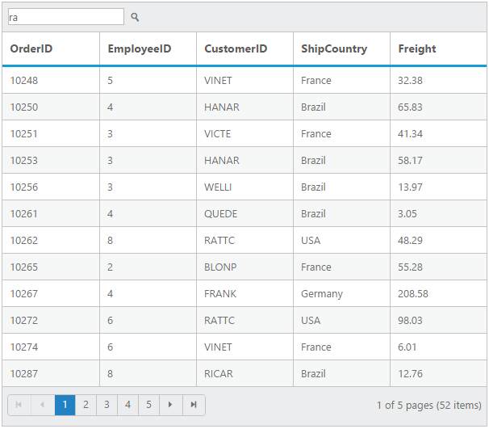

---
layout: post
title: Searching with Grid widget for Syncfusion Essential ASP
description: How to enable search option and its functionalities
platform: ejweb
control: Grid
documentation: ug
--- 
# Searching

The grid has an option to search its content using the JavaScript method `search` with search key as parameter. Also, it provides an option to integrate Search text box in grid toolbar, by adding `search` toolbar item in `ToolbarItems` property of `ToolbarSettings`.

The following code example describes the above behavior.

 


        <ej:Grid ID="OrdersGrid" runat="server" AllowSearching="true" AllowPaging="true"> 
             <ToolbarSettings ShowToolbar="true" ToolbarItems="search"/>
             <Columns>                
                  <ej:Column Field="OrderID"/>
                  <ej:Column Field="EmployeeID"/>
                  <ej:Column Field="CustomerID"/>                
                  <ej:Column Field="ShipCountry"/>
                  <ej:Column Field="Freight"/>
             </Columns>
        </ej:Grid>



     namespace WebSampleBrowser.Grid
     {
       public partial class Searching : Page
       {
         List<Orders> order = new List<Orders>();
         protected void Page_Load(object sender, EventArgs e)
          {
            BindDataSource();
          }
          private void BindDataSource()
          {
             int orderId = 10000;
             int empId = 0;
             for (int i = 0; i < 9; i++)
             {
                 order.Add(new Orders(orderId + 1, empId + 1, "VINET", "France", 32.38));
                 order.Add(new Orders(orderId + 2, empId + 2, "BLONP", "France", 11.61));
                 order.Add(new Orders(orderId + 3, empId + 3, "VICTE", "France", 45.34));
                 order.Add(new Orders(orderId + 4, empId + 4, "QUEDE", "Brazil", 37.28));
                 order.Add(new Orders(orderId + 5, empId + 5, "VINET", "France", 67.00));
                 order.Add(new Orders(orderId + 6, empId + 6, "RATTC", "USA", 23.32));
                 orderId += 6;
                 empId += 6;
             }
             this.OrdersGrid.DataSource = order;
             this.OrdersGrid.DataBind();
            }
           [Serializable]
           public class Orders
           {
             public Orders()
             { 
            
             }
             public Orders(int OrderId, int empId, string CustomerId, string shipCountry, double freight)
              {
                 this.OrderID = OrderId;
                 this.EmployeeID = empId;
                 this.CustomerID = CustomerId;
                 this.ShipCountry = shipCountry;
                 this.Freight = freight;
              }
              public int OrderID{ get; set; }
              public int EmployeeID{ get; set; }
              public string CustomerID{ get; set; }
              public string ShipCountry{ get; set; }
              public double Freight{ get; set; }
            }
         }
      }



The following output is displayed as a result of the above code example.

## Initial Searching

While initializing the grid, there is an option to display only the searched data in grid. To perform initial searching, define `Fields`, `Operator`, `Key` and `IgnoreCase` in `SearchSettings` property.

 N> `Key` value must be passed as `string`.

The following code example describes the above behavior.

 


        <ej:Grid ID="OrdersGrid" runat="server" AllowSearching="true" AllowPaging="True"> 
             <ToolbarSettings ShowToolbar="true" ToolbarItems="search"/>
             <SearchSettings Fields="CustomerID" Operator="Contains" Key="ra" IgnoreCase="false" />
             <Columns>                
                  <ej:Column Field="OrderID"/>
                  <ej:Column Field="EmployeeID"/>
                  <ej:Column Field="CustomerID"/>                
                  <ej:Column Field="ShipCountry"/>
                  <ej:Column Field="Freight"/>
             </Columns>
        </ej:Grid>


		
     using System; 
     using System.Collections.Generic;  
     using System.Linq;
     using System.Web.UI;
     using System.Web.UI.WebControls;

     namespace WebSampleBrowser.Grid
     {
       public partial class Searching : Page
       {
         List<Orders> order = new List<Orders>();
         protected void Page_Load(object sender, EventArgs e)
          {
            BindDataSource();
          }
          private void BindDataSource()
          {
             int orderId = 10000;
             int empId = 0;
             for (int i = 0; i < 9; i++)
             {
                 order.Add(new Orders(orderId + 1, empId + 1, "VINET", "France", 32.38));
                 order.Add(new Orders(orderId + 2, empId + 2, "BLONP", "France", 11.61));
                 order.Add(new Orders(orderId + 3, empId + 3, "VICTE", "France", 45.34));
                 order.Add(new Orders(orderId + 4, empId + 4, "QUEDE", "Brazil", 37.28));
                 order.Add(new Orders(orderId + 5, empId + 5, "VINET", "France", 67.00));
                 order.Add(new Orders(orderId + 6, empId + 6, "RATTC", "USA", 23.32));
                 orderId += 6;
                 empId += 6;
             }
             this.OrdersGrid.DataSource = order;
             this.OrdersGrid.DataBind();
            }
           [Serializable]
           public class Orders
           {
             public Orders()
             { 
            
             }
             public Orders(int OrderId, int empId, string CustomerId, string shipCountry, double freight)
              {
                 this.OrderID = OrderId;
                 this.EmployeeID = empId;
                 this.CustomerID = CustomerId;
                 this.ShipCountry = shipCountry;
                 this.Freight = freight;
              }
              public int OrderID{ get; set; }
              public int EmployeeID{ get; set; }
              public string CustomerID{ get; set; }
              public string ShipCountry{ get; set; }
              public double Freight{ get; set; }
            }
         }
      }



The following output is displayed as a result of the above code example.

List of supported operators in searching.

<table>
 <tr>
<td>
Operator.Equal</td></tr>
<tr>
<td>
Operator.NotEqual</td></tr>
<tr>
<td>
Operator.StartsWith</td></tr>
<tr>
<td>
Operator.EndsWith</td></tr>
<tr>
<td>
Operator.Contains</td></tr>
</table>
