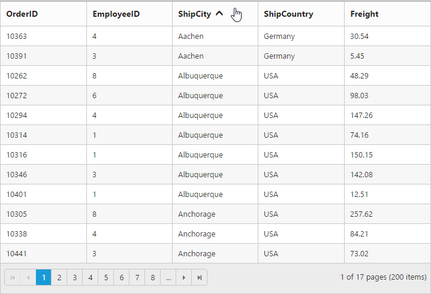
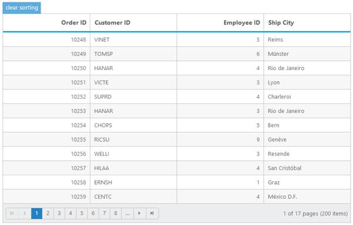

# Sorting

## Default Sorting

Sorting is a basic technique in Grid. It helps you view Grid records in ascending or descending, based on a particular column. If you want to enable sorting in Grid then use AllowSorting property at Grid initialize. By default, sorting operation can be performed by user interaction (UI) on Grid header.


<ej:Grid ID="FlatGrid" runat="server" AllowSorting="True" AllowPaging="True">

          <DataManager URL="http://mvc.syncfusion.com/Services/Northwnd.svc/Orders/" ></DataManager>   

</ej:Grid>



The following output is displayed as a result of the above code example.

N> Grid also has support to sort more than one column. This behavior is called as multi sorting. To enable this behavior in Grid then use allowMultiSorting in Grid.

## External Sorting

In Grid, you have an API to sort a column dynamically. The following code example shows you how to sort a column through API. 





        <ej:DropDownList runat="server" ID="columns">

            <Items>

                <ej:DropDownListItem Value="OrderID" Text="Order ID"></ej:DropDownListItem>

                <ej:DropDownListItem Value="CustomerID" Text="Customer ID"></ej:DropDownListItem>

                <ej:DropDownListItem Value="EmployeeID" Text="Employee ID"></ej:DropDownListItem>

                <ej:DropDownListItem Value="ShipCity" Text="Ship City"></ej:DropDownListItem>

            </Items>

        </ej:DropDownList>

         

        <ej:DropDownList runat="server" ID="direction">

            <Items>

                <ej:DropDownListItem Value="Ascending" Text="Ascending"></ej:DropDownListItem>

                <ej:DropDownListItem Value="Descending" Text="Descending"></ej:DropDownListItem>

            </Items>

        </ej:DropDownList>

         

        <ej:Button Type="button" runat="server" Text="sort" ID="sort" ClientSideOnClick="sort_click" />

         

        <ej:Grid ID="FlatGrid" runat="server" AllowSorting="True" AllowPaging="True">

<DataManager URL="http://mvc.syncfusion.com/Services/Northwnd.svc/Orders/" ></DataManager>

</ej:Grid>

 




      





The following output is displayed as a result of the above code example.

## Multi sorting in Touch device

While using Grid in a touch device environment, you have the option of multi sorting. If you click Grid header it shows a popup to enable or disable single click on Grid header as multi sorting or simple sorting. If you want to enable multi sorting with a single click then click the sorting symbol in popup.

The following output is displayed as a result of the above code example.

## Multi sorting key configs

In the normal way of sorting, if you want to sort any column, you can click the header cell of that column. For multi sorting, you need to press ctrl key plus mouse left click.

If you want to clear sorting for a column then you need to use shift plus mouse left click.

## Clear sorting using API

In Grid, you have an API to clear sorted columns. Through this API, you can clear sorting at any stage.





   

     <ej:Button Type="button" ID="clearsorting" runat="server" Text="clear sorting" ClientSideOnClick="clearsorting_click" />

     <ej:Grid ID="FlatGrid" runat="server" AllowMultiSorting="true" AllowSorting="True" AllowPaging="True">

<DataManager URL="http://mvc.syncfusion.com/Services/Northwnd.svc/Orders/" Offline="true"></DataManager>

     </ej:Grid>

    








The following output is displayed as a result of the above code example.

 

 

## Merge Sort

In the normal way of sorting, first preference is given to capital letters and then small letters. When you do not want discrimination between small and capital letters, you can set “enableLocalizedSort” API as true to sort both small and capital letters.





   

     <ej:Button Type="button" ID="clearsorting" runat="server" Text="clear sorting" ClientSideOnClick="clearsorting_click" />

     <ej:Grid ID="FlatGrid" runat="server" AllowMultiSorting="true" AllowSorting="True" AllowPaging="True">

<DataManager URL="http://mvc.syncfusion.com/Services/Northwnd.svc/Orders/" Offline="true"></DataManager>

     </ej:Grid>

    








 The following output is displayed as a result of the above code example.

