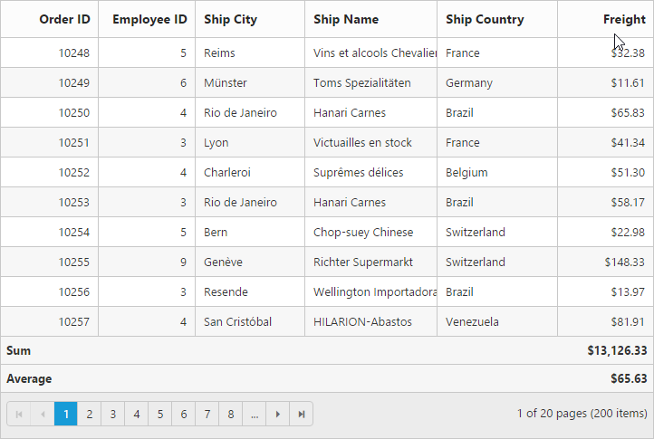
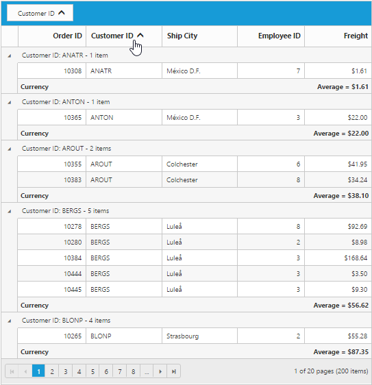

# Summary 

Summary is a key feature of Grid that is used to aggregate a particular column. This is useful to analyze the details of a particular column. It has the following types:

* Sum
* Average 
* Count
* Minimum
* Maximum
* Custom

## Default Summary

There are some default summary types available for basic summary formula. The following code example is for Default Summary Types. We can render summary rows for grid using ShowSummary and SummaryRows property of Grid.





<ej:Grid ID="OrdersGrid" runat="server" AllowPaging="True" ShowSummary="True">

<DataManager URL="http://mvc.syncfusion.com/Services/Northwnd.svc/Orders/" Offline="true"></DataManager>

            <PageSettings PageSize="10"></PageSettings>

            <SummaryRows>

                <ej:SummaryRow Title="Sum">

                    <SummaryColumn>

                       <ej:SummaryColumn SummaryType="Sum" Format="{0:C}" DisplayColumn="Freight" DataMember="Freight" />

                    </SummaryColumn>

                </ej:SummaryRow>

                <ej:SummaryRow Title="Average">

                    <SummaryColumn>

                       <ej:SummaryColumn SummaryType="Average" Format="{0:C}" DisplayColumn="Freight" DataMember="Freight" />

                    </SummaryColumn>

                 </ej:SummaryRow>

           </SummaryRows>

              <Columns>

                <ej:Column Field="OrderID" HeaderText="Order ID" IsPrimaryKey="True" TextAlign="Right" Width="80" />

                <ej:Column Field="EmployeeID" HeaderText="Employee ID" TextAlign="Right" Width="80" />

                <ej:Column Field="ShipCity" HeaderText="Ship City" Width="90" />

                <ej:Column Field="ShipName" HeaderText="Ship Name" Width="110"/>

                <ej:Column Field="ShipCountry" HeaderText="Ship Country" Width="100" />

                <ej:Column Field="Freight" HeaderText="Freight" TextAlign="Right" Width="80" Format="{0:C}" />

            </Columns>

 </ej:Grid>



public partial class DefaultFunctionalities : System.Web.UI.Page

    {

        List<Orders> order = new List<Orders>();

        protected void Page_Load(object sender, EventArgs e)

        {

            BindDataSource();

        }

        private void BindDataSource()

        {

            int code = 10000;

            for (int i = 1; i < 10; i++)

            {

                order.Add(new Orders(code + 1, "ALFKI", i + 0, 2.3 * i, new DateTime(1991, 05, 15), "Berlin"));

                order.Add(new Orders(code + 2, "ANATR", i + 2, 3.3 * i, new DateTime(1990, 04, 04), "Madrid"));

                order.Add(new Orders(code + 3, "ANTON", i + 1, 4.3 * i, new DateTime(1957, 11, 30), "Cholchester"));

                order.Add(new Orders(code + 4, "BLONP", i + 3, 5.3 * i, new DateTime(1930, 10, 22), "Marseille"));

                order.Add(new Orders(code + 5, "BOLID", i + 4, 6.3 * i, new DateTime(1953, 02, 18), "Tsawassen"));

                code += 5;

            }

            this.OrdersGrid.DataSource = order;

            this.OrdersGrid.DataBind();

        }

        [Serializable]

        public class Orders

        {

            public Orders()

            {

            }

            public Orders(long OrderId, string CustomerId, int EmployeeId, double Freight, DateTime OrderDate, string ShipCity)

            {

                this.OrderID = OrderId;

                this.CustomerID = CustomerId;

                this.EmployeeID = EmployeeId;

                this.Freight = Freight;

                this.OrderDate = OrderDate;

                this.ShipCity = ShipCity;

            }

            public long OrderID { get; set; }

            public string CustomerID { get; set; }

            public int EmployeeID { get; set; }

            public double Freight { get; set; }

            public DateTime OrderDate { get; set; }

            public string ShipCity { get; set; }

        }

    }





The following output is displayed as a result of the above code example.

## Custom Summary by String

This property helps you to create custom summary formula for summary. The following code example is for custom summary using Essential ASP.NET. We can achieve custom summary using CustomSummaryValue property.



  <ej:Grid ID="OrdersGrid" runat="server" AllowPaging="True" ShowSummary="True">

            <PageSettings PageSize="5"></PageSettings>

            <SummaryRows>

                <ej:SummaryRow Title="Currency">

                    <SummaryColumn>

                        <ej:SummaryColumn SummaryType="Custom" Format="{0:C}" DisplayColumn="Freight" DataMember="Freight" CustomSummaryValue="CustomValue" />

                    </SummaryColumn>

                </ej:SummaryRow>

            </SummaryRows>

              <Columns>

                <ej:Column Field="OrderID" HeaderText="Order ID" IsPrimaryKey="True" TextAlign="Right" Width="80" />

                <ej:Column Field="EmployeeID" HeaderText="Employee ID" TextAlign="Right" Width="80" />

                <ej:Column Field="Customer ID" HeaderText="Customer ID" TextAlign="Right" Width="80" />

                <ej:Column Field="ShipCity" HeaderText="Ship City" Width="90" />

               <ej:Column Field="Freight" HeaderText="Freight" TextAlign="Right" Width="80" Format="{0:C}" />

            </Columns>

</ej:Grid>



The following output is displayed as a result of the above code example.

## Custom Summary by Function

Custom Summary is used to create custom summary formula for summary. The following code example is for custom summary using Essential ASP.NET.





    

        <ej:Grid ID="OrdersGrid" runat="server" AllowPaging="True" ShowSummary="True">

             <SummaryRows>

                <ej:SummaryRow Title="Currency" >

                    <SummaryColumn>

                        <ej:SummaryColumn SummaryType="Custom" CustomSummaryValue="currency" DisplayColumn="Freight"

                            Format="{0:C2}" />

                    </SummaryColumn>

                </ej:SummaryRow>

            </SummaryRows>

            <Columns>

                <ej:Column Field="OrderID" HeaderText="Order ID" IsPrimaryKey="True" TextAlign="Right" Width="80" />

                 <ej:Column Field="EmployeeID" HeaderText="Employee ID" TextAlign="Right" Width="80" />

                <ej:Column Field="ShipCity" HeaderText="Ship City" Width="90" />

                <ej:Column Field="Freight" HeaderText="Freight" TextAlign="Right" Width="80" Format="{0:C}" />

            </Columns>

        </ej:Grid>

    

    





namespace WebSampleBrowser.Grid

{

    public partial class CustomSummary : System.Web.UI.Page

    {

        List<Orders> order = new List<Orders>();

        protected void Page_Load(object sender, EventArgs e)

        {

            BindDataSource();

        }

        private void BindDataSource()

        {

            int code = 10000;

            for (int i = 1; i < 10; i++)

            {

                order.Add(new Orders(code + 1, i + 0, "Berlin", 2.3 * i));

                order.Add(new Orders(code + 2, i + 2, "Madrid", 3.3 * i));

                order.Add(new Orders(code + 3, i + 1, "Cholchester", 4.3 * i));

                order.Add(new Orders(code + 4, i + 3, "Marseille", 5.3 * i));

                order.Add(new Orders(code + 5, i + 4, "London", 6.3 * i));

                code += 5;

            }

            this.OrdersGrid.DataSource = order;

            this.OrdersGrid.DataBind();

        }

        [Serializable]

        public class Orders

        {

            public Orders()

            {

            }

            public Orders(long OrderId, int EmployeeId, string ShipCity, double Freight)

            {

                this.OrderID = OrderId;

                this.EmployeeID = EmployeeId;

                this.ShipCity = ShipCity;

                this.Freight = Freight;

            }

            public long OrderID { get; set; }

            public int EmployeeID { get; set; }

            public string ShipCity { get; set; }

            public double Freight { get; set; }

        }

    }

}}





## Group Summary

This property helps you to enable the group summary column in Grid. The following code example is for Group summary.





<ej:Grid ID="OrdersGrid" runat="server" AllowGrouping="True" ShowSummary="True">

            <PageSettings PageSize="10"></PageSettings>

 <GroupSettings GroupedColumns="CustomerID"></GroupSettings>

            <SummaryRows>

                <ej:SummaryRow ShowTotalSummary="False">

                    <SummaryColumn>

                       <ej:SummaryColumn SummaryType="Average" Format="{0:C}" DisplayColumn="Freight" DataMember="Freight" Prefix="Average = " />

                    </SummaryColumn>

                 </ej:SummaryRow>

            </SummaryRows>

            <Columns>

                <ej:Column Field="OrderID" HeaderText="Order ID" IsPrimaryKey="True" TextAlign="Right" Width="80" />

                    <ej:Column Field="CustomerID" HeaderText="Customer ID" Width="90" />

                <ej:Column Field="ShipCity" HeaderText="Ship City" Width="90" />

                <ej:Column Field="EmployeeID" HeaderText="Employee ID" TextAlign="Right" Width="80" />

                <ej:Column Field="Freight" HeaderText="Freight" Width="80" TextAlign="Right"  Format="{0:C}" />

            </Columns>

</ej:Grid>




public partial class DefaultFunctionalities : System.Web.UI.Page

    {

        List<Orders> order = new List<Orders>();

        protected void Page_Load(object sender, EventArgs e)

        {

            BindDataSource();

        }

        private void BindDataSource()

        {

            int code = 10000;

            for (int i = 1; i < 10; i++)

            {

                order.Add(new Orders(code + 1, "ALFKI", i + 0, 2.3 * i, new DateTime(1991, 05, 15), "Berlin"));

                order.Add(new Orders(code + 2, "ANATR", i + 2, 3.3 * i, new DateTime(1990, 04, 04), "Madrid"));

                order.Add(new Orders(code + 3, "ANTON", i + 1, 4.3 * i, new DateTime(1957, 11, 30), "Cholchester"));

                order.Add(new Orders(code + 4, "BLONP", i + 3, 5.3 * i, new DateTime(1930, 10, 22), "Marseille"));

                order.Add(new Orders(code + 5, "BOLID", i + 4, 6.3 * i, new DateTime(1953, 02, 18), "Tsawassen"));

                code += 5;

            }

            this.OrdersGrid.DataSource = order;

            this.OrdersGrid.DataBind();

        }

        [Serializable]

        public class Orders

        {

            public Orders()

            {

            }

            public Orders(long OrderId, string CustomerId, int EmployeeId, double Freight, DateTime OrderDate, string ShipCity)

            {

                this.OrderID = OrderId;

                this.CustomerID = CustomerId;

                this.EmployeeID = EmployeeId;

                this.Freight = Freight;

                this.OrderDate = OrderDate;

                this.ShipCity = ShipCity;

            }

            public long OrderID { get; set; }

            public string CustomerID { get; set; }

            public int EmployeeID { get; set; }

            public double Freight { get; set; }

            public DateTime OrderDate { get; set; }

            public string ShipCity { get; set; }

        }

    }





The following output is displayed as a result of the above code example.

## Caption Summary

This property is used to create Caption Summary column in Grid. The following code example is for Caption Summary.

ShowCaptionSummary property used to achieve caption summary feature.





<ej:Grid ID="OrdersGrid" runat="server" AllowGrouping="True" ShowSummary="True">

    <PageSettings PageSize="10"></PageSettings>

    <SummaryRows>

  <ej:SummaryRow ShowCaptionSummary="True" ShowTotalSummary="False">

          <SummaryColumn>

  <ej:SummaryColumn SummaryType="Average" DisplayColumn="Freight" DataMember="Freight" Format="{0:C}" Prefix="Average = " />

          </SummaryColumn>

       </ej:SummaryRow>

    </SummaryRows>

    <GroupSettings GroupedColumns="CustomerID"></GroupSettings>

    <Columns>

     <ej:Column Field="OrderID" HeaderText="Order ID" IsPrimaryKey="True"   TextAlign="Right" Width="80" />

         <ej:Column Field="CustomerID" HeaderText="Customer ID" Width="80" />

         <ej:Column Field="ShipCity" HeaderText="Ship City" Width="90" />

        <ej:Column Field="EmployeeID" HeaderText="Employee ID" TextAlign="Right" Width="75" />

    <ej:Column Field="Freight" HeaderText="Freight" TextAlign="Right" Width="120" Format="{0:C}" />

    </Columns>

</ej:Grid>




public partial class DefaultFunctionalities : System.Web.UI.Page

    {

        List<Orders> order = new List<Orders>();

        protected void Page_Load(object sender, EventArgs e)

        {

            BindDataSource();

        }

        private void BindDataSource()

        {

            int code = 10000;

            for (int i = 1; i < 10; i++)

            {

                order.Add(new Orders(code + 1, "ALFKI", i + 0, 2.3 * i, new DateTime(1991, 05, 15), "Berlin"));

                order.Add(new Orders(code + 2, "ANATR", i + 2, 3.3 * i, new DateTime(1990, 04, 04), "Madrid"));

                order.Add(new Orders(code + 3, "ANTON", i + 1, 4.3 * i, new DateTime(1957, 11, 30), "Cholchester"));

                order.Add(new Orders(code + 4, "BLONP", i + 3, 5.3 * i, new DateTime(1930, 10, 22), "Marseille"));

                order.Add(new Orders(code + 5, "BOLID", i + 4, 6.3 * i, new DateTime(1953, 02, 18), "Tsawassen"));

                code += 5;

            }

            this.OrdersGrid.DataSource = order;

            this.OrdersGrid.DataBind();

        }

        [Serializable]

        public class Orders

        {

            public Orders()

            {

            }

            public Orders(long OrderId, string CustomerId, int EmployeeId, double Freight, DateTime OrderDate, string ShipCity)

            {

                this.OrderID = OrderId;

                this.CustomerID = CustomerId;

                this.EmployeeID = EmployeeId;

                this.Freight = Freight;

                this.OrderDate = OrderDate;

                this.ShipCity = ShipCity;

            }

            public long OrderID { get; set; }

            public string CustomerID { get; set; }

            public int EmployeeID { get; set; }

            public double Freight { get; set; }

            public DateTime OrderDate { get; set; }

            public string ShipCity { get; set; }

        }

    }





The following output is displayed as a result of the above code example.

